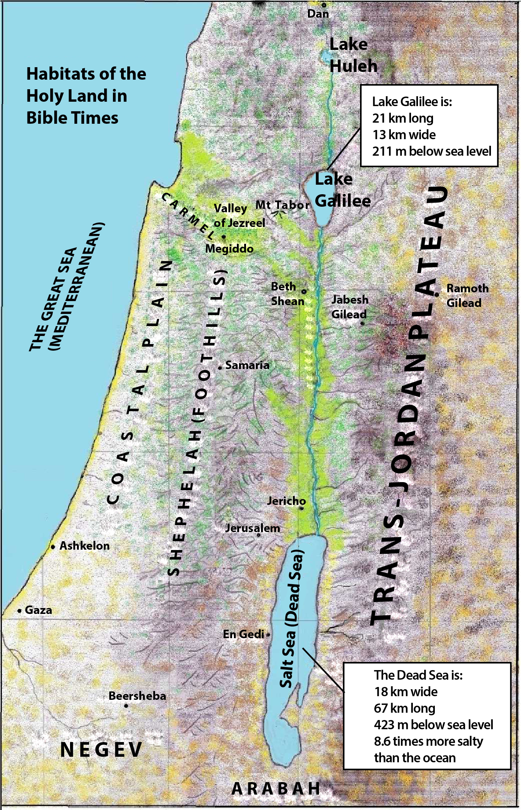

# Plants and Trees in the Bible

## License Information

Plants and Trees in the Bible © United Bible Societies, 2025. Adapted from: <cite>Each According to its Kind: Plants and Trees in the Bible</cite>, by Robert Koops © 2012 United Bible Societies. This work is licensed under Creative Commons Attribution-ShareAlike 4.0 International (<a href="https://creativecommons.org/licenses/by-sa/4.0/">https://creativecommons.org/licenses/by-sa/4.0/</a>).

--------------------------------

## Introduction (id: FLORA:1.0)

1\.0 Introduction
=================

*Habitats of the Holy Land in Bible Times (© Robert Koops)*

The Hebrew word *ya‘ar* (“forest”) occurs about sixty times in the Old Testament (including the Deuterocanon), indicating that trees in Ancient Israel were abundant in ancient times. Botanists distinguish “forest” (dense growth) and “woodland” (less dense growth). Hepper states that Lebanon probably had real forests, whereas the Holy Land would have had “woodland” or “open forest,” except for the dense stands of tamarisk and poplar described in Jeremiah as “the jungle of the Jordan.” Large oak woodland once covered the Sharon Plain, while in the mountains fir, pine, cypress, and Grecian juniper grew plentifully. Other trees and shrubs of the upland woods were the cedar, cypress, fir, ivy, laurel, laurustinus, myrtle, oak, pine, and thyine. Some thrived near streams, namely, the plane, oleander, poplar, elm, and willow.

Trees have engaged in a tug\-of\-war with various forces throughout the centuries. Natural fires have taken their toll, but the biggest enemy has been human. People have systematically cut down forests for firewood, for timber, and for the production of lime and charcoal, right up to the early twentieth century, when the Turks finished off the oaks by burning them as fuel in their trains and by putting a tax on trees, thereby causing people to cut theirs down to avoid the tax!

The trees have occasionally fought back. In the Sharon Plain, after the original Kermes oaks were cut down during the Arab period (800–1400 A.D.), Tabor oaks replaced them. The remains of a wine press or an oil press now standing in the middle of a forest tell us that now and then Nature wins a battle. But the forests and woodlands are losing the war to cultivation and animal husbandry. Sheep and goats are quite effective in preventing the regeneration of trees. Ever\-increasing human populations demand more and more cropland. Chemical fertilizers make it impossible for the long process of regeneration even to begin. It is only thanks to the creation of nature preserves here and there that we know what the forests and woodlands of the Holy Land may have looked like centuries ago.

Occurring almost five times as frequently as *ya‘ar* (“forest”), the Hebrew word *midbar* (“wilderness” or “desert”) appears over 270 times in the Old Testament. The majority of these references are found in the Pentateuch, where the saga of the “wilderness experience” of the Israelites unfolds. Subsequent references to *midbar* often recall the great exodus from Egypt and the wanderings of the descendants of Jacob in Sinai. In those long years they became familiar with many desert species that are now recorded for us in the Bible, species like acacia, broom, boxthorn, date palm, juniper, tamarisk, terebinth, and styrax. They would also have known many others that are not recorded in Scripture. After the conquest of Canaan, the southern part of the country, called *Negev* (“dry”), became synonymous with “desert.” The Jews who settled there knew its plants and depended on them.

In this chapter we deal with twenty\-six trees and shrubs that grew in the uncultivated areas of the Holy Land. The forest, streamside, and desert trees have been mentioned above. We include here two others that were imported from elsewhere, namely ebony from Africa and sandalwood from India.

In at least half of the cases, botanists agree on the identification of the wild trees. The conifers (pine, fir, cypress, cedar) are a particular problem, and debate continues to the present. Following Zohary and others, we propose that the Hebrew word *berosh* be taken as a generic word covering the Cilician fir, the Grecian juniper, and the cypress. Likewise, there is considerable uncertainty about the streamside trees and about styrax.

