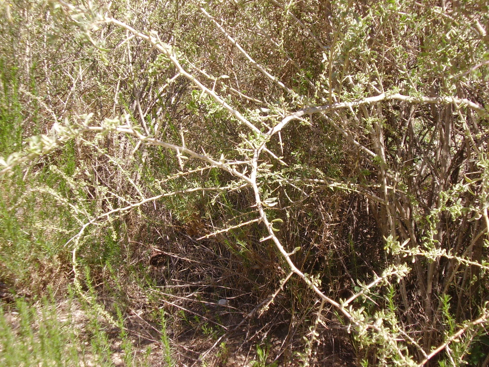

# Plants and Trees in the Bible

## License Information

Plants and Trees in the Bible © United Bible Societies, 2025. Adapted from: <cite>Each According to its Kind: Plants and Trees in the Bible</cite>, by Robert Koops © 2012 United Bible Societies. This work is licensed under Creative Commons Attribution-ShareAlike 4.0 International (<a href="https://creativecommons.org/licenses/by-sa/4.0/">https://creativecommons.org/licenses/by-sa/4.0/</a>).

--------------------------------

## Boxthorn (id: FLORA:1.2)

1\.2 Boxthorn
=============

References:
-----------

Hebrew אָטָד (’atad)

[JDG 9:14](https://ref.ly/Judg9:14), [JDG 9:15](https://ref.ly/Judg9:15), [JDG 9:15](https://ref.ly/Judg9:15), [PSA 58:10](https://ref.ly/Ps58:10)

Discussion:
-----------

In the fable of the trees in [JDG 9:0](https://ref.ly/Judg9:0), all the trees come to the *’atad* (“bramble” in the Revised Standard Version \[RSV (Revised Standard Version (1952)) ]) and ask it to become their king. With the exception of Zohary, scholars have generally agreed that this is probably a reference to the Boxthorn *Lycium europaeum*. Zohary holds that it is more likely the Christ Thorn *Ziziphus spina\-christi*. Both are thorny trees that are plentiful in the Near East, especially near Samaria in northern Israel, where Jotham, the teller of the fable, lived. The name “Christ thorn” (French *couronne\-du\-Christ*) reflects the tradition that this tree must also have been the source of the thorns that are referred to in the account of Christ’s crucifixion. The topic is widely debated, and there is little to confirm whether the “crown of thorns” came from this tree, or from one of many other prickly plants such as the thorny burnet, which is more common in the Jerusalem area. We advocate the majority opinion here, which is boxthorn (French *lycie d’Europe*).

Description:
------------

The boxthorn tree grows to 5 meters (17 feet) tall, has small leaves forming an oval crown, and has very sharp thorns. The yellowish green flowers give way to edible fruits about the size of grapes or cherries.

Special significance:
---------------------

The word associations in Jotham’s fable are by no means clear, but he appears to use the *’atad* as a tree that is neither attractive nor very useful. Indeed, its fruit is barely edible, and it does not produce usable wood, or even effective shade, since the leaves are fairly small and sparse. The *’atad* is thorny, but whether that is significant in the fable is not clear. If the tree represents Abimelech, most readers would probably agree that he was a thorny character.

Translation:
------------

Jotham’s fable, being an allegory, allows the option for translators to substitute rhetorically equivalent species for the olive, fig, grapevine, and boxthorn. However, there may be no single word for “boxthorn” in the receptor language, so translators will end up using a generic phrase like “thorn tree” or substituting a thorny local tree or shrub, probably the most common one in their area. A common problem is that languages often do not have names for plants that are not useful. If transliterations are needed, *atad* can be used from Hebrew, or translators can use a transliteration from a major language for a related type of tree, for example, Spanish *cambron* or *azufaifa*, French *jujubier*, and Portuguese *acufaifa*.

* **Associated Passages:** Judges 9:14; Judges 9:15; Psalms 58:10; Judges 9:0

