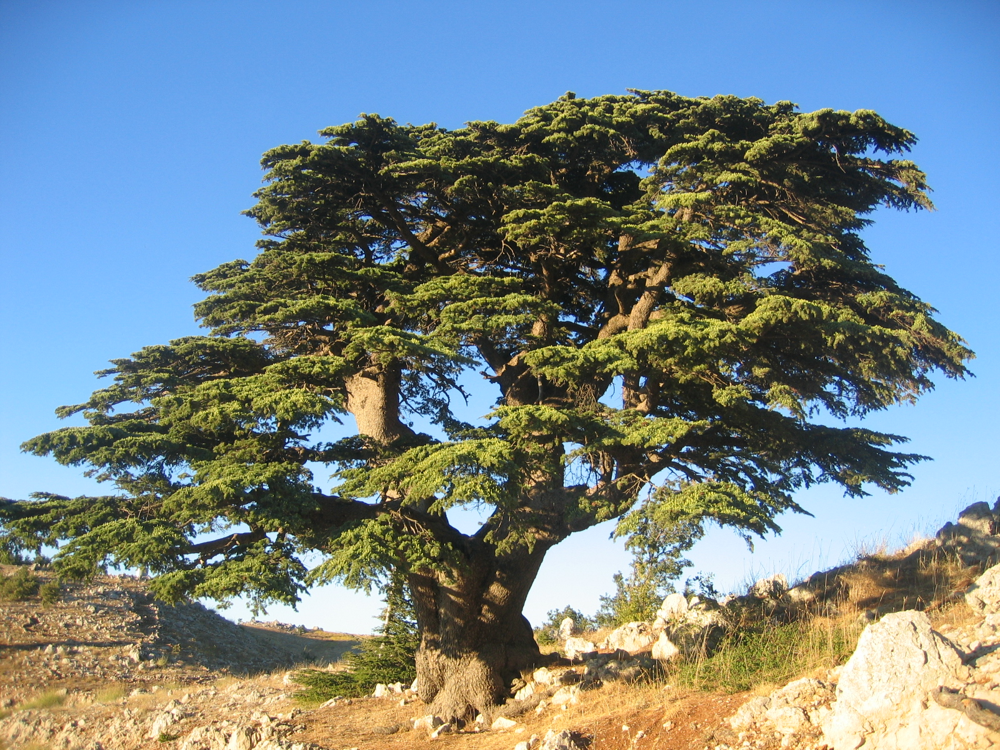
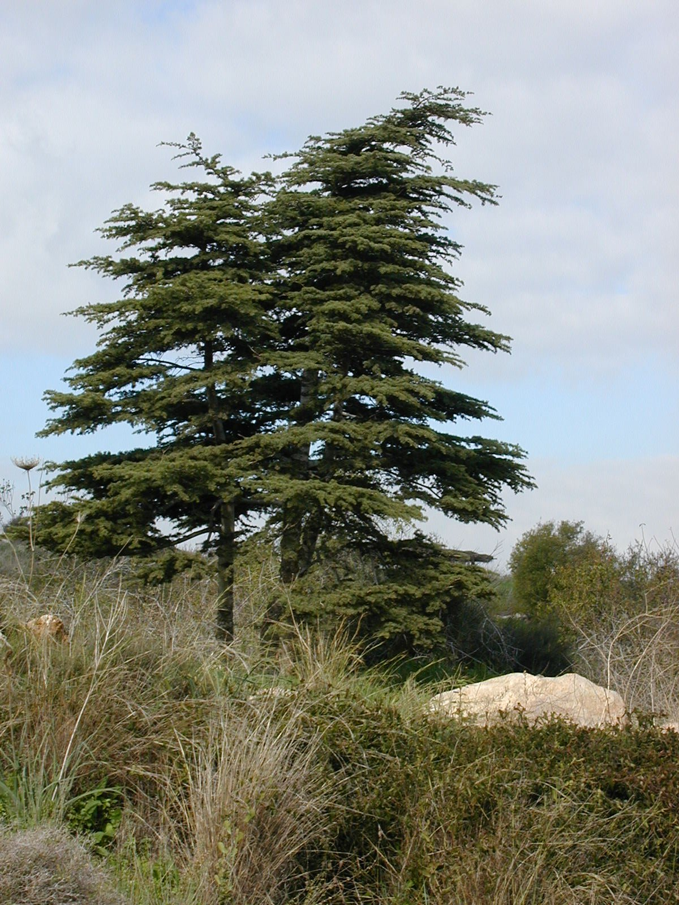

# Plants and Trees in the Bible

## License Information

Plants and Trees in the Bible © United Bible Societies, 2025. Adapted from: <cite>Each According to its Kind: Plants and Trees in the Bible</cite>, by Robert Koops © 2012 United Bible Societies. This work is licensed under Creative Commons Attribution-ShareAlike 4.0 International (<a href="https://creativecommons.org/licenses/by-sa/4.0/">https://creativecommons.org/licenses/by-sa/4.0/</a>).

--------------------------------

## Cedar (id: FLORA:1.5)

1\.5 Cedar
==========

References:
-----------

Hebrew אֶזְרָח (’ezrach)

[PSA 37:35](https://ref.ly/Ps37:35)

Hebrew אֶרֶז (’erez)

[JDG 9:15](https://ref.ly/Judg9:15), [2SA 5:11](https://ref.ly/2Sam5:11), [2SA 7:2](https://ref.ly/2Sam7:2), [2SA 7:7](https://ref.ly/2Sam7:7), [1KI 5:13](https://ref.ly/1Kgs5:13), [1KI 5:20](https://ref.ly/1Kgs5:20), [1KI 5:22](https://ref.ly/1Kgs5:22), [1KI 5:24](https://ref.ly/1Kgs5:24), [1KI 6:9](https://ref.ly/1Kgs6:9), [1KI 6:10](https://ref.ly/1Kgs6:10), [1KI 6:15](https://ref.ly/1Kgs6:15), [1KI 6:16](https://ref.ly/1Kgs6:16), [1KI 6:18](https://ref.ly/1Kgs6:18), [1KI 6:18](https://ref.ly/1Kgs6:18), [1KI 6:20](https://ref.ly/1Kgs6:20), [1KI 6:36](https://ref.ly/1Kgs6:36), [1KI 7:2](https://ref.ly/1Kgs7:2), [1KI 7:2](https://ref.ly/1Kgs7:2), [1KI 7:3](https://ref.ly/1Kgs7:3), [1KI 7:7](https://ref.ly/1Kgs7:7), [1KI 7:11](https://ref.ly/1Kgs7:11), [1KI 7:12](https://ref.ly/1Kgs7:12), [1KI 9:11](https://ref.ly/1Kgs9:11), [1KI 10:27](https://ref.ly/1Kgs10:27), [2KI 14:9](https://ref.ly/2Kgs14:9), [2KI 19:23](https://ref.ly/2Kgs19:23), [1CH 14:1](https://ref.ly/1Chr14:1), [1CH 17:1](https://ref.ly/1Chr17:1), [1CH 17:6](https://ref.ly/1Chr17:6), [1CH 22:4](https://ref.ly/1Chr22:4), [2CH 1:15](https://ref.ly/2Chr1:15), [2CH 2:2](https://ref.ly/2Chr2:2), [2CH 2:7](https://ref.ly/2Chr2:7), [2CH 9:27](https://ref.ly/2Chr9:27), [2CH 25:18](https://ref.ly/2Chr25:18), [EZR 3:7](https://ref.ly/Ezra3:7), [JOB 40:17](https://ref.ly/Job40:17), [PSA 29:5](https://ref.ly/Ps29:5), [PSA 29:5](https://ref.ly/Ps29:5), [PSA 80:11](https://ref.ly/Ps80:11), [PSA 92:13](https://ref.ly/Ps92:13), [PSA 104:16](https://ref.ly/Ps104:16), [PSA 148:9](https://ref.ly/Ps148:9), [SNG 1:17](https://ref.ly/Song1:17), [SNG 5:15](https://ref.ly/Song5:15), [SNG 8:9](https://ref.ly/Song8:9), [ISA 2:13](https://ref.ly/Isa2:13), [ISA 9:9](https://ref.ly/Isa9:9), [ISA 14:8](https://ref.ly/Isa14:8), [ISA 37:24](https://ref.ly/Isa37:24), [ISA 41:19](https://ref.ly/Isa41:19), [ISA 44:14](https://ref.ly/Isa44:14), [JER 22:7](https://ref.ly/Jer22:7), [JER 22:14](https://ref.ly/Jer22:14), [JER 22:15](https://ref.ly/Jer22:15), [JER 22:23](https://ref.ly/Jer22:23), [EZK 17:3](https://ref.ly/Ezek17:3), [EZK 17:22](https://ref.ly/Ezek17:22), [EZK 17:23](https://ref.ly/Ezek17:23), [EZK 27:5](https://ref.ly/Ezek27:5), [EZK 31:3](https://ref.ly/Ezek31:3), [EZK 31:8](https://ref.ly/Ezek31:8), [AMO 2:9](https://ref.ly/Amos2:9), [ZEC 11:1](https://ref.ly/Zech11:1), [ZEC 11:2](https://ref.ly/Zech11:2)

Greek κέδρινος (kedrinos)

[1ES 4:48](https://ref.ly/1Esd4:48), [1ES 5:53](https://ref.ly/1Esd5:53)

Greek κέδρος (kedros)

[SIR 24:13](https://ref.ly/Sir24:13), [SIR 50:12](https://ref.ly/Sir50:12)

Discussion:
-----------

Long ago the majestic cedars of Lebanon (*Cedrus libani*) completely covered the upper slopes of the Lebanon Mountains on the western and northern sides. Now only a few pockets of these mighty cedars remain. At that time they were mixed, as they are today, with other trees such as Cilician fir, Grecian juniper, cypress, and Calabrian pine.

We know from 1 Kings that Solomon used cedar wood in his palace and in the Temple. Cedar was used for beams, boards, pillars, and ceilings. Historians tell us that the Assyrians also hauled cedars to their land for use in buildings. Nebuchadnezzar of Babylon also imported cedars from Lebanon. In some versions of Isaiah we read that people made idols of cedar and oak ([ISA 44:14](https://ref.ly/Isa44:14); [ISA 44:15](https://ref.ly/Isa44:15); [ISA 44:16](https://ref.ly/Isa44:16); [ISA 44:17](https://ref.ly/Isa44:17); [ISA 44:18](https://ref.ly/Isa44:18); [ISA 44:19](https://ref.ly/Isa44:19); [ISA 44:20](https://ref.ly/Isa44:20)). Finally, when the Temple was rebuilt by the returning exiles ([EZR 3:7](https://ref.ly/Ezra3:7)), they again cut down cedar trees to grace the house of God.

In 2 Samuel, 1–2 Kings, 1–2 Chronicles and Ezra, when Lebanon is specifically mentioned, there can be no doubt that *’erez* is *Cedrus libani*, the “cedar of Lebanon,” although it is possible that sometimes the word was used loosely to include various evergreen trees.

In the description of the purification rituals ([LEV 14:4](https://ref.ly/Lev14:4); [LEV 14:6](https://ref.ly/Lev14:6); [LEV 14:49](https://ref.ly/Lev14:49); [LEV 14:51](https://ref.ly/Lev14:51); [LEV 14:52](https://ref.ly/Lev14:52); [NUM 19:6](https://ref.ly/Num19:6)), the word *’erez* probably refers to the Phoenician juniper tree (see [1\.11\.2 Phoenician juniper (coastal juniper)](#FLORA:1.11.2)), since that was the only cedar\-like tree in the Sinai Desert. Zohary, however, suggests that in those barren lands even the tamarisk, with its cedar\-like “leaves,” might have qualified as “cedar” in these rituals.

Description:
------------

Cedar trees can reach 30 meters (100 feet) high with a trunk more than 2 meters (7 feet) in diameter. The leaves of true cedars are not flat like those of most trees, but consist of tufts of dark green, shiny spines. (The cedars in North America have a flatter type of spine than the biblical cedar.) The wood is fragrant and resistant to insects. Cedars bear cones and can live to be two or three thousand years old.

Special significance:
---------------------

The cedar of Lebanon is famous for its large size (see [ISA 2:13](https://ref.ly/Isa2:13); [ISA 37:24](https://ref.ly/Isa37:24); [EZK 17:22](https://ref.ly/Ezek17:22); [AMO 2:9](https://ref.ly/Amos2:9) for just a few examples), and for the fragrance of its wood. [PSA 92:13](https://ref.ly/Ps92:13) links the cedar to righteousness, that is, presumably, to its straightness and height above other trees. The cedar is the national emblem of Lebanon.

Translation:
------------

*Cedrus* species are found in the mountains of North Africa, in the Himalayas, in India, and in North America. Translators in these places, should, of course, use the local name in nonfigurative references. In sub\-Saharan Africa, translators can transliterate from Hebrew (*erets*), Greek (*kedar*), English (*sedar*), or another major language, or they can take a generic solution such as “large, beautiful tree.” In poetic passages (wisdom literature and prophecy), some translators may wish to use a cultural equivalent with these traits. In Africa, according to Burkhill, the Pink Mahogany *Guarea cedrata* is also called the pink African cedar because of the cedar\-like scent of its timber. Likewise, some people in India and Australia use “cedar” to refer to the toon because of its reddish wood. I do not recommend such substitutes in historical passages, since the *’erez* is not related to these trees. In some figurative passages, however, the substitution could be effective, since all are large trees with reddish wood. However, each passage has to be evaluated to determine the intended effect of the image.

The Hebrew word *’oren* in [ISA 44:14](https://ref.ly/Isa44:14) is translated “cedar” by RSV (Revised Standard Version (1952)), the Jerusalem Bible (JB (Jerusalem Bible (1966))) and the New English Bible (NEB (New English Bible (1970))), and “ash” by the King James Version (KJV (King James Version (1611))). This word probably refers to the bay laurel (see [1\.12 Laurel (bay tree)](#FLORA:1.12)). *’Oren* in modern Hebrew refers to the Aleppo pine (see [1\.18\.2 Aleppo pine](#FLORA:1.18.2)).

[PSA 37:35](https://ref.ly/Ps37:35): There are two positions here based on varying Hebrew texts:

1\. following the reading *ke’erez halevanon* yields “like a cedar of Lebanon” (RSV (Revised Standard Version (1952)), GNB (Good News Bible), JB (Jerusalem Bible (1966)), Septuagint);

2\. following the reading *ke’ezrach ra‘anan* yields “like a luxuriant native tree” (so CEV (Contemporary English Version), NIV (New International Version (1984)), NLT (New Living Translation), NCV (New Century Version), REB (Revised English Bible (1989)), NJPSV (New Jewish Publication Society Version)).

The Hebrew Old Testament Text Project (HOTTP (Hebrew Old Testament Text Project (UBS))) favors the latter reading *ke’ezrach ra‘anan* with a B rating: “like a native \[tree], greening.” KJV (King James Version (1611)) translates “like a green bay tree,” but there is no recent scholarly support for this interpretation. Thus, option 2 above is probably best.

* **Associated Passages:** Psalms 37:35; Judges 9:15; 2 Samuel 5:11; 2 Samuel 7:2; 2 Samuel 7:7; 1 Kings 5:13; 1 Kings 5:20; 1 Kings 5:22; 1 Kings 5:24; 1 Kings 6:9; 1 Kings 6:10; 1 Kings 6:15; 1 Kings 6:16; 1 Kings 6:18; 1 Kings 6:20; 1 Kings 6:36; 1 Kings 7:2; 1 Kings 7:3; 1 Kings 7:7; 1 Kings 7:11; 1 Kings 7:12; 1 Kings 9:11; 1 Kings 10:27; 2 Kings 14:9; 2 Kings 19:23; 1 Chronicles 14:1; 1 Chronicles 17:1; 1 Chronicles 17:6; 1 Chronicles 22:4; 2 Chronicles 1:15; 2 Chronicles 2:2; 2 Chronicles 2:7; 2 Chronicles 9:27; 2 Chronicles 25:18; Ezra 3:7; Job 40:17; Psalms 29:5; Psalms 80:11; Psalms 92:13; Psalms 104:16; Psalms 148:9; Song of Songs 1:17; Song of Songs 5:15; Song of Songs 8:9; Isaiah 2:13; Isaiah 9:9; Isaiah 14:8; Isaiah 37:24; Isaiah 41:19; Isaiah 44:14; Jeremiah 22:7; Jeremiah 22:14; Jeremiah 22:15; Jeremiah 22:23; Ezekiel 17:3; Ezekiel 17:22; Ezekiel 17:23; Ezekiel 27:5; Ezekiel 31:3; Ezekiel 31:8; Amos 2:9; Zechariah 11:1; Zechariah 11:2; 1 Esdras (Greek) 4:48; 1 Esdras (Greek) 5:53; Sirach 24:13; Sirach 50:12; Isaiah 44:15; Isaiah 44:16; Isaiah 44:17; Isaiah 44:18; Isaiah 44:19; Isaiah 44:20; Leviticus 14:4; Leviticus 14:6; Leviticus 14:49; Leviticus 14:51; Leviticus 14:52; Numbers 19:6

