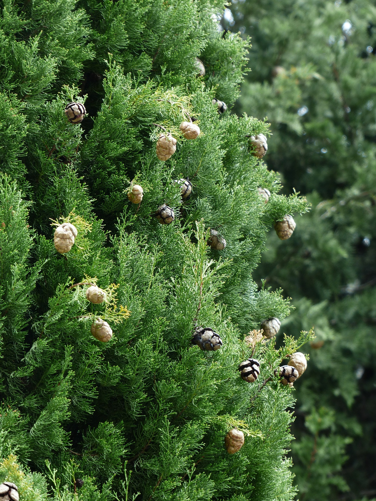

# Plants and Trees in the Bible

## License Information

Plants and Trees in the Bible © United Bible Societies, 2025. Adapted from: <cite>Each According to its Kind: Plants and Trees in the Bible</cite>, by Robert Koops © 2012 United Bible Societies. This work is licensed under Creative Commons Attribution-ShareAlike 4.0 International (<a href="https://creativecommons.org/licenses/by-sa/4.0/">https://creativecommons.org/licenses/by-sa/4.0/</a>).

--------------------------------

## Cypress (id: FLORA:1.6)

1\.6 Cypress
============

References:
-----------

Hebrew בְּרוֹשׁ (berosh)

[2SA 6:5](https://ref.ly/2Sam6:5), [PSA 104:17](https://ref.ly/Ps104:17), [ISA 37:24](https://ref.ly/Isa37:24), [ISA 41:19](https://ref.ly/Isa41:19), [ISA 55:13](https://ref.ly/Isa55:13), [EZK 31:8](https://ref.ly/Ezek31:8), [HOS 14:9](https://ref.ly/Hos14:9), [NAM 2:4](https://ref.ly/Nah2:4)

Hebrew בְּרוֹת (beroth)

[SNG 1:17](https://ref.ly/Song1:17)

Hebrew גֹּפֶר (gofer)

[GEN 6:14](https://ref.ly/Gen6:14)

Hebrew תְּאַשּׁוּר (te’ashur)

[ISA 41:19](https://ref.ly/Isa41:19), [ISA 60:13](https://ref.ly/Isa60:13), [EZK 27:6](https://ref.ly/Ezek27:6)

Hebrew תִּדְהָר (tidhar)

[ISA 41:19](https://ref.ly/Isa41:19), [ISA 60:13](https://ref.ly/Isa60:13)

Discussion:
-----------

*Cypress tree (Ray Pritz (UBS))*

The Hebrew word *berosh* probably covered cypress, fir, and juniper; we are including here only those instances of *berosh* that possibly refer specifically to the cypress. The Cypress *Cupressus sempervirens*, native to Israel, was once common in the mountains of Judea. It also grew abundantly in Lebanon along with cedars, firs, and Grecian junipers. Cypresses also grew in Judea, Gilead and Edom, and do so up to the present day.

A comparison of versions reflects the disagreement among scholars on the identification of the coniferous trees. For example, the Hebrew word *berosh* in [1KI 5:22](https://ref.ly/1Kgs5:22) (8\) is translated as follows:

“cypress” (RSV (Revised Standard Version (1952)), NRSV (New Revised Standard Version (1989)), NLT (New Living Translation), Living Bible \[LB (Living Bible (1971)) ], NJPSV (New Jewish Publication Society Version); Brown, Driver and Briggs lexicon \[BDB (Brown-Driver-Briggs Hebrew and English Lexicon) ], Keil and Delitzsch)

“pine” (GNB (Good News Bible), CEV (Contemporary English Version), NIV (New International Version (1984)), NCV (New Century Version), REB (Revised English Bible (1989)), *Fauna and Flora of the Bible* \[FFB ])

“juniper” (NJB (New Jerusalem Bible (1985)))

“fir” (New American Bible \[NAB (New American Bible (1970)) ])

*Cypress cone (Hans Braxmeier from Pixabay (Pixabay))*

The disagreement here arises from the fact that *berosh* is probably a generic term, and it should probably be translated generically, if possible, or differently according to the context. Following the opinion of Zohary and others, we take the word *berosh* in 1–2 Kings and 2 Chronicles, where it is usually paired with *’erez* (“cedar”) and/or Lebanon, to refer to the Cilician fir (see [1\.9 Fir](#FLORA:1.9)) or to the Grecian juniper (see [1\.11\.1 Grecian juniper (eastern savin)](#FLORA:1.11.1)) rather than to the cypress. In the few other places where it occurs, it may refer to any one of the three conifers. The logic here is that since cypresses grew in Judea, King Solomon would not need to import them from Lebanon. However, it could also be argued that Lebanon may have produced better specimens than King Solomon could find in Israel and he might have imported some of them. In either case, this does not argue against *berosh* as a generic term.

Hepper appears to agree with Zohary. Hareuveni identifies *berosh* as juniper. Thus, if *berosh* does refer to a single species, current scholarly opinion would support “fir” or “juniper,” but not “cypress” or “pine.” It is quite possible that *berosh* and its cognates *burasu* (Akkadian) and *brotha* (Lebanese Arabic) have been used at different times both as generic terms and as specific terms for one of the conifers.

Regarding the *gofer* wood that Noah used for his ark ([GEN 6:14](https://ref.ly/Gen6:14)), little can be known until actual specimens turn up on Mount Ararat. Meanwhile, Moldenke and others thought that the wood used to build the ark may have been cypress, and this is found in Moffatt’s version. But pieces of the ark that were allegedly found by French explorers in the 1970s turned out to be oak dating from the sixth or seventh century A.D. Cypress is very durable. The similarity of the Hebrew word *gofer* with *kofer* (“bitumen”) suggests perhaps a resinous tree. Hence, others have ventured “pine” or “cedar.”

Description:
------------

Closely related to the pines, firs and cedars, the cypress may reach 9–15 meters (30–50 feet) high. It has small scale\-like leaves and round cones. The tall, narrow specimens that are common today in Israel and other countries are a modern variety (*pyramidalis*) that has been specially developed.

Special significance:
---------------------

In the following passages *berosh* seems to suggest something exotic:

[SNG 1:17](https://ref.ly/Song1:17) \- “the beams of our house are cedar, our rafters are *berothim*.”

[ISA 60:13](https://ref.ly/Isa60:13) \- “the glory of Lebanon shall come to you, the *berosh*, the plane, and the pine, to beautify … my sanctuary … .”

Whether *berosh* was generic or specific, a number of poetical passages use it to represent something special without specifying the particular quality in focus; for example, the third line of [HOS 14:9](https://ref.ly/Hos14:9) (8\) says “I am like a *berosh*.” In this passage GNB (Good News Bible) takes the function of the tree to be protection, whereas NLT (New Living Translation) brings out the ever\-green aspect of the tree. In other passages the shape and smell of the tree may be important.

Isaiah uses *berosh* to represent a mountain tree that will grace the desert in the coming age:

[ISA 41:19](https://ref.ly/Isa41:19) \- “I will put in the wilderness the cedar, the acacia … I will set in the desert the *berosh*… .”

[ISA 55:13](https://ref.ly/Isa55:13) \- “Instead of the thorn shall come up the *berosh*. … ”

According to Hepper, the Egyptians used cypress wood for coffins.

Translation:
------------

If a generic word for evergreen conifers exists in the receptor language, then that could be used as a cover term for all the cases of *berosh*. If not, a phrase such as “strong and beautiful tree/wood” can be used in many places, or a transliteration from a major language, for example, *firi*, *piro*, *junipa* or *yunifer*, for the references in 1–2 Kings, 2 Chronicles, and Song of Songs (and *kupresi* or *sipres* elsewhere). Where there is no indigenous evergreen tree, it is best not to try to find a substitute. In [GEN 6:14](https://ref.ly/Gen6:14) we advocate “strong wood” or a transliteration.

[EZK 27:6](https://ref.ly/Ezek27:6): There are textual variations here depending on what vowels you insert in the consonantal Hebrew text for *b\-t\-’\-sh\-r\-m* and how you divide the words in this phrase. It may be read *bat\-’ashurim* or *bite’ashurim*). KJV (King James Version (1611)) takes the first option and interprets *’ashurim* as refering to the people of Ashur (Assyria). Most scholars and versions now take it to refer to some kind of wood (“boxwood” in NEB (New English Bible (1970)) and NJPSV (New Jewish Publication Society Version); “cypress” in NIV (New International Version (1984)); “pine” in RSV (Revised Standard Version (1952)), GNB (Good News Bible), and NLT (New Living Translation)). The context here is rhetorical, but it gets its dramatic force from the mass of detailed information about the geography, history, and trading practices of the time, so we like to have specific words for *berosh*, *’erez* (verse 5\), *’allon*, and *te’ashur* (verse 6\). The translation (or transliteration) of *te’ashur* here will depend on what the translator has done with the other terms. We suggest transliterating from Hebrew (together with a classifier “wood” or “tree”) by saying “… *berosh* wood from Senir … *erez* wood from Lebanon … *allon* wood from Bashan … *te’ashur* wood from the coast of Cyprus.” Transliterations from a major language are also possible.

[EZK 31:3](https://ref.ly/Ezek31:3): The second word of the Hebrew in this verse (*’ashur*) is emended by some scholars to read *te’ashur* (compare [ISA 41:19](https://ref.ly/Isa41:19); [ISA 60:13](https://ref.ly/Isa60:13)) and taken as a reference to the cypress. The third Hebrew word (*’erez*) refers to the cedar. The consensus of scholars now takes *’ashur* as referring to Assyria rather than to a tree. Only *Traduction œcuménique de la Bible* (TOB (Traduction Oecuménique de la Bible (French, 1975))) renders it as “cypress.”

[NAM 2:4](https://ref.ly/Nah2:4) (3\): Literally, the last line of this verse says “the *beroshim* tremble.” The versions are divided into two camps on the exegesis of this line:

1\. NIV (New International Version (1984)), NLT (New Living Translation), and God’s Word (GW (God's Word Translation)) accept the Hebrew text as it is and take *beroshim* to refer to arrows or spears made from the wood of *berosh*, and “tremble” refers to these weapons being waved above the heads of the warriors.

2\. RSV (Revised Standard Version (1952)), GNB (Good News Bible), CEV (Contemporary English Version), NCV (New Century Version), REB (Revised English Bible (1989)), NAB (New American Bible (1970)), JB (Jerusalem Bible (1966)), and NJB (New Jerusalem Bible (1985)) emend the consonants of *beroshim* to read “horses.” In this case, “tremble” is taken to mean “prance” (RSV (Revised Standard Version (1952)), GNB (Good News Bible), CEV (Contemporary English Version)), “be impatient for action” (NJB (New Jerusalem Bible (1985))), or “advance” (REB (Revised English Bible (1989))).

*A Handbook on The Books of Nahum, Habakkuk, and Zephaniah* considers both interpretations as equally likely. Translators are urged to follow a concensus of major versions in their area and footnote the alternative.

[2SA 6:5](https://ref.ly/2Sam6:5): Two positions are evident for the Hebrew phrase that is literally “with all the wood of *beroshim* ”:

1\. RSV (Revised Standard Version (1952)), NRSV (New Revised Standard Version (1989)), GNB (Good News Bible), NIV (New International Version (1984)), NLT (New Living Translation), REB (Revised English Bible (1989)), NAB (New American Bible (1970)), JB (Jerusalem Bible (1966)), and NJB (New Jerusalem Bible (1985)) follow one manuscript of the Dead Sea Scrolls, the Septuagint, and the parallel passage ([1CH 13:8](https://ref.ly/1Chr13:8)), which say “with all their might, with songs.”

2\. KJV (King James Version (1611)), NCV (New Century Version), NJPSV (New Jewish Publication Society Version), TOB (Traduction Oecuménique de la Bible (French, 1975)), the International Children’s Bible (ICB (International Children's Bible)), the New American Standard Bible (NASB (New American Standard Bible)), the French common language version (FRCL (French Common Language Version (Bible en français courant))), *La Sainte Bible: Nouvelle Version Segond révisée* (NVSR), and *La Sainte Bible: La Bible du Semeur* (SEM) follow the Masoretic Text (MT (Masoretic Text)) *berosh* and take *beroshim* to refer to instruments made of “fir” (KJV (King James Version (1611)), NASB (New American Standard Bible)), “cypress” (NJPSV (New Jewish Publication Society Version), NVSR, SEM, TOB (Traduction Oecuménique de la Bible (French, 1975))), or “pine” (ICB (International Children's Bible), FRCL (French Common Language Version (Bible en français courant))), just as it may refer to spears or arrows in [NAM 2:3](https://ref.ly/Nah2:3). This seems to be supported by HOTTP (Hebrew Old Testament Text Project (UBS)), which gives a C rating to the MT (Masoretic Text). The alternative interpretation is included in footnotes in NIV (New International Version (1984)) (“pine”), GNB (Good News Bible) (“fir”), NLT (New Living Translation) (“cypress”), and REB (Revised English Bible (1989)) (“beating of batons”).

Given a choice between following the MT (Masoretic Text) and following the Septuagint, we recommend following the MT (Masoretic Text), but suggest taking *beroshim* as “precious wood.” The translation then would say “musical instruments of precious wood.”

* **Associated Passages:** 2 Samuel 6:5; Psalms 104:17; Isaiah 37:24; Isaiah 41:19; Isaiah 55:13; Ezekiel 31:8; Hosea 14:9; Nahum 2:4; Song of Songs 1:17; Genesis 6:14; Isaiah 60:13; Ezekiel 27:6; 1 Kings 5:22; Ezekiel 31:3; 1 Chronicles 13:8; Nahum 2:3

* **Associated ACAI Concepts:** Cypress (ID: `flora:Cypress`); Grecian Juniper (ID: `flora:Juniper`); Fir (ID: `flora:Fir`)
