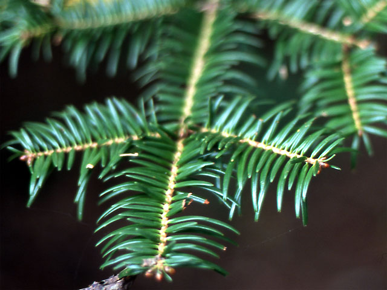

# Plants and Trees in the Bible

## License Information

Plants and Trees in the Bible © United Bible Societies, 2025. Adapted from: <cite>Each According to its Kind: Plants and Trees in the Bible</cite>, by Robert Koops © 2012 United Bible Societies. This work is licensed under Creative Commons Attribution-ShareAlike 4.0 International (<a href="https://creativecommons.org/licenses/by-sa/4.0/">https://creativecommons.org/licenses/by-sa/4.0/</a>).

--------------------------------

## Fir (id: FLORA:1.9)

1\.9 Fir
========

References:
-----------

Hebrew בְּרוֹשׁ (berosh)

[1KI 5:22](https://ref.ly/1Kgs5:22), [1KI 5:24](https://ref.ly/1Kgs5:24), [1KI 6:15](https://ref.ly/1Kgs6:15), [1KI 6:34](https://ref.ly/1Kgs6:34), [1KI 9:11](https://ref.ly/1Kgs9:11), [2KI 19:23](https://ref.ly/2Kgs19:23), [2CH 2:7](https://ref.ly/2Chr2:7), [2CH 3:5](https://ref.ly/2Chr3:5), [ISA 14:8](https://ref.ly/Isa14:8), [ISA 60:13](https://ref.ly/Isa60:13), [ZEC 11:2](https://ref.ly/Zech11:2)

Discussion:
-----------

*Fir (fir twig) (Inti\-sol\-commonswiki (Wikimedia Commons))*

The Cilician Fir *Abies cilicica* grew abundantly in the forests of Lebanon along with cedars, evergreen cypresses, and Grecian junipers. The Hebrew word *berosh* probably included fir, cypress, and juniper. According to [1KI 5:22](https://ref.ly/1Kgs5:22) (8\) and elsewhere, *berosh* was used in King Solomon’s building projects. The reference in [EZK 27:5](https://ref.ly/Ezek27:5) to the use of *berosh* for the timbers/planks of ships could well be talking about fir trees since they are very straight, but the association of *berosh* there with Mount Senir rather favors the Grecian juniper, which was abundant there (see [1\.11\.1 Grecian juniper (eastern savin)](#FLORA:1.11.1)). Hepper (page 163\) notes that in Bible times firs were shipped to Egypt for the masts in front of temple pylons, and there is strong evidence that fir trees were used for masts in ancient Greece. One bit of linguistic evidence that *berosh* could refer to this fir is that the Akkadian word *burasu*, cognate with *berosh*, probably refers to the Cilician Fir *Abies cephalonica*.

Description:
------------

The Cilician fir is a tall and almost perfectly straight evergreen tree, in the same family with pines, cedars, and cypresses. It can reach a height of 25 meters (82 feet). Its flat seeds are contained in cones that fall from the tree when mature. Firs are the major source for turpentine, used by painters to dilute paint and clean brushes.

Special significance:
---------------------

In [ISA 14:8](https://ref.ly/Isa14:8) *beroshim* are said to rejoice, and in [ZEC 11:2](https://ref.ly/Zech11:2) they are called on to mourn the loss of the cedar tree.

Translation:
------------

The *Abies* genus is represented throughout the world in temperate climates at high altitudes (for example, in Kenya, Japan, and North America). Since there are no firs or anything quite like them in tropical Africa, translators can use a transliteration, for example, *firi* or *pir*. In [EZK 27:5](https://ref.ly/Ezek27:5) we recommend following Zohary by rendering *berosh* as “fir” (so RSV (Revised Standard Version (1952)), GNB (Good News Bible), NCV (New Century Version)). The majority of English translations are divided among “fir,” “cypress,” and “pine.” In 1–2 Kings and 2 Chronicles we recommend rendering *berosh* as “fir” or “juniper.” Elsewhere *berosh* may be considered a generic word referring to cypress, fir, pine, or all of them together. In those places a general word for this type of cone\-bearing tree should be used (see also the discussion under [1\.6 Cypress](#FLORA:1.6)).

* **Associated Passages:** 1 Kings 5:22; 1 Kings 5:24; 1 Kings 6:15; 1 Kings 6:34; 1 Kings 9:11; 2 Kings 19:23; 2 Chronicles 2:7; 2 Chronicles 3:5; Isaiah 14:8; Isaiah 60:13; Zechariah 11:2; Ezekiel 27:5

* **Associated ACAI Concepts:** Fir (ID: `flora:Fir`); Grecian Juniper (ID: `flora:Juniper`); Cypress (ID: `flora:Cypress`)
