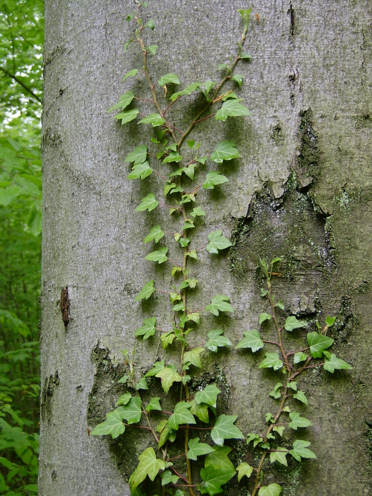

# Plants and Trees in the Bible

## License Information

Plants and Trees in the Bible © United Bible Societies, 2025. Adapted from: <cite>Each According to its Kind: Plants and Trees in the Bible</cite>, by Robert Koops © 2012 United Bible Societies. This work is licensed under Creative Commons Attribution-ShareAlike 4.0 International (<a href="https://creativecommons.org/licenses/by-sa/4.0/">https://creativecommons.org/licenses/by-sa/4.0/</a>).

--------------------------------

## Ivy (id: FLORA:1.10)

1\.10 Ivy
=========

References:
-----------

Greek κισσός (kissos)

[2MA 6:7](https://ref.ly/2Macc6:7)

Greek κισσόφυλλον (kissofullon)

[3MA 2:29](https://ref.ly/3Macc2:29)

Discussion:
-----------

*Ivy (Staszek99 (Wikimedia Commons))*

Some readers may not think of Ivy *Hedera helix* as a “tree,” but we include it here because, like “proper trees” it has a thick, woody stem. People in cities, who only see it climbing the walls of buildings, need to be reminded that it also grows in forests. The two references in Scripture are in the Deuterocanon, where we read of ivy wreaths being worn by those in the procession for Dionysus, the Greek god of fruitfulness and vegetation, and of people being branded with an ivy\-leaf symbol of Dionysus.

Translation:
------------

Since [2MA 6:7](https://ref.ly/2Macc6:7) refers to a wreath or crown made of ivy, some translators may prefer to use a generic description that does not include the species. If the species name is to be included, as it might be in a study Bible, a transliteration of ivy from a major language is recommended together with a classifier identifying the transliteration as a climbing plant, if such is available. If not, the word for “shrub” or “tree” can be used as a classifier together with a transliteration such as *kisos* (Greek), *hedera* (Latin), or one from a major local language.

* **Associated Passages:** 2 Maccabees 6:7; 3 Maccabees 2:29

