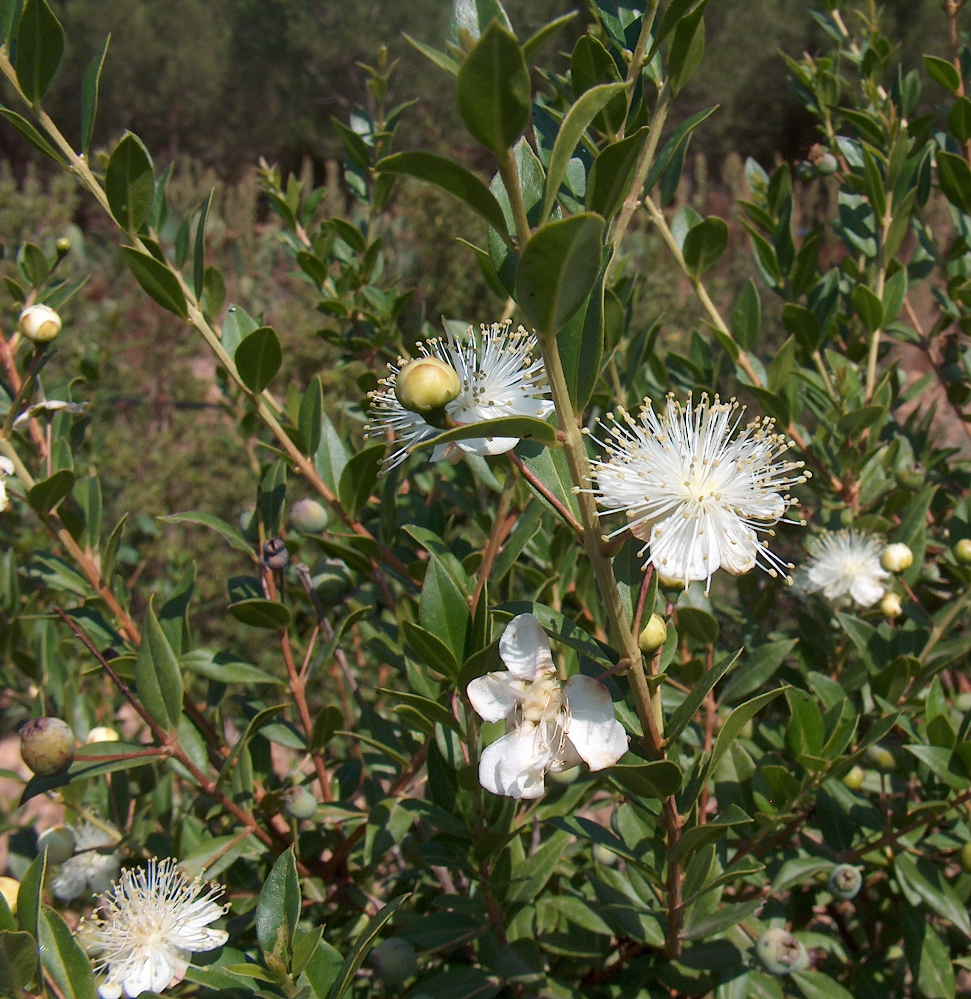

# Plants and Trees in the Bible

## License Information

Plants and Trees in the Bible © United Bible Societies, 2025. Adapted from: <cite>Each According to its Kind: Plants and Trees in the Bible</cite>, by Robert Koops © 2012 United Bible Societies. This work is licensed under Creative Commons Attribution-ShareAlike 4.0 International (<a href="https://creativecommons.org/licenses/by-sa/4.0/">https://creativecommons.org/licenses/by-sa/4.0/</a>).

--------------------------------

## Myrtle (id: FLORA:1.15)

1\.15 Myrtle
============

References:
-----------

Hebrew הֲדַס (hadas)

[NEH 8:15](https://ref.ly/Neh8:15), [ISA 41:19](https://ref.ly/Isa41:19), [ISA 55:13](https://ref.ly/Isa55:13), [ZEC 1:8](https://ref.ly/Zech1:8), [ZEC 1:10](https://ref.ly/Zech1:10), [ZEC 1:11](https://ref.ly/Zech1:11)

Discussion:
-----------

*Myrtle (Giancarlo Dessì (Wikimedia Commons))*

The Myrtle *Myrtus communis* is found in the mountains of the Galilee region up to the present, as well as in North Africa and throughout the Middle East. In the apocalyptic passage [ISA 41:19](https://ref.ly/Isa41:19) it is listed with cedars, acacias, and olives (see also [ISA 55:13](https://ref.ly/Isa55:13)), and we are told that in the new age these verdant trees will replace the thorny bushes of the wilderness. The Arabic *as* and the Akkadian *asu* are cognates of the Hebrew word *hadas*. The leaves and flowers of the myrtle are used in weddings and in medicine. The wood is used for walking sticks and furniture. The bark and roots yield tannin, used up to the present day in Russia and Turkey to prepare leather.

Description:
------------

*Myrtle branch (Giancarlo Dessì (Wikimedia Commons))*

The myrtle shrub is an evergreen with fragrant leaves and normally grows to a height of 2–3 meters (7–10 feet). It has leathery, dark green leaves, pretty white flowers, and bluish black berries, which have a sweet smell.

Special significance:
---------------------

[NEH 8:15](https://ref.ly/Neh8:15) tells us that branches of the myrtle and other trees were used to make shelters for the Festival of Shelters, a practice still followed by Jews today. The Isaiah references associate the myrtle with a time of renewal and goodness. Taken together we may conclude that when Zechariah situates his vision of horses and riders “among the myrtles,” he is thinking of a sacred place, a place of God’s presence, possibly even a “gateway to heaven,” although the use of the definite article may also point to a particular place that Zechariah and his readers knew about. Some commentators hold that the myrtles in Zechariah’s vision represent the people of Israel. Note that these myrtles are said to be growing in some kind of depression in the ground, whether a valley or ravine, which may itself be symbolic of a negative national experience, perhaps even the Babylonian Exile, as some have suggested.

The Hebrew name for myrtle is used as a personal name by women (Hadassah; see [EST 2:7](https://ref.ly/Esth2:7)) as well as men (Assa).

Translation:
------------

Myrtles are part of the gigantic *Myrtaceae* family that includes at least three thousand species throughout the world, including the guava, the eucalyptus, and the clove. Close relatives of the myrtle, however, may be hard to find, so a transliteration from a major language may be the best option. In the poetical Isaiah passages the handling of *hadas* will depend on what the translator does with the other names of trees in the list, whether they use literary equivalents or transliterations. In Nehemiah, transliteration is advised, unless, of course, myrtle or a close relative of it is known. In Zechariah, since we do not know the significant features of the myrtle that the writer had in mind, it is difficult to make an appropriate descriptive equivalent. However, a transliteration or a generic phrase such as “shrubs” or “small, leafy trees” may be used.

* **Associated Passages:** Nehemiah 8:15; Isaiah 41:19; Isaiah 55:13; Zechariah 1:8; Zechariah 1:10; Zechariah 1:11; Esther 2:7

* **Associated ACAI Concepts:** Myrtle (ID: `flora:Myrtle`)
