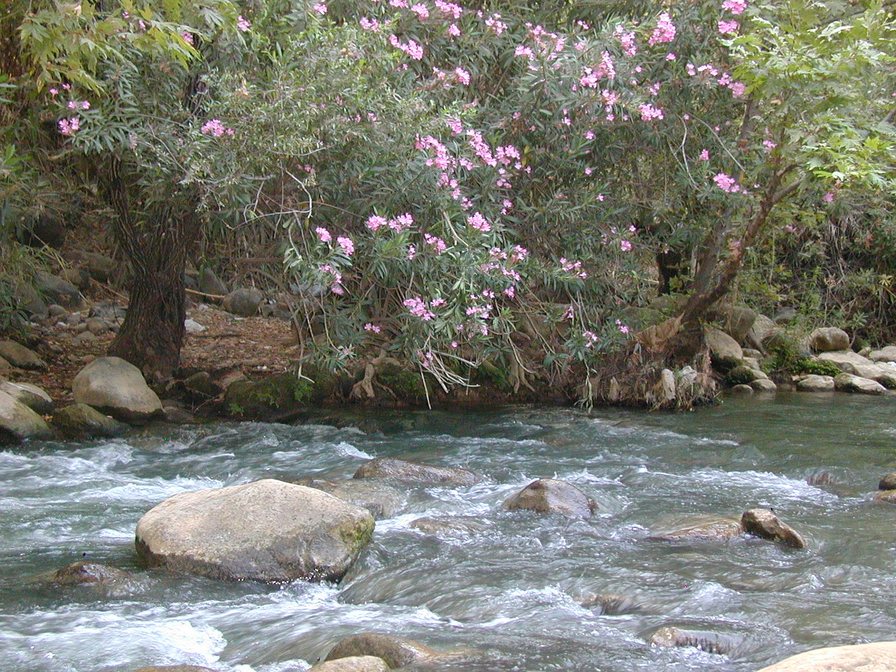

# Plants and Trees in the Bible

## License Information

Plants and Trees in the Bible © United Bible Societies, 2025. Adapted from: <cite>Each According to its Kind: Plants and Trees in the Bible</cite>, by Robert Koops © 2012 United Bible Societies. This work is licensed under Creative Commons Attribution-ShareAlike 4.0 International (<a href="https://creativecommons.org/licenses/by-sa/4.0/">https://creativecommons.org/licenses/by-sa/4.0/</a>).

--------------------------------

## Oleander (id: FLORA:1.17)

1\.17 Oleander
==============

References:
-----------

Latin ardat

[2ES 9:26](https://ref.ly/2Esd9:26)

Discussion:
-----------

*Oleander (Ray Pritz (UBS))*

The Oleander *Nerium oleander* can be found throughout Israel from the Carmel range to the Jordan Valley, inhabiting especially the creek beds that fill with water after heavy rains. It has now become a popular garden shrub. Even in the dry area east of the Jordan it may be found in abundance. Zohary considers the place name “Ardat” in [2ES 9:26](https://ref.ly/2Esd9:26) to be related to the modern Hebrew word *harduf*, which refers to the oleander shrub. Hepper and others hold that the Greek word *rodon* in [SIR 24:14](https://ref.ly/Sir24:14) and [SIR 39:13](https://ref.ly/Sir39:13) refers to oleander, but a small majority identifies *rodon* as the Phoenician rose (see [6\.1\.5 Tulip (mountain tulip, “rose of Sharon”)](#FLORA:6.1.5)). RSV (Revised Standard Version (1952)) renders it “rose” in these passages. Some scholars have contended that the Hebrew word *‘aravah* (“willows” in RSV (Revised Standard Version (1952))) in [LEV 23:40](https://ref.ly/Lev23:40) must refer to the oleander, but there is no concrete evidence for it.

Description:
------------

The oleander is a flowering shrub that can reach 1–4 meters (3–13 feet) in height and has narrow leaves like a willow. The flowers are pink, with doubled petals that make it look like a rose (hence “rose” in Sirach). The leaves, flowers, and milky resin are very toxic. The flowers usually appear in June and range from white to pink in color. The seed pod releases a fluffy seed that may be carried some distance by the wind.

Translation:
------------

The genus *Nerium*, which includes oleander, comprises species found from the Mediterranean region across to Japan. It is part of a large family of plants called Apocynaceae that is found throughout Africa and Asia, but the other genera (*Funtumia*, *Mandevilla*, *Parsonsia*, *Strophanthus*) are so different as to be unhelpful in translation.

* **Associated Passages:** 2 Esdras (Latin) 9:26; Sirach 24:14; Sirach 39:13; Leviticus 23:40

