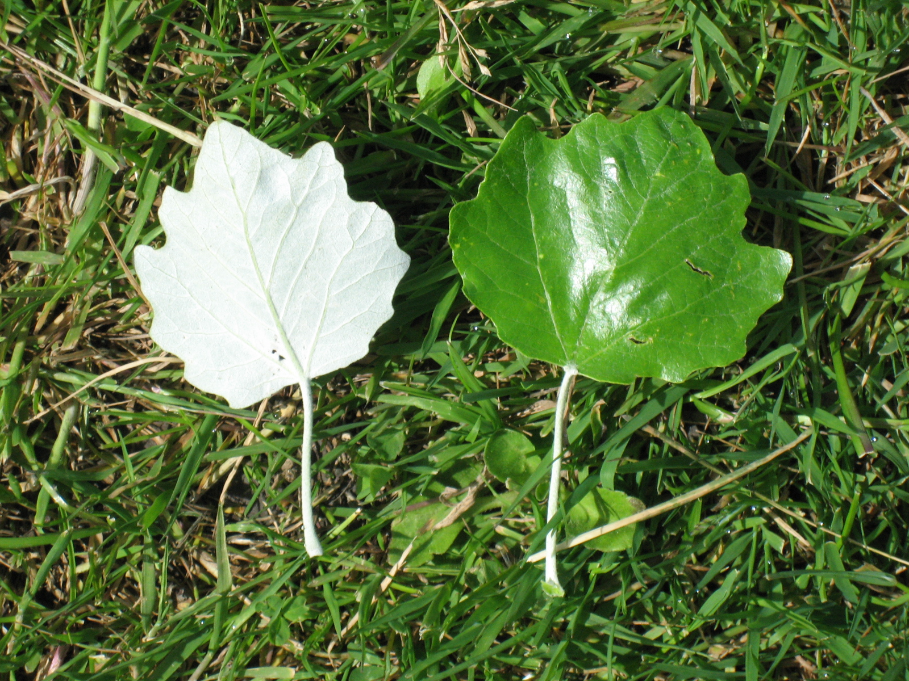

# Plants and Trees in the Bible

## License Information

Plants and Trees in the Bible © United Bible Societies, 2025. Adapted from: <cite>Each According to its Kind: Plants and Trees in the Bible</cite>, by Robert Koops © 2012 United Bible Societies. This work is licensed under Creative Commons Attribution-ShareAlike 4.0 International (<a href="https://creativecommons.org/licenses/by-sa/4.0/">https://creativecommons.org/licenses/by-sa/4.0/</a>).

--------------------------------

## Poplar (id: FLORA:1.20)

1\.20 Poplar
============

References:
-----------

Hebrew בָּכָא (baka’)

[2SA 5:23](https://ref.ly/2Sam5:23), [2SA 5:24](https://ref.ly/2Sam5:24), [1CH 14:14](https://ref.ly/1Chr14:14), [1CH 14:15](https://ref.ly/1Chr14:15)

Hebrew לִבְנֶה (livneh)

[GEN 30:37](https://ref.ly/Gen30:37)

Hebrew עֲרָבָה (‘aravah)

[LEV 23:40](https://ref.ly/Lev23:40), [JOB 40:22](https://ref.ly/Job40:22), [PSA 137:2](https://ref.ly/Ps137:2), [ISA 15:7](https://ref.ly/Isa15:7), [ISA 44:4](https://ref.ly/Isa44:4)

Discussion:
-----------

*Euphrates poplar (Michael D. Manning (Britannica))*

There are several species of poplar in the Middle East, and that has given rise to some controversy over which one is referred to by a particular Hebrew word. Two kinds of poplar were common in Israel in Bible times, the white poplar and the Euphrates poplar.

In [GEN 30:37](https://ref.ly/Gen30:37) Jacob’s magical recipe for multiplying sheep and goats relied on the light inner wood of the White Poplar *Populus alba*, a tree that grows along riverbanks in Israel. This softwood tree with gray bark was used for timber and for making tools and rafters. In some places the bark is used as medicine.

The Euphrates Poplar *Populus euphratica* likewise grows along riverbanks, but it is much more widespread in the Middle East than the white poplar, and that makes it a natural candidate for the reference in [PSA 137:2](https://ref.ly/Ps137:2), which says “On the *‘aravim* \[‘willows’ in RSV (Revised Standard Version (1952)) ] there we hung up our lyres.” This is further strengthened by the fact that in Iraq this poplar is called *gharab*, which is cognate with *‘aravah*. Zohary suggests that the Hebrew word *tsaftsafah* in [EZK 17:5](https://ref.ly/Ezek17:5) could be taken to refer to the Euphrates poplar. Hepper supports that, citing the easy\-rooting properties of the poplar. However, the Arabs call the willow *safsaf*, and for that reason we take the Ezekiel reference as referring to the willow.

The trees mentioned in [2SA 5:23](https://ref.ly/2Sam5:23); [2SA 5:24](https://ref.ly/2Sam5:24) and in [1CH 14:14](https://ref.ly/1Chr14:14); [1CH 14:15](https://ref.ly/1Chr14:15) may possibly have been poplars (“balsam trees” in RSV (Revised Standard Version (1952)); “mulberry trees” in KJV (King James Version (1611)); “aspens” in NEB (New English Bible (1970)) and REB (Revised English Bible (1989))), based on the observation that the leaves of poplars make a rustling sound when the wind blows.

Note that in [HOS 4:13](https://ref.ly/Hos4:13), the Hebrew word *livneh* refers to the styrax (see [1\.22 Styrax](#FLORA:1.22)), the argument being that it is associated there with the oak and terebinth.

Description:
------------

*Poplar leaf (MPF (Wikimedia Commons))*

The white poplar is a tall tree reaching perhaps 20 meters (66 feet). Its seeds are dispersed by the wind in bunches of long, silky hair. The Euphrates poplar is also tall. It has two types of leaves. When young, it produces a narrow leaf like a willow; when it matures, its leaves are broader. This has led to some confusion among scholars as to the identity of willows and poplars mentioned in the Bible.

Translation:
------------

*Poplar trunk (MPF (Wikimedia Commons))*

*Populus* species (cottonwood, aspen) are known throughout Europe and North America. In Africa, apart from North Africa and South Africa where a number of kinds of poplars have been introduced from Europe, there do not seem to be any *Populus* species. However, Palgrave notes that a related species, the Wild Willow *Salix subserrata*, is distributed from Egypt and Sudan right down through Kenya, Uganda, Zaire, and into South Africa. In Asia *Populus* species are known from Arabia to the region of the Himalayas.

Where *Populus* species are known, and if the inner bark is known to be white, they could be used in Genesis, but keep in mind that another tree of the same family (willow) is mentioned in [LEV 23:40](https://ref.ly/Lev23:40). Where *Populus* species are not known, we advocate transliterating from a major language in [GEN 30:37](https://ref.ly/Gen30:37) (for example, *popula*, *populari*, *hawur* \[Arabic], or *abele* \[French]), since this is a historical setting rather than a rhetorical one. We would avoid making local substitutions, even though *A Handbook on Genesis* (pages 701–702\) sanctions it there.

* **Associated Passages:** 2 Samuel 5:23; 2 Samuel 5:24; 1 Chronicles 14:14; 1 Chronicles 14:15; Genesis 30:37; Leviticus 23:40; Job 40:22; Psalms 137:2; Isaiah 15:7; Isaiah 44:4; Ezekiel 17:5; Hosea 4:13

* **Associated ACAI Concepts:** Poplar (ID: `flora:Poplar`)
