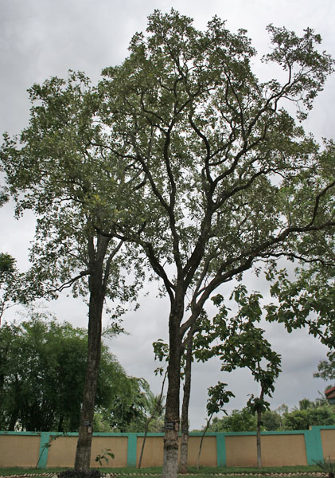

# Plants and Trees in the Bible

## License Information

Plants and Trees in the Bible © United Bible Societies, 2025. Adapted from: <cite>Each According to its Kind: Plants and Trees in the Bible</cite>, by Robert Koops © 2012 United Bible Societies. This work is licensed under Creative Commons Attribution-ShareAlike 4.0 International (<a href="https://creativecommons.org/licenses/by-sa/4.0/">https://creativecommons.org/licenses/by-sa/4.0/</a>).

--------------------------------

## Sandalwood (red saunders) (id: FLORA:1.21)

1\.21 Sandalwood (red saunders)
===============================

References:
-----------

Hebrew אַלְגּוּמִּים (’algum)

[2CH 2:7](https://ref.ly/2Chr2:7), [2CH 9:10](https://ref.ly/2Chr9:10), [2CH 9:11](https://ref.ly/2Chr9:11)

Hebrew אַלְמֹגִּים (’almug)

[1KI 10:11](https://ref.ly/1Kgs10:11), [1KI 10:12](https://ref.ly/1Kgs10:12), [1KI 10:12](https://ref.ly/1Kgs10:12)

Discussion:
-----------

A survey of the English versions indicates the vigorous debate, if not confusion, surrounding the Hebrew word *’almug* in 1 Kings and its parallel *’algum* in 2 Chronicles. The majority of English versions (RSV (Revised Standard Version (1952)), NRSV (New Revised Standard Version (1989)), NIV (New International Version (1984)), REB (Revised English Bible (1989)), NJB (New Jerusalem Bible (1985))) transliterate directly from the Hebrew in both books, but GNB (Good News Bible), CEV (Contemporary English Version), and NCV (New Century Version) harmonize 1 Kings and 2 Chronicles by using “juniper” throughout. GECL (German Common Language Version (Gute Nachricht Bibel)) likewise avoids the issue by translating “precious wood” in both books. The debate hinges on two questions:

1\. Is *’almug* in 1 Kings the same as *’algum* in 2 Chronicles?

2\. Where does the *’almug* /*’algum* tree come from?

Note where they are said to come from: [1KI 10:11](https://ref.ly/1Kgs10:11), *’almug* from Ophir; [2CH 2:7](https://ref.ly/2Chr2:7), *’algum* from Lebanon; [2CH 9:10](https://ref.ly/2Chr9:10), *’algum* from Ophir.

The botanical commentators stand as follows: Zohary, following Tristram, says that the trees are the same, that is, red sandalwood (*Pterocarpus santolinus*, also called red saunders) from India (via Ophir). Hepper, following Moldenke, Celsius, W. Smith and others, says the trees are different: *’almug* is the red sandalwood; *’algum* is the Grecian Juniper *Juniperus excelsa* of Lebanon.

According to FFB, the trees are the same, of unknown origin but maybe the red sandalwood, the white sandalwood, or the Phoenician juniper.

The biblical commentators Keil and Delitzsch consider the trees to be the same, namely sandalwood. According to them, in [2CH 2:8](https://ref.ly/2Chr2:8) the writer mistakenly groups *’algum* with cedar and cypress as products of Lebanon, whereas *’algum* should stand separately with “precious stones,” as it does in [2CH 9:10](https://ref.ly/2Chr9:10). Furthermore, G. H. Jones argues it should be *’almug*, not *’algum*, on the basis of cognates in Ugaritic (*’\-l\-m\-g*) and Akkadian (*elammakku*). Furthermore, a dialect of Sanskrit has the word *mocha* for the sandalwood tree (see also the appendix below). Adding the Arabic definite article *al* could explain *al\-mug* (and Arabic typically changes *o* to *u* in loan words). Greenfield and Mayrhofer (1967, quoted in Hepper) also hold on philological grounds that *’algum* and *’almug* are the same thing; they identify it with a tree from Lebanon which they do not name. Ugaritic records, incidentally, refer to a tree called *’\-l\-m\-g*.

On a quite different track, Hareuveni (page 99\) tries to make a case for translating *’almug* as “coral,” a mineral product found in the sea, on the ground that *’almog* is the modern Hebrew word for coral. It makes a good pair with “precious stones.” Hareuveni quotes the Babylonian Talmud, which describes in detail how these “coral trees” are brought up from the bottom of the Mediterranean Sea.

The translators of GNB (Good News Bible), CEV (Contemporary English Version) and NCV (New Century Version) (following FFB, which follows Koehler and Baumgartner) hold that the phrase “*’algum* from Lebanon” in [2CH 2:7](https://ref.ly/2Chr2:7) is basic and that it must refer to the Phoenician juniper (see [1\.11\.2 Phoenician juniper (coastal juniper)](#FLORA:1.11.2)). Then they harmonize 1 Kings with 2 Chronicles.

Looking at the accounts in 1 Kgs 10 and 2 Chr 9 as stories about Hiram’s contribution to King Solomon, one may observe first of all that the accounts are both awkwardly interrupted by the story of the visit of the queen of Sheba.\* They are almost word\-for\-word parallels except for the *’almug* /*’algum* difference. King Hiram brought gold from Ophir, and also, incidentally, *’algum* /*’almug* wood and precious stones. 1 Kings refers to *’almug* three times; the parallel account in 2 Chronicles mentions *’algum* twice, with the third parallel clearly implied. It is difficult to escape the conclusion that they refer to the same product, and that the variation is caused by the simple inversion of the two Hebrew consonants *mem* and *gimel* in one account. Neither account says where the wood came from, but it seems not to be Lebanon. This seems to rule out “juniper” (as in GNB (Good News Bible), CEV (Contemporary English Version), and NCV (New Century Version)). And it may not be Ophir. Which of the two readings is earlier? It is generally accepted that the Kings account came first and that the Chronicler used the Deuteronomic Kings account (with *’almug*) as a reference. Let us assume that *’almug* is prior.

Note that [2CH 2:7](https://ref.ly/2Chr2:7) (8\) expresses King Solomon’s desire that King Hiram send him “cedar, cypress and *’algum*.” There is no exact parallel to this in 1 Kings, but in [1KI 5:7](https://ref.ly/1Kgs5:7); [1KI 5:8](https://ref.ly/1Kgs5:8); [1KI 5:9](https://ref.ly/1Kgs5:9) we have King Hiram’s response to Solomon’s request. He says that he will send Solomon cedar and cypress. There is no reference to any other type of wood. But when we get to [2CH 9:10](https://ref.ly/2Chr9:10) we find that Hiram sends algum wood and precious stones. We can conclude that *’algum* was added to [2CH 2:7](https://ref.ly/2Chr2:7) in order to anticipate the statement in [2CH 9:10](https://ref.ly/2Chr9:10) (and [1KI 10:11](https://ref.ly/1Kgs10:11)) that Solomon brought *’algum* wood for use in the Temple. Unfortunately, the way it was added makes it sound as though the precious wood is from Lebanon. [2CH 8:18](https://ref.ly/2Chr8:18) and [2CH 9:10](https://ref.ly/2Chr9:10) (interrupted by the queen of Sheba story) clearly separate the gold (from Ophir) from the algum and precious stones (origin unspecified). We conclude that, in adapting the text of [1KI 10:11](https://ref.ly/1Kgs10:11); [1KI 10:12](https://ref.ly/1Kgs10:12), the scribe preparing [2CH 9:10](https://ref.ly/2Chr9:10); [2CH 9:11](https://ref.ly/2Chr9:11) inverted the consonants, yielding *’algum*, and the other reference in 2 Chronicles was adapted to harmonize with the first.

Description:
------------

The Red Sandalwood *Pterocarpus santolinus* is a large tropical tree with hard, reddish wood and yellow flowers. The fruit appears as a pod with two seeds in it.

Translation:
------------

If the translator is convinced on the basis of the cognates that the sandalwood tree is intended in both 1 Kings and 2 Chronicles, as we propose, it is worthwhile noting that many species of sandalwood (*Pterocarpus*) occur all over the world. There are twenty tropical species (some known as padouk, vermilion wood, bloodwood, and kino). In Africa species of *Pterocarpus* are called rosewood, barwood, or kino. In Asia the *Pterocarpus* species may be called Burmese rosewood, red wood, Amboyna wood, or maidu. French\-speaking areas may know it as *santal rouge*; in Portuguese it is *sandalo vermelho*.

Translation options are:

1\. Use a relative of the sandalwood present in the local area, or transliterate from a major language.

2\. Take 1 Kings as “original” and use a transliteration of *mug* /*mok* or *almug* /*almok* in both books. [2CH 2:7](https://ref.ly/2Chr2:7) could then have a footnote explaining that the Hebrew has *’algum*. (A study Bible would explain why this tropical tree came to be in this verse about Lebanon.)

3\. Generalize by using “precious wood” in both books as in GECL (German Common Language Version (Gute Nachricht Bibel)).

4\. Transliterate from the Hebrew in both 1 Kings and 2 Chronicles as in RSV (Revised Standard Version (1952)) and NIV (New International Version (1984)), live with the tantalizing similarity (for example, *aligumu* /*alimugu*), and wait for archeologists to discover samples at the Temple Mount.

Zohary suggests that [2CH 2:7](https://ref.ly/2Chr2:7) a be revised to read “Send me also cedar \[and] cypress from Lebanon and \[also] algum timber.” This matches better with 1 Kings but may be a more radical rearrangement of the grammar than some translators will allow.

Appendix
--------

Zohary and others have argued for *’almug* being sandalwood on the grounds that *mug* is cognate with the Sanskrit *mocha*, with the definite article *al* prefixed. This assumes that the Arabs were trafficking in sandalwood, using the name *almuka* or something like it, and that the Arabic word came into the Hebrew Bible at the time of the writing of 1–2 Kings and 1–2 Chronicles. There is a question, however, whether the definite article was in use in Arabic at the time these books were written. Moscati’s *An Introduction to the Comparative Grammar of the Semitic Languages* says that most texts of Epigraphic South Arabian and Early Northern Arabic (fifth century B.C. to fourth century A.D.) have no definite article, but instead suffix a *nun* or *mem* for the absolute state (as in Babylonian). It has been assumed until recently that the article *al* appears regularly only in classical Arabic (beginning in the fourth century A.D. onward). However, two important exceptions with *al* have been found, in the form of inscriptions, and Moscati concedes that they may date to the Early Northern Arabic Period. Further, Herodotus, writing in the fifth century B.C., already uses a phrase for “the goddess” with both of the prefixes *h* /*hn* and *al* in an Aramaic inscription.

1 Kgs

[1KI 9:26](https://ref.ly/1Kgs9:26); [1KI 9:27](https://ref.ly/1Kgs9:27) gold from Ophir

[1KI 10:11](https://ref.ly/1Kgs10:11); [1KI 10:12](https://ref.ly/1Kgs10:12) *’almug* and precious stones

[1KI 10:14](https://ref.ly/1Kgs10:14); [1KI 10:15](https://ref.ly/1Kgs10:15) total amount of gold

2 Chr

[2CH 8:17](https://ref.ly/2Chr8:17); [2CH 8:18](https://ref.ly/2Chr8:18) gold from Ophir

[2CH 9:10](https://ref.ly/2Chr9:10); [2CH 9:11](https://ref.ly/2Chr9:11) *’algum* and precious stones

[2CH 9:13](https://ref.ly/2Chr9:13); [2CH 9:14](https://ref.ly/2Chr9:14) total amount of gold

* **Associated Passages:** 2 Chronicles 2:7; 2 Chronicles 9:10; 2 Chronicles 9:11; 1 Kings 10:11; 1 Kings 10:12; 2 Chronicles 2:8; 1 Kings 5:7; 1 Kings 5:8; 1 Kings 5:9; 2 Chronicles 8:18; 1 Kings 9:26; 1 Kings 9:27; 1 Kings 10:14; 1 Kings 10:15; 2 Chronicles 8:17; 2 Chronicles 9:13; 2 Chronicles 9:14

