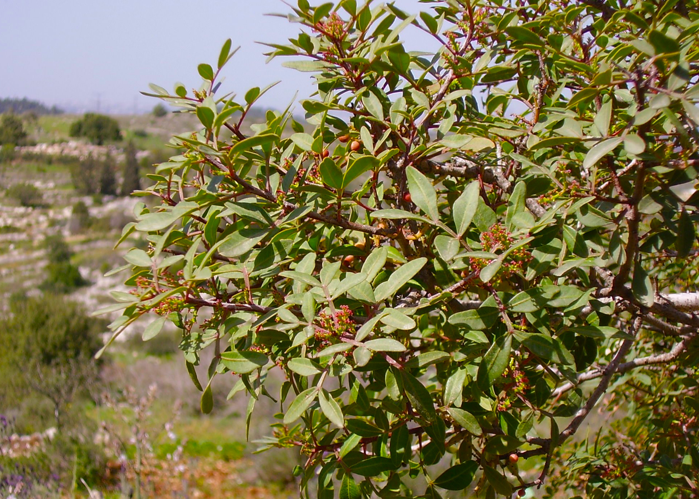

# Plants and Trees in the Bible

## License Information

Plants and Trees in the Bible © United Bible Societies, 2025. Adapted from: <cite>Each According to its Kind: Plants and Trees in the Bible</cite>, by Robert Koops © 2012 United Bible Societies. This work is licensed under Creative Commons Attribution-ShareAlike 4.0 International (<a href="https://creativecommons.org/licenses/by-sa/4.0/">https://creativecommons.org/licenses/by-sa/4.0/</a>).

--------------------------------

## Terebinth (id: FLORA:1.24)

1\.24 Terebinth
===============

References:
-----------

### **Tree**:

Hebrew אֵלָה, אַלָּה (’elah, ’alah)

[GEN 35:4](https://ref.ly/Gen35:4), [JOS 24:26](https://ref.ly/Josh24:26), [JDG 6:11](https://ref.ly/Judg6:11), [JDG 6:19](https://ref.ly/Judg6:19), [1SA 17:2](https://ref.ly/1Sam17:2), [1SA 17:19](https://ref.ly/1Sam17:19), [1SA 21:10](https://ref.ly/1Sam21:10), [2SA 18:9](https://ref.ly/2Sam18:9), [2SA 18:9](https://ref.ly/2Sam18:9), [2SA 18:10](https://ref.ly/2Sam18:10), [2SA 18:14](https://ref.ly/2Sam18:14), [1KI 13:14](https://ref.ly/1Kgs13:14), [1CH 10:12](https://ref.ly/1Chr10:12), [ISA 1:30](https://ref.ly/Isa1:30), [ISA 6:13](https://ref.ly/Isa6:13), [EZK 6:13](https://ref.ly/Ezek6:13), [HOS 4:13](https://ref.ly/Hos4:13)

Hebrew אַיִל (’ayil)

[ISA 1:29](https://ref.ly/Isa1:29), [ISA 57:5](https://ref.ly/Isa57:5), [ISA 61:3](https://ref.ly/Isa61:3), [EZK 31:14](https://ref.ly/Ezek31:14)

Hebrew אֵלֶם (’elem)

[PSA 56:1](https://ref.ly/Ps56:1)

Greek σχῖνος (schinos)

[SUS 1:54](https://ref.ly/PrAzar1:54)

Greek τερέμινθος (tereminthos)

[SIR 24:16](https://ref.ly/Wis24:16)

References:
-----------

### **Fruit**:

Hebrew בָּטְנִים (boten)

[GEN 43:11](https://ref.ly/Gen43:11)

References:
-----------

### **Resin**:

Hebrew צֳרִי (tsori)

[GEN 37:25](https://ref.ly/Gen37:25), [GEN 43:11](https://ref.ly/Gen43:11), [JER 8:22](https://ref.ly/Jer8:22), [JER 46:11](https://ref.ly/Jer46:11), [JER 51:8](https://ref.ly/Jer51:8), [EZK 27:17](https://ref.ly/Ezek27:17)

Discussion:
-----------

The Hebrew words *’elah* and *’alah* refer to any of three species of terebinth mentioned in the Bible: 1\) the Atlantic Terebinth *Pistacia atlantica*, 2\) the Palestinian Terebinth *Pistacia palaestina* (or *Pistacia terebinthus*), and 3\) the Lentisk Terebinth *Pistacia lentiscus* (or *Pistacia lenticus*), also called the mastic tree.

According to Zohary, the Atlantic terebinth, also called the teil tree, is found in the Negev, Lower Galilee, and the Dan Valley. Hepper says it was once abundant in Gilead, the trunk and bark being a possible source for aromatic resin (mastic) exported to Egypt. It is a dry\-land tree that grows in the border areas between evergreen woodlands and the dwarf\-shrub steppes (note “valley of Elah” in [1SA 17:2](https://ref.ly/1Sam17:2); [1SA 17:19](https://ref.ly/1Sam17:19); [1SA 21:10](https://ref.ly/1Sam21:10)). The nuts of the Atlantic terebinth are used for dyeing and tanning animal skins, but they can be eaten if roasted. They are often sold in Arab markets, are bigger than the nuts of the Palestinian terebinth, and are quite different from the true pistachio nuts, which come from outside the Holy Land (see below).

The Palestinian terebinth is found mostly on wooded hills, often together with the common oak. Its little round nuts can be eaten whole, fresh, or roasted, and it is probably these nuts (*boten*) that were carried to Egypt by the sons of Jacob ([GEN 43:11](https://ref.ly/Gen43:11)), although Zohary holds that they could also have been the fruit of the true pistachio tree (*Pistacia vera*), which was, and is, abundant in Persia (now Iran).

The lentisk terebinth is a shrub or bush that grew in the hills of Gilead, and may be the source of the “balm/resin” (*tsori* in Hebrew) carried by the Ishmaelites in [GEN 37:25](https://ref.ly/Gen37:25), and by the sons of Jacob to Egypt along with pistachio nuts in [GEN 43:11](https://ref.ly/Gen43:11). The fact that [GEN 37:25](https://ref.ly/Gen37:25); [JER 8:22](https://ref.ly/Jer8:22); [JER 46:11](https://ref.ly/Jer46:11) all mention Gilead in connection with the resin *tsori*, suggests that its source was a plant unique to Palestine. That is why it could be used to trade for goods from Egypt. The references in Jeremiah presumably refer to the salve made from the terebinth resin.

Description:
------------

Terebinths look like oaks but have pinnate leaves. The Atlantic terebinth may reach a height of 10 meters (33 feet). The Palestinian terebinth species is shorter, reaching to 5 meters (17 feet). The lentisk terebinth, or mastic (gum) tree, is a small shrub or tree 1–3 meters (3–10 feet) in height that produces a sweet\-smelling resin when the stem or branches are cut. The resin dries into hard lumps, which are then ground and dissolved in olive oil for medicinal use, perfume, incense, varnish, and glue.

Special significance:
---------------------

Both of the larger terebinths were revered by ancient Israelites and other peoples. They built shrines and altars in the terebinth groves, and sometimes buried people there. The resin of the lentisk terebinth was highly prized for its medicinal value, which is why the Ishmaelites ([GEN 37:25](https://ref.ly/Gen37:25)) and the sons of Jacob ([GEN 43:11](https://ref.ly/Gen43:11)) were carrying them as trade goods to Egypt. [SIR 24:16](https://ref.ly/Wis24:16) uses the wide\-spreading branches terebinth as a metaphor for wisdom.

Translation:
------------

KJV (King James Version (1611)) has “elms” for what should be “terebinths” in [HOS 4:13](https://ref.ly/Hos4:13). In [GEN 35:4](https://ref.ly/Gen35:4) the terebinth (*’elah*) near Shechem seems to conflict with the oak (*’elon*) in [GEN 12:6](https://ref.ly/Gen12:6). Some versions harmonize the two accounts using “oak” in both places. Others do so with “terebinth.” Still others render both as “great tree” or “holy tree.” It is quite possible that *’elah* at some point became a generic term for all big trees.

Terebinths do not grow outside of the Middle East, but related species in the *Pistacia* genus are found from southern Europe across Asia to the Philippines. Where a related species cannot be found, a generic phrase or a transliteration from a major language is recommended, for example, *terebinti*, or, from Hebrew, *elahi*.

[PSA 56:1](https://ref.ly/Ps56:1): Although the Hebrew word *’elem* in the introduction to [PSA 56:0](https://ref.ly/Ps56:0) normally means “silence,” most commentators have chosen rather to take it as an alternate spelling of the word for “terebinth” (*’elah*, *’alah*).

* **Associated Passages:** Genesis 35:4; Joshua 24:26; Judges 6:11; Judges 6:19; 1 Samuel 17:2; 1 Samuel 17:19; 1 Samuel 21:10; 2 Samuel 18:9; 2 Samuel 18:10; 2 Samuel 18:14; 1 Kings 13:14; 1 Chronicles 10:12; Isaiah 1:30; Isaiah 6:13; Ezekiel 6:13; Hosea 4:13; Isaiah 1:29; Isaiah 57:5; Isaiah 61:3; Ezekiel 31:14; Psalms 56:1; Susanna 1:54; Sirach 24:16; Genesis 43:11; Genesis 37:25; Jeremiah 8:22; Jeremiah 46:11; Jeremiah 51:8; Ezekiel 27:17; Genesis 12:6; Psalms 56:0

