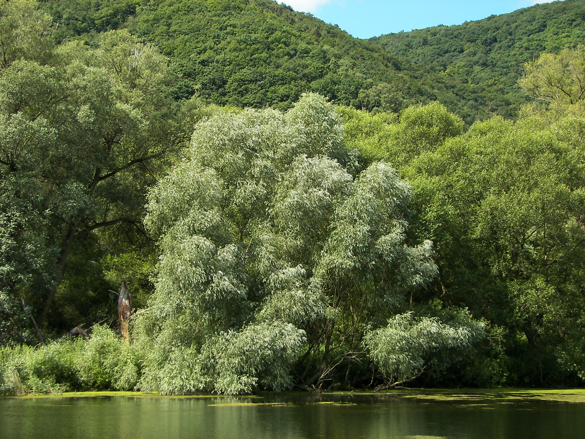

# Plants and Trees in the Bible

## License Information

Plants and Trees in the Bible © United Bible Societies, 2025. Adapted from: <cite>Each According to its Kind: Plants and Trees in the Bible</cite>, by Robert Koops © 2012 United Bible Societies. This work is licensed under Creative Commons Attribution-ShareAlike 4.0 International (<a href="https://creativecommons.org/licenses/by-sa/4.0/">https://creativecommons.org/licenses/by-sa/4.0/</a>).

--------------------------------

## Willow (id: FLORA:1.26)

1\.26 Willow
============

References:
-----------

Hebrew עֲרָבָה (‘aravah)

[LEV 23:40](https://ref.ly/Lev23:40), [JOB 40:22](https://ref.ly/Job40:22), [ISA 44:4](https://ref.ly/Isa44:4)

Hebrew צַפְצָפָה (tsaftsafah)

[EZK 17:5](https://ref.ly/Ezek17:5)

Discussion:
-----------

There are two kinds of willow in Palestine, the White Willow *Salix alba* being the northern one, and the Common Willow *Salix acmophylla* being the southern, more heat\-tolerant one. In the Jordan Valley the willow gives way to the salt\-tolerant Euphrates poplar as the river gets close to the Dead Sea. Some confusion of names arises from the fact that the Euphrates poplar has two kinds of leaves. The younger shoots produce a narrow leaf like the willow, and the mature shoots produce a wider, ovate leaf.

Zohary states confidently that the species in [LEV 23:40](https://ref.ly/Lev23:40) and [ISA 44:4](https://ref.ly/Isa44:4) is definitely the willow. Presumably the same Hebrew word *‘aravah* in [JOB 40:22](https://ref.ly/Job40:22) also refers to the willow. Hepper, translating this word as “willows” in [ISA 44:4](https://ref.ly/Isa44:4), apparently agrees with Zohary. FFB concedes that putting “willows” in [LEV 23:40](https://ref.ly/Lev23:40) may be correct, but goes on to reverse itself by saying that “poplar” is justified in all passages by the fact that the Arabic name *gharab* is cognate with the Hebrew word. In response, Zohary argues that Arabs use *gharab* for both poplars and willows, the leaves of the two trees being very similar.

Considering the context, the word *‘aravah* found in [PSA 137:2](https://ref.ly/Ps137:2) most likely refers to the Euphrates poplar (see [1\.20 Poplar](#FLORA:1.20)). Ezekiel’s reference to a plant (*tsaftsafah* in Hebrew) that grew by a stream could refer either to a poplar or to a willow. According to Zohary, Arabs in Egypt call willows *safsaf*, whereas elsewhere in North Africa *safsaf* refers to the Euphrates poplar.

Description:
------------

The willow is found along streams, where it can grow to a height of 6 meters (20 feet). It has long, narrow leaves which drop during the winter and the tiny green flowers appear around October.

Special significance:
---------------------

If “willow” is indeed the correct translation of *‘aravah* in Leviticus, then it is one of the four species recommended for use in building shelters for the Festival of Shelters. In Job it is the habitat of the mysterious Behemoth that no man can tame. In Isaiah and Ezekiel it is a metaphor for something that grows luxuriantly.

Translation:
------------

The English versions fall into several groups regarding the translation of *‘aravah* in [LEV 23:40](https://ref.ly/Lev23:40): 1\) ”willows” (RSV (Revised Standard Version (1952)), NLT (New Living Translation), REB (Revised English Bible (1989)), NASB (New American Standard Bible), NJPSV (New Jewish Publication Society Version)); 2\) ”poplars” (NIV (New International Version (1984)), NCV (New Century Version), GW (God's Word Translation), NAB (New American Bible (1970))); 3\) ”flowering shrubs” (NJB (New Jerusalem Bible (1985))); and 4\) ”leafy trees/branches” (GNB (Good News Bible), CEV (Contemporary English Version); GNB (Good News Bible) combines the last two of the series, CEV (Contemporary English Version) the last three).

As explained above, we recommend “willow” or a member of the *Salix* genus in [LEV 23:40](https://ref.ly/Lev23:40); [JOB 40:22](https://ref.ly/Job40:22); [ISA 44:4](https://ref.ly/Isa44:4). Over three hundred *Salix* species are found around the world in temperate regions. They are sometimes known as ossiers or sallows. At least one *Salix* species (Safsaf Willow *Salix subserrata*) is found in sub\-Saharan Africa in addition to being found in Egypt, Libya, and Israel. *Flora of West Tropical Africa* lists three other species, and Palgrave records two other indigenous willows in southern Africa. There are willows on the Jos Plateau in Nigeria (Hepper, private communication). People who make round, thatched houses use thin, flexible sticks from a shrub to form the concentric rings that hold the radial sticks (either bamboo or sorghum stalks) in place. Some of these may be willows, and if so, the local word would be appropriate in the biblical context where shelters are being constructed.

Where such a local plant is not available, we favor following something like “tree of *wilo* ” or using a generic phrase, lumping it with the previous phrase, but making sure that *wilo* or its equivalent in a major language is included in a footnote.

In [ISA 44:4](https://ref.ly/Isa44:4) and [EZK 17:5](https://ref.ly/Ezek17:5) the willow is symbolic of quick growth and may require an appropriate local equivalent of a thriving plant.

* **Associated Passages:** Leviticus 23:40; Job 40:22; Isaiah 44:4; Ezekiel 17:5; Psalms 137:2

