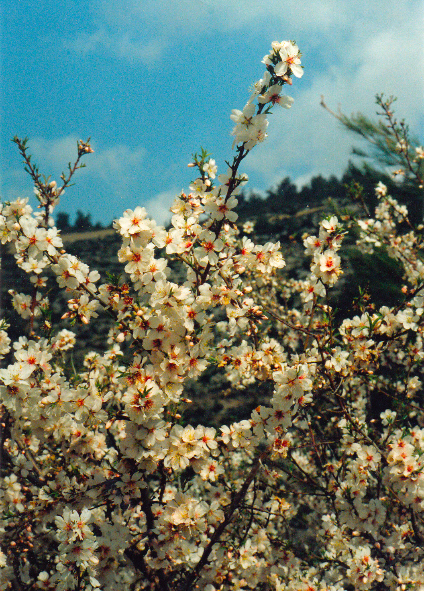
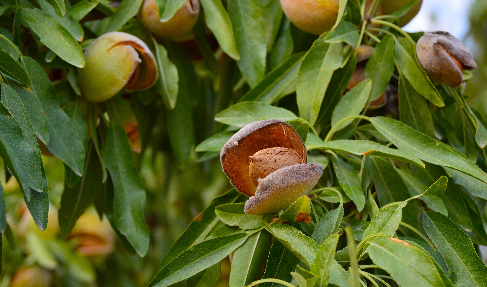

# Plants and Trees in the Bible

## License Information

Plants and Trees in the Bible © United Bible Societies, 2025. Adapted from: <cite>Each According to its Kind: Plants and Trees in the Bible</cite>, by Robert Koops © 2012 United Bible Societies. This work is licensed under Creative Commons Attribution-ShareAlike 4.0 International (<a href="https://creativecommons.org/licenses/by-sa/4.0/">https://creativecommons.org/licenses/by-sa/4.0/</a>).

--------------------------------

## Almond (id: FLORA:2.1)

2\.1 Almond
===========

References:
-----------

Hebrew לוּז (luz)

[GEN 30:37](https://ref.ly/Gen30:37)

Hebrew מְשֻׁקָּד (meshuqad)

[EXO 25:33](https://ref.ly/Exod25:33), [EXO 25:33](https://ref.ly/Exod25:33), [EXO 25:34](https://ref.ly/Exod25:34), [EXO 37:19](https://ref.ly/Exod37:19), [EXO 37:19](https://ref.ly/Exod37:19), [EXO 37:20](https://ref.ly/Exod37:20)

Hebrew שָׁקֵד (shaqed)

[GEN 43:11](https://ref.ly/Gen43:11), [NUM 17:23](https://ref.ly/Num17:23), [ECC 12:5](https://ref.ly/Eccl12:5), [JER 1:11](https://ref.ly/Jer1:11)

Discussion:
-----------

*Almond flower (Ray Pritz (UBS))*

The almond is one of a group of fruit\-bearing trees (*Prunus*) that also includes plums, cherries, peaches, and apricots. There are fifteen species of wild almond in Iran, two wild species in Israel, and one cultivated one (*Prunus dulcis*, also called *Amygdalus communis*). They are plentiful now in the hills of Israel, and probably were so in Bible times, even in the hot, dry Negev.

Description:
------------

The almond tree grows to around 4 meters (13 feet) tall. It loses its leaves in winter and then, before the new leaves appear in spring, a profusion of white or pink flowers appears. The flowers are quite flat, with oval petals. The fuzzy fruit, about the size of a date palm fruit, comes about ten weeks later. The seed (“nut” in English) is fifty percent oil, and can be eaten raw but is usually roasted.

Special significance:
---------------------

Three passages make reference to physical features of the almond tree. In [EXO 25:33](https://ref.ly/Exod25:33); [EXO 25:33](https://ref.ly/Exod25:33); [EXO 25:34](https://ref.ly/Exod25:34); [EXO 37:19](https://ref.ly/Exod37:19); [EXO 37:19](https://ref.ly/Exod37:19); [EXO 37:20](https://ref.ly/Exod37:20) we find the Hebrew word *meshuqad* (“almond\-like”) referring to the shape of the almond blossom. The flat almond flower made a reasonable model for the lamp holders at the top of the branches of the lampstand in the Tabernacle.

*Almond tree (Avishai Teicher (Wikimedia Commons))*

The writer of [ECC 12:5](https://ref.ly/Eccl12:5) uses the profusion of white blossoms on the almond tree as a symbol of old age. The comparison is of course to the white hair of the elders. FFB ’s comment that the almond tree is “a sign of the beauty of spring which does not bring joy to an old man” (page 89\) ignores the gift of the poet.

In [JER 1:11](https://ref.ly/Jer1:11) the author makes use of the similarity of the Hebrew name *shaqed* (“almond”) to the word *shoqed* (“watching” or “wakeful”) to emphasize that Yahweh is “watching” over Israel. Some commentators add to this that since the almond is the first of the trees to blossom in the spring—even before the leaves emerge—it was “waking up early,” and God, likewise, is an “early help” in time of trouble.

Places named “Luz” in [GEN 28:19](https://ref.ly/Gen28:19); [GEN 35:6](https://ref.ly/Gen35:6); [GEN 48:3](https://ref.ly/Gen48:3); [JOS 16:2](https://ref.ly/Josh16:2); [JOS 18:13](https://ref.ly/Josh18:13); [JOS 18:13](https://ref.ly/Josh18:13); [JDG 1:23](https://ref.ly/Judg1:23); [JDG 1:26](https://ref.ly/Judg1:26) indicate the value of almonds to the people of the land and the possibility that almond trees grew in the desert hills of Sinai, although they are not found there today.

Translation:
------------

*Almond nut (antcaesar (Wikimedia Commons))*

The *Prunus* family has members in various parts of the world, such as *Prunus salicina* in China and *Prunus munsoniana* in eastern North America. However, the branches and fruit of many of these are so different from the true almond that in nonfigurative passages local names will not really be usable. In a passage such as [GEN 30:37](https://ref.ly/Gen30:37), a transliteration from a major language is recommended; for example, *shaked* /*lus* (Hebrew), *lawus* (Arabic), *amande* (French), *amendoa* (Portuguese), *almendra* (Spanish), and *alimondi*. In English the “l” is not pronounced, so “almond” may be transliterated *amond*. Elsewhere, where the tree is used figuratively, as in Exodus and Ecclesiastes (see below), translators can use a blossom with a similar shape and color.

In most translations the words *shaqed* and *luz* will need to be translated contextually, as follows:

[GEN 43:11](https://ref.ly/Gen43:11): Jacob gifts to Pharaoh were “a little balm and a little honey, gum, myrrh, pistachio nuts, and almonds.” Most translators will have to use the phrase “almond fruit” or “almond seeds” here.

[EXO 25:33](https://ref.ly/Exod25:33); [EXO 25:33](https://ref.ly/Exod25:33); [EXO 25:34](https://ref.ly/Exod25:34): The shape of the flower is in focus here (GNB (Good News Bible), CEV (Contemporary English Version), NIV (New International Version (1984)), REB (Revised English Bible (1989)), and others have “almond blossoms”). It has five petals that form a roughly cup\-like shape.

[NUM 17:23](https://ref.ly/Num17:23): Since Aaron’s rod produced almond fruit in verse 8 (23\), it is reasonable to assume that the sticks in verse 2 (17\) are from almond trees. In some languages it may be useful for cohesion to make this explicit in the text at verse 2\.

[ECC 12:5](https://ref.ly/Eccl12:5): Here the almond tree serves as a metaphor for old age. A transliteration of “almond” from English or some other major language will fall flat in terms of poetic impact. Mft (Moffatt Translation (1926)) is the only translation that I have seen that attempts to retain the tree and the image by rendering the third clause of this verse as “when his hair is almond white.”

[JER 1:11](https://ref.ly/Jer1:11): As mentioned above, here we have a word play on *shaqed* /*shoqed* “almond/watching.” Again, a few translations have made valiant attempts to translate the wordplay; for example, Mft (Moffatt Translation (1926)) renders the last clause of this verse as “The shoot of a wake\-tree” and NJB (New Jerusalem Bible (1985)) has “I see a branch of the Watchful Tree.”

* **Associated Passages:** Genesis 30:37; Exodus 25:33; Exodus 25:34; Exodus 37:19; Exodus 37:20; Genesis 43:11; Numbers 17:23; Ecclesiastes 12:5; Jeremiah 1:11; Genesis 28:19; Genesis 35:6; Genesis 48:3; Joshua 16:2; Joshua 18:13; Judges 1:23; Judges 1:26

