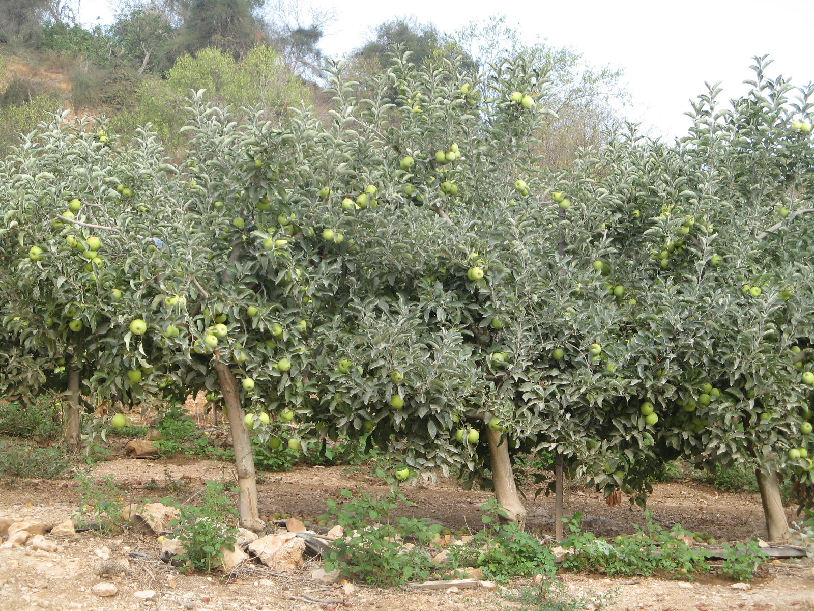

# Plants and Trees in the Bible

## License Information

Plants and Trees in the Bible © United Bible Societies, 2025. Adapted from: <cite>Each According to its Kind: Plants and Trees in the Bible</cite>, by Robert Koops © 2012 United Bible Societies. This work is licensed under Creative Commons Attribution-ShareAlike 4.0 International (<a href="https://creativecommons.org/licenses/by-sa/4.0/">https://creativecommons.org/licenses/by-sa/4.0/</a>).

--------------------------------

## Apple (id: FLORA:2.2)

2\.2 Apple
==========

References:
-----------

Hebrew תַּפּוּחַ (tapuach)

[PRO 25:11](https://ref.ly/Prov25:11), [SNG 2:3](https://ref.ly/Song2:3), [SNG 2:5](https://ref.ly/Song2:5), [SNG 7:9](https://ref.ly/Song7:9), [SNG 8:5](https://ref.ly/Song8:5), [JOL 1:12](https://ref.ly/Joel1:12)

Discussion:
-----------

The Wild Apple (or Crab Apple) *Malus sylvestris* is the ancestor of the sweet fruit we know today *Malus domestica*. The domestication may have occurred in what is now Iran, Armenia, Turkey, or Syria. Apples have grown in Europe, in western Asia, and probably in Turkey and Lebanon, for several thousand years. The question for Bible scholars is whether the puny, rather tart fruit of the wild apple merits the glowing description we find in [PRO 25:11](https://ref.ly/Prov25:11): “… like apples of silver in a setting of gold,” and in [SNG 2:5](https://ref.ly/Song2:5): “Sustain me with raisins, refresh me with apples; for I am sick with love.” With that doubt in mind, some scholars have suggested that the *tapuach*, whose pleasant smell is noted in [SNG 7:9](https://ref.ly/Song7:9) (8\), is the apricot. Zohary favors the apple on linguistic grounds, citing the Arabic cognate *tuffach*, which refers to the apple, and Egyptian records from 1298–1235 B.C. that refer to *taph* (probably the same as *tapuach*) growing in the Nile Valley. It is possible that improved varieties had already been developed in biblical times. Zohary points out that the apricot appeared in the region much later than the apple.

Hepper cites a study that describes how archeologists found carbonized wild apple fruits, dating from the ninth century B.C., in an excavation of Kadesh Barnea in northern Sinai, but he concludes that the issue of apple versus apricot is irresolvable at the present time.

Description:
------------

The apple tree reaches to 5–10 meters (17–33 feet), has a rounded crown, and bears a round fruit about the size of an orange. In the spring the tree is completely covered with pink flowers, which gradually give way to the green of the leaves as they develop. The fruit can be greenish, yellow, or red.

Special significance:
---------------------

In [PRO 25:11](https://ref.ly/Prov25:11) a well\-spoken word is compared to “apples of gold in a setting of silver.” In [SNG 2:3](https://ref.ly/Song2:3) the tree itself is cited as beautiful: “As an apple tree among the trees of the wood, so is my beloved among young men.” This suggests that the *tapuach* is one of the trees of the forest, but we can also take it as the poet imagining the domesticated apple being placed in the forest. [SNG 2:5](https://ref.ly/Song2:5) (“Sustain me with raisins, refresh me with apples …”) suggests that apples were a special treat. [JOL 1:12](https://ref.ly/Joel1:12) lists the *tapuach* along with four other species that are withering in the drought.

Translation:
------------

Apples grow well only in temperate climates where the tree is frozen part of the year, so there are no close native relatives in tropical Africa or Asia. However, fruits grown in Europe and South Africa are being shipped to many African countries, and so have become well\-known, at least in the cities, usually by a name from a major international language. We recommend transliteration from a well\-known language (for example, *tufa* \[Arabic], *pom* /*pomier* \[French], *manzano* \[Spanish], *masa* /*masiyera* \[Portuguese], and *apel* \[English]), although translators seeking literary equivalence may wish to find a cultural substitute in the Proverbs and Song of Songs passages. For example, in [SNG 2:3](https://ref.ly/Song2:3) (“Like the *tapuach* among the trees of the wood, so is my beloved among men”), a local idealized tree could be substituted if there is one. A footnote would cite the Hebrew and its major language equivalent. “Apricot” in NEB (New English Bible (1970)) has been replaced by “apple” in REB (Revised English Bible (1989)).

* **Associated Passages:** Proverbs 25:11; Song of Songs 2:3; Song of Songs 2:5; Song of Songs 7:9; Song of Songs 8:5; Joel 1:12

