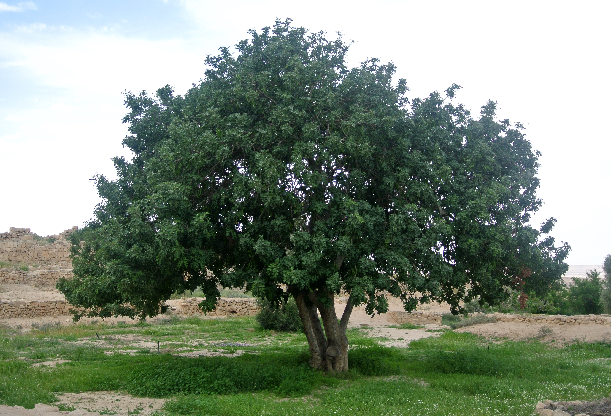

# Plants and Trees in the Bible

## License Information

Plants and Trees in the Bible © United Bible Societies, 2025. Adapted from: <cite>Each According to its Kind: Plants and Trees in the Bible</cite>, by Robert Koops © 2012 United Bible Societies. This work is licensed under Creative Commons Attribution-ShareAlike 4.0 International (<a href="https://creativecommons.org/licenses/by-sa/4.0/">https://creativecommons.org/licenses/by-sa/4.0/</a>).

--------------------------------

## Carob (id: FLORA:2.3)

2\.3 Carob
==========

References:
-----------

### **Seed pods**:

Greek κεράτιον (keration)

[LUK 15:16](https://ref.ly/Mark15:16)

Discussion:
-----------

The Carob *Ceratonia siliqua* is a very common tree found throughout the Mediterranean area and also in Arabia, Somalia, and Oman. It is native to Israel, where it was called *charuv*, according to Jewish religious writings of the first few centuries after Christ. Arabs call it *kharrub*.

In Bible times, as now, carob trees were found in the coastal plain and in the foothills (Shephelah) and on the eastern slopes of Galilee and Samaria. The carob seed pods are filled with a sweet moist pulp that was popular with poor people. The pods were also used to feed animals. That is probably the basis for Jesus’ statement that the prodigal boy in the parable looked hungrily at the carob *keration* (“pods”) that he had to feed to the pigs ([LUK 15:16](https://ref.ly/Mark15:16)).

Description:
------------

The carob tree is an evergreen with dark green leaves and many low leafy branches that hide a short trunk. The crown of the tree is round and may reach as high as 12 meters (40 feet). As is the case of the acacia, the date palm and the fig, the carob tree is a lonely representative of a large tropical family (in this case the pea sub\-family *Caesalpinioideae*) that found its way into parts of Israel many millennia ago. The trees in this family are legumes, that is, they put nitrogen into the soil by way of little nodules on the roots. As the tree ages, the trunk becomes twisted. In contrast to many other trees of the Bible lands, this one bears flowers in autumn, and the seed pods form the following summer. The mature pod is dark brown and about 15–25 centimeters (6–10 inches) in length and 2\.5–3\.5 centimeters (1–1\.5 inches) broad.

Special significance:
---------------------

If indeed the “pods” of [LUK 15:16](https://ref.ly/Mark15:16) were carob pods, it would certainly indicate that they were not considered high\-class food. The tree is also called “St. John’s bread” on the belief that John the Baptist must have eaten these fruits when he lived in the desert of Judea. It is quite likely that John did eat carob pods. However, the suggestion that the “locusts” in [MRK 1:6](https://ref.ly/Matt1:6) were locust bean pods is not correct, since John probably did eat locusts, as some people in the world still do today. Ironically, carob pod pulp, which was once the “food of the poor” has become, in the last few years, an expensive “health food” in England and America! The word “carat” used in weighing diamonds comes from the Greek name of this tree, since the seeds were used as a standard for measurement. They typically weigh about two hundred milligrams.

Translation:
------------

Since the Greek word for carob does not actually occur in [LUK 15:16](https://ref.ly/Mark15:16), and *keration* could possibly refer to some other sort of pods, we cannot actually name a species here. If translators have a word for the edible seed pods of trees, they should use it. Otherwise they will have to use something like “fruit of wild trees.” In study notes translators may wish to refer to major language terms, for example, French *caroube*, Spanish *algarrobo*, Portuguese *alfarroba*, and Arabic *kharrub*.

* **Associated Passages:** Luke 15:16; Mark 1:6

