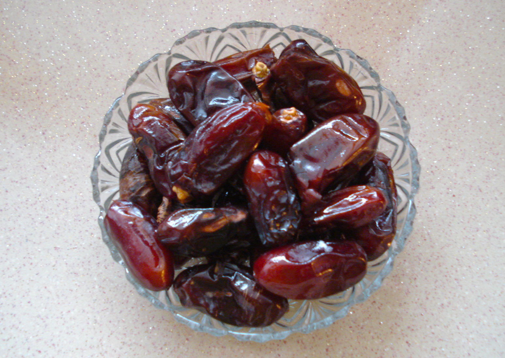

# Plants and Trees in the Bible

## License Information

Plants and Trees in the Bible © United Bible Societies, 2025. Adapted from: <cite>Each According to its Kind: Plants and Trees in the Bible</cite>, by Robert Koops © 2012 United Bible Societies. This work is licensed under Creative Commons Attribution-ShareAlike 4.0 International (<a href="https://creativecommons.org/licenses/by-sa/4.0/">https://creativecommons.org/licenses/by-sa/4.0/</a>).

--------------------------------

## Date palm (id: FLORA:2.5)

2\.5 Date palm
==============

References:
-----------

### **Tree**:

Hebrew תָּמָר (tamar)

[EXO 15:27](https://ref.ly/Exod15:27), [LEV 23:40](https://ref.ly/Lev23:40), [NUM 33:9](https://ref.ly/Num33:9), [DEU 34:3](https://ref.ly/Deut34:3), [JDG 1:16](https://ref.ly/Judg1:16), [JDG 3:13](https://ref.ly/Judg3:13), [2CH 28:15](https://ref.ly/2Chr28:15), [NEH 8:15](https://ref.ly/Neh8:15), [PSA 92:13](https://ref.ly/Ps92:13), [SNG 7:8](https://ref.ly/Song7:8), [SNG 7:9](https://ref.ly/Song7:9), [JOL 1:12](https://ref.ly/Joel1:12)

Hebrew תֹּמֶר (tomer)

[JDG 4:5](https://ref.ly/Judg4:5)

Hebrew תִּמֹרָה (timorah)

[1KI 6:29](https://ref.ly/1Kgs6:29), [1KI 6:32](https://ref.ly/1Kgs6:32), [1KI 6:32](https://ref.ly/1Kgs6:32), [1KI 6:35](https://ref.ly/1Kgs6:35), [1KI 7:36](https://ref.ly/1Kgs7:36), [2CH 3:5](https://ref.ly/2Chr3:5), [EZK 40:16](https://ref.ly/Ezek40:16), [EZK 40:22](https://ref.ly/Ezek40:22), [EZK 40:22](https://ref.ly/Ezek40:22), [EZK 40:26](https://ref.ly/Ezek40:26), [EZK 40:31](https://ref.ly/Ezek40:31), [EZK 40:34](https://ref.ly/Ezek40:34), [EZK 40:37](https://ref.ly/Ezek40:37), [EZK 41:18](https://ref.ly/Ezek41:18), [EZK 41:18](https://ref.ly/Ezek41:18), [EZK 41:19](https://ref.ly/Ezek41:19), [EZK 41:19](https://ref.ly/Ezek41:19), [EZK 41:20](https://ref.ly/Ezek41:20), [EZK 41:25](https://ref.ly/Ezek41:25), [EZK 41:26](https://ref.ly/Ezek41:26)

Greek φοῖνιξ (phoinix)

[JHN 12:13](https://ref.ly/John12:13), [REV 7:9](https://ref.ly/Rev7:9), [SIR 24:14](https://ref.ly/Sir24:14), [SIR 50:12](https://ref.ly/Sir50:12), [2MA 10:7](https://ref.ly/2Macc10:7), [2MA 14:4](https://ref.ly/2Macc14:4)

References:
-----------

### **Branch**:

Hebrew כִּפָּה (kipah)

[JOB 15:32](https://ref.ly/Job15:32), [ISA 9:13](https://ref.ly/Isa9:13), [ISA 19:15](https://ref.ly/Isa19:15)

Greek βαΐνη (bainē)

[1MA 13:37](https://ref.ly/1Macc13:37)

Greek βάϊον (baion)

[JHN 12:13](https://ref.ly/John12:13), [1MA 13:51](https://ref.ly/1Macc13:51)

Discussion:
-----------

*Date palm (Ray Pritz (UBS))*

More than forty types of date palm (*Phoenix dactylifera*) are found in dry tropical countries all the way from the Canary Islands, across Africa to India. They probably originated in the Middle East (Zohary and Hopf), where they are still found in abundance. In [LEV 23:40](https://ref.ly/Lev23:40) we read that the branches of date palms were to be used for the Festival of Shelters, and in [JHN 12:13](https://ref.ly/John12:13) people welcomed Jesus with date palm leaves. In the latter case there is a legitimate question of where they got the leaves, since Jerusalem is rather too high and cold for date palms. But the same could be asked about the prophetess Deborah’s palm ([JDG 4:5](https://ref.ly/Judg4:5)), which was located between Ramah and Bethel, scarcely lower than Jerusalem. Jericho was known as the “city of palm trees” (*temarim* in Hebrew \- [DEU 34:3](https://ref.ly/Deut34:3); [JDG 1:16](https://ref.ly/Judg1:16); [JDG 3:13](https://ref.ly/Judg3:13); [2CH 28:15](https://ref.ly/2Chr28:15)). Date fruits were eaten fresh or dried and pressed into “cakes,” and they were sometimes made into a drink. It is possible that in [DEU 8:8](https://ref.ly/Deut8:8) the Hebrew word *devash* that we normally take as “honey” refers to a syrup made from dates. The leaves were and are used for mats, baskets, fences, and roofs. Date palms are now cultivated intensively in the Jordan and Aravah valleys, around the Dead Sea, and on the coastal plain of Israel. The word “date” entered English from Latin *dactylus* via Old French *datil*. Latin got it from Greek *daktylos*, meaning “finger.”

Description:
------------

The date palm typically grows to a height of 10–20 meters (33–66 feet) and has a cluster of immense leaves at the top. Each year, old leaves wither and droop, and people who own palms cut the old branches off. The tightly packed bunch of immature leaves is called *lulav* in Hebrew. Date palms start bearing fruit at around five to eight years of age. The sweet fruits, a little smaller than a human thumb, grow in large bunches. Inside the soft fruit is a very hard seed about 2\.5 centimeters (1 inch) long. Date palm trees are either male or female, and there are places where the trees of one sex grow but no fruit is seen, because they lack pollination. Farmers prefer to propagate them by cultivating the suckers that grow at the base of the tree, rather than from seeds, which would produce too many male trees. The fruit appears on the female tree in the summer (June\-August).

Special significance:
---------------------

*Date palms (haitham alfalah (Wikimedia Common))*

In [SNG 7:8](https://ref.ly/Song7:8) (7\) we find the palm used as a symbol of elegance and grace. In [PSA 92:12](https://ref.ly/Ps92:12); [PSA 92:13](https://ref.ly/Ps92:13); [PSA 92:14](https://ref.ly/Ps92:14) we are told that the righteous will flourish like the palm tree, but [JOB 15:32](https://ref.ly/Job15:32) says the wicked will wither like a dry palm branch. The palm is one of the four special species listed in [NEH 8:15](https://ref.ly/Neh8:15) in connection with the Festival of Shelters. Tamar was a popular Hebrew name, mentioned in several books of the Bible (for example, [GEN 38:6](https://ref.ly/Gen38:6); [RUT 4:12](https://ref.ly/Ruth4:12); [1CH 2:4](https://ref.ly/1Chr2:4)). In [1MA 13:37](https://ref.ly/1Macc13:37) the palm branch is a symbol of peace, but in [1MA 13:51](https://ref.ly/1Macc13:51) it is a symbol of victory (so also [JHN 12:13](https://ref.ly/John12:13); [REV 7:9](https://ref.ly/Rev7:9); [2MA 10:7](https://ref.ly/2Macc10:7)).

Translation:
------------

*Dates (Maderibeyza (Wikimedia Commons))*

Translators living along the West African coast often substitute the oil palm or the coconut palm for the date palm, which is found normally in desert areas. Others are familiar with the fan palm (*Borassus*, “ruhn palm”) but they should note that the shape of the leaf of the fan palm is quite different from that of the date palm. I am not aware of a non\-European language that has a generic word for palm. Since the function of palm branches in the Festival of Shelters is to build rough shelters, the type of palm tree does not make a lot of difference. The same is true for references where the image of the palm is used as a decoration, as in the description of the Temple (see [1KI 6:29](https://ref.ly/1Kgs6:29); [1KI 6:35](https://ref.ly/1Kgs6:35)). In cases where the fruit is mentioned, a transliteration is recommended, either from the Hebrew word *tamar* or from a major language.

In locations where oil and coconut palm trees are found, but no date palms, the oil palm is to be preferred. In places where no palms are found, it is still possible that the date fruit is found in markets, particularly in Muslim\-dominated areas, where it may be a popular item for breaking the fast during Ramadan. In northern Nigeria, a dwarf species of date palm (*Phoenix reclinata*) grows in ravines and bears small edible fruits much like the big palm. At least one translation there (Berom) makes use of the local name.

It would seem then that if the date palm is not known at all, the options here are:

1\. use the word for oil or coconut palm (and consider writing a footnote that indicates that the Hebrew words *tamar* and *tomer* and the Greek word *phoinix* refer to a similar tree that has a quite different fruit);

2\. transliterate from Hebrew (*tomera*, *tamara*) and Greek (*fonis*, *fowinik*);

3\. transliterate from a major language, for example, *nakhal* /*temer* (Arabic), *dattier* (French), *datil* /*palmera* (Spanish), *mtende* (Swahili), *khaji* (Hindi), *karchuram* (Tamil), and *haizao* (Chinese);

4\. use a generic phrase appropriate to the context, for example, “beautiful tree.”

[NUM 24:6](https://ref.ly/Num24:6): The first line of this verse reads “Like valleys \[*nechalim*, plural of *nachal* ] that stretch afar.” The Hebrew word *nachal* refers literally to a “torrent” of water. Since that makes an odd parallel with gardens, aloes, and cedars, the majority of scholars believe it refers to date palms here based on a similar word in Arabic with that meaning. Many English versions have “palm groves” (NRSV (New Revised Standard Version (1989)), NLT (New Living Translation), REB (Revised English Bible (1989)), NJPSV (New Jewish Publication Society Version); similarly CEV (Contemporary English Version)) or “rows of palms” (GNB (Good News Bible)).

[JOB 15:32](https://ref.ly/Job15:32): The Hebrew words *temurato* (“his recompense”) in verse 31 and *timmale'* (“It will be paid in full”) in verse 32 have been debated for centuries. Houbigant and others have said that *temurato* should be read as *timorato* (“his palm tree”), and *timmale'* should be read as *timmal* (“it will wither”; so Septuagint, Vulgate, Syriac). This interpretation anticipates the Hebrew word *kipah* (“branch”) in verse 32, where the second line reads “and his branch will not be green.” Dhorme suggests that *temurato* should be read as *zemorato* (“his vine shoots”), which anticipates the line about grapevines in verse 33\. *A Handbook on The Book of Job* supports using “palm tree” and “palm branch” in this passage. We do too.

[JOB 29:18](https://ref.ly/Job29:18): Instead of “sand,” the Septuagint reads “palm tree” (*phoinix*). Many scholars follow the Septuagint here, but some take *phoinix* as referring not to the date palm but to the legendary “Phoenix,” a bird that was believed to live a long life.

* **Associated Passages:** Exodus 15:27; Leviticus 23:40; Numbers 33:9; Deuteronomy 34:3; Judges 1:16; Judges 3:13; 2 Chronicles 28:15; Nehemiah 8:15; Psalms 92:13; Song of Songs 7:8; Song of Songs 7:9; Joel 1:12; Judges 4:5; 1 Kings 6:29; 1 Kings 6:32; 1 Kings 6:35; 1 Kings 7:36; 2 Chronicles 3:5; Ezekiel 40:16; Ezekiel 40:22; Ezekiel 40:26; Ezekiel 40:31; Ezekiel 40:34; Ezekiel 40:37; Ezekiel 41:18; Ezekiel 41:19; Ezekiel 41:20; Ezekiel 41:25; Ezekiel 41:26; John 12:13; Revelation 7:9; Sirach 24:14; Sirach 50:12; 2 Maccabees 10:7; 2 Maccabees 14:4; Job 15:32; Isaiah 9:13; Isaiah 19:15; 1 Maccabees 13:37; 1 Maccabees 13:51; Deuteronomy 8:8; Psalms 92:12; Psalms 92:14; Genesis 38:6; Ruth 4:12; 1 Chronicles 2:4; Numbers 24:6; Job 29:18

