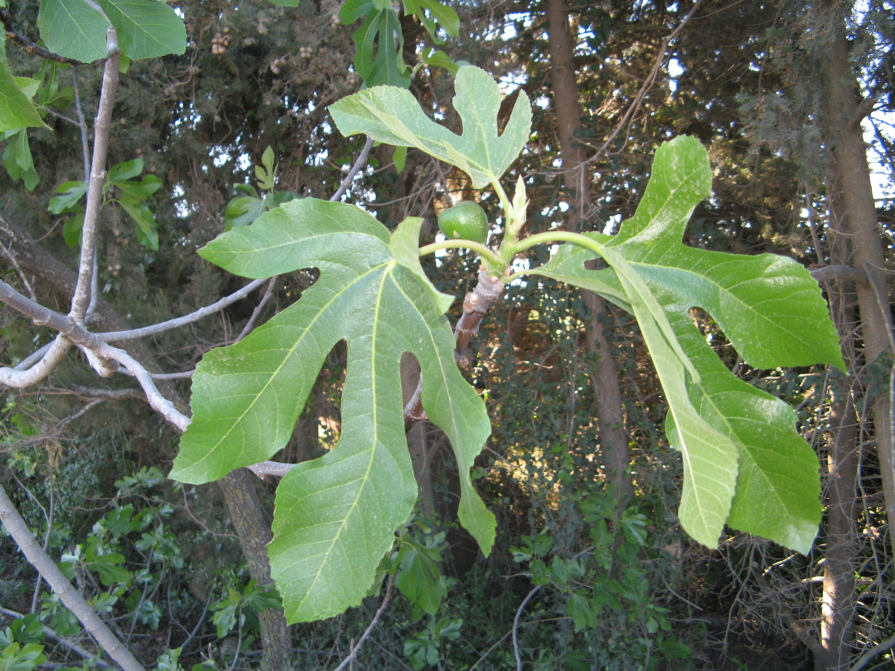
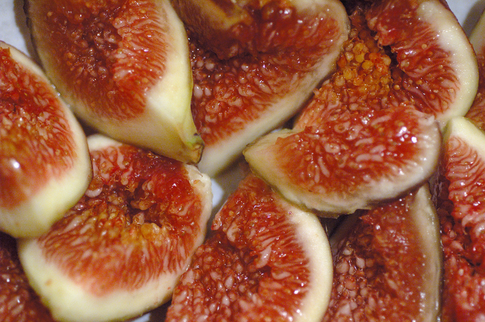

# Plants and Trees in the Bible

## License Information

Plants and Trees in the Bible © United Bible Societies, 2025. Adapted from: <cite>Each According to its Kind: Plants and Trees in the Bible</cite>, by Robert Koops © 2012 United Bible Societies. This work is licensed under Creative Commons Attribution-ShareAlike 4.0 International (<a href="https://creativecommons.org/licenses/by-sa/4.0/">https://creativecommons.org/licenses/by-sa/4.0/</a>).

--------------------------------

## Fig (id: FLORA:2.6)

2\.6 Fig
========

References:
-----------

### **Fig tree**:

Hebrew תְּאֵנָה (te’enah)

[GEN 3:7](https://ref.ly/Gen3:7), [DEU 8:8](https://ref.ly/Deut8:8), [JDG 9:10](https://ref.ly/Judg9:10), [JDG 9:11](https://ref.ly/Judg9:11), [1KI 5:5](https://ref.ly/1Kgs5:5), [2KI 18:31](https://ref.ly/2Kgs18:31), [PSA 105:33](https://ref.ly/Ps105:33), [PRO 27:18](https://ref.ly/Prov27:18), [SNG 2:13](https://ref.ly/Song2:13), [ISA 34:4](https://ref.ly/Isa34:4), [ISA 36:16](https://ref.ly/Isa36:16), [JER 5:17](https://ref.ly/Jer5:17), [JER 8:13](https://ref.ly/Jer8:13), [HOS 2:14](https://ref.ly/Hos2:14), [HOS 9:10](https://ref.ly/Hos9:10), [JOL 1:7](https://ref.ly/Joel1:7), [JOL 1:12](https://ref.ly/Joel1:12), [JOL 2:22](https://ref.ly/Joel2:22), [AMO 4:9](https://ref.ly/Amos4:9), [MIC 4:4](https://ref.ly/Mic4:4), [NAM 3:12](https://ref.ly/Nah3:12), [HAB 3:17](https://ref.ly/Hab3:17), [HAG 2:19](https://ref.ly/Hag2:19), [ZEC 3:10](https://ref.ly/Zech3:10)

Greek συκῆ (sukē)

[MAT 21:19](https://ref.ly/Matt21:19), [MAT 21:19](https://ref.ly/Matt21:19), [MAT 21:20](https://ref.ly/Matt21:20), [MAT 21:21](https://ref.ly/Matt21:21), [MAT 24:32](https://ref.ly/Matt24:32), [MRK 11:13](https://ref.ly/Mark11:13), [MRK 11:20](https://ref.ly/Mark11:20), [MRK 11:21](https://ref.ly/Mark11:21), [MRK 13:28](https://ref.ly/Mark13:28), [LUK 13:6](https://ref.ly/Luke13:6), [LUK 13:7](https://ref.ly/Luke13:7), [LUK 21:29](https://ref.ly/Luke21:29), [JHN 1:48](https://ref.ly/John1:48), [JHN 1:50](https://ref.ly/John1:50), [JAS 3:12](https://ref.ly/Jas3:12), [REV 6:13](https://ref.ly/Rev6:13), [1MA 14:12](https://ref.ly/1Macc14:12)

References:
-----------

### **Fig fruit**:

Hebrew בִּכּוּרָה (bikurah (early fig))

[ISA 28:4](https://ref.ly/Isa28:4), [JER 24:2](https://ref.ly/Jer24:2), [HOS 9:10](https://ref.ly/Hos9:10), [MIC 7:1](https://ref.ly/Mic7:1)

Hebrew דְּבֵלָה (develah (fig cake))

[1SA 25:18](https://ref.ly/1Sam25:18), [1SA 30:12](https://ref.ly/1Sam30:12), [2KI 20:7](https://ref.ly/2Kgs20:7), [1CH 12:41](https://ref.ly/1Chr12:41), [ISA 38:21](https://ref.ly/Isa38:21)

Hebrew פַּג (pag (early fig))

[SNG 2:13](https://ref.ly/Song2:13)

Hebrew תְּאֵנָה (te’enah)

[NUM 13:23](https://ref.ly/Num13:23), [NUM 20:5](https://ref.ly/Num20:5), [2KI 20:7](https://ref.ly/2Kgs20:7), [NEH 13:15](https://ref.ly/Neh13:15), [ISA 38:21](https://ref.ly/Isa38:21), [JER 8:13](https://ref.ly/Jer8:13), [JER 24:1](https://ref.ly/Jer24:1), [JER 24:2](https://ref.ly/Jer24:2), [JER 24:2](https://ref.ly/Jer24:2), [JER 24:2](https://ref.ly/Jer24:2), [JER 24:3](https://ref.ly/Jer24:3), [JER 24:3](https://ref.ly/Jer24:3), [JER 24:5](https://ref.ly/Jer24:5), [JER 24:8](https://ref.ly/Jer24:8), [JER 29:17](https://ref.ly/Jer29:17)

Greek ὄλυνθος (olunthos (late fig))

[REV 6:13](https://ref.ly/Rev6:13)

Greek σῦκον (sukon)

[MAT 7:16](https://ref.ly/Matt7:16), [MRK 11:13](https://ref.ly/Mark11:13), [LUK 6:44](https://ref.ly/Luke6:44), [JAS 3:12](https://ref.ly/Jas3:12)

Discussion:
-----------

*Fig tree (Ray Pritz (UBS))*

*Fig leaf (Ray Pritz (UBS))*

Two types of fig trees are mentioned in the Bible, the Common Fig *Ficus carica* (Hebrew *te’enah*) and the Sycomore Fig *Ficus sycomorus* (Hebrew *shiqmah*; see [2\.12 Vine](#FLORA:2.12)). They are closely related. The common fig tree grows not only in Israel, but throughout the world in warm climates. In the Holy Land it was a common source of food; the fruit was eaten both fresh and dried. Sometimes the dried ones were pressed together to form flat “cakes” or blocks (Hebrew *develah*). But, just as important, the large leaves of the fig make it an excellent shade tree. However, the first use of the fig mentioned in the Bible ([GEN 3:7](https://ref.ly/Gen3:7)) was not for food or shade but for clothing; Adam and Eve sewed fig leaves for themselves to cover their nakedness.

The fig was probably domesticated in northwestern Turkey from a wild variety that grew there around 5000 years ago. Greek, Roman, and Egyptian records indicate that the fruits were popular. Figs are now grown especially in Israel, Turkey, Greece, Italy, and Portugal, as well as in the warm parts of the United States. The fig is distantly related to the mulberry (*Morus nigra*), breadfruit (*Artocarpus altilis*), jackfruit (*Artocarpus heterophyllus*), and Chinese mulberry (*Cudrania tricuspidata*).

The fig is believed to be indigenous to western Asia and to have been distributed by humans and birds throughout the Mediterranean area. Remnants of figs have been found in excavations of sites traced to at least 5000 B.C.

Description:
------------

*Fig, unripe (H. Zell (Wikimedia Commons))*

The domesticated fig grows to about 5–8 meters (17–26 feet) and has a round crown and very deep and round roots. The trunk may grow to be more than 70 centimeters (2 feet) thick. Fig trees may grow to be several decades old, if they are well cared for. Figs are usually propagated by planting cuttings. The pollination of the flowers is an amazingly intricate process closely linked to the life cycle of a tiny wasp, and the fact that fig trees, like papayas and date palms, are male or female. (There are now some kinds of figs that produce fruit without pollination.) The fruits are about the size of a hen’s egg and can be green, yellow, purple, or brown depending on the type. They are sweet and soft and difficult to transport. For that reason most farmers dry the fruits before shipping them. The “fruit” of the fig is technically a strangely shaped flower. Noting the absence of a “real” flower, the ancient people of India called it a flowerless tree.

Special significance:
---------------------

*Fresh figs, cut open (Eric Hunt (Wikimedia Commons))*

The common fig tree, along with the vine and the olive, is one of the three “top trees” for the Jews. The Bible refers to the fig over 270 times. The image of peace and happiness in Israel was “every man under his vine and under his fig tree” ([1KI 5:5](https://ref.ly/1Kgs5:5) \[4\.25])

Translation:
------------

Wild figs are common throughout the tropical world; there are at least eight hundred species of *Ficus*, thirty\-two in southern Africa alone. The banyan, peepul, and bo are all types of fig. The fruits of wild fig trees are not nearly as juicy or sweet as those of the domesticated ones. In many places people eat the fruit when they find it in the wild, but do not market it or cultivate the trees. Translators are urged to use the local word, and, if necessary, use a footnote to indicate the difference between the local one and the biblical one. Where it is not known at all, transliterations from a major language may be used in nonfigurative contexts, for example, *fikus* (Latin), *teen* /*barchomi* (Arabic), *higo* /*higuera* (Spanish), *figue* (French), *Feige* (German), *fico* (Italian), *figuera* (Portuguese), *mu hwa gwa* (Korean), *anjeer* (Hindi), and *wu huwa guo* (Chinese).

* **Associated Passages:** Genesis 3:7; Deuteronomy 8:8; Judges 9:10; Judges 9:11; 1 Kings 5:5; 2 Kings 18:31; Psalms 105:33; Proverbs 27:18; Song of Songs 2:13; Isaiah 34:4; Isaiah 36:16; Jeremiah 5:17; Jeremiah 8:13; Hosea 2:14; Hosea 9:10; Joel 1:7; Joel 1:12; Joel 2:22; Amos 4:9; Micah 4:4; Nahum 3:12; Habakkuk 3:17; Haggai 2:19; Zechariah 3:10; Matthew 21:19; Matthew 21:20; Matthew 21:21; Matthew 24:32; Mark 11:13; Mark 11:20; Mark 11:21; Mark 13:28; Luke 13:6; Luke 13:7; Luke 21:29; John 1:48; John 1:50; James 3:12; Revelation 6:13; 1 Maccabees 14:12; Isaiah 28:4; Jeremiah 24:2; Micah 7:1; 1 Samuel 25:18; 1 Samuel 30:12; 2 Kings 20:7; 1 Chronicles 12:41; Isaiah 38:21; Numbers 13:23; Numbers 20:5; Nehemiah 13:15; Jeremiah 24:1; Jeremiah 24:3; Jeremiah 24:5; Jeremiah 24:8; Jeremiah 29:17; Matthew 7:16; Luke 6:44

* **Associated ACAI Concepts:** Fig (ID: `flora:Fig`)
