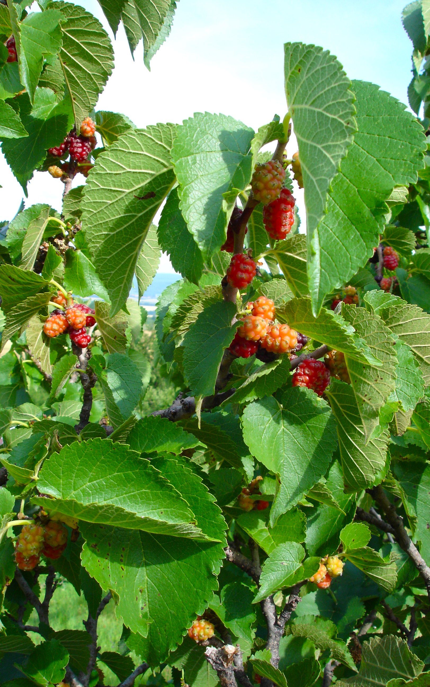

# Plants and Trees in the Bible

## License Information

Plants and Trees in the Bible © United Bible Societies, 2025. Adapted from: <cite>Each According to its Kind: Plants and Trees in the Bible</cite>, by Robert Koops © 2012 United Bible Societies. This work is licensed under Creative Commons Attribution-ShareAlike 4.0 International (<a href="https://creativecommons.org/licenses/by-sa/4.0/">https://creativecommons.org/licenses/by-sa/4.0/</a>).

--------------------------------

## Mulberry (id: FLORA:2.7)

2\.7 Mulberry
=============

References:
-----------

Hebrew מְסֻכָּן (mesukan)

[ISA 40:20](https://ref.ly/Isa40:20)

Greek μόρον (moron)

[1MA 6:34](https://ref.ly/1Macc6:34)

Greek συκάμινος (sukaminos)

[LUK 17:6](https://ref.ly/Luke17:6)

Discussion:
-----------

The references to mulberry in the Scriptures are all controversial. However, Zohary, on the basis of cognate words in Sumerian (*messikanu*, *sukannu*) confidently associates the Hebrew word *mesukan* in [ISA 40:20](https://ref.ly/Isa40:20) with the mulberry tree, as did Thompson before him. Further, they take the Greek word *sucaminos* in [LUK 17:6](https://ref.ly/Luke17:6) as also cognate with Sumerian *sukannu*. Like the apple, the pomegranate, the fig and the pistachio, the Black Mulberry *Morus nigra* may have been introduced into the Holy Land from one of the neighboring countries like Persia (now Iran).

Description:
------------

The black mulberry is a large, broad tree (6 meters \[20 feet] high) that produces flowers and leaves in spring and loses its leaves every year in winter. The crown is broad and low. The trunk gets twisted as it grows old and may rot away, only to be replaced by another one from the same root. People pile stones up in order to support the low branches of old trees. The leaves are stiff, rough, and hairy. The flowers are pollinated by the wind, and the fruit is a rather tart, black berry about the size of a large cashew nut. In Europe and North America, people use mulberries mostly to make pies and wine. A different species, the white mulberry, has a whitish fruit.

The black mulberry tree is similar in size and shape to the sycomore fig (see [2\.12 Vine](#FLORA:2.12)). In fact, the translators of the Septuagint introduced considerable confusion by translating the Hebrew word *shiqmah* as *sucaminos* ([1KI 10:27](https://ref.ly/1Kgs10:27); [1CH 27:28](https://ref.ly/1Chr27:28); [2CH 1:15](https://ref.ly/2Chr1:15); [2CH 9:27](https://ref.ly/2Chr9:27); [PSA 78:47](https://ref.ly/Ps78:47); [ISA 9:9](https://ref.ly/Isa9:9); [AMO 7:14](https://ref.ly/Amos7:14)). The confusion has been perpetuated in languages like German that refer to the sycomore fig as the “mulberry fig.”

Special significance:
---------------------

The New Testament reference to the mulberry in [LUK 17:6](https://ref.ly/Luke17:6) occurs in Jesus’ parable about faith. “If you had faith like a mustard seed,” he said, “you could say to this mulberry tree (*sucaminos*), ‘Get up and throw yourself into the sea,’ and it would do so.”

[1MA 6:34](https://ref.ly/1Macc6:34) tells us that soldiers showed the bright red juice of the mulberry to their elephants in order to provoke them to fight.

In China the main use of the mulberry tree (a white subspecies) is to feed the leaves to a certain type of caterpillar that produces silk threads. These threads are woven into cloth. There is evidence that in the early centuries of the Christian era the Mediterranean island of Cos and the Phoenician city of Sidon had industries that used a local type of silk moth, which fed on black mulberry leaves. Hepper (page 169\) surmises that the silk referred to in [EZK 16:10](https://ref.ly/Ezek16:10); [EZK 16:13](https://ref.ly/Ezek16:13) may have come from the precursors of these local industries.

Translation:
------------

There are at least eighteen subspecies of mulberry in the world, distributed from China to North America. In the Middle East area two have been cultivated, the black mulberry and the white mulberry. The black mulberry grows well in what is now Iran, and it may have been introduced into Canaan from there.

In areas where the mulberry tree is found, the local name should be used in [LUK 17:6](https://ref.ly/Luke17:6). Where it is not found (for example, most of Africa), transliteration from a major language is advised, for example, *muluberi* or *sikamayin*. (French *mûrier*, Spanish *mora*, Portuguese *amoreira*, Arabic *tut*). KJV (King James Version (1611)) uses “mulberry” in [2SA 5:23](https://ref.ly/2Sam5:23); [2SA 5:24](https://ref.ly/2Sam5:24) and [1CH 14:14](https://ref.ly/1Chr14:14); [1CH 14:15](https://ref.ly/1Chr14:15), where we advocate “poplar” (see [1\.20 Poplar](#FLORA:1.20)).

* **Associated Passages:** Isaiah 40:20; 1 Maccabees 6:34; Luke 17:6; 1 Kings 10:27; 1 Chronicles 27:28; 2 Chronicles 1:15; 2 Chronicles 9:27; Psalms 78:47; Isaiah 9:9; Amos 7:14; Ezekiel 16:10; Ezekiel 16:13; 2 Samuel 5:23; 2 Samuel 5:24; 1 Chronicles 14:14; 1 Chronicles 14:15

