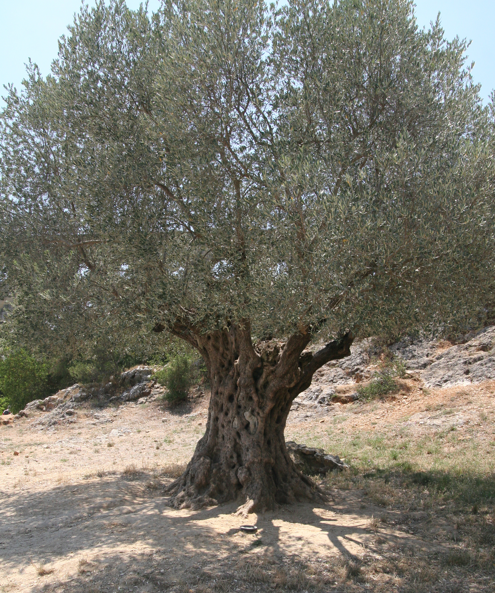
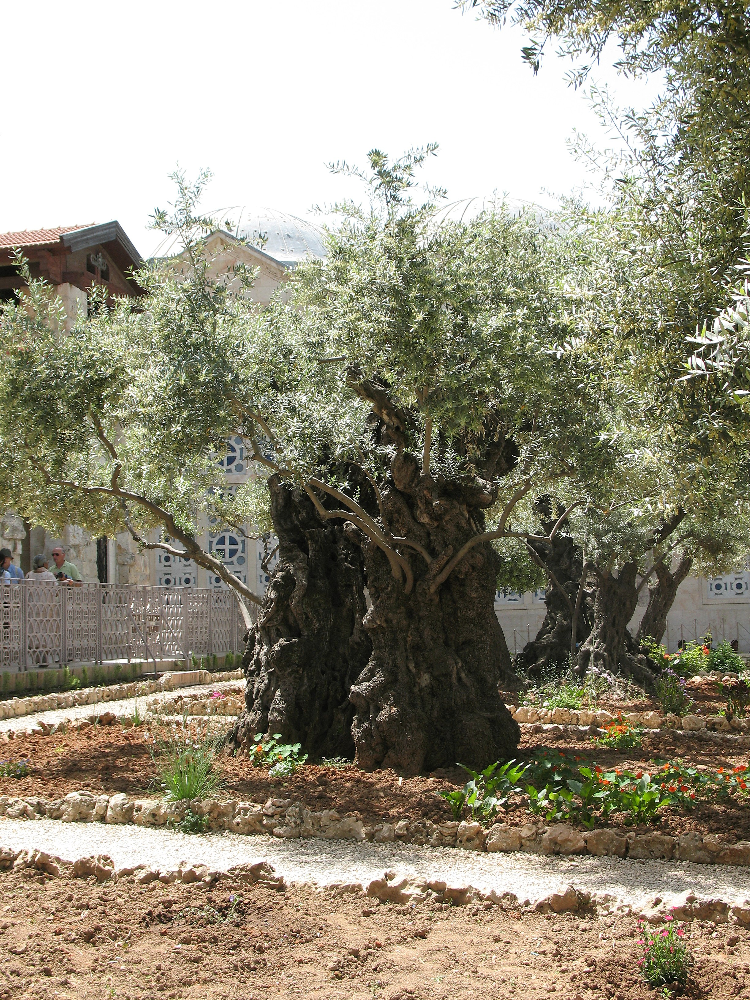

# Plants and Trees in the Bible

## License Information

Plants and Trees in the Bible © United Bible Societies, 2025. Adapted from: <cite>Each According to its Kind: Plants and Trees in the Bible</cite>, by Robert Koops © 2012 United Bible Societies. This work is licensed under Creative Commons Attribution-ShareAlike 4.0 International (<a href="https://creativecommons.org/licenses/by-sa/4.0/">https://creativecommons.org/licenses/by-sa/4.0/</a>).

--------------------------------

## Olive (id: FLORA:2.8)

2\.8 Olive
==========

References:
-----------

Hebrew זַיִת (zayith)

[GEN 8:11](https://ref.ly/Gen8:11), [EXO 23:11](https://ref.ly/Exod23:11), [EXO 27:20](https://ref.ly/Exod27:20), [LEV 24:2](https://ref.ly/Lev24:2), [DEU 6:11](https://ref.ly/Deut6:11), [DEU 8:8](https://ref.ly/Deut8:8), [DEU 24:20](https://ref.ly/Deut24:20), [DEU 28:40](https://ref.ly/Deut28:40), [DEU 28:40](https://ref.ly/Deut28:40), [JOS 24:13](https://ref.ly/Josh24:13), [JDG 9:8](https://ref.ly/Judg9:8), [JDG 9:9](https://ref.ly/Judg9:9), [JDG 15:5](https://ref.ly/Judg15:5), [1SA 8:14](https://ref.ly/1Sam8:14), [2SA 15:30](https://ref.ly/2Sam15:30), [2KI 5:26](https://ref.ly/2Kgs5:26), [2KI 18:32](https://ref.ly/2Kgs18:32), [1CH 27:28](https://ref.ly/1Chr27:28), [NEH 5:11](https://ref.ly/Neh5:11), [NEH 8:15](https://ref.ly/Neh8:15), [NEH 9:25](https://ref.ly/Neh9:25), [JOB 15:33](https://ref.ly/Job15:33), [PSA 52:10](https://ref.ly/Ps52:10), [PSA 128:3](https://ref.ly/Ps128:3), [ISA 17:6](https://ref.ly/Isa17:6), [ISA 24:13](https://ref.ly/Isa24:13), [JER 11:16](https://ref.ly/Jer11:16), [HOS 14:7](https://ref.ly/Hos14:7), [AMO 4:9](https://ref.ly/Amos4:9), [MIC 6:15](https://ref.ly/Mic6:15), [HAB 3:17](https://ref.ly/Hab3:17), [HAG 2:19](https://ref.ly/Hag2:19), [ZEC 4:3](https://ref.ly/Zech4:3), [ZEC 4:11](https://ref.ly/Zech4:11), [ZEC 4:12](https://ref.ly/Zech4:12), [ZEC 14:4](https://ref.ly/Zech14:4), [ZEC 14:4](https://ref.ly/Zech14:4)

Greek καλλιέλαιος (kallielaios (cultivated olive tree))

[ROM 11:24](https://ref.ly/Acts11:24)

Greek ἀγριέλαιος (agrielaios (wild olive tree))

[ROM 11:17](https://ref.ly/Acts11:17), [ROM 11:24](https://ref.ly/Acts11:24)

Greek ἐλαία (elaia (olive tree, fruit))

[MAT 21:1](https://ref.ly/Matt21:1), [MAT 24:3](https://ref.ly/Matt24:3), [MAT 26:30](https://ref.ly/Matt26:30), [MRK 11:1](https://ref.ly/Matt11:1), [MRK 13:3](https://ref.ly/Matt13:3), [MRK 14:26](https://ref.ly/Matt14:26), [LUK 19:29](https://ref.ly/Mark19:29), [LUK 19:37](https://ref.ly/Mark19:37), [LUK 21:37](https://ref.ly/Mark21:37), [LUK 22:39](https://ref.ly/Mark22:39), [JHN 8:1](https://ref.ly/Luke8:1), [ROM 11:17](https://ref.ly/Acts11:17), [ROM 11:24](https://ref.ly/Acts11:24), [JAS 3:12](https://ref.ly/Heb3:12), [REV 11:4](https://ref.ly/Jude11:4), [JDT 15:13](https://ref.ly/Tob15:13), [SIR 24:14](https://ref.ly/Wis24:14), [SIR 50:10](https://ref.ly/Wis50:10)

Greek ἐλαιών (elaiōn (olive grove))

[ACT 1:12](https://ref.ly/John1:12)

Greek θαλλός (thallos (olive branch))

[2MA 14:4](https://ref.ly/1Macc14:4)

Latin oliva

[2ES 16:30](https://ref.ly/1Esd16:30)

Discussion:
-----------

 The olive family has over four hundred species in the world. Many of them grow in Africa, India, and Australia, but it is the one in the Bible, the European Olive *Olea europaea*, that has become famous. It is likely that the olive was domesticated in Egypt or the eastern Mediterranean basin in the third millennium B.C. The botanist Newberry argued that Egypt was its original home. We know from the Bible that olives grew in the hills of Samaria and in the foothills. There is a wild variety, called *Olea europaea sylvestris*, that is smaller than the domestic one; it produces a smaller fruit with less oil. The Apostle Paul refers to this wild variety in [ROM 11:17](https://ref.ly/Acts11:17); [ROM 11:24](https://ref.ly/Acts11:24). Olives are easily propagated by cuttings and by grafting fruitful species into less fruitful ones. They grow best on hillsides where the rain drains off quickly. The fruit forms by August but does not ripen until December or January.

Description:
------------

The olive is not a big tree, reaching up to perhaps 10 meters (33 feet), but with pruning it is usually kept to around 5 meters (17 feet) tall. The leaves are grayish green above, and whitish underneath. The bark of young trees is silvery gray but gets darker and rougher as the tree ages. The trunk also gets twisted and hollow and may reach over a meter in thickness. Olives grow for hundreds of years, and some in Israel have possibly reached two thousand years.

The fruit of the olive is about 2 centimeters (1 inch) long and a bit more than a centimeter (1/2 inch) thick. It has a hard stone inside and a soft skin that covers the oily flesh. Today a mature tree may yield 10–20 kilograms (22–44 pounds) of fruit, which, when processed, will yield 1\.3–2\.6 kilograms (3–6 pounds) of oil (Hepper, page 107\).

Special significance:
---------------------

For the Jews the “big three” trees were the vine, the fig, and the olive. People ate olive fruits, but more importantly, they squeezed the oil from the fruits, and used it for cooking, for lamps, for rubbing on the body, for medicine, and in religion. Jacob poured olive oil on the stone where he saw a vision of angels, declaring it a holy place ([GEN 28:18](https://ref.ly/Gen28:18)). Moses, similarly, anointed the Tabernacle and its equipment with olive oil mixed with sweet\-smelling resins ([EXO 40:9](https://ref.ly/Exod40:9)). Aaron and the priests who served in the Tabernacle were also anointed ([EXO 29:21](https://ref.ly/Exod29:21)). Eventually the ceremony was extended to prophets ([PSA 105:15](https://ref.ly/Ps105:15); [ISA 61:1](https://ref.ly/Isa61:1)) and kings ([1SA 16:13](https://ref.ly/1Sam16:13); [1KI 1:39](https://ref.ly/1Kgs1:39)). In [2MA 14:4](https://ref.ly/1Macc14:4) the Greek word *thallos* (“olive branch”) seems to be used as a symbol of spiritual authority for the priest Alcimus, who opposed Judas Maccabeus.

Translation:
------------

Some types of wild olive grow in Africa, India, and Australia, but are not well\-known. The so\-called “African olive” (*Canarium schweinfurthii*; Hausa *atili*; Yoruba *origbo*; Efik *eben etridon*; Cameroun *abel*; Ivory Coast *aiele*; Ghana *bediwunua* /*eyere*; Uganda *mwafu*) produces a black, oil\-bearing fruit much like an olive. It is common as a snack in northern Nigeria. The “Chinese olive” is also a species of *Canarium* and may be a possible cultural substitute, if it produces edible fruit and oil. The “Russian olive” grown in dry regions of the world is a member of the *Elaeagnus* family and not a true olive. A variety of olive (*Olea cuspidate*) is used for building in India and Nepal, but it is probably not possible to use it in the Bible except perhaps in a study Bible where you could say that the biblical olive was related to this tree.

Since most of the kinds of olive trees in the world do not have edible fruit, it may not be possible to substitute a local variety. If it is done, however, a footnote would be required saying that the Palestinian kind produced edible fruit and oil. If a variety of *Canarium* (for example, *atili* in northern Nigeria) is eaten in your area, you could use the local name for it. Otherwise transliterate from a major language, for example, *olivi* /*wolifu* (from English); *zayitu* (French, Hebrew), *zeitun* (Arabic), *asetuna* (Spanish), *azeitona* /*olivo* (Portuguese), *oliibu* (Korean), and *gan lan shu* / *mu xi lan* (Chinese).

[1KI 6:23](https://ref.ly/1Kgs6:23); [1KI 6:31](https://ref.ly/1Kgs6:31); [1KI 6:32](https://ref.ly/1Kgs6:32); [1KI 6:33](https://ref.ly/1Kgs6:33); [NEH 8:15](https://ref.ly/Neh8:15); [ISA 41:19](https://ref.ly/Isa41:19) mention the “oil tree” (Hebrew *‘ets shemen*), which a number of scholars and versions take to be the olive. Following Zohary and Hepper, however, we take the oil tree to be a type of pine (see [1\.18\.2 Aleppo pine](#FLORA:1.18.2)).

Note on olive oil
-----------------

There are two major Hebrew words for olive oil, *shemen* and *yitshar*. *Shemen* occurs in [GEN 28:18](https://ref.ly/Gen28:18); [GEN 35:14](https://ref.ly/Gen35:14), and in many other Old Testament books. In almost every case *yitshar* refers to freshly produced oil and is nearly always mentioned with the Hebrew word *tirosh* (“vintage,” “new wine”) and/or with newly harvested grain (*dagan*); see, for example, [NEH 5:11](https://ref.ly/Neh5:11). The Hebrew verb *tsahar* means “to press out oil” and by extension, “to glisten/shine.” In [EZR 6:9](https://ref.ly/Ezra6:9) the writer uses the Aramaic word for oil (*meshach* —coming from the root meaning “to anoint” or “to rub”) along with another Aramaic word referring to wine: *chamar*.

On olive oil and its uses in the Bible, see WTH, [9\.3 Olive oil](#REALIA:9.3).

* **Associated Passages:** Genesis 8:11; Exodus 23:11; Exodus 27:20; Leviticus 24:2; Deuteronomy 6:11; Deuteronomy 8:8; Deuteronomy 24:20; Deuteronomy 28:40; Joshua 24:13; Judges 9:8; Judges 9:9; Judges 15:5; 1 Samuel 8:14; 2 Samuel 15:30; 2 Kings 5:26; 2 Kings 18:32; 1 Chronicles 27:28; Nehemiah 5:11; Nehemiah 8:15; Nehemiah 9:25; Job 15:33; Psalms 52:10; Psalms 128:3; Isaiah 17:6; Isaiah 24:13; Jeremiah 11:16; Hosea 14:7; Amos 4:9; Micah 6:15; Habakkuk 3:17; Haggai 2:19; Zechariah 4:3; Zechariah 4:11; Zechariah 4:12; Zechariah 14:4; Romans 11:24; Romans 11:17; Matthew 21:1; Matthew 24:3; Matthew 26:30; Mark 11:1; Mark 13:3; Mark 14:26; Luke 19:29; Luke 19:37; Luke 21:37; Luke 22:39; John 8:1; James 3:12; Revelation 11:4; Judith 15:13; Sirach 24:14; Sirach 50:10; Acts 1:12; 2 Maccabees 14:4; 2 Esdras (Latin) 16:30; Genesis 28:18; Exodus 40:9; Exodus 29:21; Psalms 105:15; Isaiah 61:1; 1 Samuel 16:13; 1 Kings 1:39; 1 Kings 6:23; 1 Kings 6:31; 1 Kings 6:32; 1 Kings 6:33; Isaiah 41:19; Genesis 35:14; Ezra 6:9

