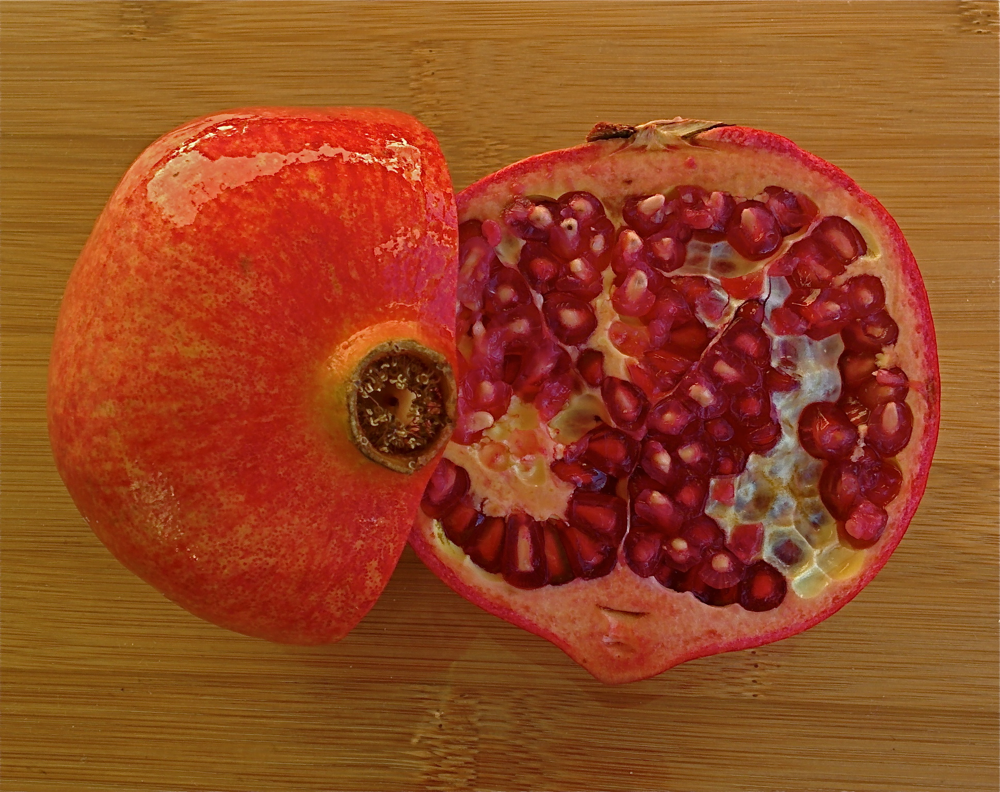

# Plants and Trees in the Bible

## License Information

Plants and Trees in the Bible © United Bible Societies, 2025. Adapted from: <cite>Each According to its Kind: Plants and Trees in the Bible</cite>, by Robert Koops © 2012 United Bible Societies. This work is licensed under Creative Commons Attribution-ShareAlike 4.0 International (<a href="https://creativecommons.org/licenses/by-sa/4.0/">https://creativecommons.org/licenses/by-sa/4.0/</a>).

--------------------------------

## Pomegranate (id: FLORA:2.10)

2\.10 Pomegranate
=================

References:
-----------

Hebrew רִמּוֹן (rimmon)

[EXO 28:33](https://ref.ly/Exod28:33), [EXO 28:34](https://ref.ly/Exod28:34), [EXO 28:34](https://ref.ly/Exod28:34), [EXO 39:24](https://ref.ly/Exod39:24), [EXO 39:25](https://ref.ly/Exod39:25), [EXO 39:25](https://ref.ly/Exod39:25), [EXO 39:26](https://ref.ly/Exod39:26), [EXO 39:26](https://ref.ly/Exod39:26), [NUM 13:23](https://ref.ly/Num13:23), [NUM 20:5](https://ref.ly/Num20:5), [DEU 8:8](https://ref.ly/Deut8:8), [1SA 14:2](https://ref.ly/1Sam14:2), [1KI 7:18](https://ref.ly/1Kgs7:18), [1KI 7:20](https://ref.ly/1Kgs7:20), [1KI 7:42](https://ref.ly/1Kgs7:42), [1KI 7:42](https://ref.ly/1Kgs7:42), [2KI 25:17](https://ref.ly/2Kgs25:17), [2CH 3:16](https://ref.ly/2Chr3:16), [2CH 4:13](https://ref.ly/2Chr4:13), [2CH 4:13](https://ref.ly/2Chr4:13), [SNG 4:3](https://ref.ly/Song4:3), [SNG 4:13](https://ref.ly/Song4:13), [SNG 6:7](https://ref.ly/Song6:7), [SNG 6:11](https://ref.ly/Song6:11), [SNG 7:13](https://ref.ly/Song7:13), [SNG 8:2](https://ref.ly/Song8:2), [JER 52:22](https://ref.ly/Jer52:22), [JER 52:22](https://ref.ly/Jer52:22), [JER 52:23](https://ref.ly/Jer52:23), [JER 52:23](https://ref.ly/Jer52:23), [JOL 1:12](https://ref.ly/Joel1:12), [HAG 2:19](https://ref.ly/Hag2:19)

Greek ροΐσκος (roiskos)

[SIR 45:9](https://ref.ly/Wis45:9)

Discussion:
-----------

The Pomegranate *Punica granatum* has been grown from ancient times across the Middle East over to Iran and into northern India. It is widely cultivated throughout India and the drier parts of Southeast Asia, Malaya, the East Indies, and tropical Africa. Pomegranates are now found throughout the warm parts of southern Europe and across North Africa and Asia all the way to Nepal. Images of pomegranate fruits have been found in Pharaoh’s temple in Karnak, Egypt, dating from around 1480 B.C. In classical Latin the species name was *malum punium* (apple of Puni) or *malum granatum* (seedy apple). This has influenced the common name for pomegranate in many languages (for example, German *Granatapfel*, “seeded apple”). The English word “pomegranate” itself comes from Latin *pomum* (fruit, apple) via Old French; (compare *pomme* in French). The Arabic *rummân* passed into some other languages, including Portuguese *romã*.

Description:
------------

The pomegranate is a small tree, growing to about 3–5 meters (10–17 feet) tall, with narrow, dark green leaves and many thorny branches. It has a lovely red flower. The fruit is a bit smaller than an orange and has a hard skin, which must be cut open to get at the tightly\-packed pockets of seeds inside, each seed enclosed in a little bag of juicy pulp. The end of the fruit has a distinctive flower\-like shape. The hard skin, which turns from green to red as it ripens, is used as a tanning agent, for medicine, and for ink. The seeds were sometimes made into wine. Pomegranate trees live up to two hundred years.

Special significance:
---------------------

The pomegranate was one of the seven “special” foods mentioned in [DEU 8:8](https://ref.ly/Deut8:8) that the Israelites would find in Canaan. The fruit was one of several brought back to the camp of the Israelites by the men who scouted out Canaan ([NUM 13:23](https://ref.ly/Num13:23)). In [JOS 15:32](https://ref.ly/Josh15:32) it is a place name. In [SNG 4:3](https://ref.ly/Song4:3) the bride of the king is said to have cheeks like halves of a pomegranate, a reference, probably, to their red color. The flower\-shaped end of the pomegranate fruit made it an attractive decoration, for example on the fringe of the priests’ robes ([EXO 28:33](https://ref.ly/Exod28:33); [EXO 28:34](https://ref.ly/Exod28:34); [EXO 28:34](https://ref.ly/Exod28:34)) and on the columns and furniture of the Temple ([2KI 25:17](https://ref.ly/2Kgs25:17)). One of the earliest artifacts we have of the Temple in Jerusalem is a pomegranate\-shaped carving considered to be the head of a staff. The prophet Joel mentions the pomegranate as one of five species that were dying because of a drought and a locust plague ([JOL 1:12](https://ref.ly/Joel1:12)).

In Jewish tradition the pomegranate stands for righteousness, because it is said to have 613 seeds, corresponding to the 613 commands of the Torah. For this reason and others many Jews eat pomegranates on the Jewish New Year Festival (Rosh Hashanah). Jewish tradition also holds that the pointed calyx of the pomegranate is the original “design” for a royal crown.

The Babylonians believed chewing pomegranate seeds before battle made them invincible. The Qur’an mentions pomegranates three times, twice as examples of the good things God creates, once as a fruit found in the Garden of Paradise.

Translation:
------------

The pomegranate is only recently being grown outside of the Mediterranean area. In West Africa it has not yet become a popular fruit. Where it is known at all, it is called *rummân* (from Arabic). In [SNG 4:3](https://ref.ly/Song4:3) and [SNG 6:7](https://ref.ly/Song6:7) the references to the pomegranate are rhetorical. There a cultural equivalent representing redness or beauty could be used. Elsewhere in the Bible transliteration is advised, following a major language, for example, *roman* /*rumman* (Arabic), *romã* /*romeira* /*roman­zeiro* (Portuguese), *grenade* /*mangrano* (French), *seok ryu* (Korean). The word *pome* simply means “fruit,” so the basic word to transliterate from is *granate* (compare *granada* in Spanish). A possible expression is “garinada fruit.” The Latin phrase *Punica granatum* for pomegranate means the “grenade” of Punica (\= Carthage), a city in present\-day Tunisia. The Latin word *granatum* means “filled with many grains or seeds.” Reflecting this, Bambara of Guinea uses “karanati fruit.” One could also use the Hebrew *rimmon* as a base. Areas influenced by Arabic may find a word like *rummân*, for example, *roomaanoo* in Mandinka. A footnote could describe the fruit as similar to a guava, red and seedy.

Although the pomegranate has been introduced recently throughout Africa, it is not well\-known, so the name will most likely need to be transliterated. As the English name is quite long, the translator is advised to translate from another source or look for ways to shorten it, such as “granata fruit.”

[EXO 28:33](https://ref.ly/Exod28:33): “On its skirts you shall make pomegranates of blue and purple and scarlet stuff, around its skirts, with bells of gold between them.” Here the writer is talking about making images of pomegranate fruit from cloth (“blue and purple and scarlet stuff”). One could say something like “… take colored string \[or, cotton] and make things like pomegranate fruit … .” Also consider using an illustration. Finally, one could consider using “like the fruit of trees” in the text, and designating the species (pomegranate) in a footnote. LB (Living Bible (1971)) takes the pomegranates as embroidered, but the impression is given that the bells are also embroidered, which seems odd, as they need to tinkle (verse 35\). NCV (New Century Version) says “balls like pomegranates,” which is clear. For verses 33–34 CEV (Contemporary English Version) provides a helpful model, saying “Along the hem of the robe weave pomegranates of blue, purple, and red wool with a gold bell between each of them.”

[1KI 7:18](https://ref.ly/1Kgs7:18): Instead of “pomegranates,” some Hebrew manuscripts read “pillars” (*‘amudim* rather than *rimmonim*). HOTTP (Hebrew Old Testament Text Project (UBS)) favors *‘amudim* here but only with a “C” rating. Possible reasons for supposing there was a change of the text from *‘amudim* to *rimmonim* are:

a) The difficulty of the reading “pillars.” It is quite likely that the scribe felt that “pomegranates” made more sense.

b) Similarity to parallel passages. In this case, the scribes probably looked at verses 20 and 42, and possibly at [2CH 3:16](https://ref.ly/2Chr3:16), all of which have *rimmonim*.

If “pomegranates” is chosen (so Septuagint, RSV (Revised Standard Version (1952)), and most modern versions), there are still questions. It is impossible to tell from the Hebrew whether these bronze fruits were cast separately (as NAB (New American Bible (1970)) clearly states), or whether they were hammered or etched into the bronze surface (CEV (Contemporary English Version) “designs that looked like pomegranates”).The essential thing to convey is that these objects are models or pictures of the fruit of the pomegranate, which is well described in FFB, pages 168–170\.

* **Associated Passages:** Exodus 28:33; Exodus 28:34; Exodus 39:24; Exodus 39:25; Exodus 39:26; Numbers 13:23; Numbers 20:5; Deuteronomy 8:8; 1 Samuel 14:2; 1 Kings 7:18; 1 Kings 7:20; 1 Kings 7:42; 2 Kings 25:17; 2 Chronicles 3:16; 2 Chronicles 4:13; Song of Songs 4:3; Song of Songs 4:13; Song of Songs 6:7; Song of Songs 6:11; Song of Songs 7:13; Song of Songs 8:2; Jeremiah 52:22; Jeremiah 52:23; Joel 1:12; Haggai 2:19; Sirach 45:9; Joshua 15:32

