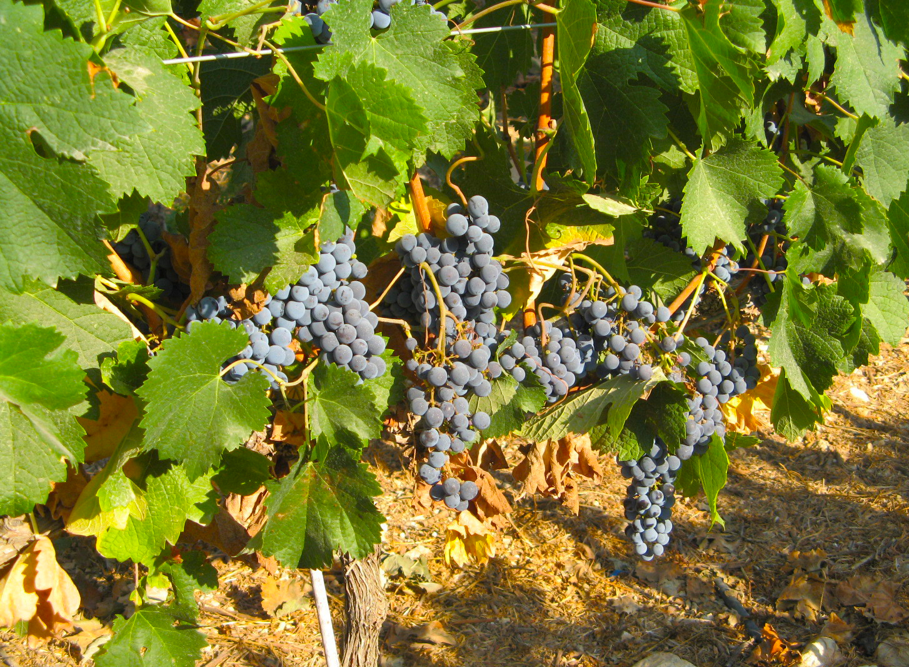
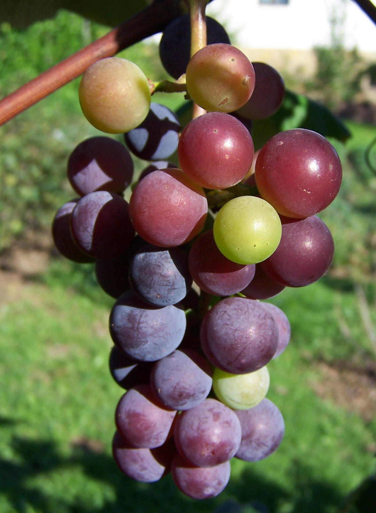

# Plants and Trees in the Bible

## License Information

Plants and Trees in the Bible © United Bible Societies, 2025. Adapted from: <cite>Each According to its Kind: Plants and Trees in the Bible</cite>, by Robert Koops © 2012 United Bible Societies. This work is licensed under Creative Commons Attribution-ShareAlike 4.0 International (<a href="https://creativecommons.org/licenses/by-sa/4.0/">https://creativecommons.org/licenses/by-sa/4.0/</a>).

--------------------------------

## Vine (id: FLORA:2.12)

2\.12 Vine
==========

References:
-----------

### **Vine**:

Hebrew גֶּפֶן (gefen)

[GEN 40:9](https://ref.ly/Gen40:9), [GEN 40:10](https://ref.ly/Gen40:10), [GEN 49:11](https://ref.ly/Gen49:11), [NUM 6:4](https://ref.ly/Num6:4), [NUM 20:5](https://ref.ly/Num20:5), [DEU 8:8](https://ref.ly/Deut8:8), [DEU 32:32](https://ref.ly/Deut32:32), [DEU 32:32](https://ref.ly/Deut32:32), [JDG 9:12](https://ref.ly/Judg9:12), [JDG 9:13](https://ref.ly/Judg9:13), [JDG 13:14](https://ref.ly/Judg13:14), [1KI 5:5](https://ref.ly/1Kgs5:5), [2KI 4:39](https://ref.ly/2Kgs4:39), [2KI 18:31](https://ref.ly/2Kgs18:31), [JOB 15:33](https://ref.ly/Job15:33), [PSA 78:47](https://ref.ly/Ps78:47), [PSA 80:9](https://ref.ly/Ps80:9), [PSA 80:15](https://ref.ly/Ps80:15), [PSA 105:33](https://ref.ly/Ps105:33), [PSA 128:3](https://ref.ly/Ps128:3), [SNG 2:13](https://ref.ly/Song2:13), [SNG 6:11](https://ref.ly/Song6:11), [SNG 7:9](https://ref.ly/Song7:9), [SNG 7:13](https://ref.ly/Song7:13), [ISA 7:23](https://ref.ly/Isa7:23), [ISA 16:8](https://ref.ly/Isa16:8), [ISA 16:9](https://ref.ly/Isa16:9), [ISA 24:7](https://ref.ly/Isa24:7), [ISA 32:12](https://ref.ly/Isa32:12), [ISA 34:4](https://ref.ly/Isa34:4), [ISA 36:16](https://ref.ly/Isa36:16), [JER 2:21](https://ref.ly/Jer2:21), [JER 5:17](https://ref.ly/Jer5:17), [JER 6:9](https://ref.ly/Jer6:9), [JER 8:13](https://ref.ly/Jer8:13), [JER 48:32](https://ref.ly/Jer48:32), [EZK 15:2](https://ref.ly/Ezek15:2), [EZK 15:6](https://ref.ly/Ezek15:6), [EZK 17:6](https://ref.ly/Ezek17:6), [EZK 17:6](https://ref.ly/Ezek17:6), [EZK 17:7](https://ref.ly/Ezek17:7), [EZK 17:8](https://ref.ly/Ezek17:8), [EZK 19:10](https://ref.ly/Ezek19:10), [HOS 2:14](https://ref.ly/Hos2:14), [HOS 10:1](https://ref.ly/Hos10:1), [HOS 14:8](https://ref.ly/Hos14:8), [JOL 1:7](https://ref.ly/Joel1:7), [JOL 1:12](https://ref.ly/Joel1:12), [JOL 2:22](https://ref.ly/Joel2:22), [MIC 4:4](https://ref.ly/Mic4:4), [HAB 3:17](https://ref.ly/Hab3:17), [HAG 2:19](https://ref.ly/Hag2:19), [ZEC 3:10](https://ref.ly/Zech3:10), [ZEC 8:12](https://ref.ly/Zech8:12), [MAL 3:11](https://ref.ly/Mal3:11)

Greek ἄμπελος (ampelos)

[MAT 26:29](https://ref.ly/Matt26:29), [MRK 14:25](https://ref.ly/Mark14:25), [LUK 22:18](https://ref.ly/Luke22:18), [JHN 15:1](https://ref.ly/John15:1), [JHN 15:4](https://ref.ly/John15:4), [JHN 15:5](https://ref.ly/John15:5), [JAS 3:12](https://ref.ly/Jas3:12), [REV 14:18](https://ref.ly/Rev14:18), [REV 14:19](https://ref.ly/Rev14:19), [SIR 24:17](https://ref.ly/Sir24:17), [1MA 14:12](https://ref.ly/1Macc14:12)

Latin vinea

[2ES 5:23](https://ref.ly/2Esd5:23)

References:
-----------

### **Vineyard**:

Hebrew כֶּרֶם (kerem)

[GEN 9:20](https://ref.ly/Gen9:20), [EXO 22:4](https://ref.ly/Exod22:4), [EXO 22:4](https://ref.ly/Exod22:4), [EXO 23:11](https://ref.ly/Exod23:11), [LEV 19:10](https://ref.ly/Lev19:10), [LEV 19:10](https://ref.ly/Lev19:10), [LEV 25:3](https://ref.ly/Lev25:3), [LEV 25:4](https://ref.ly/Lev25:4), [NUM 16:14](https://ref.ly/Num16:14), [NUM 20:17](https://ref.ly/Num20:17), [NUM 21:22](https://ref.ly/Num21:22), [NUM 22:24](https://ref.ly/Num22:24), [DEU 6:11](https://ref.ly/Deut6:11), [DEU 20:6](https://ref.ly/Deut20:6), [DEU 22:9](https://ref.ly/Deut22:9), [DEU 22:9](https://ref.ly/Deut22:9), [DEU 23:25](https://ref.ly/Deut23:25), [DEU 24:21](https://ref.ly/Deut24:21), [DEU 28:30](https://ref.ly/Deut28:30), [DEU 28:39](https://ref.ly/Deut28:39), [JOS 24:13](https://ref.ly/Josh24:13), [JDG 9:27](https://ref.ly/Judg9:27), [JDG 14:5](https://ref.ly/Judg14:5), [JDG 15:5](https://ref.ly/Judg15:5), [JDG 21:20](https://ref.ly/Judg21:20), [JDG 21:21](https://ref.ly/Judg21:21), [1SA 8:14](https://ref.ly/1Sam8:14), [1SA 8:15](https://ref.ly/1Sam8:15), [1SA 22:7](https://ref.ly/1Sam22:7), [1KI 21:1](https://ref.ly/1Kgs21:1), [1KI 21:2](https://ref.ly/1Kgs21:2), [1KI 21:2](https://ref.ly/1Kgs21:2), [1KI 21:6](https://ref.ly/1Kgs21:6), [1KI 21:6](https://ref.ly/1Kgs21:6), [1KI 21:6](https://ref.ly/1Kgs21:6), [1KI 21:7](https://ref.ly/1Kgs21:7), [1KI 21:15](https://ref.ly/1Kgs21:15), [1KI 21:16](https://ref.ly/1Kgs21:16), [1KI 21:18](https://ref.ly/1Kgs21:18), [2KI 5:26](https://ref.ly/2Kgs5:26), [2KI 18:32](https://ref.ly/2Kgs18:32), [2KI 19:29](https://ref.ly/2Kgs19:29), [1CH 27:27](https://ref.ly/1Chr27:27), [1CH 27:27](https://ref.ly/1Chr27:27), [NEH 5:3](https://ref.ly/Neh5:3), [NEH 5:4](https://ref.ly/Neh5:4), [NEH 5:5](https://ref.ly/Neh5:5), [NEH 5:11](https://ref.ly/Neh5:11), [NEH 9:25](https://ref.ly/Neh9:25), [JOB 24:6](https://ref.ly/Job24:6), [JOB 24:18](https://ref.ly/Job24:18), [PSA 107:37](https://ref.ly/Ps107:37), [PRO 24:30](https://ref.ly/Prov24:30), [PRO 31:16](https://ref.ly/Prov31:16), [ECC 2:4](https://ref.ly/Eccl2:4), [SNG 1:6](https://ref.ly/Song1:6), [SNG 1:6](https://ref.ly/Song1:6), [SNG 1:14](https://ref.ly/Song1:14), [SNG 2:15](https://ref.ly/Song2:15), [SNG 2:15](https://ref.ly/Song2:15), [SNG 7:13](https://ref.ly/Song7:13), [SNG 8:11](https://ref.ly/Song8:11), [SNG 8:11](https://ref.ly/Song8:11), [SNG 8:12](https://ref.ly/Song8:12), [ISA 1:8](https://ref.ly/Isa1:8), [ISA 3:14](https://ref.ly/Isa3:14), [ISA 5:1](https://ref.ly/Isa5:1), [ISA 5:1](https://ref.ly/Isa5:1), [ISA 5:3](https://ref.ly/Isa5:3), [ISA 5:4](https://ref.ly/Isa5:4), [ISA 5:5](https://ref.ly/Isa5:5), [ISA 5:7](https://ref.ly/Isa5:7), [ISA 5:10](https://ref.ly/Isa5:10), [ISA 16:10](https://ref.ly/Isa16:10), [ISA 27:2](https://ref.ly/Isa27:2), [ISA 36:17](https://ref.ly/Isa36:17), [ISA 37:30](https://ref.ly/Isa37:30), [ISA 65:21](https://ref.ly/Isa65:21), [JER 12:10](https://ref.ly/Jer12:10), [JER 31:5](https://ref.ly/Jer31:5), [JER 32:15](https://ref.ly/Jer32:15), [JER 35:7](https://ref.ly/Jer35:7), [JER 35:9](https://ref.ly/Jer35:9), [JER 39:10](https://ref.ly/Jer39:10), [EZK 28:26](https://ref.ly/Ezek28:26), [HOS 2:17](https://ref.ly/Hos2:17), [AMO 4:9](https://ref.ly/Amos4:9), [AMO 5:11](https://ref.ly/Amos5:11), [AMO 5:17](https://ref.ly/Amos5:17), [AMO 9:14](https://ref.ly/Amos9:14), [MIC 1:6](https://ref.ly/Mic1:6), [ZEP 1:13](https://ref.ly/Zeph1:13)

Greek ἀμπελών (ampelōn)

[MAT 20:1](https://ref.ly/Matt20:1), [MAT 20:2](https://ref.ly/Matt20:2), [MAT 20:4](https://ref.ly/Matt20:4), [MAT 20:7](https://ref.ly/Matt20:7), [MAT 20:8](https://ref.ly/Matt20:8), [MAT 21:28](https://ref.ly/Matt21:28), [MAT 21:33](https://ref.ly/Matt21:33), [MAT 21:39](https://ref.ly/Matt21:39), [MAT 21:40](https://ref.ly/Matt21:40), [MAT 21:41](https://ref.ly/Matt21:41), [MRK 12:1](https://ref.ly/Mark12:1), [MRK 12:2](https://ref.ly/Mark12:2), [MRK 12:8](https://ref.ly/Mark12:8), [MRK 12:9](https://ref.ly/Mark12:9), [MRK 12:9](https://ref.ly/Mark12:9), [LUK 13:6](https://ref.ly/Luke13:6), [LUK 20:9](https://ref.ly/Luke20:9), [LUK 20:10](https://ref.ly/Luke20:10), [LUK 20:13](https://ref.ly/Luke20:13), [LUK 20:15](https://ref.ly/Luke20:15), [LUK 20:15](https://ref.ly/Luke20:15), [LUK 20:16](https://ref.ly/Luke20:16), [1CO 9:7](https://ref.ly/1Cor9:7), [1MA 3:56](https://ref.ly/1Macc3:56), [4MA 2:9](https://ref.ly/4Macc2:9), [1ES 4:16](https://ref.ly/1Esd4:16)

Latin vinea

[2ES 16:31](https://ref.ly/2Esd16:31)

References:
-----------

### **Fruit of the vine**:

Hebrew בֹּסֶר (boser (unripe grape))

[JOB 15:33](https://ref.ly/Job15:33), [ISA 18:5](https://ref.ly/Isa18:5), [JER 31:29](https://ref.ly/Jer31:29), [JER 31:30](https://ref.ly/Jer31:30), [EZK 18:2](https://ref.ly/Ezek18:2)

Hebrew בָּצִיר (batsir)

[LEV 26:5](https://ref.ly/Lev26:5), [LEV 26:5](https://ref.ly/Lev26:5), [JDG 8:2](https://ref.ly/Judg8:2), [ISA 24:13](https://ref.ly/Isa24:13), [ISA 32:10](https://ref.ly/Isa32:10), [JER 48:32](https://ref.ly/Jer48:32), [MIC 7:1](https://ref.ly/Mic7:1)

Hebrew עֵנָב (‘enav (grape))

[GEN 40:10](https://ref.ly/Gen40:10), [GEN 40:11](https://ref.ly/Gen40:11), [GEN 49:11](https://ref.ly/Gen49:11), [LEV 25:5](https://ref.ly/Lev25:5), [NUM 6:3](https://ref.ly/Num6:3), [NUM 6:3](https://ref.ly/Num6:3), [NUM 13:20](https://ref.ly/Num13:20), [NUM 13:23](https://ref.ly/Num13:23), [DEU 23:25](https://ref.ly/Deut23:25), [DEU 32:14](https://ref.ly/Deut32:14), [DEU 32:32](https://ref.ly/Deut32:32), [DEU 32:32](https://ref.ly/Deut32:32), [NEH 13:15](https://ref.ly/Neh13:15), [ISA 5:2](https://ref.ly/Isa5:2), [ISA 5:4](https://ref.ly/Isa5:4), [JER 8:13](https://ref.ly/Jer8:13), [HOS 3:1](https://ref.ly/Hos3:1), [HOS 9:10](https://ref.ly/Hos9:10), [AMO 9:13](https://ref.ly/Amos9:13)

Hebrew תִּירוֹשׁ (tirosh)

[GEN 27:28](https://ref.ly/Gen27:28), [GEN 27:37](https://ref.ly/Gen27:37), [NUM 18:12](https://ref.ly/Num18:12), [DEU 7:13](https://ref.ly/Deut7:13), [DEU 11:14](https://ref.ly/Deut11:14), [DEU 12:17](https://ref.ly/Deut12:17), [DEU 14:23](https://ref.ly/Deut14:23), [DEU 18:4](https://ref.ly/Deut18:4), [DEU 28:51](https://ref.ly/Deut28:51), [DEU 33:28](https://ref.ly/Deut33:28), [JDG 9:13](https://ref.ly/Judg9:13), [2KI 18:32](https://ref.ly/2Kgs18:32), [2CH 31:5](https://ref.ly/2Chr31:5), [2CH 32:28](https://ref.ly/2Chr32:28), [NEH 5:11](https://ref.ly/Neh5:11), [NEH 10:38](https://ref.ly/Neh10:38), [NEH 10:40](https://ref.ly/Neh10:40), [NEH 13:5](https://ref.ly/Neh13:5), [NEH 13:12](https://ref.ly/Neh13:12), [PSA 4:8](https://ref.ly/Ps4:8), [PRO 3:10](https://ref.ly/Prov3:10), [ISA 24:7](https://ref.ly/Isa24:7), [ISA 36:17](https://ref.ly/Isa36:17), [ISA 62:8](https://ref.ly/Isa62:8), [ISA 65:8](https://ref.ly/Isa65:8), [JER 31:12](https://ref.ly/Jer31:12), [HOS 2:10](https://ref.ly/Hos2:10), [HOS 2:11](https://ref.ly/Hos2:11), [HOS 2:24](https://ref.ly/Hos2:24), [HOS 4:11](https://ref.ly/Hos4:11), [HOS 7:14](https://ref.ly/Hos7:14), [HOS 9:2](https://ref.ly/Hos9:2), [JOL 1:10](https://ref.ly/Joel1:10), [JOL 2:19](https://ref.ly/Joel2:19), [JOL 2:24](https://ref.ly/Joel2:24), [MIC 6:15](https://ref.ly/Mic6:15), [HAG 1:11](https://ref.ly/Hag1:11), [ZEC 9:17](https://ref.ly/Zech9:17)

Greek βότρυς (botrus)

[REV 14:18](https://ref.ly/Rev14:18)

Greek σταφυλή (staphulē)

[MAT 7:16](https://ref.ly/Matt7:16), [LUK 6:44](https://ref.ly/Luke6:44), [REV 14:18](https://ref.ly/Rev14:18), [SIR 39:26](https://ref.ly/Sir39:26), [SIR 50:15](https://ref.ly/Sir50:15), [SIR 51:15](https://ref.ly/Sir51:15), [1MA 6:34](https://ref.ly/1Macc6:34)

Latin acinum

[2ES 9:21](https://ref.ly/2Esd9:21), [2ES 9:22](https://ref.ly/2Esd9:22)

Latin botrus

[2ES 12:42](https://ref.ly/2Esd12:42)

Latin uva

[2ES 16:27](https://ref.ly/2Esd16:27)

Latin vindemia

[2ES 16:27](https://ref.ly/2Esd16:27)

References:
-----------

### **Cake of dried grapes**:

Hebrew אָשִׁישׁ, אֲשִׁישָׁה (’ashish, ’ashishah)

[2SA 6:19](https://ref.ly/2Sam6:19), [1CH 16:3](https://ref.ly/1Chr16:3), [SNG 2:5](https://ref.ly/Song2:5), [ISA 16:7](https://ref.ly/Isa16:7), [HOS 3:1](https://ref.ly/Hos3:1)

Hebrew צִמּוּקִים (tsimuqim)

[1SA 25:18](https://ref.ly/1Sam25:18), [1SA 30:12](https://ref.ly/1Sam30:12), [2SA 16:1](https://ref.ly/2Sam16:1), [1CH 12:41](https://ref.ly/1Chr12:41)

References:
-----------

### **Beverages made from vine fruits**:

Hebrew יַיִן (yayin)

[GEN 9:21](https://ref.ly/Gen9:21), [GEN 9:24](https://ref.ly/Gen9:24), [GEN 14:18](https://ref.ly/Gen14:18), [GEN 19:32](https://ref.ly/Gen19:32), [GEN 19:33](https://ref.ly/Gen19:33), [GEN 19:34](https://ref.ly/Gen19:34), [GEN 19:35](https://ref.ly/Gen19:35), [GEN 27:25](https://ref.ly/Gen27:25), [GEN 49:11](https://ref.ly/Gen49:11), [GEN 49:12](https://ref.ly/Gen49:12), [EXO 29:40](https://ref.ly/Exod29:40), [LEV 10:9](https://ref.ly/Lev10:9), [LEV 23:13](https://ref.ly/Lev23:13), [NUM 6:3](https://ref.ly/Num6:3), [NUM 6:3](https://ref.ly/Num6:3), [NUM 6:4](https://ref.ly/Num6:4), [NUM 6:20](https://ref.ly/Num6:20), [NUM 15:5](https://ref.ly/Num15:5), [NUM 15:7](https://ref.ly/Num15:7), [NUM 15:10](https://ref.ly/Num15:10), [NUM 28:14](https://ref.ly/Num28:14), [DEU 14:26](https://ref.ly/Deut14:26), [DEU 28:39](https://ref.ly/Deut28:39), [DEU 29:5](https://ref.ly/Deut29:5), [DEU 32:33](https://ref.ly/Deut32:33), [DEU 32:38](https://ref.ly/Deut32:38), [JOS 9:4](https://ref.ly/Josh9:4), [JOS 9:13](https://ref.ly/Josh9:13), [JDG 13:4](https://ref.ly/Judg13:4), [JDG 13:7](https://ref.ly/Judg13:7), [JDG 13:14](https://ref.ly/Judg13:14), [JDG 13:14](https://ref.ly/Judg13:14), [JDG 19:19](https://ref.ly/Judg19:19), [1SA 1:14](https://ref.ly/1Sam1:14), [1SA 1:15](https://ref.ly/1Sam1:15), [1SA 1:24](https://ref.ly/1Sam1:24), [1SA 10:3](https://ref.ly/1Sam10:3), [1SA 16:20](https://ref.ly/1Sam16:20), [1SA 25:18](https://ref.ly/1Sam25:18), [1SA 25:37](https://ref.ly/1Sam25:37), [2SA 13:28](https://ref.ly/2Sam13:28), [2SA 16:1](https://ref.ly/2Sam16:1), [2SA 16:2](https://ref.ly/2Sam16:2), [1CH 9:29](https://ref.ly/1Chr9:29), [1CH 12:41](https://ref.ly/1Chr12:41), [1CH 27:27](https://ref.ly/1Chr27:27), [2CH 2:9](https://ref.ly/2Chr2:9), [2CH 2:14](https://ref.ly/2Chr2:14), [2CH 11:11](https://ref.ly/2Chr11:11), [NEH 2:1](https://ref.ly/Neh2:1), [NEH 2:1](https://ref.ly/Neh2:1), [NEH 5:15](https://ref.ly/Neh5:15), [NEH 5:18](https://ref.ly/Neh5:18), [NEH 13:15](https://ref.ly/Neh13:15), [EST 1:7](https://ref.ly/Esth1:7), [EST 1:10](https://ref.ly/Esth1:10), [EST 5:6](https://ref.ly/Esth5:6), [EST 7:2](https://ref.ly/Esth7:2), [EST 7:7](https://ref.ly/Esth7:7), [EST 7:8](https://ref.ly/Esth7:8), [JOB 1:13](https://ref.ly/Job1:13), [JOB 1:18](https://ref.ly/Job1:18), [JOB 32:19](https://ref.ly/Job32:19), [PSA 60:5](https://ref.ly/Ps60:5), [PSA 75:9](https://ref.ly/Ps75:9), [PSA 78:65](https://ref.ly/Ps78:65), [PSA 104:15](https://ref.ly/Ps104:15), [PRO 4:17](https://ref.ly/Prov4:17), [PRO 9:2](https://ref.ly/Prov9:2), [PRO 9:5](https://ref.ly/Prov9:5), [PRO 20:1](https://ref.ly/Prov20:1), [PRO 21:17](https://ref.ly/Prov21:17), [PRO 23:20](https://ref.ly/Prov23:20), [PRO 23:30](https://ref.ly/Prov23:30), [PRO 23:31](https://ref.ly/Prov23:31), [PRO 31:4](https://ref.ly/Prov31:4), [PRO 31:6](https://ref.ly/Prov31:6), [ECC 2:3](https://ref.ly/Eccl2:3), [ECC 9:7](https://ref.ly/Eccl9:7), [ECC 10:19](https://ref.ly/Eccl10:19), [SNG 1:2](https://ref.ly/Song1:2), [SNG 1:4](https://ref.ly/Song1:4), [SNG 2:4](https://ref.ly/Song2:4), [SNG 4:10](https://ref.ly/Song4:10), [SNG 5:1](https://ref.ly/Song5:1), [SNG 7:10](https://ref.ly/Song7:10), [SNG 8:2](https://ref.ly/Song8:2), [ISA 5:11](https://ref.ly/Isa5:11), [ISA 5:12](https://ref.ly/Isa5:12), [ISA 5:22](https://ref.ly/Isa5:22), [ISA 16:10](https://ref.ly/Isa16:10), [ISA 22:13](https://ref.ly/Isa22:13), [ISA 24:9](https://ref.ly/Isa24:9), [ISA 24:11](https://ref.ly/Isa24:11), [ISA 28:1](https://ref.ly/Isa28:1), [ISA 28:7](https://ref.ly/Isa28:7), [ISA 28:7](https://ref.ly/Isa28:7), [ISA 29:9](https://ref.ly/Isa29:9), [ISA 51:21](https://ref.ly/Isa51:21), [ISA 55:1](https://ref.ly/Isa55:1), [ISA 56:12](https://ref.ly/Isa56:12), [JER 13:12](https://ref.ly/Jer13:12), [JER 13:12](https://ref.ly/Jer13:12), [JER 23:9](https://ref.ly/Jer23:9), [JER 25:15](https://ref.ly/Jer25:15), [JER 35:2](https://ref.ly/Jer35:2), [JER 35:5](https://ref.ly/Jer35:5), [JER 35:5](https://ref.ly/Jer35:5), [JER 35:6](https://ref.ly/Jer35:6), [JER 35:6](https://ref.ly/Jer35:6), [JER 35:8](https://ref.ly/Jer35:8), [JER 35:14](https://ref.ly/Jer35:14), [JER 40:10](https://ref.ly/Jer40:10), [JER 40:12](https://ref.ly/Jer40:12), [JER 48:33](https://ref.ly/Jer48:33), [JER 51:7](https://ref.ly/Jer51:7), [LAM 2:12](https://ref.ly/Lam2:12), [EZK 27:18](https://ref.ly/Ezek27:18), [EZK 44:21](https://ref.ly/Ezek44:21), [DAN 1:5](https://ref.ly/Dan1:5), [DAN 1:8](https://ref.ly/Dan1:8), [DAN 1:16](https://ref.ly/Dan1:16), [DAN 10:3](https://ref.ly/Dan10:3), [HOS 4:11](https://ref.ly/Hos4:11), [HOS 7:5](https://ref.ly/Hos7:5), [HOS 9:4](https://ref.ly/Hos9:4), [HOS 14:8](https://ref.ly/Hos14:8), [JOL 1:5](https://ref.ly/Joel1:5), [JOL 4:3](https://ref.ly/Joel4:3), [AMO 2:8](https://ref.ly/Amos2:8), [AMO 2:12](https://ref.ly/Amos2:12), [AMO 5:11](https://ref.ly/Amos5:11), [AMO 6:6](https://ref.ly/Amos6:6), [AMO 9:14](https://ref.ly/Amos9:14), [MIC 2:11](https://ref.ly/Mic2:11), [MIC 6:15](https://ref.ly/Mic6:15), [HAB 2:5](https://ref.ly/Hab2:5), [ZEP 1:13](https://ref.ly/Zeph1:13), [HAG 2:12](https://ref.ly/Hag2:12), [ZEC 9:15](https://ref.ly/Zech9:15), [ZEC 10:7](https://ref.ly/Zech10:7)

Hebrew שֵׁכָר (shekar)

[LEV 10:9](https://ref.ly/Lev10:9), [NUM 6:3](https://ref.ly/Num6:3), [NUM 6:3](https://ref.ly/Num6:3), [NUM 28:7](https://ref.ly/Num28:7), [DEU 14:26](https://ref.ly/Deut14:26), [DEU 29:5](https://ref.ly/Deut29:5), [JDG 13:4](https://ref.ly/Judg13:4), [JDG 13:7](https://ref.ly/Judg13:7), [JDG 13:14](https://ref.ly/Judg13:14), [1SA 1:15](https://ref.ly/1Sam1:15), [PSA 69:13](https://ref.ly/Ps69:13), [PRO 20:1](https://ref.ly/Prov20:1), [PRO 31:4](https://ref.ly/Prov31:4), [PRO 31:6](https://ref.ly/Prov31:6), [ISA 5:11](https://ref.ly/Isa5:11), [ISA 5:22](https://ref.ly/Isa5:22), [ISA 24:9](https://ref.ly/Isa24:9), [ISA 28:7](https://ref.ly/Isa28:7), [ISA 28:7](https://ref.ly/Isa28:7), [ISA 28:7](https://ref.ly/Isa28:7), [ISA 29:9](https://ref.ly/Isa29:9), [ISA 56:12](https://ref.ly/Isa56:12), [MIC 2:11](https://ref.ly/Mic2:11)

Hebrew תִּרוֹשׁ (tirosh (see “Fruit of the vine” above))

Greek γλεῦκος (gleukos (sweet wine))

[ACT 2:13](https://ref.ly/Acts2:13)

Greek οἶνος (oinos (wine))

[MAT 9:17](https://ref.ly/Matt9:17), [MAT 9:17](https://ref.ly/Matt9:17), [MAT 9:17](https://ref.ly/Matt9:17), [MAT 27:34](https://ref.ly/Matt27:34), [MRK 2:22](https://ref.ly/Mark2:22), [MRK 2:22](https://ref.ly/Mark2:22), [MRK 2:22](https://ref.ly/Mark2:22), [MRK 2:22](https://ref.ly/Mark2:22), [MRK 15:23](https://ref.ly/Mark15:23), [LUK 1:15](https://ref.ly/Luke1:15), [LUK 5:37](https://ref.ly/Luke5:37), [LUK 5:37](https://ref.ly/Luke5:37), [LUK 5:38](https://ref.ly/Luke5:38), [LUK 7:33](https://ref.ly/Luke7:33), [LUK 10:34](https://ref.ly/Luke10:34), [JHN 2:3](https://ref.ly/John2:3), [JHN 2:3](https://ref.ly/John2:3), [JHN 2:9](https://ref.ly/John2:9), [JHN 2:10](https://ref.ly/John2:10), [JHN 2:10](https://ref.ly/John2:10), [JHN 4:46](https://ref.ly/John4:46), [ROM 14:21](https://ref.ly/Rom14:21), [EPH 5:18](https://ref.ly/Eph5:18), [1TI 3:8](https://ref.ly/1Tim3:8), [1TI 5:23](https://ref.ly/1Tim5:23), [TIT 2:3](https://ref.ly/Titus2:3), [REV 6:6](https://ref.ly/Rev6:6), [REV 14:8](https://ref.ly/Rev14:8), [REV 14:10](https://ref.ly/Rev14:10), [REV 16:19](https://ref.ly/Rev16:19), [REV 17:2](https://ref.ly/Rev17:2), [REV 18:3](https://ref.ly/Rev18:3), [REV 18:13](https://ref.ly/Rev18:13), [REV 19:15](https://ref.ly/Rev19:15), [TOB 4:15](https://ref.ly/Tob4:15), [JDT 10:5](https://ref.ly/Jdt10:5), [JDT 11:13](https://ref.ly/Jdt11:13), [JDT 12:1](https://ref.ly/Jdt12:1), [JDT 12:13](https://ref.ly/Jdt12:13), [JDT 12:20](https://ref.ly/Jdt12:20), [JDT 13:2](https://ref.ly/Jdt13:2), [ESG 1:7](https://ref.ly/EsthGr1:7), [WIS 2:7](https://ref.ly/Wis2:7), [SIR 9:9](https://ref.ly/Sir9:9), [SIR 9:10](https://ref.ly/Sir9:10), [SIR 19:2](https://ref.ly/Sir19:2), [SIR 31:25](https://ref.ly/Sir31:25), [SIR 31:25](https://ref.ly/Sir31:25), [SIR 31:26](https://ref.ly/Sir31:26), [SIR 31:27](https://ref.ly/Sir31:27), [SIR 31:27](https://ref.ly/Sir31:27), [SIR 31:28](https://ref.ly/Sir31:28), [SIR 31:29](https://ref.ly/Sir31:29), [SIR 31:31](https://ref.ly/Sir31:31), [SIR 32:5](https://ref.ly/Sir32:5), [SIR 32:6](https://ref.ly/Sir32:6), [SIR 40:20](https://ref.ly/Sir40:20), [SIR 49:1](https://ref.ly/Sir49:1), [BEL 1:3](https://ref.ly/Bel1:3), [BEL 1:11](https://ref.ly/Bel1:11), [2MA 15:39](https://ref.ly/2Macc15:39), [2MA 15:39](https://ref.ly/2Macc15:39), [3MA 5:2](https://ref.ly/3Macc5:2), [3MA 5:10](https://ref.ly/3Macc5:10), [3MA 5:45](https://ref.ly/3Macc5:45), [3MA 6:30](https://ref.ly/3Macc6:30), [1ES 3:10](https://ref.ly/1Esd3:10), [1ES 3:17](https://ref.ly/1Esd3:17), [1ES 3:18](https://ref.ly/1Esd3:18), [1ES 3:23](https://ref.ly/1Esd3:23), [1ES 3:24](https://ref.ly/1Esd3:24), [1ES 4:14](https://ref.ly/1Esd4:14), [1ES 4:16](https://ref.ly/1Esd4:16), [1ES 4:37](https://ref.ly/1Esd4:37), [1ES 6:29](https://ref.ly/1Esd6:29), [1ES 8:20](https://ref.ly/1Esd8:20)

Greek σίκερα (sikera)

[LUK 1:15](https://ref.ly/Luke1:15)

Latin vinum

[2ES 9:24](https://ref.ly/2Esd9:24)

Discussion:
-----------

The Common Grape Vine *Vitis vinifera* is mentioned more often than any other plant or tree in the Bible.\* Excavations in Greece have discovered grape seeds dating to 4500 B.C. Egyptian records document the existence of cultivated vines in Canaan as early as 2375 B.C., and subsequent records report trade in vine products around 1360 B.C. and many times thereafter.

Description:
------------

The vine is a creeping plant that develops a woody stem when it matures. It grows along the ground until it finds a tree or other object to climb, using tendrils. It bears bunches of small round fruit that are sweet and juicy. Today farmers grow them commercially throughout the Mediterranean area, in South Africa, in North America, and in many other countries. The first reference to the vine in the Bible ([GEN 9:20](https://ref.ly/Gen9:20)) tells us that Noah planted a vineyard (Hebrew *kerem*) and that he made an alcoholic drink from the fruit. Farmers since then have improved on the size, color, and quality of the fruit by careful pruning and selection until now there are at least 65 kinds of grapevines. Like many other plants in temperate areas, the vine has leaves that appear in early spring. After the fruit is picked and the weather gets cold, the leaves drop off and the plant is bare until the following spring.

A typical vineyard in Bible times was surrounded by a stone fence. It had a stone tower from which the owner could watch for predators, and a place to squeeze the juice out of the fruits.

References to the vine and its fruits in the Bible are found in descriptions of farms, of sacrifices, and of social interaction.

Special significance:
---------------------

The vine is the most frequently cited plant in the Bible, and that alone makes it special. Vines, grapes, raisins, and wine were a major element of Jewish life, so it is not a surprise that the vine and its products are used figuratively probably more than any other Bible plant. After the flood purified the earth at the time of Noah, the vine became the means by which the human race was plunged again into sin ([GEN 9:20](https://ref.ly/Gen9:20)). We know from Jacob’s blessing in [GEN 49:11](https://ref.ly/Gen49:11); [GEN 49:12](https://ref.ly/Gen49:12), from [ISA 16:10](https://ref.ly/Isa16:10), from [AMO 9:13](https://ref.ly/Amos9:13), and from many other passages that the vine was the symbol of blessing, prosperity, and happiness. The fact that there were groups like the Nazirites and Rechabites who abstained from drinking wine simply shows the radical self\-denial that these people imposed on themselves ([NUM 6:3](https://ref.ly/Num6:3); [NUM 6:4](https://ref.ly/Num6:4); [JER 35:2](https://ref.ly/Jer35:2); [JER 35:5](https://ref.ly/Jer35:5); [JER 35:6](https://ref.ly/Jer35:6)). A drink offering of wine was an important part of worship ([EXO 29:40](https://ref.ly/Exod29:40)), and the image of contentment was “every man under his vine and under his fig tree” ([MIC 4:4](https://ref.ly/Mic4:4)). Jotham includes the vine in his well\-known Parable of the Trees ([JDG 9:7](https://ref.ly/Judg9:7) ff.). In the New Testament, Jesus rescued a man from humiliation at a wedding party by miraculously providing a fresh supply of wine ([JHN 2:1](https://ref.ly/John2:1) ff.). He compared his teaching to wine. Wine becomes a major symbol in the Christian community when Jesus foreshadows his crucifixion by comparing the wine poured out in the Passover celebration to his blood ([MAT 26:27](https://ref.ly/Matt26:27); [MAT 26:28](https://ref.ly/Matt26:28); [MAT 26:29](https://ref.ly/Matt26:29)). He speaks of the need for Christians to be like the branches of the vine, drawing their nourishment from him, the True Vine ([JHN 15:1](https://ref.ly/John15:1) ff.). Nearly every New Testament writer makes some metaphorical reference to the vine or its products.

The Hebrew word *shekar* (“strong drink”) probably refers to a alcoholic drink made from grain, honey or dates, but could also have been distilled from wine.

Translation:
------------

**Vine and vineyard**: There are around 65 kinds of grapevines (*Vitis vinifera*) found in the Northern Hemisphere. They belong to a larger family of creeping plants called *Vitaceae*, which has over 800 species throughout the world including many in the tropical and warm climates of the world.

Grapevines have occasionally been grown in West Africa (for example, in The Gambia and in northern Nigeria) but are not well known even where they are grown commercially. Attempts at substituting a local tree name have not been entirely successful because the species chosen is usually not cultivated and/or does not have the same economic or social function that the grape had in Israel.

Thus it is probably best to use a transliteration from a major language. However, in parts of Nigeria and perhaps elsewhere, the word *grep* refers to “grapefruit” and should be avoided in translation. A transliteration from “vine” or “wine” is preferred, although a translator needs to be careful. The English word “vine” refers to any creeping plant, but it also refers to a particular kind of vine that produces grapes (*Vitis vinifera*). This can be confusing. Furthermore, translators in English\-speaking countries should think carefully about what they are going to do with the word “wine.” In The Gambia, Mandinka translators first used “wayini tree” but later concluded that it may be better to have a word for “vine” that is not necessarily identical with “wine.” *Bine*, from *binekaro* (“vinegar”), was considered, as was *inabi* (“grape”) from Arabic.

Languages that borrow the Arabic word *inabi* must deal with the fact that this word bears an unfortunate resemblance to *annabi* (“prophet”) and new readers reading “water of inabi” in a context of prophecy may associate it, for better or worse, with prophets and prophecy. In northern Nigeria church people have gotten used to *inabi* in the New Testament even though many of them don’t know what it is. Rubassa in Nigeria uses a wild grape\-like plant (*afwafwa*)\*\*, and Igala has used the same species (*achiwebetema*) for years. Likewise, two translations in Mali and Burkina Faso use their local name for a wild vine (*Lannea microcarpa*) for the biblical vine. There is a species (*Rhoicissus tridentata*) in southern and eastern Africa known as “African grape” (locally called “bobbejaantou”). In such cases translators should write a footnote (or glossary item) stating that the grapes of Bible times were larger and sweeter than the local variety, and that they were cultivated extensively as a source for producing beverages. Other possibilities for transliteration are: *vinyola* /*videra* (Portuguese), *vitis* (Latin), and *inab* (Arabic).

**Fruit of the vine** (Hebrew *‘enav*; Greek *botrus*, *staphulē*): There is some evidence that *botrus* refers to a bunch of grapes, while *staphulē* refers to individual grapes. According to Louw and Nida (*Greek\-English Lexicon of the New Testament based on Semantic Domains*), however, both words may refer to individual grapes as well as bunches of grapes. The Hebrew word *tirosh* is equivalent to the word “vintage” in English, that is, the grape harvest and possibly the first squeezing of the grapes. It is normally used along with the words referring to the olive harvest (*yitshar*) and grain harvest (*dagan*).

**Vineyard**: The typical translation solution for translating “vineyard” is to take the word chosen for “vine” and expand to “field/farm of vine trees.”

**Beverages made from vine fruit**: Grape juice contains yeast organisms that make it ferment naturally, converting natural sugar into alcohol or vinegar within a day or two, depending on the weather (Hepper, page 101\). In normal wine preparation, the juice (called “must”) is allowed to ferment for six weeks, after which the clear liquid is poured out into another container leaving behind the sediment (the “lees”; see [JER 48:11](https://ref.ly/Jer48:11)) consisting of seeds, twigs, and skins. Once it is in sealed containers for storage it is called *yayin* in Hebrew. Translators from churches that require abstinence from alcohol are tempted to avoid or downplay the fact that *yayin* refers to an alcoholic drink. This is difficult to defend since the Jews had no refrigeration to keep *yayin* cool enough to prevent fermentation.

The Hebrew word *tirosh*, sometimes translated “new wine,” is problematical. There is no phrase “new wine” in the Hebrew Old Testament or the Septuagint translation of it. The Septuagint usually translated *tirosh* simply as wine (*oinos* in Greek). In the New Testament Jesus creates the phrase “new wine” for his parable of the wineskins, linking it with new wineskins ([MAT 9:17](https://ref.ly/Matt9:17); [MRK 2:22](https://ref.ly/Mark2:22); [LUK 5:37](https://ref.ly/Luke5:37); [LUK 5:38](https://ref.ly/Luke5:38)); it seems to be a made\-up phrase there, not a technical expression. In [NUM 6:3](https://ref.ly/Num6:3); [NUM 6:4](https://ref.ly/Num6:4) the Nazirites were prohibited from drinking wine, strong drink, and vinegar, or even eating grapes or grapeskins, but *tirosh* is not mentioned there, suggesting that it may have even been an abstract term like the English word “vintage,” which refers to the grape harvest. The word *tirosh* is usually used with the Hebrew words for unprocessed grain (*dagan*) and olive oil (*yitshar*), in contexts that refer to the produce of the land. What RSV (Revised Standard Version (1952)) calls “new wine” in these passages is better rendered “vintage” in English. In [ISA 24:7](https://ref.ly/Isa24:7) *tirosh* seems to refer to the grapevines themselves (so GNB (Good News Bible), CEV (Contemporary English Version), NLT (New Living Translation)). In [MIC 6:15](https://ref.ly/Mic6:15) it refers to grapes. In [JOL 2:24](https://ref.ly/Joel2:24) it seems to refer to freshly squeezed grape juice. It occurs only twice with the Hebrew verb for “drink” ([ISA 62:8](https://ref.ly/Isa62:8); [MIC 6:15](https://ref.ly/Mic6:15)), but in both those passages it can be taken as metonymic, not literal.

Some have tried to argue that *tirosh* was unfermented grape juice, which may be true in [JOL 2:24](https://ref.ly/Joel2:24), but that is rather beside the point since it does not refer to a beverage in most cases. Even if *tirosh* is assumed to include the juice in its first stages on the first day after squeezing, it would have been mildly alcoholic since it has a kind of yeast in it and the Jews had no means of refrigeration. A case in point is [HOS 4:11](https://ref.ly/Hos4:11), which says “*Yayin* and *tirosh* take away understanding.” Why? Surely because they contain alcohol! Another example is [JDG 9:13](https://ref.ly/Judg9:13), where the grapevine in the Parable of the Trees says, “Shall I give up my *tirosh* that cheers gods and men?” I take *tirosh* here as a metonym for the final product. But if it is literal, why would it cheer anyone, if not because of its alcoholic content?

Sometimes translators, even if they concede the above, prefer to use a literal expression like “wayin” precisely because it is not well known, and thus hides the problem. This is not very satisfactory. They need to know that there are possibilities for translating these words contextually. For example, in passages where *tirosh* refers to a product of the land along with grain and oil, a phrase like “the juice of vayin fruit” is an acceptable translation of *tirosh*. In places where the reference is to drunkenness, the local word for alcoholic drink may be appropriate, and in fact, need not cause any offense. The compulsion to be concordant with English “wine” is what causes the problem.

On the other hand there are communities where *yayin*, *tirosh*, and the Greek word *oinos* have been translated using a word for a locally popular alcoholic brew, such as guinea corn (sorghum) beer. This, however, is not technically accurate. Properly speaking, wine is made from fruit, and beer from grain.

There are a few other Hebrew words that may refer to wine (for example *chemer*, *sove’*, *mezeg*; see WTH, [9\.1 Wine](#REALIA:9.1)) but they may be generic, or abstract, or poetic, or they refer to a drink made from fruit other than the fruit of the vine, such as pomegranates or dates, so we do not consider them here. In a number of places, wine is referred to indirectly. When a drink offering of wine was required, as in [DEU 15:14](https://ref.ly/Deut15:14), the people are told to bring the offering “out of your wine press \[*yeqev* in Hebrew].”

[NUM 28:7](https://ref.ly/Num28:7): RSV (Revised Standard Version (1952)) renders the Hebrew word *shekar* in this verse as “strong drink.” NIV (New International Version (1984)) and NJB (New Jerusalem Bible (1985)) take it literally here, saying “fermented drink/liquor.” NLT (New Living Translation) is similar with “alcoholic drink.” GNB (Good News Bible), CEV (Contemporary English Version), and others just use “wine.” (REB (Revised English Bible (1989)) cleverly does both by rendering this verse as “The wine for the proper drink\-offering is to be a quarter of a hin to each ram; you are to pour out this strong drink … .”) Some commentators see this as a strange use of *shekar*, which normally refers to alcoholic drinks made from grain or honey. They think “wine” was intended and that a late editor used *shekar* possibly under the influence of Akkadians, who always talked about using *shikar* for any kind of libation. See WTH, pages 374–375, for further discussion.

* **Associated Passages:** Genesis 40:9; Genesis 40:10; Genesis 49:11; Numbers 6:4; Numbers 20:5; Deuteronomy 8:8; Deuteronomy 32:32; Judges 9:12; Judges 9:13; Judges 13:14; 1 Kings 5:5; 2 Kings 4:39; 2 Kings 18:31; Job 15:33; Psalms 78:47; Psalms 80:9; Psalms 80:15; Psalms 105:33; Psalms 128:3; Song of Songs 2:13; Song of Songs 6:11; Song of Songs 7:9; Song of Songs 7:13; Isaiah 7:23; Isaiah 16:8; Isaiah 16:9; Isaiah 24:7; Isaiah 32:12; Isaiah 34:4; Isaiah 36:16; Jeremiah 2:21; Jeremiah 5:17; Jeremiah 6:9; Jeremiah 8:13; Jeremiah 48:32; Ezekiel 15:2; Ezekiel 15:6; Ezekiel 17:6; Ezekiel 17:7; Ezekiel 17:8; Ezekiel 19:10; Hosea 2:14; Hosea 10:1; Hosea 14:8; Joel 1:7; Joel 1:12; Joel 2:22; Micah 4:4; Habakkuk 3:17; Haggai 2:19; Zechariah 3:10; Zechariah 8:12; Malachi 3:11; Matthew 26:29; Mark 14:25; Luke 22:18; John 15:1; John 15:4; John 15:5; James 3:12; Revelation 14:18; Revelation 14:19; Sirach 24:17; 1 Maccabees 14:12; 2 Esdras (Latin) 5:23; Genesis 9:20; Exodus 22:4; Exodus 23:11; Leviticus 19:10; Leviticus 25:3; Leviticus 25:4; Numbers 16:14; Numbers 20:17; Numbers 21:22; Numbers 22:24; Deuteronomy 6:11; Deuteronomy 20:6; Deuteronomy 22:9; Deuteronomy 23:25; Deuteronomy 24:21; Deuteronomy 28:30; Deuteronomy 28:39; Joshua 24:13; Judges 9:27; Judges 14:5; Judges 15:5; Judges 21:20; Judges 21:21; 1 Samuel 8:14; 1 Samuel 8:15; 1 Samuel 22:7; 1 Kings 21:1; 1 Kings 21:2; 1 Kings 21:6; 1 Kings 21:7; 1 Kings 21:15; 1 Kings 21:16; 1 Kings 21:18; 2 Kings 5:26; 2 Kings 18:32; 2 Kings 19:29; 1 Chronicles 27:27; Nehemiah 5:3; Nehemiah 5:4; Nehemiah 5:5; Nehemiah 5:11; Nehemiah 9:25; Job 24:6; Job 24:18; Psalms 107:37; Proverbs 24:30; Proverbs 31:16; Ecclesiastes 2:4; Song of Songs 1:6; Song of Songs 1:14; Song of Songs 2:15; Song of Songs 8:11; Song of Songs 8:12; Isaiah 1:8; Isaiah 3:14; Isaiah 5:1; Isaiah 5:3; Isaiah 5:4; Isaiah 5:5; Isaiah 5:7; Isaiah 5:10; Isaiah 16:10; Isaiah 27:2; Isaiah 36:17; Isaiah 37:30; Isaiah 65:21; Jeremiah 12:10; Jeremiah 31:5; Jeremiah 32:15; Jeremiah 35:7; Jeremiah 35:9; Jeremiah 39:10; Ezekiel 28:26; Hosea 2:17; Amos 4:9; Amos 5:11; Amos 5:17; Amos 9:14; Micah 1:6; Zephaniah 1:13; Matthew 20:1; Matthew 20:2; Matthew 20:4; Matthew 20:7; Matthew 20:8; Matthew 21:28; Matthew 21:33; Matthew 21:39; Matthew 21:40; Matthew 21:41; Mark 12:1; Mark 12:2; Mark 12:8; Mark 12:9; Luke 13:6; Luke 20:9; Luke 20:10; Luke 20:13; Luke 20:15; Luke 20:16; 1 Corinthians 9:7; 1 Maccabees 3:56; 4 Maccabees 2:9; 1 Esdras (Greek) 4:16; 2 Esdras (Latin) 16:31; Isaiah 18:5; Jeremiah 31:29; Jeremiah 31:30; Ezekiel 18:2; Leviticus 26:5; Judges 8:2; Isaiah 24:13; Isaiah 32:10; Micah 7:1; Genesis 40:11; Leviticus 25:5; Numbers 6:3; Numbers 13:20; Numbers 13:23; Deuteronomy 32:14; Nehemiah 13:15; Isaiah 5:2; Hosea 3:1; Hosea 9:10; Amos 9:13; Genesis 27:28; Genesis 27:37; Numbers 18:12; Deuteronomy 7:13; Deuteronomy 11:14; Deuteronomy 12:17; Deuteronomy 14:23; Deuteronomy 18:4; Deuteronomy 28:51; Deuteronomy 33:28; 2 Chronicles 31:5; 2 Chronicles 32:28; Nehemiah 10:38; Nehemiah 10:40; Nehemiah 13:5; Nehemiah 13:12; Psalms 4:8; Proverbs 3:10; Isaiah 62:8; Isaiah 65:8; Jeremiah 31:12; Hosea 2:10; Hosea 2:11; Hosea 2:24; Hosea 4:11; Hosea 7:14; Hosea 9:2; Joel 1:10; Joel 2:19; Joel 2:24; Micah 6:15; Haggai 1:11; Zechariah 9:17; Matthew 7:16; Luke 6:44; Sirach 39:26; Sirach 50:15; Sirach 51:15; 1 Maccabees 6:34; 2 Esdras (Latin) 9:21; 2 Esdras (Latin) 9:22; 2 Esdras (Latin) 12:42; 2 Esdras (Latin) 16:27; 2 Samuel 6:19; 1 Chronicles 16:3; Song of Songs 2:5; Isaiah 16:7; 1 Samuel 25:18; 1 Samuel 30:12; 2 Samuel 16:1; 1 Chronicles 12:41; Genesis 9:21; Genesis 9:24; Genesis 14:18; Genesis 19:32; Genesis 19:33; Genesis 19:34; Genesis 19:35; Genesis 27:25; Genesis 49:12; Exodus 29:40; Leviticus 10:9; Leviticus 23:13; Numbers 6:20; Numbers 15:5; Numbers 15:7; Numbers 15:10; Numbers 28:14; Deuteronomy 14:26; Deuteronomy 29:5; Deuteronomy 32:33; Deuteronomy 32:38; Joshua 9:4; Joshua 9:13; Judges 13:4; Judges 13:7; Judges 19:19; 1 Samuel 1:14; 1 Samuel 1:15; 1 Samuel 1:24; 1 Samuel 10:3; 1 Samuel 16:20; 1 Samuel 25:37; 2 Samuel 13:28; 2 Samuel 16:2; 1 Chronicles 9:29; 2 Chronicles 2:9; 2 Chronicles 2:14; 2 Chronicles 11:11; Nehemiah 2:1; Nehemiah 5:15; Nehemiah 5:18; Esther 1:7; Esther 1:10; Esther 5:6; Esther 7:2; Esther 7:7; Esther 7:8; Job 1:13; Job 1:18; Job 32:19; Psalms 60:5; Psalms 75:9; Psalms 78:65; Psalms 104:15; Proverbs 4:17; Proverbs 9:2; Proverbs 9:5; Proverbs 20:1; Proverbs 21:17; Proverbs 23:20; Proverbs 23:30; Proverbs 23:31; Proverbs 31:4; Proverbs 31:6; Ecclesiastes 2:3; Ecclesiastes 9:7; Ecclesiastes 10:19; Song of Songs 1:2; Song of Songs 1:4; Song of Songs 2:4; Song of Songs 4:10; Song of Songs 5:1; Song of Songs 7:10; Song of Songs 8:2; Isaiah 5:11; Isaiah 5:12; Isaiah 5:22; Isaiah 22:13; Isaiah 24:9; Isaiah 24:11; Isaiah 28:1; Isaiah 28:7; Isaiah 29:9; Isaiah 51:21; Isaiah 55:1; Isaiah 56:12; Jeremiah 13:12; Jeremiah 23:9; Jeremiah 25:15; Jeremiah 35:2; Jeremiah 35:5; Jeremiah 35:6; Jeremiah 35:8; Jeremiah 35:14; Jeremiah 40:10; Jeremiah 40:12; Jeremiah 48:33; Jeremiah 51:7; Lamentations 2:12; Ezekiel 27:18; Ezekiel 44:21; Daniel 1:5; Daniel 1:8; Daniel 1:16; Daniel 10:3; Hosea 7:5; Hosea 9:4; Joel 1:5; Joel 4:3; Amos 2:8; Amos 2:12; Amos 6:6; Micah 2:11; Habakkuk 2:5; Haggai 2:12; Zechariah 9:15; Zechariah 10:7; Numbers 28:7; Psalms 69:13; Acts 2:13; Matthew 9:17; Matthew 27:34; Mark 2:22; Mark 15:23; Luke 1:15; Luke 5:37; Luke 5:38; Luke 7:33; Luke 10:34; John 2:3; John 2:9; John 2:10; John 4:46; Romans 14:21; Ephesians 5:18; 1 Timothy 3:8; 1 Timothy 5:23; Titus 2:3; Revelation 6:6; Revelation 14:8; Revelation 14:10; Revelation 16:19; Revelation 17:2; Revelation 18:3; Revelation 18:13; Revelation 19:15; Tobit 4:15; Judith 10:5; Judith 11:13; Judith 12:1; Judith 12:13; Judith 12:20; Judith 13:2; Esther Greek 1:7; Wisdom of Solomon 2:7; Sirach 9:9; Sirach 9:10; Sirach 19:2; Sirach 31:25; Sirach 31:26; Sirach 31:27; Sirach 31:28; Sirach 31:29; Sirach 31:31; Sirach 32:5; Sirach 32:6; Sirach 40:20; Sirach 49:1; Bel and the Dragon 1:3; Bel and the Dragon 1:11; 2 Maccabees 15:39; 3 Maccabees 5:2; 3 Maccabees 5:10; 3 Maccabees 5:45; 3 Maccabees 6:30; 1 Esdras (Greek) 3:10; 1 Esdras (Greek) 3:17; 1 Esdras (Greek) 3:18; 1 Esdras (Greek) 3:23; 1 Esdras (Greek) 3:24; 1 Esdras (Greek) 4:14; 1 Esdras (Greek) 4:37; 1 Esdras (Greek) 6:29; 1 Esdras (Greek) 8:20; 2 Esdras (Latin) 9:24; Judges 9:7; John 2:1; Matthew 26:27; Matthew 26:28; Jeremiah 48:11; Deuteronomy 15:14

