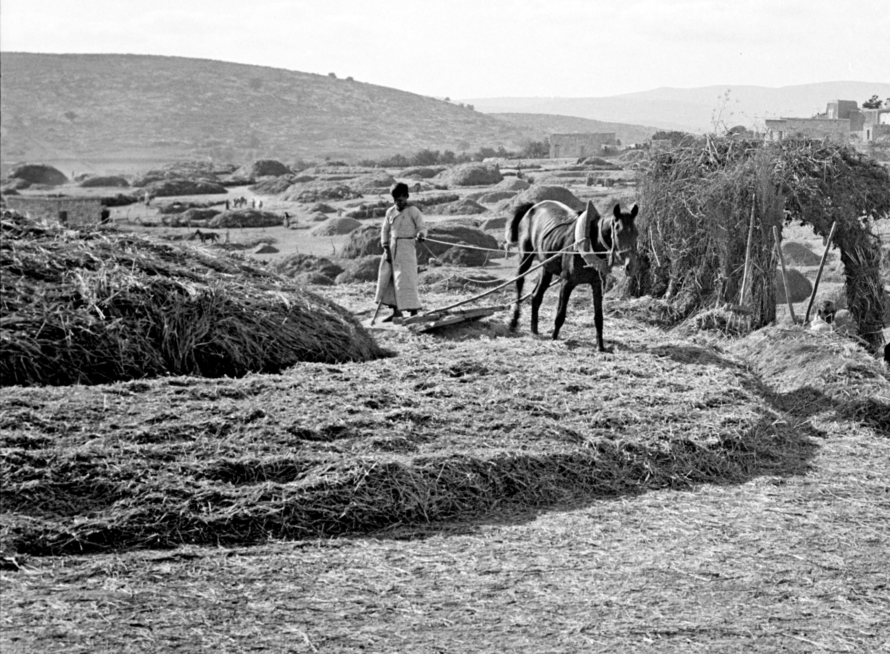
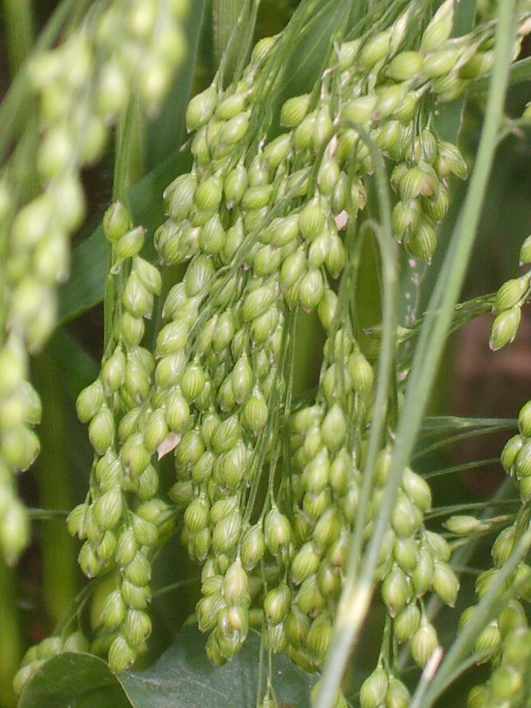
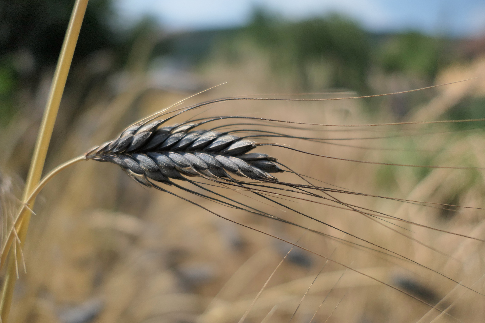

# Plants and Trees in the Bible

## License Information

Plants and Trees in the Bible © United Bible Societies, 2025. Adapted from: <cite>Each According to its Kind: Plants and Trees in the Bible</cite>, by Robert Koops © 2012 United Bible Societies. This work is licensed under Creative Commons Attribution-ShareAlike 4.0 International (<a href="https://creativecommons.org/licenses/by-sa/4.0/">https://creativecommons.org/licenses/by-sa/4.0/</a>).

--------------------------------

## Grain (id: FLORA:3.1)

3\.1 Grain
==========

At least four types of grain are mentioned in the Bible: barley, millet, sorghum, and wheat. In addition to these types of grain, Hebrew words for things such as “threshing floor,” “sickle,” and “winnow” attest to the prominence of grain in the life of the ancient Israelites.
------------------------------------------------------------------------------------------------------------------------------------------------------------------------------------------------------------------------------------------------------------------------------------

Hebrew דָּגָן (dagan)

[GEN 27:28](https://ref.ly/Gen27:28), [GEN 27:37](https://ref.ly/Gen27:37), [NUM 18:12](https://ref.ly/Num18:12), [NUM 18:27](https://ref.ly/Num18:27), [DEU 7:13](https://ref.ly/Deut7:13), [DEU 11:14](https://ref.ly/Deut11:14), [DEU 12:17](https://ref.ly/Deut12:17), [DEU 14:23](https://ref.ly/Deut14:23), [DEU 18:4](https://ref.ly/Deut18:4), [DEU 28:51](https://ref.ly/Deut28:51), [DEU 33:28](https://ref.ly/Deut33:28), [2KI 18:32](https://ref.ly/2Kgs18:32), [2CH 31:5](https://ref.ly/2Chr31:5), [2CH 32:28](https://ref.ly/2Chr32:28), [NEH 5:2](https://ref.ly/Neh5:2), [NEH 5:3](https://ref.ly/Neh5:3), [NEH 5:10](https://ref.ly/Neh5:10), [NEH 5:11](https://ref.ly/Neh5:11), [NEH 10:40](https://ref.ly/Neh10:40), [NEH 13:5](https://ref.ly/Neh13:5), [NEH 13:12](https://ref.ly/Neh13:12), [PSA 4:8](https://ref.ly/Ps4:8), [PSA 65:10](https://ref.ly/Ps65:10), [PSA 78:24](https://ref.ly/Ps78:24), [ISA 36:17](https://ref.ly/Isa36:17), [ISA 62:8](https://ref.ly/Isa62:8), [JER 31:12](https://ref.ly/Jer31:12), [LAM 2:12](https://ref.ly/Lam2:12), [EZK 36:29](https://ref.ly/Ezek36:29), [HOS 2:10](https://ref.ly/Hos2:10), [HOS 2:11](https://ref.ly/Hos2:11), [HOS 2:24](https://ref.ly/Hos2:24), [HOS 7:14](https://ref.ly/Hos7:14), [HOS 9:1](https://ref.ly/Hos9:1), [HOS 14:8](https://ref.ly/Hos14:8), [JOL 1:10](https://ref.ly/Joel1:10), [JOL 1:17](https://ref.ly/Joel1:17), [JOL 2:19](https://ref.ly/Joel2:19), [HAG 1:11](https://ref.ly/Hag1:11), [ZEC 9:17](https://ref.ly/Zech9:17)

Hebrew בַּר (bar)

[GEN 41:35](https://ref.ly/Gen41:35), [GEN 41:49](https://ref.ly/Gen41:49), [GEN 42:3](https://ref.ly/Gen42:3), [GEN 42:25](https://ref.ly/Gen42:25), [GEN 45:23](https://ref.ly/Gen45:23), [PSA 65:14](https://ref.ly/Ps65:14), [PSA 72:16](https://ref.ly/Ps72:16), [PRO 11:26](https://ref.ly/Prov11:26), [PRO 14:4](https://ref.ly/Prov14:4), [JER 23:28](https://ref.ly/Jer23:28), [JOL 2:24](https://ref.ly/Joel2:24), [AMO 5:11](https://ref.ly/Amos5:11), [AMO 8:5](https://ref.ly/Amos8:5), [AMO 8:6](https://ref.ly/Amos8:6)

Hebrew שֶׁבֶר (shever)

[GEN 42:1](https://ref.ly/Gen42:1), [GEN 42:2](https://ref.ly/Gen42:2), [GEN 42:19](https://ref.ly/Gen42:19), [GEN 42:26](https://ref.ly/Gen42:26), [GEN 43:2](https://ref.ly/Gen43:2), [GEN 44:2](https://ref.ly/Gen44:2), [GEN 47:14](https://ref.ly/Gen47:14), [NEH 10:32](https://ref.ly/Neh10:32), [AMO 8:5](https://ref.ly/Amos8:5)

Hebrew קָמָה (qamah)

[EXO 22:5](https://ref.ly/Exod22:5), [DEU 16:9](https://ref.ly/Deut16:9), [DEU 23:26](https://ref.ly/Deut23:26), [DEU 23:26](https://ref.ly/Deut23:26), [JDG 15:5](https://ref.ly/Judg15:5), [JDG 15:5](https://ref.ly/Judg15:5), [2KI 19:26](https://ref.ly/2Kgs19:26), [ISA 17:5](https://ref.ly/Isa17:5), [ISA 37:27](https://ref.ly/Isa37:27), [HOS 8:7](https://ref.ly/Hos8:7)

Hebrew גָּדִישׁ (gadish)

[EXO 22:5](https://ref.ly/Exod22:5), [JDG 15:5](https://ref.ly/Judg15:5), [JOB 5:26](https://ref.ly/Job5:26)

Hebrew אָבִיב (’aviv)

[EXO 9:31](https://ref.ly/Exod9:31), [LEV 2:14](https://ref.ly/Lev2:14)

Hebrew שִׁבֹּלֶת (shiboleth)

[GEN 41:5](https://ref.ly/Gen41:5), [GEN 41:6](https://ref.ly/Gen41:6), [GEN 41:7](https://ref.ly/Gen41:7), [GEN 41:7](https://ref.ly/Gen41:7), [GEN 41:22](https://ref.ly/Gen41:22), [GEN 41:23](https://ref.ly/Gen41:23), [GEN 41:24](https://ref.ly/Gen41:24), [GEN 41:24](https://ref.ly/Gen41:24), [GEN 41:26](https://ref.ly/Gen41:26), [GEN 41:27](https://ref.ly/Gen41:27), [RUT 2:2](https://ref.ly/Ruth2:2), [JOB 24:24](https://ref.ly/Job24:24), [ISA 17:5](https://ref.ly/Isa17:5), [ISA 17:5](https://ref.ly/Isa17:5)

Hebrew כַּרְמֶל (karmel)

[LEV 2:14](https://ref.ly/Lev2:14), [LEV 23:14](https://ref.ly/Lev23:14), [2KI 4:42](https://ref.ly/2Kgs4:42)

Hebrew גֶּרֶשׂ (geres)

[LEV 2:14](https://ref.ly/Lev2:14), [LEV 2:16](https://ref.ly/Lev2:16)

KJV (King James Version (1611)), REB (Revised English Bible (1989)), and some other versions, following British usage, use “corn” as a generic term to cover crops such as wheat and barley, while RSV (Revised Standard Version (1952)), the New King James Version (NKJV (New King James Version (1982))), and many other versions, following American usage, use “grain” as the generic term. Versions such as GNB (Good News Bible) have British editions and American editions that accommodate to the different usages. Although maize as we know it now did not exist in Bible times, we may need to refer to it as a species, and we will call it “maize,” following the British tradition, and use “grain” as the generic term, following American usage.

Generic words can cause problems for a translator. In [GEN 1:11](https://ref.ly/Gen1:11); [GEN 1:12](https://ref.ly/Gen1:12) we find the Hebrew phrase *‘esev mazri‘a zera‘* (“plants yielding seed”) standing in contrast to the phrase *‘ets peri ‘oseh peri* (“fruit trees bearing fruit”). Some English versions take “plants yielding seed” as referring to “grain” (GNB (Good News Bible), CEV (Contemporary English Version), NCV (New Century Version)), whereas others use broader expressions such as “seed\-bearing plants” (NIV (New International Version (1984)), NJB (New Jerusalem Bible (1985)), NJPSV (New Jewish Publication Society Version)) or “plants that bear seed” (REB (Revised English Bible (1989))). The writer of Genesis may be using a traditional Hebrew plant taxonomy that divides useful flora into two categories, namely seed\-bearing plants and fruit\-bearing plants. If so, translators should try to render “plants yielding seed” with an expression that includes more species than just the grains. After all, onions, beans, peas, melons, and other plants bear seeds, as well as grain.

The Hebrew word *dagan* occurs forty times in the Old Testament (for example, [GEN 27:28](https://ref.ly/Gen27:28), [GEN 27:37](https://ref.ly/Gen27:37); [NUM 18:12](https://ref.ly/Num18:12), [NUM 18:27](https://ref.ly/Num18:27); [DEU 7:13](https://ref.ly/Deut7:13); [DEU 11:14](https://ref.ly/Deut11:14)), and it is often translated “grain.” However, in Bible times the word *dagan* included peas, beans, lentils, and cumin as well as what we normally call “grain” from grasses or cereals. In these forty references *dagan* is paired with the Hebrew word *tirosh* (“grape harvest”) in all but ten. The Hebrew word *yitshar* (“newly pressed oil”) is mentioned in twenty of them. All three words include the concept of “newly harvested.” They express the idea of “produce of the land,” as when Isaac blesses Jacob ([GEN 27:28](https://ref.ly/Gen27:28)):

May God give you of the dew of heaven,

and of the fatness of the earth,

and plenty of *dagan* \[farm produce] and *tirosh* \[vineyard produce].

The Old Testament has many other Hebrew words and phrases that refer to grain. Since these generic terms can cause problems for translators, we will consider them one by one:

*Bar*: This word can refer to grain on a threshing floor ([JOL 2:24](https://ref.ly/Joel2:24)) or to grain that is stored ([GEN 41:35](https://ref.ly/Gen41:35)). It is used to refer to kernels of grain in contrast to chaff in [JER 23:28](https://ref.ly/Jer23:28).

*Shever*: In [GEN 42:1](https://ref.ly/Gen42:1); [GEN 42:2](https://ref.ly/Gen42:2) Jacob hears about *shever* in Egypt. In this passage the word is quite general, almost equivalent to “food.” In [NEH 10:32](https://ref.ly/Neh10:32) (31\) Nehemiah forbids the sale of *shever* on the Sabbath. In [AMO 8:5](https://ref.ly/Amos8:5) the prophet warns about cheating on the sale of *shever* (parallel to *bar*).

*Qamah*: In [JDG 15:5](https://ref.ly/Judg15:5) Samson burns the *qamah* (“ripe, uncut grain plants”) as well as the *gadish* (“sheaves”) in the fields of the Philistines. English versions usually render *qamah* as “standing grain.” The Arabic word for wheat is *al\-kama*, so it may have been wheat that the Philistines grew in the Sorek Valley.

*Gadish* refers to sheaves.

*’Aviv* refers to newly formed ears of grain.

*Shiboleth* refers to ears of grain. In [RUT 2:2](https://ref.ly/Ruth2:2) Ruth gleans the stalks of ripe barley that the harvesters leave behind. In the Egyptian king’s dream ([GEN 41:5](https://ref.ly/Gen41:5); [GEN 41:6](https://ref.ly/Gen41:6); [GEN 41:7](https://ref.ly/Gen41:7); [GEN 41:7](https://ref.ly/Gen41:7)) the ears of grain are presumably wheat.

*Karmel* refers to fresh ears of grain. In [LEV 2:14](https://ref.ly/Lev2:14) the ears of grain are probably wheat, which were roasted and brought for the firstfruits offering. The prophet Elisha received a gift of fresh ears of grain ([2KI 4:42](https://ref.ly/2Kgs4:42)).

*Geres* refers to crushed grain.
--------------------------------

Hebrew קלה, קָלִי (qalah, qali)

[LEV 23:14](https://ref.ly/Lev23:14), [JOS 5:11](https://ref.ly/Josh5:11), [RUT 2:14](https://ref.ly/Ruth2:14), [1SA 17:17](https://ref.ly/1Sam17:17), [1SA 25:18](https://ref.ly/1Sam25:18), [2SA 17:28](https://ref.ly/2Sam17:28), [2SA 17:28](https://ref.ly/2Sam17:28)

Hebrew עֲבוּר (‘avur)

[JOS 5:11](https://ref.ly/Josh5:11), [JOS 5:12](https://ref.ly/Josh5:12)

Hebrew בְּלִיל (belil)

[JOB 6:5](https://ref.ly/Job6:5), [JOB 24:6](https://ref.ly/Job24:6), [ISA 30:24](https://ref.ly/Isa30:24)

Hebrew רִיפוֹת (rifoth)

[2SA 17:19](https://ref.ly/2Sam17:19), [PRO 27:22](https://ref.ly/Prov27:22)

*Qalah* /*qali* refers to roasted, dried, or baked kernels of grain.

*‘Avur*: RSV (Revised Standard Version (1952)) renders *‘avur* as “produce” in [JOS 5:11](https://ref.ly/Josh5:11); [JOS 5:12](https://ref.ly/Josh5:12), but *A Handbook on The Book of Joshua* translates it as “grain (barley).”

*Belil*: According to [JOB 24:6](https://ref.ly/Job24:6), wild donkeys scavenge for *belil* (“food”) for their young.

*Rifoth*: In [2SA 17:19](https://ref.ly/2Sam17:19) a woman scatters *rifoth* (“grain”) on a mat over a well hiding two men. [PRO 27:22](https://ref.ly/Prov27:22) says “Crush a fool in a mortar with a pestle, along with crushed grain \[*rifoth* ], yet his folly will not depart from him.”
-----------------------------------------------------------------------------------------------------------------------------------------------------------------------------------------------------------------------------------------------------------------------------------------------

Hebrew לֶחֶם (lechem)

[ISA 28:28](https://ref.ly/Isa28:28), [ISA 30:23](https://ref.ly/Isa30:23)

Hebrew זֶרַע (zera‘)

[NUM 20:5](https://ref.ly/Num20:5), [1SA 8:15](https://ref.ly/1Sam8:15), [JOB 39:12](https://ref.ly/Job39:12), [ISA 23:3](https://ref.ly/Isa23:3)

*Lechem* is normally translated “bread,” but RSV (Revised Standard Version (1952)) appropriately renders it “bread grain” in [ISA 28:28](https://ref.ly/Isa28:28) and “grain” in [ISA 30:23](https://ref.ly/Isa30:23).

*Zera‘* is literally “sowing” or “seed,” but it means “grain” in [NUM 20:5](https://ref.ly/Num20:5); [1SA 8:15](https://ref.ly/1Sam8:15); [JOB 39:12](https://ref.ly/Job39:12); [ISA 23:3](https://ref.ly/Isa23:3).

The New Testament and Deuterocanon also have their share of generic Greek words for grain:
------------------------------------------------------------------------------------------

Greek καρπός (karpos)

[MAT 13:8](https://ref.ly/Matt13:8), [MAT 13:26](https://ref.ly/Matt13:26), [MRK 4:7](https://ref.ly/Mark4:7), [MRK 4:8](https://ref.ly/Mark4:8)

Greek κόκκος (kokkos)

[MAT 13:31](https://ref.ly/Matt13:31), [MAT 17:20](https://ref.ly/Matt17:20), [MRK 4:31](https://ref.ly/Mark4:31), [LUK 13:19](https://ref.ly/Luke13:19), [LUK 17:6](https://ref.ly/Luke17:6), [JHN 12:24](https://ref.ly/John12:24), [1CO 15:37](https://ref.ly/1Cor15:37)

Greek σπόριμος (sporimos)

[MAT 12:1](https://ref.ly/Matt12:1), [MRK 2:23](https://ref.ly/Mark2:23), [LUK 6:1](https://ref.ly/Luke6:1)

*Karpos* is literally “fruit,” but the context of [MAT 13:8](https://ref.ly/Matt13:8), [MAT 13:26](https://ref.ly/Matt13:26) and [MRK 4:7](https://ref.ly/Mark4:7); [MRK 4:8](https://ref.ly/Mark4:8) indicates wheat or barley, and the natural equivalent is “grain” in English.

*Kokkos* refers to kernels or seeds of grain.

*Sporimos* is based on the Greek verb meaning “sow.” It clearly refers to fields of wheat or barley.
----------------------------------------------------------------------------------------------------

Greek στάχυς (stachus)

[MAT 12:1](https://ref.ly/Matt12:1), [MRK 2:23](https://ref.ly/Mark2:23), [MRK 4:28](https://ref.ly/Mark4:28), [MRK 4:28](https://ref.ly/Mark4:28), [LUK 6:1](https://ref.ly/Luke6:1)

*Stachus* refers to the grain heads of wheat or barley.
-------------------------------------------------------

Greek ἄλφιτον (alfiton)

[JDT 10:5](https://ref.ly/Jdt10:5)

Greek σπέρμα (sperma)

[MAT 13:24](https://ref.ly/Matt13:24), [MAT 13:27](https://ref.ly/Matt13:27), [MAT 13:32](https://ref.ly/Matt13:32), [MAT 13:37](https://ref.ly/Matt13:37), [MAT 13:38](https://ref.ly/Matt13:38), [1CO 15:38](https://ref.ly/1Cor15:38)

Greek σπορά (spora)

[1MA 10:30](https://ref.ly/1Macc10:30)

*Alfiton* refers to roasted, dried, or baked kernels of grain. RSV (Revised Standard Version (1952)) render it “parched grain.” This is what Ruth had for lunch (Hebrew *qali*) when she gleaned in Boaz’s field. *Alfiton* is found in the Septuagint of [RUT 2:14](https://ref.ly/Ruth2:14); [1SA 25:18](https://ref.ly/1Sam25:18); [2SA 17:28](https://ref.ly/2Sam17:28); [JDT 10:5](https://ref.ly/Jdt10:5).

*Sperma* refers to a single kernal of grain, or more generically, a seed.

*Spora* refers to “grain harvest” (GNB (Good News Bible)).
----------------------------------------------------------

Greek σπόρος (sporos)

[MRK 4:26](https://ref.ly/Mark4:26), [MRK 4:27](https://ref.ly/Mark4:27), [LUK 8:5](https://ref.ly/Luke8:5), [LUK 8:11](https://ref.ly/Luke8:11), [2CO 9:10](https://ref.ly/2Cor9:10), [2CO 9:10](https://ref.ly/2Cor9:10), [SIR 40:22](https://ref.ly/Sir40:22)

*Sporos* in [SIR 40:22](https://ref.ly/Sir40:22) refers specifically to the sprouting of seeds, and in Sirach the reference may be to the sprouting of grain in the spring (so REB (Revised English Bible (1989)), NJB (New Jerusalem Bible (1985))), but some translators take it more generally to mean the sprouting of flowers (so NAB (New American Bible (1970))).

There are also several generic Latin words for grain in 2 Esdras:
-----------------------------------------------------------------

*Frumentum* ([2ES 15:42](https://ref.ly/2Esd15:42)) refers to grain harvest like the Greek word *spora*. RSV (Revised Standard Version (1952)) renders it “grain,” and REB (Revised English Bible (1989)) is more generic with “crops.”

*Granum* in [2ES 4:30](https://ref.ly/2Esd4:30); [2ES 4:31](https://ref.ly/2Esd4:31) refers to grain in general.

*Semen*: In [2ES 8:43](https://ref.ly/2Esd8:43); [2ES 4:31](https://ref.ly/2Esd4:31); [2ES 4:32](https://ref.ly/2Esd4:32) *semen* refers to a single kernel of grain, equivalent to *zera‘* in Hebrew and *sperma* in Greek (as in [MAT 13:24](https://ref.ly/Matt13:24)).

In [DEU 28:22](https://ref.ly/Deut28:22) we read of grain being affected by “blight/blasting” (*shidafon* in Hebrew) and “mildew” (*yeraqon*). This pair of words also occurs in [1KI 8:37](https://ref.ly/1Kgs8:37); [2CH 6:28](https://ref.ly/2Chr6:28); [AMO 4:9](https://ref.ly/Amos4:9); [HAG 2:17](https://ref.ly/Hag2:17), where we find a litany of disasters that come upon the people. The Hebrew verb *shadaf* (“to blast”) occurs by itself in [GEN 41:6](https://ref.ly/Gen41:6); [GEN 41:23](https://ref.ly/Gen41:23); [GEN 41:27](https://ref.ly/Gen41:27), where it is explicitly associated with crops being blasted by the fierce, seasonal, hot wind from the desert. The cognate in Chaldean is *shadaf*, which means “scorched.” The Hebrew noun *shedefah* (“scorching”) occurs in [2KI 19:26](https://ref.ly/2Kgs19:26) (also in the emended text of [ISA 37:27](https://ref.ly/Isa37:27)), which says grass on a rooftop with very little soil is scorched before it can mature. (The cognate word in Arabic means “black.”) The Hebrew word *yeraqon* means “paleness” in [JER 30:6](https://ref.ly/Jer30:6), where it describes people’s faces, but elsewhere it refers to a fungus that keeps grain heads from developing properly.
--------------------------------------------------------------------------------------------------------------------------------------------------------------------------------------------------------------------------------------------------------------------------------------------------------------------------------------------------------------------------------------------------------------------------------------------------------------------------------------------------------------------------------------------------------------------------------------------------------------------------------------------------------------------------------------------------------------------------------------------------------------------------------------------------------------------------------------------------------------------------------------------------------------------------------------------------------------------------------------------------------------------------------------------------------------------------------------------------------------------------------------------------------------------------------------------------------------------------------------------------------------

*Threshing (Matson Collection (Wikimedia Commons))*

In addition to these technical words for grain, the Bible refers to grain in a number of places by the expression “out of/from … threshing floor” (for example, [DEU 15:14](https://ref.ly/Deut15:14)).

References to flour, or fine flour, for cereal offerings (also called meal or grain offerings; Hebrew *minchah*) would presumably refer to flour made from wheat, although barley flour was also used when wheat was scarce.

* **Associated Passages:** Genesis 27:28; Genesis 27:37; Numbers 18:12; Numbers 18:27; Deuteronomy 7:13; Deuteronomy 11:14; Deuteronomy 12:17; Deuteronomy 14:23; Deuteronomy 18:4; Deuteronomy 28:51; Deuteronomy 33:28; 2 Kings 18:32; 2 Chronicles 31:5; 2 Chronicles 32:28; Nehemiah 5:2; Nehemiah 5:3; Nehemiah 5:10; Nehemiah 5:11; Nehemiah 10:40; Nehemiah 13:5; Nehemiah 13:12; Psalms 4:8; Psalms 65:10; Psalms 78:24; Isaiah 36:17; Isaiah 62:8; Jeremiah 31:12; Lamentations 2:12; Ezekiel 36:29; Hosea 2:10; Hosea 2:11; Hosea 2:24; Hosea 7:14; Hosea 9:1; Hosea 14:8; Joel 1:10; Joel 1:17; Joel 2:19; Haggai 1:11; Zechariah 9:17; Genesis 41:35; Genesis 41:49; Genesis 42:3; Genesis 42:25; Genesis 45:23; Psalms 65:14; Psalms 72:16; Proverbs 11:26; Proverbs 14:4; Jeremiah 23:28; Joel 2:24; Amos 5:11; Amos 8:5; Amos 8:6; Genesis 42:1; Genesis 42:2; Genesis 42:19; Genesis 42:26; Genesis 43:2; Genesis 44:2; Genesis 47:14; Nehemiah 10:32; Exodus 22:5; Deuteronomy 16:9; Deuteronomy 23:26; Judges 15:5; 2 Kings 19:26; Isaiah 17:5; Isaiah 37:27; Hosea 8:7; Job 5:26; Exodus 9:31; Leviticus 2:14; Genesis 41:5; Genesis 41:6; Genesis 41:7; Genesis 41:22; Genesis 41:23; Genesis 41:24; Genesis 41:26; Genesis 41:27; Ruth 2:2; Job 24:24; Leviticus 23:14; 2 Kings 4:42; Leviticus 2:16; Joshua 5:11; Ruth 2:14; 1 Samuel 17:17; 1 Samuel 25:18; 2 Samuel 17:28; Joshua 5:12; Job 6:5; Job 24:6; Isaiah 30:24; 2 Samuel 17:19; Proverbs 27:22; Isaiah 28:28; Isaiah 30:23; Numbers 20:5; 1 Samuel 8:15; Job 39:12; Isaiah 23:3; Matthew 13:8; Matthew 13:26; Mark 4:7; Mark 4:8; Matthew 13:31; Matthew 17:20; Mark 4:31; Luke 13:19; Luke 17:6; John 12:24; 1 Corinthians 15:37; Matthew 12:1; Mark 2:23; Luke 6:1; Mark 4:28; Judith 10:5; Matthew 13:24; Matthew 13:27; Matthew 13:32; Matthew 13:37; Matthew 13:38; 1 Corinthians 15:38; 1 Maccabees 10:30; Mark 4:26; Mark 4:27; Luke 8:5; Luke 8:11; 2 Corinthians 9:10; Sirach 40:22; Genesis 1:11; Genesis 1:12; 2 Esdras (Latin) 15:42; 2 Esdras (Latin) 4:30; 2 Esdras (Latin) 4:31; 2 Esdras (Latin) 8:43; 2 Esdras (Latin) 4:32; Deuteronomy 28:22; 1 Kings 8:37; 2 Chronicles 6:28; Amos 4:9; Haggai 2:17; Jeremiah 30:6; Deuteronomy 15:14

* **Associated ACAI Concepts:** Grain (ID: `flora:Grain`); Wheat (ID: `flora:Wheat`)

## Barley (id: FLORA:3.1.1)

3\.1\.1 Barley
==============

References:
-----------

Hebrew שְׂעֹרָה (se‘orah)

[EXO 9:31](https://ref.ly/Exod9:31), [EXO 9:31](https://ref.ly/Exod9:31), [LEV 27:16](https://ref.ly/Lev27:16), [NUM 5:15](https://ref.ly/Num5:15), [DEU 8:8](https://ref.ly/Deut8:8), [JDG 7:13](https://ref.ly/Judg7:13), [RUT 1:22](https://ref.ly/Ruth1:22), [RUT 2:17](https://ref.ly/Ruth2:17), [RUT 2:23](https://ref.ly/Ruth2:23), [RUT 3:2](https://ref.ly/Ruth3:2), [RUT 3:15](https://ref.ly/Ruth3:15), [RUT 3:17](https://ref.ly/Ruth3:17), [2SA 14:30](https://ref.ly/2Sam14:30), [2SA 17:28](https://ref.ly/2Sam17:28), [2SA 21:9](https://ref.ly/2Sam21:9), [1KI 5:8](https://ref.ly/1Kgs5:8), [2KI 4:42](https://ref.ly/2Kgs4:42), [2KI 7:1](https://ref.ly/2Kgs7:1), [2KI 7:16](https://ref.ly/2Kgs7:16), [2KI 7:18](https://ref.ly/2Kgs7:18), [1CH 11:13](https://ref.ly/1Chr11:13), [2CH 2:9](https://ref.ly/2Chr2:9), [2CH 2:14](https://ref.ly/2Chr2:14), [2CH 27:5](https://ref.ly/2Chr27:5), [JOB 31:40](https://ref.ly/Job31:40), [ISA 28:25](https://ref.ly/Isa28:25), [JER 41:8](https://ref.ly/Jer41:8), [EZK 4:9](https://ref.ly/Ezek4:9), [EZK 4:12](https://ref.ly/Ezek4:12), [EZK 13:19](https://ref.ly/Ezek13:19), [EZK 45:13](https://ref.ly/Ezek45:13), [HOS 3:2](https://ref.ly/Hos3:2), [HOS 3:2](https://ref.ly/Hos3:2), [JOL 1:11](https://ref.ly/Joel1:11)

Greek κριθή (krithē)

[REV 6:6](https://ref.ly/Rev6:6), [JDT 8:2](https://ref.ly/Jdt8:2)

Greek κρίθινος (krithinos)

[JHN 6:9](https://ref.ly/John6:9), [JHN 6:13](https://ref.ly/John6:13)

Discussion:
-----------

*Barley head (T. Voekler (Wikimedia Commons))*

Barley *Hordeum distichum* or *Hordeum vulgare* is a type of grass like wheat and rice. It has been cultivated in the Middle East for thousands of years and is now one of the most prominent seed crops grown in the world. Twenty species are known, of which eight are European. Barley needs less rain than wheat does, so in the Holy Land it was typically found in the drier areas above the coastal plain and near the desert. From [2KI 7:1](https://ref.ly/2Kgs7:1) and [REV 6:6](https://ref.ly/Rev6:6) we know that barley was considered inferior to wheat and was often used to feed animals, as it is today. When the wheat supply ran out, people had to make their bread with barley. Barley was gathered before wheat, the harvest coming around March or April in the lower regions and in May in the mountains (see [EXO 9:31](https://ref.ly/Exod9:31); [2KI 4:42](https://ref.ly/2Kgs4:42)). In Egypt and in ancient Greece barley was used to make beer.

Description:
------------

*Barley seeds (Rasbak (Wikimedia Commons))*

Barley plants look like wheat or rice. They are less than 1 meter (3 feet) tall, and have a single head on each stalk, with six rows of kernels, although the biblical kind may have had only two rows. The head bends at a downward angle when it is ripe.

Special significance:
---------------------

In the story of Gideon and the Midianites in [JDG 7:13](https://ref.ly/Judg7:13), “a cake of barley” representing the (despised) Israelite army tumbles into the Midianite camp and knocks down the tent (representing the nomadic Midianites).

Translation:
------------

Barley is a plant of temperate zones, like Europe and the Near East; it does not grow well in the tropics. However, barley has been recently introduced along with wheat into many parts of the world for brewing beer and other malted drinks. It is also known to have grown in Korea as early as 1500 B.C. along with wheat and millet. It is becoming known in Malay as *barli*. Except for the reference in Judges, all references to barley in the Bible are non\-rhetorical, so unrelated cultural equivalents are discouraged. Some receptor language speakers may coin a name for it as in Malay, or the translator can use a transliteration from Hebrew (*se‘orah*), Latin (*horideyo*), or from a major language (for example, Arabic *sha‘ir*, Spanish *cebada*, French *orge*, Portuguese *cevada*, Swahili *shayiri*), together with a classifier, if there is one (for example, “grain of shayir”). One translation used “rice of baali” but ran into a problem: Rice is now imported to parts of West Africa from Bali. Not surprisingly, it is called “rice of Bali” and was confused with “rice of baali.”

[EXO 9:31](https://ref.ly/Exod9:31) reads “The flax and the barley were ruined, for the barley was in the ear and the flax was in bud.” The plants and developmental phases referred to here can be confusing if translated literally. Two possible ways to render this verse are:

1\. Use generic words plus a transliteration (for example, “grain of barli,” “plant of filas”), particularly in first half of the verse. The generic terms can be repeated optionally in the second half by saying “for the grain had already produced heads and the plants had flowers.”

2\. Identify the plants generically and then put the actual name in parentheses or in footnotes; for example, the whole verse may be rendered “The crops that were ripe (*barli*) and those that were budding (*filakis*) were destroyed.” (The Hebrew chiastic structure has been rearranged in this example.)

* **Associated Passages:** Exodus 9:31; Leviticus 27:16; Numbers 5:15; Deuteronomy 8:8; Judges 7:13; Ruth 1:22; Ruth 2:17; Ruth 2:23; Ruth 3:2; Ruth 3:15; Ruth 3:17; 2 Samuel 14:30; 2 Samuel 17:28; 2 Samuel 21:9; 1 Kings 5:8; 2 Kings 4:42; 2 Kings 7:1; 2 Kings 7:16; 2 Kings 7:18; 1 Chronicles 11:13; 2 Chronicles 2:9; 2 Chronicles 2:14; 2 Chronicles 27:5; Job 31:40; Isaiah 28:25; Jeremiah 41:8; Ezekiel 4:9; Ezekiel 4:12; Ezekiel 13:19; Ezekiel 45:13; Hosea 3:2; Joel 1:11; Revelation 6:6; Judith 8:2; John 6:9; John 6:13

* **Associated ACAI Concepts:** Barley (ID: `flora:Barley`)

## Millet (id: FLORA:3.1.2)

3\.1\.2 Millet
==============

References:
-----------

Hebrew דֹּחַן (dochan)

[EZK 4:9](https://ref.ly/Ezek4:9)

Hebrew פַּנַּג (pannag)

[EZK 27:17](https://ref.ly/Ezek27:17)

Discussion:
-----------

*Millet (Dalgial (Wikimedia Commons))*

To illustrate the siege of Jerusalem, Ezekiel is instructed to make a loaf of bread out of wheat, barley, beans, lentils, millet (*dochan* in Hebrew), and spelt in [EZK 4:9](https://ref.ly/Ezek4:9). In Arabic millet is called *dukhn* or *dochna*, suggesting that the Hebrew word *dochan* could indeed be millet. Some scholars believe that Millet *Panicum miliaceum* or *Panicum callosum* was first domesticated in Ethiopia, but others say in India or the East Indies. From one of those places it was carried into Mesopotamia around 3000 B.C. If that is so, it may have been known to the people of Israel during their stay in Egypt as well as after the conquest of Canaan. Zohary implies that *dochan* was either millet or sorghum (see [3\.1\.3 Sorghum (durra)](#FLORA:3.1.3)). In [EZK 27:17](https://ref.ly/Ezek27:17) a reference is made to *pannag*, which Moldenke takes as possibly referring to millet, on the basis of the fact that in Syriac *pannag* refers to millet. However, Hepper says that neither millet nor sorghum reached the Mediterranean area before the Christian era, making it unlikely that *dochan* or *pannag* refer to either millet or sorghum.

Today millet is used throughout the world for porridge, alcoholic beverages, and as animal food. It is not good for bread, which may be significant in the incident mentioned in [EZK 4:9](https://ref.ly/Ezek4:9).

Description:
------------

If indeed millet was grown at all in Old Testament times, it would have been a short variety less than 1 meter (3 feet) in height. It has a single head on a stalk, with many tiny seeds, so the Latin name is *miliaceum* (“million seeds”).

Translation:
------------

There are six hundred kinds of *Panicum* species growing in the warm and tropical zones of the world, many of them domesticated, and two in Europe. Translators who do not have a local word for millet will need to use a transliteration from a major language, for example, French *millet*, Portuguese *miliyo*, and Spanish *mijo*. Since the references to millet are part of lists in non\-rhetorical contexts, there is no need to look for a cultural equivalent.

* **Associated Passages:** Ezekiel 4:9; Ezekiel 27:17

* **Associated ACAI Concepts:** Millet (ID: `flora:Millet`)

## Sorghum (durra) (id: FLORA:3.1.3)

3\.1\.3 Sorghum (durra)
=======================

Reference:”
-----------

Hebrew דֹּחַן (dochan)

[EZK 4:9](https://ref.ly/Ezek4:9)

Discussion:
-----------

*Sorghum (durra) (1\) (© Christian Fisher (Wikimedia Commons))*

*Sorghum vulgare* or *Sorghum bicolor* (known in West Africa as guinea corn or kint) may have originated in northeastern Africa (probably Sudan) and been carried through southwestern Asia to India as early as 2000 B.C. If so, it could have been known to the Israelites at the time of the conquest, and could be the *dochan* of [EZK 4:9](https://ref.ly/Ezek4:9) (see [3\.1\.2 Millet](#FLORA:3.1.2)). According to Hepper, sorghum was only introduced into the Holy Land around the time of Christ, so the word *dochan* cannot refer to it. It has also been suggested that *dochan* refers to the “reed” (see [5\.1\.4 Reed (common reed, giant reed)](#FLORA:5.1.4)).

Sorghum is now the world’s fourth most important cereal after wheat, rice, and maize. It is used not only for food, but also for the sweet juice from its stalk, and for brooms and brushes.

Description:
------------

*Sorghum head (2\) (Larry Rana, USDA)*

The early kinds of sorghum, though taller than wheat, barley or millet, would have been little more than 1–2 meters (3–7 feet) in height. Since then, kinds of sorghum have been developed that reach 5 meters (17 feet). These are especially popular in rural Africa, where the long stalks are used for roofs and fences.

Translation:
------------

*Sorghum head (3\) (Bob Nichols, USDA)*

Since we are unsure of the identity of the plant called *dochan*, it seems unwise to use a species name for it. It is better to transliterate this term. However, if sorghum is found to be accurate, translators in Africa should know that sorghum is also called guinea corn, durra, dari, and jowar (Hausa *dawa*, Arabic *hhash*, French *sorgo*, Mandinka *kintoo*, Swahili *mkota*). In China it is called *kaolang*. In the United States it is sometimes called milo or broom corn.

* **Associated Passages:** Ezekiel 4:9

* **Associated ACAI Concepts:** Sorghum (ID: `flora:Sorghum`); Millet (ID: `flora:Millet`)

## Wheat (id: FLORA:3.1.4)

3\.1\.4 Wheat
=============

References:
-----------

Hebrew חִטָּה (chittah)

[GEN 30:14](https://ref.ly/Gen30:14), [EXO 9:32](https://ref.ly/Exod9:32), [EXO 29:2](https://ref.ly/Exod29:2), [EXO 34:22](https://ref.ly/Exod34:22), [DEU 8:8](https://ref.ly/Deut8:8), [DEU 32:14](https://ref.ly/Deut32:14), [JDG 6:11](https://ref.ly/Judg6:11), [JDG 15:1](https://ref.ly/Judg15:1), [RUT 2:23](https://ref.ly/Ruth2:23), [1SA 6:13](https://ref.ly/1Sam6:13), [1SA 12:17](https://ref.ly/1Sam12:17), [2SA 4:6](https://ref.ly/2Sam4:6), [2SA 17:28](https://ref.ly/2Sam17:28), [1KI 5:25](https://ref.ly/1Kgs5:25), [1CH 21:20](https://ref.ly/1Chr21:20), [1CH 21:23](https://ref.ly/1Chr21:23), [2CH 2:9](https://ref.ly/2Chr2:9), [2CH 2:14](https://ref.ly/2Chr2:14), [2CH 27:5](https://ref.ly/2Chr27:5), [JOB 31:40](https://ref.ly/Job31:40), [PSA 81:17](https://ref.ly/Ps81:17), [PSA 147:14](https://ref.ly/Ps147:14), [SNG 7:3](https://ref.ly/Song7:3), [ISA 28:25](https://ref.ly/Isa28:25), [JER 12:13](https://ref.ly/Jer12:13), [JER 41:8](https://ref.ly/Jer41:8), [EZK 4:9](https://ref.ly/Ezek4:9), [EZK 27:17](https://ref.ly/Ezek27:17), [EZK 45:13](https://ref.ly/Ezek45:13), [JOL 1:11](https://ref.ly/Joel1:11)

Aramaic חִנְטִי? (chintan)

[EZR 6:9](https://ref.ly/Ezra6:9), [EZR 7:22](https://ref.ly/Ezra7:22)

Hebrew כֻּסֶּמֶת (kusemeth)

[EXO 9:32](https://ref.ly/Exod9:32), [ISA 28:25](https://ref.ly/Isa28:25), [EZK 4:9](https://ref.ly/Ezek4:9)

Greek πυρός (puros)

[JDT 2:27](https://ref.ly/Jdt2:27), [JDT 3:3](https://ref.ly/Jdt3:3), [SIR 39:26](https://ref.ly/Sir39:26), [1ES 6:29](https://ref.ly/1Esd6:29), [1ES 8:20](https://ref.ly/1Esd8:20)

Greek σιτίον (sition)

[ACT 7:12](https://ref.ly/Acts7:12)

Greek σῖτος (sitos)

[MAT 3:12](https://ref.ly/Matt3:12), [MAT 13:25](https://ref.ly/Matt13:25), [MAT 13:29](https://ref.ly/Matt13:29), [MAT 13:30](https://ref.ly/Matt13:30), [MRK 4:28](https://ref.ly/Mark4:28), [LUK 3:17](https://ref.ly/Luke3:17), [LUK 12:18](https://ref.ly/Luke12:18), [LUK 16:7](https://ref.ly/Luke16:7), [LUK 22:31](https://ref.ly/Luke22:31), [JHN 12:24](https://ref.ly/John12:24), [ACT 27:38](https://ref.ly/Acts27:38), [1CO 15:37](https://ref.ly/1Cor15:37), [REV 6:6](https://ref.ly/Rev6:6), [REV 18:13](https://ref.ly/Rev18:13), [TOB 1:7](https://ref.ly/Tob1:7), [JDT 11:13](https://ref.ly/Jdt11:13), [1MA 8:26](https://ref.ly/1Macc8:26), [1MA 8:28](https://ref.ly/1Macc8:28)

Discussion:
-----------

*Wheat in field (Bluemoose (Wikimedia Commons))*

Two kinds of wild wheat have grown in the open deciduous oak woodland in the northern part of the Fertile Crescent for several thousand years: Einkorn Wheat *Triticum monococcum* and Emmer Wheat *Triticum dicoccum*. Both came into cultivation together with barley. Just before the time of the Romans, the Naked Bread Wheat or Hard Wheat *Triticum durum* started replacing the hulled varieties. This then became the favorite type of wheat for bread and macaroni. Spelt is a submember of the *Triticum aestivum* species. Unfortunately, according to one dictionary, spelt is also used as a local name for emmer wheat.

In RSV (Revised Standard Version (1952)) and some other versions, the generic Hebrew word *bar* has been rendered “wheat” in [JER 23:28](https://ref.ly/Jer23:28); [AMO 5:11](https://ref.ly/Amos5:11); [AMO 8:5](https://ref.ly/Amos8:5); [AMO 8:6](https://ref.ly/Amos8:6). This is legitimate, since the grain referred to by *bar* was probably wheat. However, it might be better to say “grain” in these passages.

The most important early wheat for the Israelites was emmer, probably the only wheat known in Egypt, and referred to in Hebrew as *chittah*. However, according to Hepper, the seven\-headed wheat of the Egyptian king’s dream ([GEN 41:5](https://ref.ly/Gen41:5); [GEN 41:6](https://ref.ly/Gen41:6); [GEN 41:7](https://ref.ly/Gen41:7)) suggests that there may also have been *Triticum turgidum* (rivet wheat) in the emmer group. The Hebrew word *kusemeth* probably refers to a type of emmer wheat that the Egyptians called *swt*. KJV (King James Version (1611)) renders *kusemeth* as “rye” in [EXO 9:32](https://ref.ly/Exod9:32) and [ISA 28:25](https://ref.ly/Isa28:25) (24\), but this is not correct since rye is a European grain that was not known in Israel in Bible times.

Description:
------------

*Wheat head (Magnus Hagdorn (Wikimedia Commons))*

Wheat is a type of grass like rice and barley, growing to around 75 centimeters (2\.5 feet) in height and having a head with many small grains in rows.

Special significance:
---------------------

Bread made from wheat was the staple food for the people of ancient Israel, so God punished them by breaking “the staff of bread” (see, for example, [EZK 4:16](https://ref.ly/Ezek4:16)).

Translation:
------------

If wheat is unfamiliar, translators can transliterate from a major language in non\-rhetorical contexts (for example, English *witi*, Portuguese *trigo*, French *ble* or *froment*, Swahili *ngano*, Arabic *kama* /*alkama*). The transliteration may add a generic tag such as “grain.” The New Testament passages are mostly rhetorical, opening the possibility for a metaphorical equivalent.

[EXO 9:32](https://ref.ly/Exod9:32); [EXO 9:32](https://ref.ly/Exod9:32): “But the wheat and the spelt were not ruined, for they are late in coming up.” In this verse RSV (Revised Standard Version (1952)), NIV (New International Version (1984)), NLT (New Living Translation), NJB (New Jerusalem Bible (1985)), and NAB (New American Bible (1970)) render the Hebrew words *chittah* as “wheat” and *kusemeth* as “spelt.” REB (Revised English Bible (1989)) has “wheat” and “vetches.” Zohary and Hepper both say that rendering “spelt” as *kusemeth* is erroneous. *Chittah* and *kusemeth* are simply two kinds of wheat. *Chittah* was the more valued because it was easier to harvest. *Kusemeth* was still useful since it could grow in drier and less fertile areas.

In this verse GNB (Good News Bible) combines *chittah* and *kusemeth* as “wheat.” CEV (Contemporary English Version) is similar with “wheat crops,” and so is NCV (New Century Version) with “wheat crops.” Following the lead of our suggestion for barley and flax in the previous verse (see [3\.1\.1 Barley](#FLORA:3.1.1)), this verse may be rendered “but the crops that ripen later, that is, different kinds of witi, were not spoiled.” A transliteration of the Hebrew word *kusemeth* is also possible. This word may also be rendered “bush wheat” or “upland wheat” on the analogy of “upland rice.”

For “flour,” the food product resulting from grinding wheat, see [9\.4 Bread](#REALIA:9.4).

* **Associated Passages:** Genesis 30:14; Exodus 9:32; Exodus 29:2; Exodus 34:22; Deuteronomy 8:8; Deuteronomy 32:14; Judges 6:11; Judges 15:1; Ruth 2:23; 1 Samuel 6:13; 1 Samuel 12:17; 2 Samuel 4:6; 2 Samuel 17:28; 1 Kings 5:25; 1 Chronicles 21:20; 1 Chronicles 21:23; 2 Chronicles 2:9; 2 Chronicles 2:14; 2 Chronicles 27:5; Job 31:40; Psalms 81:17; Psalms 147:14; Song of Songs 7:3; Isaiah 28:25; Jeremiah 12:13; Jeremiah 41:8; Ezekiel 4:9; Ezekiel 27:17; Ezekiel 45:13; Joel 1:11; Ezra 6:9; Ezra 7:22; Judith 2:27; Judith 3:3; Sirach 39:26; 1 Esdras (Greek) 6:29; 1 Esdras (Greek) 8:20; Acts 7:12; Matthew 3:12; Matthew 13:25; Matthew 13:29; Matthew 13:30; Mark 4:28; Luke 3:17; Luke 12:18; Luke 16:7; Luke 22:31; John 12:24; Acts 27:38; 1 Corinthians 15:37; Revelation 6:6; Revelation 18:13; Tobit 1:7; Judith 11:13; 1 Maccabees 8:26; 1 Maccabees 8:28; Jeremiah 23:28; Amos 5:11; Amos 8:5; Amos 8:6; Genesis 41:5; Genesis 41:6; Genesis 41:7; Ezekiel 4:16

* **Associated ACAI Concepts:** Wheat (ID: `flora:Wheat`)
