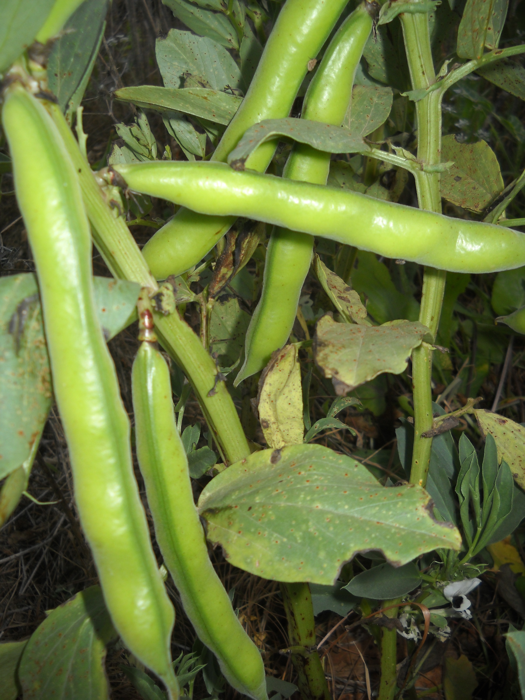
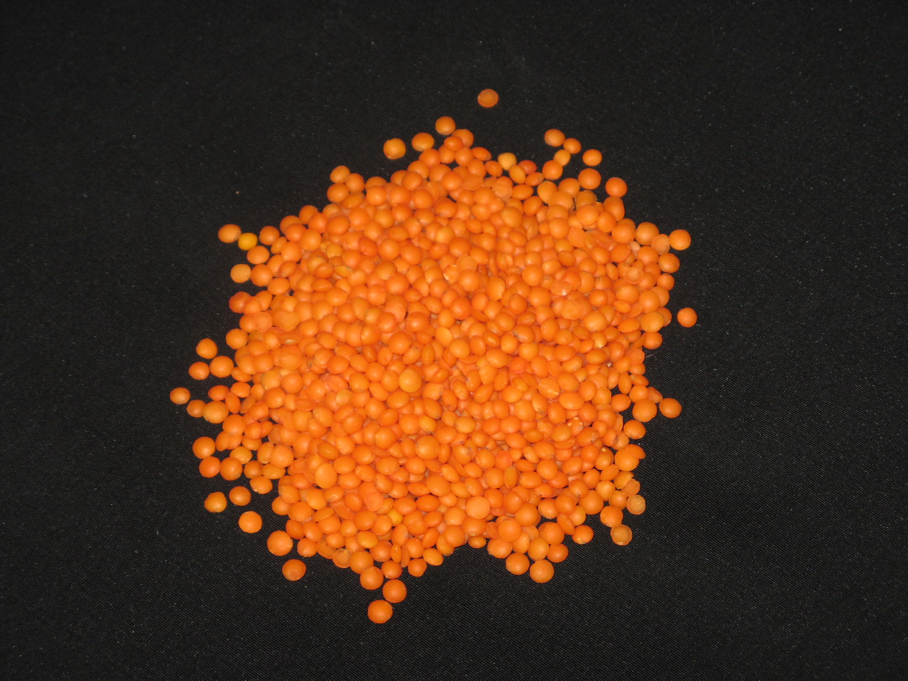

# Plants and Trees in the Bible

## License Information

Plants and Trees in the Bible © United Bible Societies, 2025. Adapted from: <cite>Each According to its Kind: Plants and Trees in the Bible</cite>, by Robert Koops © 2012 United Bible Societies. This work is licensed under Creative Commons Attribution-ShareAlike 4.0 International (<a href="https://creativecommons.org/licenses/by-sa/4.0/">https://creativecommons.org/licenses/by-sa/4.0/</a>).

--------------------------------

## Pulses (id: FLORA:3.3)

3\.3 Pulses
===========

There are three types of pulses in the Bible: beans, chickpeas, and lentils.
----------------------------------------------------------------------------

## Beans (id: FLORA:3.3.1)

3\.3\.1 Beans
=============

References:
-----------

Hebrew פּוֹל (pol)

[2SA 17:28](https://ref.ly/2Sam17:28), [EZK 4:9](https://ref.ly/Ezek4:9)

Discussion:
-----------

Commentators and translators are unanimous in identifying the Hebrew word *pol* as the Broad Bean *Vicia faba* or *Faba vulgaris*. Beans were cultivated in the Middle East for millennia, and they probably originated there. No wild species are now known, and it is quite possible that the ancestors of the bean are extinct. Samples of beans have been found in excavations at Jericho dating to 7,000–8,000 years ago.

Description:
------------

The broad bean is an erect plant, not a vine, reaching to 1 meter (3 feet) in height. The stem branches only in the upper part. It has no tendrils like many types of bean have today. The flowers are white, and when they ripen, they form pods containing 3–6 large flat beans of a cream or tan color.

Special significance:
---------------------

In [2SA 17:28](https://ref.ly/2Sam17:28) people bring food, including beans, to King David as he flees from his son Absalom. In [EZK 4:9](https://ref.ly/Ezek4:9) Ezekiel is instructed to publicly make “bread” out of wheat, barley, beans, and lentils—whatever he could find—the point probably being that good quality bread will soon be scarce in Jerusalem.

Translation:
------------

There are at least two hundred species of the genus *Vicia* to which the broad bean belongs. *Vicia* itself is part of the vast family of legumes. It is possible that the Hebrew word *pol* actually refers to more than one type of bean, including what we now know as peas. Since beans and peas are known around the world, translators will probably be able to find a local equivalent. In both contexts (2 Samuel and Ezekiel) the word is used in a list of items, and if a local species of bean is not available to the translator, a transliteration should be used (for example, Arabic *adas*; French *faverole*, *fève*, *haricot*; Spanish *frijol*; Portuguese *fava*, *favarola*, *feijão*; Swahili *haragwe*; Latin *vicia*).

* **Associated Passages:** 2 Samuel 17:28; Ezekiel 4:9

## Chickpeas (id: FLORA:3.3.2)

3\.3\.2 Chickpeas
=================

Reference:”
-----------

Hebrew חָמִיץ (chamits)

[ISA 30:24](https://ref.ly/Isa30:24)

Discussion:
-----------

In [ISA 30:24](https://ref.ly/Isa30:24) the prophet says that when God restores the nation of Judah, the oxen and donkeys will eat *belil chamits* “winnowed with shovel and fork.” The Hebrew word *belil* is accepted as meaning “fodder” or “provender,” but the modifying word *chamits* is debated. RSV (Revised Standard Version (1952)) translates it as “salted,” GNB (Good News Bible) says, “finest and best,” REB (Revised English Bible (1989)) has “well\-seasoned,” and NLT (New Living Translation) uses “good.” NRSV (New Revised Standard Version (1989)) and NAB (New American Bible (1970)) combine the two words, saying “silage.” However, the Hebrew word *chamits* is cognate with the Arabic *chumus* and the Aramaic *chimtsa*, both of which refer to the Chickpea *Cicer arietinum*. So Zohary advocates translating *chamits* as “chickpeas.” The choice is between two interpretations of *chamits*, one favored by cognate evidence, the other by traditional exegesis. In the excavation of Jericho, chickpeas were found dating from at least 2000 B.C., well before the time of Isaiah, but archeologists claim to have found chickpeas on other sites in the Middle East also, some dating to 7000 B.C. Wild species found growing in the northern part of the Fertile Crescent have led botanists to believe that the chickpea originated there.

Description:
------------

The chickpea stands about 20 centimeters (8 inches) high and has small leaves opposite each other on the stems and branches. The flowers are blue or white and form a short pod with one or two almost cubical seeds, tan in color.

Special significance:
---------------------

The intent of [ISA 30:24](https://ref.ly/Isa30:24) is to show the glorious future of Judah, where even the cows and donkeys will dine on delicious food.

Translation:
------------

The context here is rhetorical, so if the translator understands *chamits* to mean “chickpeas,” it may be effective to use a cultural equivalent, preferably a plant that local farm animals would find delicious. Some translators, lacking a specific word for chickpeas, will need to use a generic term or phrase. If a transliteration from a major language is desired, consider Arabic *hummus*; French *pois**chiche*, *cicerole*; Portuguese *graão**de**bico*; and Spanish *garbanzo*. If, on the other hand, the alternative meaning of *chamits* is taken, a simple phrase such as “good food,” “best food” or “mixed food” is acceptable.

* **Associated Passages:** Isaiah 30:24

## Lentils (id: FLORA:3.3.3)

3\.3\.3 Lentils
===============

References:
-----------

Hebrew עֲדָשָׁה (‘adashah)

[GEN 25:34](https://ref.ly/Gen25:34), [2SA 17:28](https://ref.ly/2Sam17:28), [2SA 23:11](https://ref.ly/2Sam23:11), [EZK 4:9](https://ref.ly/Ezek4:9)

Discussion:
-----------

Scholars are agreed that the Hebrew word *‘adashah* refers to the Lentil *Lens culinaris* (formerly known as *Lens esculenta*). The Arabic word *‘adas*, as well as several references in post\-biblical Hebrew, confirm this identification, as does the Septuagint. Seeds found in excavations dating to the sixth or seventh millennium B.C. show that the lentil is one of the first species to be cultivated by humans. In those excavations lentils are often found together with seeds of wheat and barley.

Description:
------------

The lentil is a low\-branched plant with a weak stem. It has tendrils, like pumpkins and squashes, and pinkish flowers that develop into a pod like a bean. The pod is very short with only one seed inside, about the size of a small pea. In one type of lentil the pea is reddish brown, hence the reference to “red” stew in [GEN 25:30](https://ref.ly/Gen25:30). The pods are often in pairs or sets of three. In the Holy Land lentils grow in the cold season (November\-March).

Special significance:
---------------------

In [EZK 4:9](https://ref.ly/Ezek4:9) the strange bread, made from six kinds of grains and legumes including lentils, was probably intended to show that food would become scarce and that the people would have to eat whatever they could find. The lentil is typically used in soups and stews, as it was when Jacob used it to trick his brother Esau into giving up his rights as the firstborn son. Lentils were among the foodstuffs brought to David by local people when he was pursued by Absalom.

Translation:
------------

Lentils are now widespread in Asia, India, and North Africa. In places where they are not known, we suggest using the word for a local type of bean rather than a transliteration. However, in [EZK 4:9](https://ref.ly/Ezek4:9) “beans” are also mentioned, so a possible rendering for “beans and lentils” is “different kinds of beans.” In [GEN 25:34](https://ref.ly/Gen25:34) a generic expression for “pottage of lentils” would be appropriate, such as “bean soup,” “bean stew” (CEV (Contemporary English Version)), or “vegetable soup” (NCV (New Century Version)). If a transliteration from a major language is desired, consider Arabic *adas*; French *cristallin*, *lentille*; Spanish *lenteja*; Portuguese *lentilha*; and Swahili *adesi*.

* **Associated Passages:** Genesis 25:34; 2 Samuel 17:28; 2 Samuel 23:11; Ezekiel 4:9; Genesis 25:30

