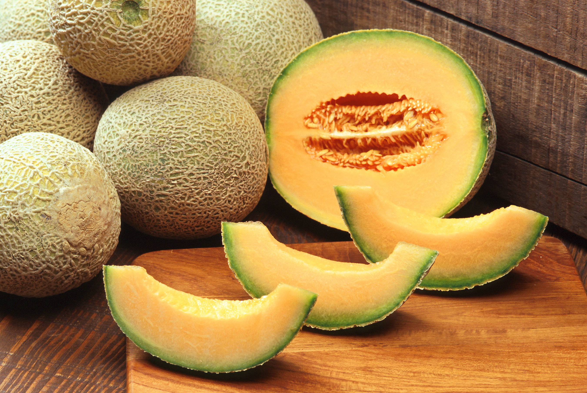
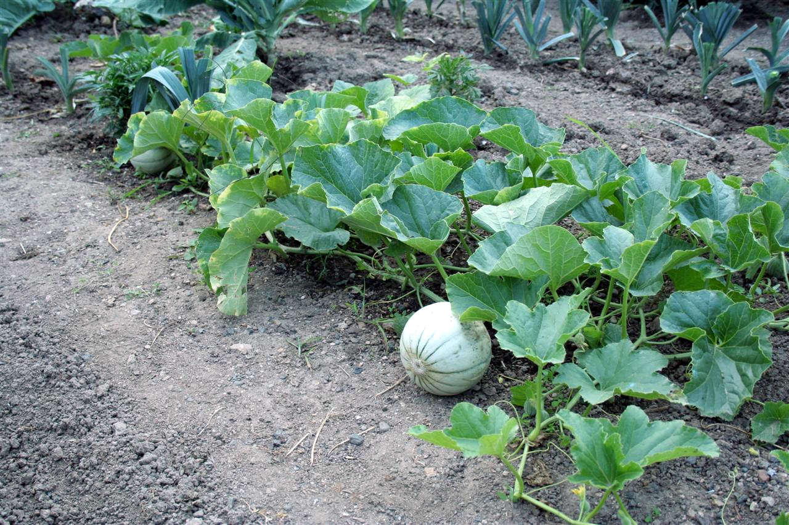
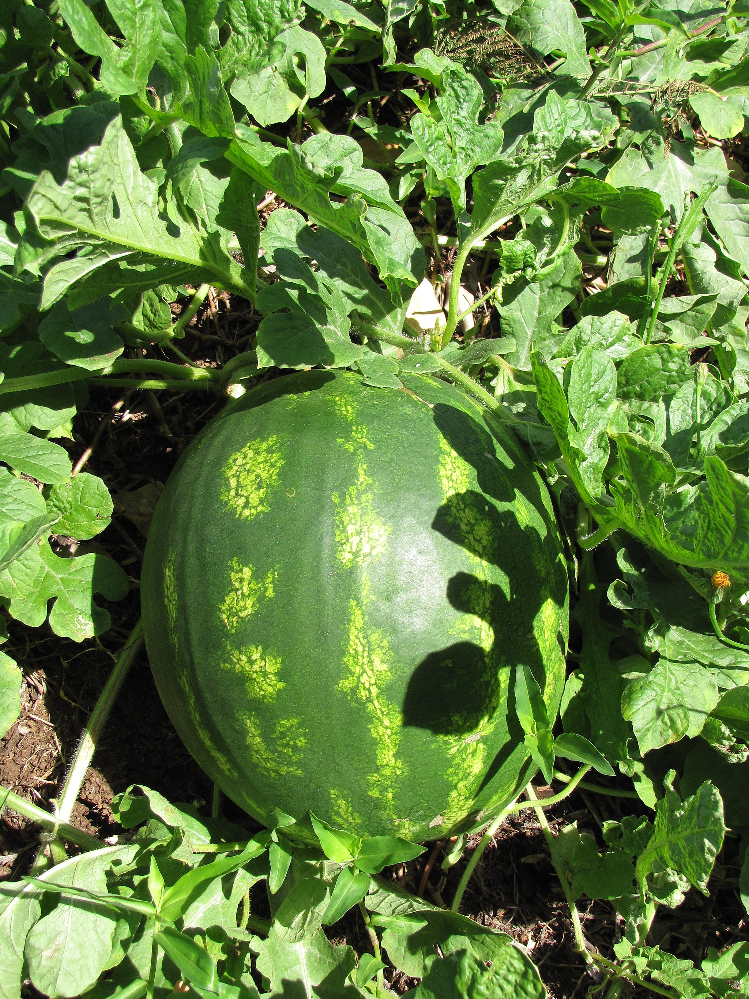

# Plants and Trees in the Bible

## License Information

Plants and Trees in the Bible © United Bible Societies, 2025. Adapted from: <cite>Each According to its Kind: Plants and Trees in the Bible</cite>, by Robert Koops © 2012 United Bible Societies. This work is licensed under Creative Commons Attribution-ShareAlike 4.0 International (<a href="https://creativecommons.org/licenses/by-sa/4.0/">https://creativecommons.org/licenses/by-sa/4.0/</a>).

--------------------------------

## Melon (id: FLORA:3.4)

3\.4 Melon
==========

There are two types of melons in the Bible: muskmelon and watermelon.
---------------------------------------------------------------------

## Muskmelon (cantaloupe) (id: FLORA:3.4.1)

3\.4\.1 Muskmelon (cantaloupe)
==============================

References:
-----------

Hebrew קִשֻּׁאָה (qishshu’ah)

[NUM 11:5](https://ref.ly/Num11:5)

Hebrew מִקְשָׁה (miqshah)

[ISA 1:8](https://ref.ly/Isa1:8), [JER 10:5](https://ref.ly/Jer10:5)

Greek σικυήρατον (sikuēraton)

[LJE 1:69](https://ref.ly/Bar1:69)

Discussion:
-----------

RSV (Revised Standard Version (1952)) renders the Hebrew words *qishshu’ah* and *miqshah* as “cucumber.” Against Moldenke and others, Zohary argues forcefully that these words refer to the Muskmelon *Cucumis melo*, and that “garden cucumbers did not exist in Egypt in biblical times” (page 86\). Hepper concurs with this, as does *The Interpreter’s Dictionary of the Bible*. Confusingly, one narrow and curved type of muskmelon is called the “snake cucumber.”

Cultivated muskmelons started out in and around Persia (now Iran) before moving into northern India, Kashmir, and Afghanistan. Although truly wild forms of *Cucumis melo* have not been found in those regions, several related wild species have been noted.

A picture of offerings presented at a funeral in Egypt around 2400 B.C. contains fruit that some experts take to be muskmelons. The Greeks appear to have known the fruit in the third century B.C., and in the first century after Christ it was definitely described by the Roman philosopher Pliny, who said it was something new in Campania in Italy. The Greek physician Galen, in the second century A.D., wrote of its medicinal qualities, and Roman writers of the third century gave directions for growing it and preparing it with spices for eating. The Chinese apparently did not know the muskmelon until it was introduced to their country around the beginning of the Christian Era from the regions west of the Himalayas.

Description:
------------

The muskmelon vine has round leaves and tendrils and creeps along the ground like a pumpkin or cucumber. It has tendrils and yellow flowers that develop into a fruit 10–40 centimeters (4–16 inches) in diameter. The fruit becomes yellowish or light green when ripe. The muskmelon is so named because of the distinctive smell of its ripe fruits. “Musk” is a Persian word for a kind of perfume; “melon” is a French word, from the Latin *melopepo*, meaning “apple\-shaped melon.” Latin took words of similar meaning from Greek.

Special significance:
---------------------

According to [NUM 11:5](https://ref.ly/Num11:5), the wandering Israelites remembered muskmelons and other tasty food that they had enjoyed in Egypt and complained to Moses. [ISA 1:8](https://ref.ly/Isa1:8) uses the melon patch (after harvest) as a picture of abandonment, dereliction, and desolation.

Translation:
------------

Many varieties of muskmelon are known around the world in warm countries. If it is not known, it may be translated contextually. [NUM 11:5](https://ref.ly/Num11:5) is non\-rhetorical, and a transliteration from a major language is recommended (for example, French *cantaloupe*, Spanish and Portuguese *cantalupo*, Arabic *abd el lawi*). However, the reference to the temporary shelter in the melon patch in [ISA 1:8](https://ref.ly/Isa1:8) is metaphorical, so a cultural equivalent representing a lonely or abandoned place could be considered. In this verse translators should keep in mind its parallel images, which are “a booth in a vineyard” and “a besieged city.”

[JER 10:5](https://ref.ly/Jer10:5): RSV (Revised Standard Version (1952)) renders the first line of this verse as “Their idols are like scarecrows \[*tomer* in Hebrew] in a cucumber field \[*miqshah* ].” Exegetical questions swallow up the botanical ones here, and they all hinge on the Hebrew words *tomer miqshah*, which could be understood to mean “a straight palm tree” (so KJV (King James Version (1611)), NKJV (New King James Version (1982)), ancient Greek versions of Aquila and Theodosius), “a handcarved pillar” (so Keil and Delitzsch, McKane), or “a scarecrow in a cucumber/melon field” (so RSV (Revised Standard Version (1952)), GNB (Good News Bible), and most other English versions). The Septuagint does not have this phrase at all, so there is no help there. Keil and Delitzsch argue for taking *tomer miqshah* as a handcarved pillar since the word *miqshah* means “hammered work” in [EXO 25:18](https://ref.ly/Exod25:18), [EXO 25:31](https://ref.ly/Exod25:31), [EXO 25:36](https://ref.ly/Exod25:36). KJV (King James Version (1611)) has “upright as the palm tree” (similarly NKJV (New King James Version (1982))), based on the idea that the word *tomer* is a variant of *tamar*, the normal word for palm tree. *Tomer* also occurs in [JDG 4:5](https://ref.ly/Judg4:5), where it seems to be universally accepted as meaning “palm tree,” although no one can satisfactorily explain the unusual vowel pattern (*tomer* instead of *tamar*). See [2\.5 Date palm](#FLORA:2.5).

Among the texts of [JER 10:5](https://ref.ly/Jer10:5) found at Qumran, 4QJera and 4QJerb do not have this line, but according to Lundbom, both Janzen and Tov believe that 4QJerb included something in that place that is now missing. According to Lundbom, it should begin with “It is worked silver, they will not walk,” which is similar to the reading in the Septuagint but with something added. In other words, Lundbom concludes that if we had a complete 4QJerb it would not have the words *tomer miqshah* and therefore would not help to resolve the issue of cucumber/melon patch versus palm tree or pillar.

The cucumber field interpretation has apparently been influenced by [LJE 1:69](https://ref.ly/Bar1:69) (70\), which begins with “Like a scarecrow in a cucumber bed, that guards nothing.” The Greek word *sikuēraton* (“cucumber bed”) may even be derived from the Hebrew word *qishshu’ah* by inversion of the first two consonants.

Most versions and commentators seem to favor the cucumber/melon patch interpretation rather than the palm tree or pillar interpretation. However, the evidence on the other side is such that I would suggest including it in a footnote that offers these alternatives: “a carved post” or “a carved palm tree.”

If translators decide on the botanical interpretation of *miqshah*, they still have to decide what vegetable or fruit it was. Zohary strongly favors muskmelon and Hepper appears to agree. NIV (New International Version (1984)) says “a melon patch” (similarly GNB (Good News Bible), NCV (New Century Version)). NLT (New Living Translation) generalizes by saying “a garden.”

* **Associated Passages:** Numbers 11:5; Isaiah 1:8; Jeremiah 10:5; Letter of Jeremiah 1:69; Exodus 25:18; Exodus 25:31; Exodus 25:36; Judges 4:5

## Watermelon (id: FLORA:3.4.2)

3\.4\.2 Watermelon
==================

Reference:”
-----------

Hebrew אֲבַטִּיחַ (’avattiach)

[NUM 11:5](https://ref.ly/Num11:5)

Discussion:
-----------

Most scholars believe the Hebrew word *’avattiach* refers to the Common Watermelon *Citrullus vulgaris* /*lanatus*, and it should be so identified since there are other types of melons, such as the muskmelon, with which it should not be confused. In fact, until recently, some botanists thought that this word referred to the muskmelon. Watermelons probably originated in Africa (possibly in the Kalahari) and were probably domesticated in the Neolithic Period. They have been cultivated in Egypt since prehistoric times and are used for food, drink, and medicine. Even the seeds are eaten. The Arabic cognate *batekh* /*batikh* is used for both the muskmelon and the watermelon.

Description:
------------

The watermelon plant is a vine like a pumpkin or a squash. The fruits vary widely in size, shape and color, some being striped, others being plain colored (mostly dark or light green).

Special significance:
---------------------

According to [NUM 11:5](https://ref.ly/Num11:5), watermelons were among the fruits that the wandering Israelites remembered from Egypt when they complained to Moses.

Translation:
------------

By now watermelons are a fairly common sight in the cities of the world. Where the fruit is marketed, there will be a name for it, often based on a major language (for example French *pastèque*; Spanish *sandía*; Portuguese *melancia*; Arabic *batekh*, *batikh*; and Swahili *tikiti*).

* **Associated Passages:** Numbers 11:5

