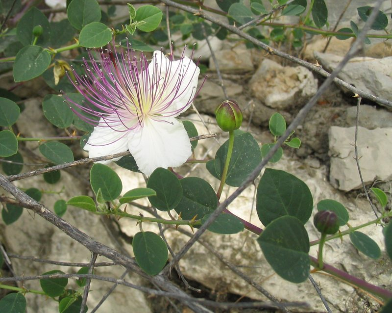
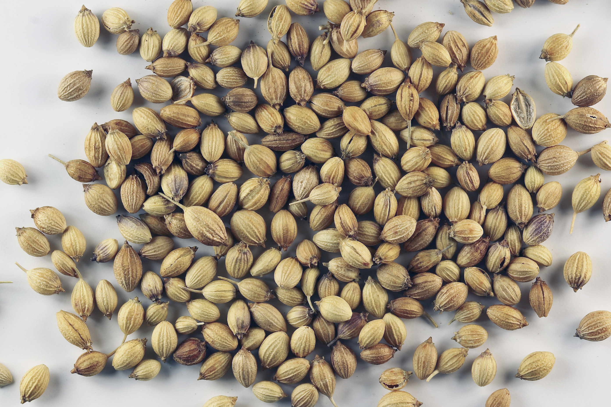
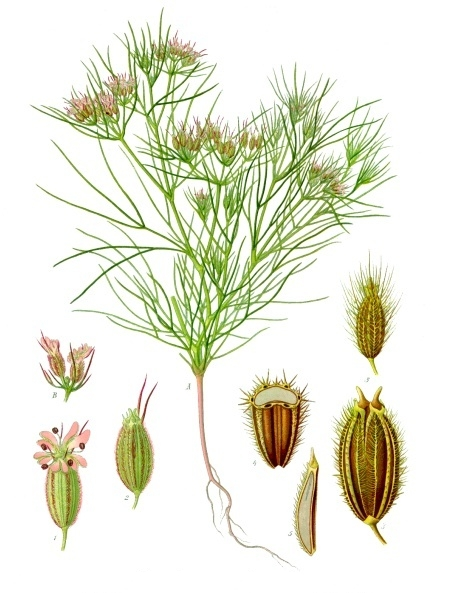
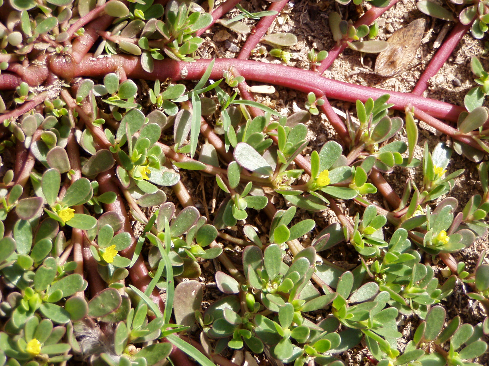
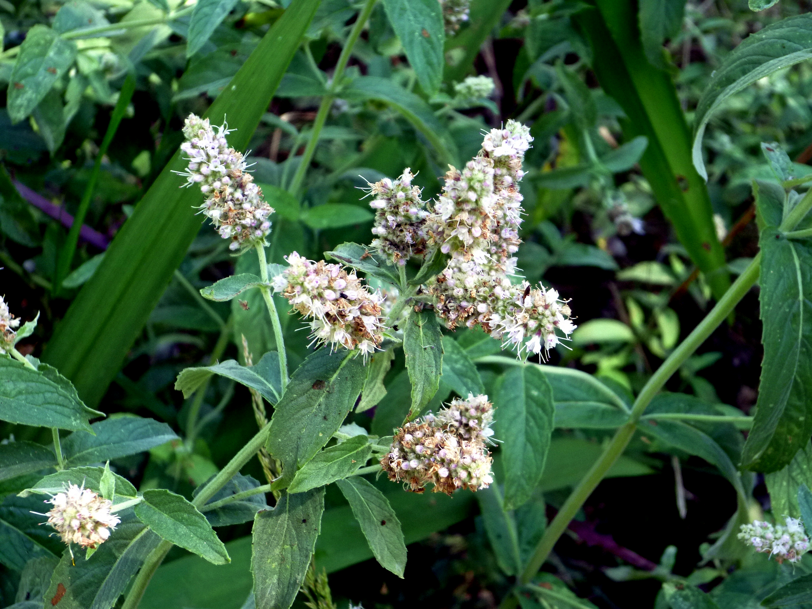
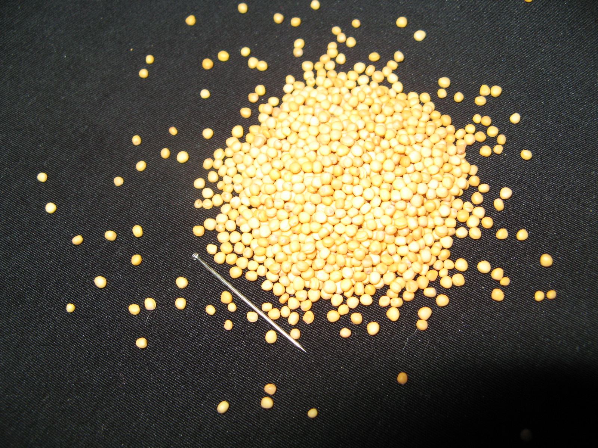
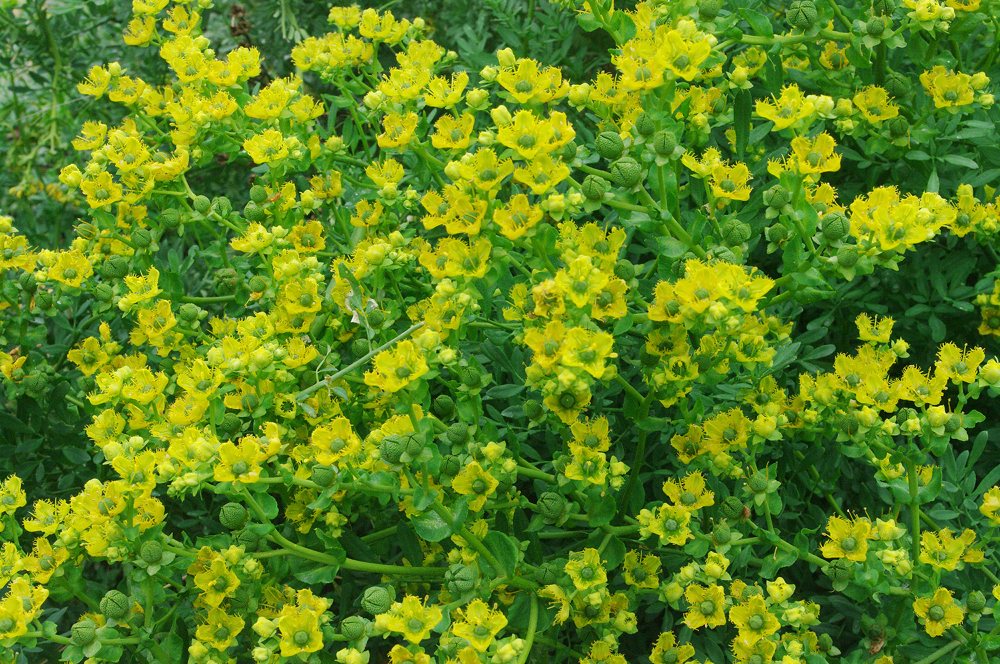
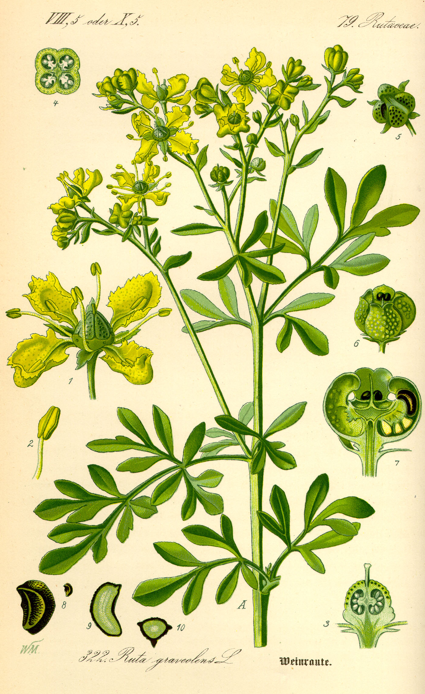

# Plants and Trees in the Bible

## License Information

Plants and Trees in the Bible © United Bible Societies, 2025. Adapted from: <cite>Each According to its Kind: Plants and Trees in the Bible</cite>, by Robert Koops © 2012 United Bible Societies. This work is licensed under Creative Commons Attribution-ShareAlike 4.0 International (<a href="https://creativecommons.org/licenses/by-sa/4.0/">https://creativecommons.org/licenses/by-sa/4.0/</a>).

--------------------------------

## Condiments (id: FLORA:3.5)

3\.5 Condiments
===============

There are eleven types of condiments in the Bible: caper, coriander, cumin, dill, dove’s dung, mallow, mint, mustard, nigella, orache, and rue.
-----------------------------------------------------------------------------------------------------------------------------------------------

## Caper (caper bush, caper berry) (id: FLORA:3.5.1)

3\.5\.1 Caper (caper bush, caper berry)
=======================================

Reference:”
-----------

Hebrew אֲבִיּוֹנָה (’aviyonah)

[ECC 12:5](https://ref.ly/Eccl12:5)

Discussion:
-----------

*Caper flower, bud (Iorsh (Wikimedia Commons))*

In the delightful description of old age in [ECC 12:0](https://ref.ly/Eccl12:0), a string of metaphors is followed by the clause “desire \[*’aviyonah* in Hebrew] fails.” The word *’aviyonah* only occurs once in the Bible, so there has been much debate over its meaning. The Septuagint translators took the first meaning of the word and rendered it “caper berry,” referring to the spicy tasting bud of a small bush (*Capparis spinosa*) common in the Middle East. The Syriac and the Vulgate have the same rendering, and so do NAB (New American Bible (1970)) and GECL (German Common Language Version (Gute Nachricht Bibel)). GW (God's Word Translation), JB (Jerusalem Bible (1966)), and NJPSV (New Jewish Publication Society Version) are similar with “caper bush,” and so are NEB (New English Bible (1970)) and REB (Revised English Bible (1989)) with “caper\-buds.” *La Nouvelle Bible Segond* and *La Sainte Bible: Version Synodale* say simply “caper,” and FRCL (French Common Language Version (Bible en français courant)) uses the generic term “spices.”

*Caper buds (© Yuvalr (Wikimedia Commons))*

Jews and others in ancient times used the caper berry and especially the pickled bud of the bush to increase the appetite, and the words meaning “desire” found in Greek and Hebrew dictionaries seems to be based on the association of capers and desire. In the Middle Ages Europeans considered the caper berry as an aphrodisiac; Moldenke does not find evidence that it was so used in ancient times.

A number of prominent botanists are convinced that the Hebrew word *’ezov* in the Pentateuch does not refer to the hyssop plant (so Septuagint) or even the marjoram (“Syrian hyssop”), but to the caper bush, which grows in Egypt and the Sinai Desert, where the Israelites were instructed to use it for the Passover ceremony. It also grows in the cracks of city walls, fitting the description of Solomon’s knowledge of botany as described in [1KI 5:13](https://ref.ly/1Kgs5:13) (4\.33\). Some even say a stick from the caper bush would have been long enough to fit the reference in [JHN 19:29](https://ref.ly/John19:29) (*hussōpos* in Greek), where soldiers lifted a sponge to Jesus’ lips on a stick. However, Zohary and others, on the basis of etymology, believe the words *’ezov* and *hussōpos* most likely refer to the marjoram plant. I agree. See also the discussion on these words under [5\.2\.4 Marjoram](#FLORA:5.2.4).

Description:
------------

*Caper bush (© Ray Pritz (UBS))*

In open areas the caper bush can grow as a bush to a meter (3 feet) in height, but more often it is found sprawling over rocks and broken\-down walls, and hanging from cliffs and the cracks in outside walls. It has a beautiful flower with three purplish\-white petals and many long, curved purple stamens. The leaves are round and gray\-green in color. The flowers open in the evening and wilt by the following morning, eventually producing a stalk with a berry containing many seeds.

Special significance:
---------------------

*Caper flower (© Klearchos Kapoutsis (Wikimedia Commons))*

People in the Middle East and many other places soak the buds of the caper in vinegar and eat them with meat. This process, called “pickling,” was already being done before the time of Christ in Israel, Egypt, and Arabia. Middle Easterners also ate the fruit of the caper bush, which was also spicy. Now pickled caper buds are popular throughout Europe, especially in France. Ancient Greek writers mention the caper often. It was used to get rid of stomach gas.

Translation:
------------

The caper bush is common throughout the Mediterranean region. Another species known as *Capparis sodado* grows in East Africa (Sudan), Arabia, and southern India. It is an almost leafless spiny shrub and has edible berries. Four other members of the genus *Capparis* are found in South America (mostly in Argentina, southern Brazil, Columbia, Paraguay, and Venezuela) with the names *Pan y agua* and *Sacha\-poroto*. There the fruit is eaten but is apparently not as popular as the caper is in southern Europe. The reference to the caper in [ECC 12:5](https://ref.ly/Eccl12:5) is part of a long string of metaphors, so the translation of “caper” will depend on how the translators have dealt with “almond tree” and the other metaphors, either leaving them literal, or “domesticating” them by using local equivalents or a generic term. Our preference here would be to keep the language poetical by substituting a local plant with the same function, in this case, something that stimulates the taste buds. Here we want to express the old person’s inability to enjoy spicy food. If the translation is to be more literal, an English transliteration could be used by rendering the whole clause as “the *kaparis* no longer makes you/him salivate \[or, no longer bites/tickles],” with a footnote indicating that *kaparis* is a Jewish spice. Other transliterations could be made from Arabic *assaf*, *alkabara*; French *capre*; Portuguese *alcaparras*; and Spanish *alcaparron*, *caparra*. RSV (Revised Standard Version (1952)) says “desire fails,” which is a nonfigurative rendering of the Hebrew. If this option is followed, a footnote may be appreciated, stating that the Hebrew refers to a spicy food in this passage.

* **Associated Passages:** Ecclesiastes 12:5; Ecclesiastes 12:0; 1 Kings 5:13; John 19:29

* **Associated ACAI Concepts:** Caper (ID: `flora:Caper`)

## Coriander (id: FLORA:3.5.2)

3\.5\.2 Coriander
=================

References:
-----------

Hebrew גַּד (gad)

[EXO 16:31](https://ref.ly/Exod16:31), [NUM 11:7](https://ref.ly/Num11:7)

Discussion:
-----------

*Coriander bush (© Niepokój Zbigniew (Wikimedia Commons))*

According to [EXO 16:31](https://ref.ly/Exod16:31), the miraculous food called “manna” that God sent to the wandering Israelites in the desert was “like coriander seed, white.” Coriander *Coriandrum sativum* did in fact grow in Egypt and the Holy Land. However, its seed is not very white, but more brown or gray, and the [NUM 11:7](https://ref.ly/Num11:7) tells us that the color was that of bdellium, of which we know almost nothing for certain. Further, the Septuagint has the Greek word *korion*, which is not coriander. The Arabic name *gidda*, the cognate of the Hebrew word *gad*, refers to a different plant, namely wormwood. To complicate the matter further, [EXO 16:14](https://ref.ly/Exod16:14) describes manna as “flaky,” whereas coriander seeds are spherical or egg\-shaped.

In view of these difficulties, Zohary expresses doubt as to whether the word *gad* actually refers to the plant we now know as coriander. He speculates that early translators, not knowing what *gad* referred to, took the Punic word *goid* for coriander, and made the association between *gad* and coriander. The writer would have done us a favor if he had said “like coriander flowers,” which can be white, but unfortunately the text has “seed.” Maybe an early narrator or scribe made a mistake in transmitting the text. Could the Hebrew word *perach* (“flower”) perhaps have been replaced by *zera‘* (“seed”)?

However, it is possible that coriander seed really was intended, and that the point of comparison between manna and coriander seeds was their size, which is about 4 millimeters (3/16 inch) in diameter, the size of a peppercorn (black pepper seed). (Thus REB (Revised English Bible (1989)) and NAB (New American Bible (1970)) have “like coriander seed, but white.”) Another possibility is that the writer was thinking of the way the seeds cluster, or of their firmness. We are told in [NUM 11:8](https://ref.ly/Num11:8) that the people pounded the manna in mortars and ground it in mills, suggesting some degree of hardness.

Description:
------------

*Coriander seeds (© Sanjay Acharya (Wikimedia Commons))*

The coriander plant is around 60 centimeters (2 feet) in height, the upper leaves being finely divided and the lower ones broad, with tiny white or reddish flowers, and a strong odor. The seeds are oily, brown or gray, and about the size of small peas. The leaves and seeds were used in ancient times in cooking, and are still used for soup and salads up to the present. The fragrant oil from the seeds is sometimes used in making perfume and medicine.

Special significance:
---------------------

As discussed above, coriander is used to describe the appearance of manna. Unfortunately we don’t know whether the point of comparison is the color, shape, size, or texture. Coriander is common in Israel and Egypt, and all the way across to Iraq and India. The leaves are used as a spice for food and also in perfume. But all of that is irrelevant if the point of comparison has to do with the seed.

Translation:
------------

*A Handbook on Exodus* says that it is the shape and size of the coriander seeds that are the point of comparison between coriander and manna, but since we are not sure, it may be difficult to find a cultural equivalent. So translators can give a generic rendering, as GNB (Good News Bible) has done (“like a small white seed”), omitting reference to coriander (but including it in a footnote). It is also possible to follow REB (Revised English Bible (1989)) and NAB (New American Bible (1970)) (“like coriander seed, but white”), which disassociate the seed from the color. If this is done, translators may transliterate “coriander” from a major language (for example, French *koriyandro*, *korion*; Arabic *kuzbara*; Portuguese *coentro*; Spanish *cilantro*) or from the Hebrew *gad*.

The Septuagint injects the Greek word for coriander (*korion*) from [EXO 16:31](https://ref.ly/Exod16:31) back into verse 14\. Some versions have followed this, but it is not particularly helpful.

* **Associated Passages:** Exodus 16:31; Numbers 11:7; Exodus 16:14; Numbers 11:8

* **Associated ACAI Concepts:** Coriander (ID: `flora:Coriander`)

## Cumin (cummin) (id: FLORA:3.5.3)

3\.5\.3 Cumin (cummin)
======================

References:
-----------

Hebrew כַּמֹּן (kammon)

[ISA 28:25](https://ref.ly/Isa28:25), [ISA 28:27](https://ref.ly/Isa28:27), [ISA 28:27](https://ref.ly/Isa28:27)

Greek κύμινον (kuminon)

[MAT 23:23](https://ref.ly/Matt23:23)

Discussion:
-----------

*Cumin (Franz Eugen Köhler (Wikimedia Commons))*

Two controversial seeds are mentioned in [ISA 28:25](https://ref.ly/Isa28:25); [ISA 28:25](https://ref.ly/Isa28:25); [ISA 28:27](https://ref.ly/Isa28:27); [ISA 28:27](https://ref.ly/Isa28:27): *qetsach* (see [3\.5\.9 Nigella (kalonji, black cumin, black seed, charnushka, nutmeg flower)](#FLORA:3.5.9)) and *kammon*. The seeds referred to as *kammon* are probably those of cumin (also spelled “cummin”), which takes its Latin scientific name *Cuminum cyminum* from the Greek. It was common to the Mediterranean area (especially in Syria) and Ethiopia, possibly even native to Egypt, where it was used in cooking and also as medicine.

Description:
------------

The cumin plant belongs to the same family as the carrot. It branches abundantly from the base and has similar leaves and flowers. However, the seeds have a much sharper smell than those of the carrot. Cumin is planted and harvested each year, reaching a height of perhaps 50–60 centimeters (20–24 inches).

Special significance:
---------------------

In [ISA 28:25](https://ref.ly/Isa28:25); [ISA 28:25](https://ref.ly/Isa28:25); [ISA 28:27](https://ref.ly/Isa28:27); [ISA 28:27](https://ref.ly/Isa28:27) cumin is cited with other garden plants to show how different plants and their fruits require different care and processing. (Cumin and nigella, for example, are more easily damaged in threshing than hard cereal grains would be). It is part of a parable Isaiah tells to the proud Israelite leaders who thought they knew how God deals with people. Interestingly, farmers in Malta still thresh cumin in the way described by Isaiah. In New Testament times the Jewish authorities were not sure whether cumin should be tithed since it was not mentioned specifically in the Mosaic Law. They took no chances and insisted that people tithe their cumin. But then they ignored the need for justice and mercy, thereby incurring the condemnation of Jesus in [MAT 23:23](https://ref.ly/Matt23:23).

Translation:
------------

Translators will either transliterate “cumin” from a major language (for example, Spanish *comino*; Portuguese *cuminho*, *cominho*; Arabic *kamun*, Swahili *jamda*, *kisibiti*, *jira*), or they can seek an equivalent, depending on what they have done with the other terms (“mint” and “dill”) in [MAT 23:23](https://ref.ly/Matt23:23). Simplified versions may use a generic phrase such as “all kinds of small garden plants.”

* **Associated Passages:** Isaiah 28:25; Isaiah 28:27; Matthew 23:23

* **Associated ACAI Concepts:** Cumin (ID: `flora:Cumin`)

## Dill (id: FLORA:3.5.4)

3\.5\.4 Dill
============

Reference:”
-----------

Greek ἄνηθον (anēthon)

[MAT 23:23](https://ref.ly/Matt23:23)

Discussion:
-----------

*Dill flowers (© PatríciaR (Wikimedia Commons))*

KJV (King James Version (1611)) translates the Greek word *anēthon* in [MAT 23:23](https://ref.ly/Matt23:23) as “anise,” but scholars now agree that the plant Jesus refers to is the Dill *Anethum graveolens*, a garden herb. The translation of the Hebrew word *qetsach* as “dill” by RSV (Revised Standard Version (1952)), NEB (New English Bible (1970)), and REB (Revised English Bible (1989)) in [ISA 28:25](https://ref.ly/Isa28:25); [ISA 28:27](https://ref.ly/Isa28:27); [ISA 28:27](https://ref.ly/Isa28:27) is now seen as erroneous. (see [3\.5\.9 Nigella (kalonji, black cumin, black seed, charnushka, nutmeg flower)](#FLORA:3.5.9).)

Description:
------------

*Dill plant (Prof. Dr. Otto Wilhelm Thomé Flora von Deutschland, Österreich und der Schweiz 1885, Gera, Germany)*

Dill is an annual plant that can reach 50 centimeters (20 inches) in height. Like the carrot, parsley and fennel, it has fine leaves. Its yellow flowers form a shape like a covered cup. The leaves and seeds have a pleasant, spicy smell.

Special significance:
---------------------

As in the case of cumin (3\.5\.3\) and mint (3\.5\.7\), Jesus used dill to condemn the skewed values of the religious leaders, who were blind to the misfortunes of the poor but fastidiously tithed even small garden seeds.

Translation:
------------

Dill is known in western Asia and in India as well as in Europe and America. Depending on what is done with the other plants in [MAT 23:23](https://ref.ly/Matt23:23), namely mint and cumin, the translator may choose to transliterate “dill” from the original Greek *anēthon* or from a major language (for example, French *aneth*; Spanish *anega*, *eneldo*, *aneto*; Portuguese *endro*, *aneto*, *funcho*; Arabic *bazrul*, *shibit*, *sjama*). It is debatable whether the context here is rhetorical or not, so transliteration of the three species is acceptable, although substituting cultural equivalents is also possible and effective. It is important to keep in mind the parallel passage of [2KI 6:25](https://ref.ly/2Kgs6:25), which does not include dill. *An American Translation* (AT (American Translation (Goodspeed, 1935))), Mft (Moffatt Translation (1926)), and Weymouth use “dill” here, as do the modern English versions.

* **Associated Passages:** Matthew 23:23; Isaiah 28:25; Isaiah 28:27; 2 Kings 6:25

* **Associated ACAI Concepts:** Dill (ID: `flora:Dill`)

## Dove’s dung (Star of Bethlehem) (id: FLORA:3.5.5)

3\.5\.5 Dove’s dung (Star of Bethlehem)
=======================================

Reference:”
-----------

Hebrew חֲרָאִים, חרצנים (chareyonim or chartsonim)

[2KI 6:25](https://ref.ly/2Kgs6:25)

Discussion:
-----------

*Star of Bethlehem plant (Iorsh (Wikimedia Commons))*

In the story of the siege of Samaria, we read in [2KI 6:25](https://ref.ly/2Kgs6:25) that “the fourth part of a kab of dove’s dung \[was sold] for five shekels of silver.” The Samarians must have been desparate, but even so, they were probably not eating dove’s dung, and three possibilities are given by the experts:

1\. The original writer wrote the Hebrew word *chartsonim* (“wild onion”) and the text was copied wrongly to read *chareyonim* (“dove’s dung”). NJB (New Jerusalem Bible (1985)) and NAB (New American Bible (1970)) take this position.

2\. Dove’s dung was the name of a common plant (footnotes in GNB (Good News Bible) and NLT (New Living Translation)). Possible candidates for the plant called “dove’s dung” are:

a. locust bean, or carob (NIV (New International Version (1984)), REB (Revised English Bible (1989)), NJPSV (New Jewish Publication Society Version) footnote);

b. the bulb of a flower (Linnaeus, Josephus).

3\. Real dove’s dung was processed and made into a salt substitute (footnote in GECL (German Common Language Version (Gute Nachricht Bibel)) \[1982]).

Hepper doubts that dove’s dung would refer to the carob or locust bean. He finds option 2b more likely, saying that *chareyonim* refers to the bulbs of the Star of Bethlehem *Ornithogalum narbonense*, which, according to historians, were sold during the siege of Samaria at about two ounces of silver for a cup. The name Linnaeus gave to the Star of Bethlehem plant is “ornitho\-galum.” This name literally means bird\-milk, suggesting that the botanist was perhaps aware of the connection to a name like “bird dung.” Only one of the many species of the genus *Ornithogalum* is edible; all the others are poisonous. Having lived in Nigeria where the leaf of a plant called “bird dung” is a popular soup ingredient (called *kashin tsuntsu* in Hausa), I am prepared to believe option 2\. Anderson, Zohary, and Hareuveni do not mention “dove’s dung,” perhaps on the assumption that it is not a plant.

Description:
------------

*Star of Bethlehem (© Hectonichus (Wikimedia Commons))*

The Star of Bethlehem plant grows to about 25 centimeters (10 inches) from a circular bunch of narrow leaves at the base. Its sweet\-smelling white flowers have six petals and grow on a stalk. They appear late in the spring and last only about 2 weeks before wilting. The flowers open in the morning and usually close by noon.

Special significance:
---------------------

Whatever “dove’s dung” may be in [2KI 6:25](https://ref.ly/2Kgs6:25), it was intended to illustrate the desperate condition of the inhabitants of Samaria during the siege, when even something barely edible was sold at an exorbitant price.

Translation:
------------

For “dove’s dung” the name of some marginally edible market item, or a phrase such as “wild onions” would be appropriate in [JOB 6:6](https://ref.ly/Job6:6). The use of a commonly used measurement and coin instead of “kab” and “shekel” will help get the point across. The parallelism of “dove’s dung” with “donkey’s head” will also help, as long as the value of the silver is expressed meaningfully. If the translator substitutes a local object for “dove’s dung,” it should be a very low\-value commodity. The Septuagint translated “dove’s dung” literally. Those who wish to follow a literal rendering, as in RSV (Revised Standard Version (1952)) and NLT (New Living Translation), should have a footnote stating that “dove’s dung” could be a plant. Possibilities for transliteration are French *ornithogale*, *aspergette*; Portuguese *ornitogalos*; and Spanish *ornitogala*.

* **Associated Passages:** 2 Kings 6:25; Job 6:6

* **Associated ACAI Concepts:** Star of Bethlehem (ID: `flora:StarOfBethlehem`)

## Mallow (id: FLORA:3.5.6)

3\.5\.6 Mallow
==============

References:
-----------

Hebrew חַלָּמוּת (challamuth)

[JOB 24:24](https://ref.ly/Job24:24)

Hebrew כֹּל (kol)

[JOB 6:6](https://ref.ly/Job6:6)

Discussion:
-----------

*Common purslane (© Júlio Reis (Wikimedia Commons))*

Responding to the unhelpful and unkind words of his so\-called friends, Job asks the following in [JOB 6:6](https://ref.ly/Job6:6): “Can that which is tasteless be eaten without salt? Is there any taste in the slime of the purslane \[*challamuth* in Hebrew]?” The main ideas of these two parallel lines are: a) tasteless things need salt, and b) the slime of *challamuth* is tasteless.

There is much debate whether or not the Hebrew word *challamuth* refers to a plant at all here. Some versions render it as “white of an egg” (GNB (Good News Bible), NLT (New Living Translation), GW (God's Word Translation)) or “egg white” (NIV (New International Version (1984))), and one commentator suggests it could refer to “whitewash,” “plaster,” or even “one who has died.” However, on the basis of Arabic cognate word *lachamut* and the Mishnaic tradition, Zohary holds that *challamuth* may refer to one or more plants from the *Malvaceae* family, namely Mallow *Malva sylvestris*, Mallow *Malva nicaeensis*, or Hollyhock *Alcea setosa*. REB (Revised English Bible (1989)) has “mallow.” Some species in this family are in fact eaten by goats and are used by Bedouins in cooking.

However, Hepper identifies *challamuth* as the Common Purslane *Portulaca oleracea*, another plant used in salad and as medicine. Moldenke does not find a plant at all in [JOB 6:6](https://ref.ly/Job6:6).

Description:
------------

*Common mallow (© Alvesgaspar (Wikimedia Commons))*

The common mallow is a small plant growing to around 25 centimeters (10 inches) high. It has round, lobed or heart\-shaped leaves with long stems, and produces a purple flower.

Special significance:
---------------------

If the word *challamuth* refers to a plant, it is one that represents something tasteless and slimy in [JOB 6:6](https://ref.ly/Job6:6). Job describes the words of his companions as tasteless and unhelpful like the slimy *challamuth*. Not surprisingly, Bildad responds in kind in [JOB 8:1](https://ref.ly/Job8:1), saying that Job’s own words are “a great wind.”

Translation:
------------

[JOB 6:6](https://ref.ly/Job6:6): Given the wide range of opinion among the experts, the translator’s simplest option for rendering *challamuth* is to follow a major version used in the area. Since the context is rhetorical, translators striving for poetic impact may look for a cultural equivalent—a plant that is known to be tasteless, or something else unpleasant like a raw egg white.

An important question here is this: Is *challamuth* something totally inedible, or is it something that is edible if you put salt on it? In Africa, where okra and roselle are well known (and slimy), such a plant could be used. However, translators should be careful since both okra and rosella are eaten frequently in soup and are considered delicious! *A Handbook on The Book of Job* gives about equal weight to “purslane,” “mallow,” “milkweed,” and “egg white,” and finally commends “egg white” as in GNB (Good News Bible). However, if translators wish to take *challamuth* as a plant, we offer the following basic models based on two alternative assumptions:

1\. If the Hebrew words *tafel* (“that which is tasteless”) and *rir challamuth* (“slime of the purslane”) refer to totally inedible substances, two possible renderings of [JOB 6:6](https://ref.ly/Job6:6) are:

“No one could swallow what I have been given to eat. It is like plaster, like the sap of milkweed \[or, euphorbia cactus / mallow].”

“No one can eat whitewash \[or, plaster/sand/straw/cotton]. There is no taste in milkweed sap \[or, euphorbia sap].”

2\. If these Hebrew words refer to edible but tasteless substances, two possible models are:

“No one could swallow what I have been given to eat. It is like pap \[or, raw cassava or some local very plain food without much taste] without salt, like the sap of mallow \[or, the juice of some tasteless but edible plant].”

“No one can eat pap \[or, raw cassava or some local flat\-tasting food such as rice] without salt. There is no taste in the sap of mallow \[or, the juice of some tasteless but edible plant.]”

Any of these renderings prepare the reader for Job’s next line: “My appetite refuses to touch them.”

[JOB 24:24](https://ref.ly/Job24:24): According to HOTTP (Hebrew Old Testament Text Project (UBS)), the Hebrew word *kakol* rendered “like the mallow” can either mean “like all” or “like the umbel.” (An umbel is a flower cluster that has a common axis.) If it is true that the Hebrew verb following *kakol* actually means “to close up,” then “umbel” is odd because umbellate flowers, to my knowledge, do not “close up.” So, if translators follow HOTTP (Hebrew Old Testament Text Project (UBS)) here, the meaning “like all” is recommended. NIV (New International Version (1984)) follows this sense by rendering the second line of this verse as “they are brought low and gathered up like all others” (similarly LB (Living Bible (1971)), NAB (New American Bible (1970)), Wolfers).

The Septuagint translates *kol* as the plant called “saltwort,” according to Pope. If one normally follows the Septuagint, “saltwort” is preferable to “mallow.” If a transliteration from English is necessary, “saltwort” (NJB (New Jerusalem Bible (1985))) or “saltplant” is more technically correct than “mallow” (RSV (Revised Standard Version (1952)), NJPSV (New Jewish Publication Society Version)). See [3\.5\.10 Orache (saltwort)](#FLORA:3.5.10).

GNB (Good News Bible) and CEV (Contemporary English Version) render *kol* as “weeds” to avoid the issue of the identity of the plant, but of course this rendering loses some color in its generality.

* **Associated Passages:** Job 24:24; Job 6:6; Job 8:1

* **Associated ACAI Concepts:** Mallow (ID: `flora:Mallow`)

## Mint (id: FLORA:3.5.7)

3\.5\.7 Mint
============

References:
-----------

Greek ἡδύοσμον (hēduosmon)

[MAT 23:23](https://ref.ly/Matt23:23), [LUK 11:42](https://ref.ly/Luke11:42)

Discussion:
-----------

*Horse mint (© Isidre blanc (Wikimedia Commons))*

The Horse Mint *Mentha longifolia* is the most common of the mint plants in the Holy Land, found on the banks of streams throughout the country. The Jews called it *dandanah*, a Hebrew word that does not occur in the Old Testament. They served its leaves along with milk and cucumbers, made a hot drink by boiling them, or used them, as the Romans and Greeks also did, in medicine and cooking. According to Moldenke, people scattered mint leaves on the floors of synagogues, and the fragrance was released as people entered and stepped on them.

Description:
------------

The horse mint is larger than the other kinds of mint, reaching up to 2 meters (7 feet). It has small, soft leaves with sawlike margins, and lavender\-colored flowers.

Special significance:
---------------------

In [MAT 23:23](https://ref.ly/Matt23:23) and [LUK 11:42](https://ref.ly/Luke11:42) Jesus accuses the Pharisees of legalistically tithing not only from their major food crops—olives, dates and wheat, for example—but even from the leaves they pluck for their soup, including mint, and then ignoring issues of justice and poverty.

Translation:
------------

At least twenty\-five kinds of mint are found in temperate areas of the world. It is well known in West Africa as an additive to tea. Depending on what translators do with the other species mentioned in [MAT 23:23](https://ref.ly/Matt23:23) and [LUK 11:42](https://ref.ly/Luke11:42) (dill, cumin, and rue), if they do not have these species locally, they may transliterate “mint” from a major language (for example, French *menthe*; Spanish *menta*; Portuguese *hortelã*, *hisopo*, *erva**de**São**Lourenco*; Swahili *mnaanaa*). In simplified versions they may cover all these species with a generic phrase such as “all kinds of little plants in the garden.”

* **Associated Passages:** Matthew 23:23; Luke 11:42

* **Associated ACAI Concepts:** Mint (ID: `flora:Mint`)

## Mustard (id: FLORA:3.5.8)

3\.5\.8 Mustard
===============

References:
-----------

Greek σίναπι (sinapi)

[MAT 13:31](https://ref.ly/Matt13:31), [MAT 17:20](https://ref.ly/Matt17:20), [MRK 4:31](https://ref.ly/Mark4:31), [LUK 13:19](https://ref.ly/Luke13:19), [LUK 17:6](https://ref.ly/Luke17:6)

Discussion:
-----------

*White mustard plant (© H. Zell (Wikimedia Commons))*

There is by no means full agreement about the precise identity of the plant in Jesus’ famous references to the mustard seed. Two types of mustard grow in the Holy Land and probably grew there in Bible times: Black Mustard *Brassica nigra* and White Mustard *Sinapis alba*. Zohary and Moldenke favor the former. Hepper leaves it open. Both species were either cultivated or gathered in Bible times, probably more for the oil, which was used in medicine and cooking, than as a spice. Both types are cultivated today.

Description:
------------

*Mustard seeds with pin (© Ray Pritz (UBS))*

Mustard plants are related to some other well\-known food plants, such as collards, broccoli, cauliflower, Brussels sprouts, rutabaga, and Chinese cabbage. They are planted and harvested each year. They grow to 2 meters (7 feet) in height and have branches like a tree. At the ends of the branches there are bright yellow flowers with four petals, like nearly all the members of the *Brassicaceae* family. The seeds are small among the seeds of garden plants, being about 2 millimeters (1/12 inch) in diameter, but they are not by any means the smallest of all seeds.

Special significance:
---------------------

The point of the mustard seed parable of Jesus is that something small can produce something very large and complex, like the kingdom of God, or like the amazing deeds of a person with faith.

Translation:
------------

At least thirty kinds of mustard are known in the world, twenty\-one of them in Europe. Others are found in Northeast Africa, India, Japan, and China. The quality in focus in all of the Gospel references is the smallness of the mustard seed compared to the large size of the resulting plant. The translator must keep that in mind, even if a relative of the mustard is found. If no effective equivalent is available, it will be necessary to transliterate “mustard” from a major language (for example, French *moutarde*, Spanish *mostaza*, Portuguese *mostarda*, Arabic *khardal**aswad*, Swahili *haradali*).

* **Associated Passages:** Matthew 13:31; Matthew 17:20; Mark 4:31; Luke 13:19; Luke 17:6

* **Associated ACAI Concepts:** Mustard (ID: `flora:Mustard`)

## Nigella (kalonji, black cumin, black seed, charnushka, nutmeg flower) (id: FLORA:3.5.9)

3\.5\.9 Nigella (kalonji, black cumin, black seed, charnushka, nutmeg flower)
=============================================================================

References:
-----------

Hebrew קֶצַח (qetsach)

[ISA 28:25](https://ref.ly/Isa28:25), [ISA 28:27](https://ref.ly/Isa28:27), [ISA 28:27](https://ref.ly/Isa28:27)

Discussion:
-----------

*Nigella plants (Franz Eugen Köhler, Köhler's Medizinal\-Pflanzen)*

The English versions of [ISA 28:25](https://ref.ly/Isa28:25); [ISA 28:27](https://ref.ly/Isa28:27); [ISA 28:27](https://ref.ly/Isa28:27) reveal the confusion of the translators who have encountered the Hebrew word *qetsach*. It has been rendered “fitches” (KJV (King James Version (1611))), “dill” (RSV (Revised Standard Version (1952)), GNB (Good News Bible), CEV (Contemporary English Version), NLT (New Living Translation), NEB (New English Bible (1970)), REB (Revised English Bible (1989))), “fennel” (JB (Jerusalem Bible (1966)), NJB (New Jerusalem Bible (1985))), and “caraway” (NIV (New International Version (1984))). Against all of these renderings, Zohary confidently asserts that the word *qetsach* refers to the Nigella plant *Nigella sativa*, also called by the names nutmeg flower, black cumin, black seed, charnushka, and kalonji. (The Hebrew word *kammon* in these verses refers to the ordinary cumin; see [3\.5\.3 Cumin (cummin)](#FLORA:3.5.3)) Hepper agrees, apparently supported by Post, Moldenke, and others. The Aramaic and Arabic equivalent is *qatscha*. Jews, Arabs, and Europeans use nigella seeds to decorate cakes and bread up to the present. It is also used as a spice in cooking.

Description:
------------

Nigella is planted and harvested annually. It grows to around 30 centimeters (1 foot) in height and has a lacy leaf like dill or carrot and a greenish\-blue flower with five petals. The base of the flower becomes a seedpod that contains many round, black, sharp\-smelling seeds.

Special significance:
---------------------

Nigella is used by Isaiah as one of several species in a parable he tells to the leaders of Israel. A farmer, he says, does not destroy the results of one season’s work while preparing for that of the next season. This is spoken to know\-it\-all scoffers who claim that God’s ways are completely fixed. Against that Isaiah says that God’s ways are according to the conditions of his creatures, as a farmer plants and harvests according to the needs of the various crops.

Translation:
------------

The abundance of names for nigella is an indication of its popularity around the world. Fortunately the Latin name *nigella* is now replacing the confusing name “black cumin.” This is good because cumin is a totally different plant. Likewise, “nutmeg flower” and “black caraway” are losing favor. So translators can avoid the confusion brought on by the English by transliterating from Latin (*nigella*), French and Dutch (*nigelle*), Spanish (*agenuz*, *neguilla*, *arañuel*), German (*Nigella*, *Schwartzkümmel* \[literally “black seed”]), Hebrew (*qetsach*), Persian (*kalanji*), or Arabic (*habbet as suda*, *kamun aswad*, *shuniz*). In Amharic nigella is *tikur azmud*, in Mandarin *hei zhong cao*, and in Indonesian *jinten hitam*.

* **Associated Passages:** Isaiah 28:25; Isaiah 28:27

* **Associated ACAI Concepts:** Nutmeg Flower (ID: `flora:NutmegFlower`)

## Orache (saltwort) (id: FLORA:3.5.10)

3\.5\.10 Orache (saltwort)
==========================

Reference:”
-----------

Hebrew מַלּוּחַ (malluach)

[JOB 30:4](https://ref.ly/Job30:4)

Discussion:
-----------

*Orache (© Karsten Niehaus (Academic.com))*

[JOB 30:4](https://ref.ly/Job30:4) describes an unfortunate group of people who in their hunger pluck *malluach* and the leaves of bushes to eat. Although a few botanists render *malluach* as “mallow” (so RSV (Revised Standard Version (1952))), Zohary, following Moldenke and others, holds that *malluach* refers to the Shrubby Orache *Atriplex halimus*, also called saltbush. The Septuagint uses the Greek word *halimōn* (coming from *halmē* “salted”), which refers to a species of saltwort or orache. Orache is abundant especially in salty areas in the desert and on the shores of the Mediterranean Sea and the Dead Sea. If we follow the Septuagint, orache or saltwort is also appropriate in [JOB 24:24](https://ref.ly/Job24:24) (see [3\.5\.6 Mallow](#FLORA:3.5.6)).

Description:
------------

*Shrubby orache (© Krzysztof Ziarnek, Kenraiz (Wikimedia Commons))*

The orache plant grows up to 2 meters (7 feet) tall, with many branches emerging at ground level. Its stem and branches have small silver\-gray leaves covered with tiny hairs. Its leaves are edible but salty. Orache belongs to the goosefoot family (*Chenopodiaceae*), which includes spinach.

Translation:
------------

Given the uncertainty of the identification of the Hebrew word *malluach*, translators may be excused for taking a generic route here and translating “coarse leaves” (NLT (New Living Translation)), “tasteless shrubs” (CEV (Contemporary English Version)), “desert plants,” (NCV (New Century Version)), or “plants of the desert” (GNB (Good News Bible)). NIV (New International Version (1984)) says “salt herbs,” which makes reference to the salt\-tolerant nature of the orache reflected in the Septuagint and in the alternative name “saltwort.” However, it is equally appropriate to supply a species name here, and if the translator is so inclined, a transliteration of “orache” can be made from a major language (for example, English *orash*, French *arroche*), or a word like “saltbush” can be coined. “Mallow” should be not be used, since it refers to a different plant found in [JOB 6:6](https://ref.ly/Job6:6) (see [3\.5\.6 Mallow](#FLORA:3.5.6)).

* **Associated Passages:** Job 30:4; Job 24:24; Job 6:6

* **Associated ACAI Concepts:** Orache (ID: `flora:Orache`)

## Rue (id: FLORA:3.5.11)

3\.5\.11 Rue
============

Reference:”
-----------

Greek πήγανον (pēganon)

[LUK 11:42](https://ref.ly/Luke11:42)

Discussion:
-----------

*Rue flowers (© Zeynel Cebeci (Wikimedia Commons))*

In the Holy Land at the time of Jesus there was only one wild species of rue common, the Mountain Rue *Ruta chalepensis*, and it is likely the one referred to by Jesus in his rebuke of the Pharisees in [LUK 11:42](https://ref.ly/Luke11:42). The very similar cultivated rue *Ruta graveolens* was introduced from southern Europe later. Rue is common throughout the Middle East, from Syria to Sinai up to the present. Because of its strong smell it is used in cooking and in medicine up to the present. It was used by the Greeks, Romans, and Jews against snakebite and the stings of bees, wasps and scorpions, not to mention its effectiveness against insanity, epilepsy, and even “the evil eye.” In post\-biblical Jewish literature rue is called *pigam*, which is cognate with the Greek *pēganon* and the Arabic *fegan*.

Description:
------------

*Rue plant (Otto Wilhelm Thomé Flora von Deutschland, Österreich und der Schweiz 1885, via Kurt Stueber)*

Rue is a small, shrubby plant that produces many branches at ground level, with many yellow flowers and very sharp\-smelling leaves. It can reach up to a meter (3 feet) in height.

Special significance:
---------------------

The ancient Jewish Talmud states that cultivated plants should be tithed. It is possible that the disagreement between Jesus and the Pharisees arose because by New Testament times the people were cultivating rue, dill, and similar plants that had not been cultivated before, and the Pharisees then applied the laws of the Talmud to these little plants, thus complicating the lives of the common people, while at the same time they ignored issues of justice and compassion.

Translation:
------------

Depending on what translators do with “mint” in [LUK 11:42](https://ref.ly/Luke11:42), they may find a cultural substitute for “rue” or a generic phrase for “mint and rue and every herb.” Since the context is not rhetorical and the plant genus is limited to the Middle East, a transliteration of “rue” will be appropriate. Transliterations can be made from the Greek *pēganon* or from a major language. (The English word rue comes from Old English *ruwe*, which comes from Latin *ruta* and Greek *rhyte*.)

* **Associated Passages:** Luke 11:42

* **Associated ACAI Concepts:** Rue (ID: `flora:Rue`)
