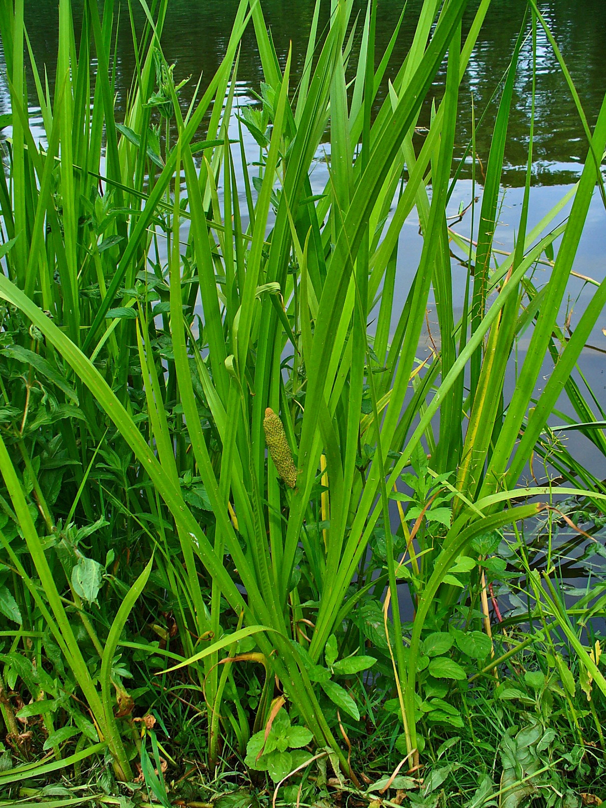
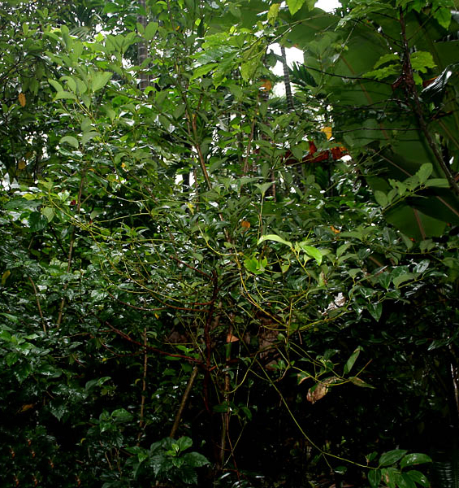
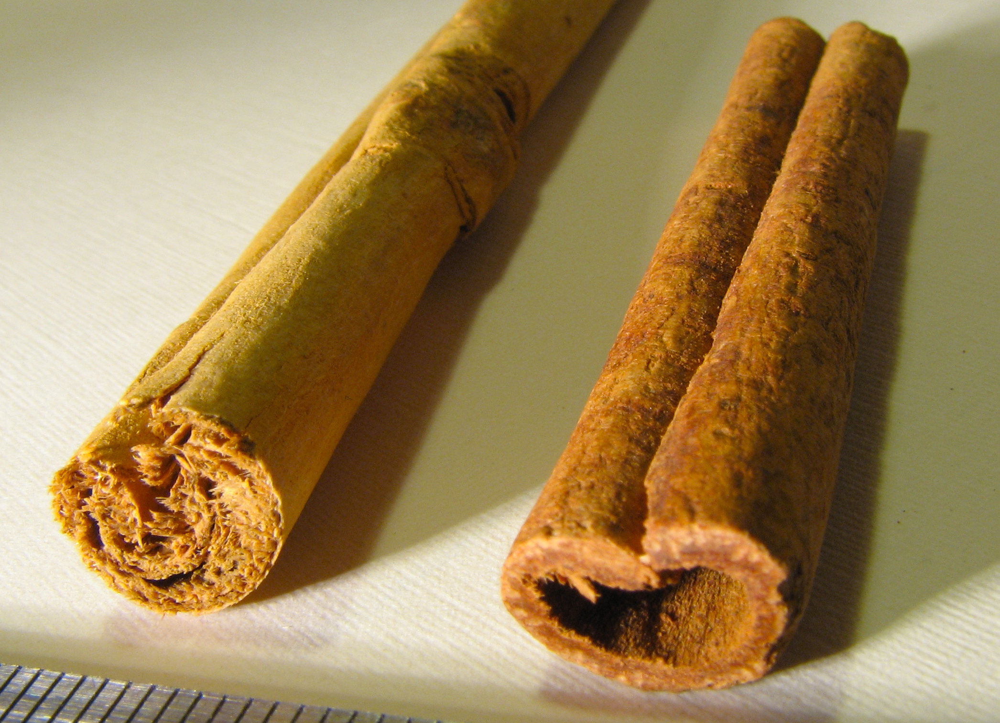
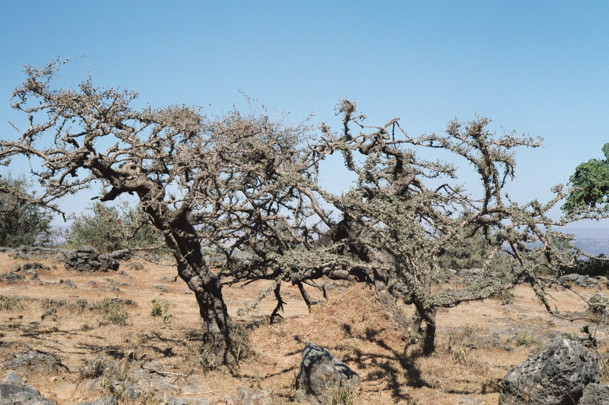
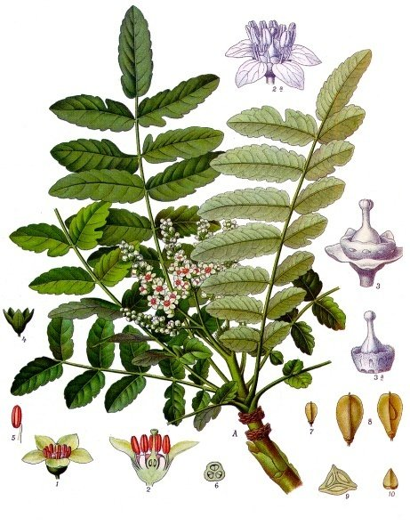

# Plants and Trees in the Bible

## License Information

Plants and Trees in the Bible © United Bible Societies, 2025. Adapted from: <cite>Each According to its Kind: Plants and Trees in the Bible</cite>, by Robert Koops © 2012 United Bible Societies. This work is licensed under Creative Commons Attribution-ShareAlike 4.0 International (<a href="https://creativecommons.org/licenses/by-sa/4.0/">https://creativecommons.org/licenses/by-sa/4.0/</a>).

--------------------------------

## Trees and plants yielding incense and perfume (id: FLORA:4.1)

4\.1 Trees and plants yielding incense and perfume
==================================================

## Agarwood (eaglewood, aloeswood, lignaloes) (id: FLORA:4.1.1)

4\.1\.1 Agarwood (eaglewood, aloeswood, lignaloes)
==================================================

References:
-----------

Hebrew אֲהָלִים (’ahalim)

[NUM 24:6](https://ref.ly/Num24:6), [PRO 7:17](https://ref.ly/Prov7:17)

Hebrew אֲהָלוֹת (’ahaloth)

[PSA 45:9](https://ref.ly/Ps45:9), [SNG 4:14](https://ref.ly/Song4:14)

Discussion:
-----------

*Agarwood trunk (DXLINH (Wikimedia Commons))*

Zohary confidently identifies the Hebrew word *’ahaloth* in [PSA 45:9](https://ref.ly/Ps45:9) (8\) as referring to the Agarwood or Eaglewood *Aquillaria agallocha*, which is a tree native to northern India. (He also says it is native to East Africa, but this seems to be a mistake). The ancient Greek writer Dioscorides calls the eaglewood *agallochon*, a wood found in India and Arabia. This view is supported by Anderson and the commentators Snaith and Budd. Hepper, who is generally suspicious of claims about trade with the Far East in this period of history, doubts this identification but goes along with it for lack of an alternative. The chips of the wood are sold in India under the name *agar* (Hepper, page 140\) and burned as incense. Expeditions like those of King Solomon ([1KI 9:26–1KI 9:28](https://ref.ly/1Kgs9:26-1Kgs9:28)) may have brought this precious commodity from India by way of mysterious places like Tema ([JOB 6:19](https://ref.ly/Job6:19)) or Dedan ([ISA 21:13](https://ref.ly/Isa21:13)), possibly in the Arabian Peninsula.

In [NUM 24:6](https://ref.ly/Num24:6) the Hebrew word *’ahalim* does not refer to the fragrant chips of the agarwood tree, but the actual trees. The last two lines of this verse read “like aloes \[*’ahalim* ] that the LORD has planted, like cedar trees beside the waters.” These parallel lines suggest verdant growth. If the agarwood trees actually grew only in the Far East, what would Balaam or the writer of Numbers know about how they looked? Budd and others suggest that in this verse various elements of nature are combined in an exotic vision of luxury and beauty. Mft (Moffatt Translation (1926)) renders *’ahalim* as “oaks,” assuming that a Middle Eastern species was intended. Moldenke approves of this.

The agarwood tree is also known as lignaloes or aloeswood, but it has no relation whatever to the True Aloe *Aloe vera* that is native to the Middle East, Madagascar, and southern Africa (see [4\.2\.1 Aloe (bitter aloe)](#FLORA:4.2.1)).

Description:
------------

*Agarwood \- botanical illustration (W. Saunders (Wikimedia Commons))*

The eaglewood, or agarwood, tree is tall, reaching 35–40 meters (115–132 feet), and 4 meters (13 feet) in circumference. The wood is fragrant especially when it is infected by a certain fungus, which the tree counteracts by producing a sweet\-smelling resin.

Special significance:
---------------------

*Agarwood cross\-section (Photo courtesy of Robert A. Blanchette (University of Minnesota))*

Apart from the unusual reference in Numbers, all the references to agarwood pair it with myrrh, confirming its function as a fragrant substance used in incense and perfumes. Traditionally old agarwood trees were cut down in order to find the resinous wood in the center of the tree. Now, due to the serious decline in the number of trees, people in Thailand, Bhutan and other Southeast Asian countries have found ways to induce younger trees to produce the resin. This resin has been a highly valued part of both Buddhist and Islamic ceremonies for many centuries, as well as being used for perfume and for medicine. Embalmers in ancient Egypt used agarwood along with other spices. Japanese people use it with sandalwood in their incense ceremony (*koh\-do*).

Translation:
------------

Since the agarwood tree is well known in East Africa and India (Sanskrit *aghal*), translators in these areas should be able to find the local name. In Arabic agarwood is called *oud* (“wood”), the name used also by perfumers in Europe, but it is rarely seen because of its high cost. The tree is called *jin\-koh* in Japanese, *chen\-xiang* in Chinese, and *gaharu* in Indonesian. Elsewhere, translators will need to consider how they deal with the word pair myrrh and agar. If “myrrh” is transliterated, then “agar” could also be transliterated. In Asia the tree takes its name from the product (agar). In [PSA 45:9](https://ref.ly/Ps45:9); [PRO 7:17](https://ref.ly/Prov7:17); [SNG 4:14](https://ref.ly/Song4:14), it is the name of the substance that would be transliterated (“agar”), not the tree (“agarwood”). It could be argued that these passages are rhetorical, and translators are thereby free to seek cultural equivalents for myrrh and agar. Balaam’s blessing of Israel in [NUM 24:6](https://ref.ly/Num24:6), though rhetorical and even perhaps fanciful, is a more complicated case, since it pairs agarwood trees with cedars, which are also cited prominently in non\-rhetorical contexts. There the translator will need to choose between being historically and geographically accurate and being rhetorically effective.

* **Associated Passages:** Numbers 24:6; Proverbs 7:17; Psalms 45:9; Song of Songs 4:14; 1 Kings 9:26; 1 Kings 9:28; Job 6:19; Isaiah 21:13

## Calamus (sweet flag, aromatic cane, sweet cane, ginger grass) (id: FLORA:4.1.2)

4\.1\.2 Calamus (sweet flag, aromatic cane, sweet cane, ginger grass)
=====================================================================

References:
-----------

Hebrew קָנֶה (qaneh)

[SNG 4:14](https://ref.ly/Song4:14), [ISA 43:24](https://ref.ly/Isa43:24), [EZK 27:19](https://ref.ly/Ezek27:19)

Hebrew קְנֵה־בֹשֶׂם (qeneh bosem)

[EXO 30:23](https://ref.ly/Exod30:23)

Hebrew קָנֶה הַטּוֹב (qaneh hattov)

[JER 6:20](https://ref.ly/Jer6:20)

Discussion:
-----------

*Calamus (CostaPPPR (Wikimedia Commons))*

The Hebrew word *qaneh* /*qeneh* means “cane” or “stalk”; *tov* means “good”; *bosem* means “spicy.” There are three general options for the identity of *qaneh*. Many botanists have held that this word refers to any of three or four sweet\-smelling grasses of the genus *Cymbopogon*, one of which grows wild in Israel. That would be one option. Another is that it was imported from India, where other fragrant types of *Cymbopogon* were and are cultivated, such as Ginger Grass *Cymbopogon martinii*, Camel Grass *Cymbopogon schoenanthrus*, and Lemon Grass *Cymbopogon citratus*. Of these, Zohary and Moldenke both favor “ginger grass,” which is also called “sweet calamus.” However, the real Calamus *Acorus calamus* is a third possibility. It is a reed\-like plant, more popularly known as the “sweet flag.” The origin of this plant is hotly debated, but it may have started from India and spread in marshy ground across Europe, picking up names like flagroot, myrtle flag, myrtle sedge, sweet root, and sweet sedge. The Egyptologist Joret believes it was used by the Pharaohs. The botanist Burkill holds that the Greeks used the ginger\-like roots of the sweet flag, but confused them with the roots of the true ginger grass, leaving a legacy of confusion behind them (Hepper, page 144\).

Description:
------------

Ginger grass (option 2\) grows in clumps to more than a meter (3 feet) high and has stiff leaves like sword grass. The oil is extracted by boiling and distilling the leaves.

Calamus (option 3\) is a type of reed. It has stiff leaves but is distinguished by its green flower head that grows on a stalk to about 50 centimeters (20 inches) high.

Special significance:
---------------------

*Qeneh bosem* is mentioned in [EXO 30:23](https://ref.ly/Exod30:23) as one ingredient of the sacred oil used to anoint the priests.

Translation:
------------

The references to *qaneh* in [ISA 43:24](https://ref.ly/Isa43:24) and [JER 6:20](https://ref.ly/Jer6:20) are arguably rhetorical. Local cultural equivalents could be sought in those passages, keeping in mind that in both places *qaneh* is paired with frankincense. Translators may feel it best to deal with both of them the same way. If so, a generic word for grass or reed may be used together with a word meaning “fragrant” to render *qaneh*. Translators from Asia will probably find local names for ginger grass or lemon grass. Alternatively, the translator could transliterate from Greek (*kalamos*) with or without the word for “sweet.” Since the extract of calamus/ginger grass is an oil, one could translate “sweet\-smelling kalamos oil.” Translators can also consider transliterating from a major language (for example, French *verveine*, *citronelle*; Portuguese *erva* \-*cideira*; Spanish *limonaria*, *paja**de**Meca*, *Pasto cetron*, *Zacate lemon*, *palmarosa*; Chinese *shihch'ang pu*).

* **Associated Passages:** Song of Songs 4:14; Isaiah 43:24; Ezekiel 27:19; Exodus 30:23; Jeremiah 6:20

## Cassia (id: FLORA:4.1.3)

4\.1\.3 Cassia
==============

References:
-----------

Hebrew קִדָּה (qiddah)

[EXO 30:24](https://ref.ly/Exod30:24), [EZK 27:19](https://ref.ly/Ezek27:19)

Hebrew קְצִיעָה (qetsi‘ah)

[PSA 45:9](https://ref.ly/Ps45:9)

Discussion:
-----------

*Cassia tree (J.M. Garg (Wikimedia Commons))*

As in the case of agarwood above ([4\.1\.1](#FLORA:4.1.1)), Zohary is confident that the substance referred to by the Hebrew words *qiddah* and *qetsi‘ah* is oil or powder derived from the leaves, twigs, or bark of the Cassia *Cinnamomum cassia*, a tree found in East Asia. The name “cassia” may possibly come from the Khasi people of northeastern India and Bangladesh; earlier they lived in the area of Assam and Burma and were involved in the ancient cassia trade. So cassia oil may have been brought into Israel from East Asia. However, with respect to “cassia” and “cinnamon” in [EXO 30:23](https://ref.ly/Exod30:23); [EXO 30:24](https://ref.ly/Exod30:24), Hepper argues that these spices were probably not Asian spices as has often been supposed. Quoting research by Lucas and Harris on ancient Egyptian materials, he says that there is no evidence of these Asian spices in tombs in Egypt (Hepper, page 138\). If they were being transported by the deprived Israelites, why were they not used by the more prosperous Egyptians? Further, how was Moses to have access to these substances in remote Sinai? Hepper favors southern Arabia and northeastern Africa as sources for fragrant barks and resins. Note the caravans of Tema and Dedan ([JOB 6:19](https://ref.ly/Job6:19); [ISA 21:13](https://ref.ly/Isa21:13); [ISA 21:14](https://ref.ly/Isa21:14)) and the visit of the Queen of Sheba ([1KI 10:2](https://ref.ly/1Kgs10:2)).

Description:
------------

Asian cassia trees grow to 10 meters (33 feet) tall. They have distinctive opposite leaves with three lighter\-colored veins or ribs radiating from the base. Their rather small flowers droop in bunches.

Special significance:
---------------------

*Qiddah* is mentioned in [EXO 30:24](https://ref.ly/Exod30:24) as one ingredient of the sacred oil used to anoint the priests. The Hebrew word *qetsi‘ah* appears as the name of one of Job’s daughters in [JOB 42:14](https://ref.ly/Job42:14).

Translation:
------------

Cassia is closely related to the well\-known spice, cinnamon. In fact, much of the “cinnamon” sold in North America is cassia. Europeans and South Americans tend to use the real cinnamon from Sri Lanka and elsewhere. Since cassia is native to East Asia, translators there will know it by a local name, for example, *kayu manis cina* (Indonesian), *kaeseo* (Korean), *ob choey chin* / *thephatharo* (Thai), and *que don* / *que quang* (Vietnamese). Chinese has at least ten names for it, including *guan gui* and *gui xin*. It is cultivated there for its bark, buds, and oil. Since the passages that refer to cassia are non\-rhetorical, translators elsewhere may transliterate this term from a major language (for example, Arabic *darsini*, *kirfa*, *karfa*, *salika*; French *kas*, *kanéfis*, *kanel**de**chin* /*selon*; Spanish/Portuguese *cassia*, *canela de la China*). Cassia is of the genus *Cinnamomum*, which is completely different from the genus *Cassia* of which there are many species in Africa. So transliterations based on “cassia” are potentially misleading in Africa. To avoid a wrong association with African cassia (which is not aromatic), African translators could do one of the following:

1\. transliterate from the Hebrew *qiddah*;

2\. transliterate from English (*kasiya*) and write a footnote saying this tree has no relationship to the cassia tree of Africa;

3\. substitute a well\-known sweet\-smelling gum.

* **Associated Passages:** Exodus 30:24; Ezekiel 27:19; Psalms 45:9; Exodus 30:23; Job 6:19; Isaiah 21:13; Isaiah 21:14; 1 Kings 10:2; Job 42:14

## Cinnamon (id: FLORA:4.1.4)

4\.1\.4 Cinnamon
================

References:
-----------

Hebrew קִנָּמוֹן (qinnamon)

[EXO 30:23](https://ref.ly/Exod30:23), [PRO 7:17](https://ref.ly/Prov7:17), [SNG 4:14](https://ref.ly/Song4:14)

Greek κιννάμωμον (kinnamōmon)

[REV 18:13](https://ref.ly/Rev18:13), [SIR 24:15](https://ref.ly/Sir24:15)

Discussion:
-----------

*Cinnamon leaves (H. Zell (Wikimedia Commons))*

True Cinnamon *Cinnamomum verum* (or *Cinnamomum zeylanicum*) is a tree found mostly in Sri Lanka, India, and Burma. The Hebrew word *qinnamon* may ultimately derive from an early form of the Malaysian/Indonesian expression *kayu**manis*, meaning “sweet wood.” As in the case of cassia, there is debate about whether the cinnamon mentioned in the Old Testament could have been imported from the Far East or whether there was perhaps a spice from Arabia or Africa that was named *qinnamon*, because this name was known at the time of writing. Some scholars believe that there was trade between India and Egypt as early as the second millennium B.C. In fact, the renowned Egyptian queen Hatshepsut is thought to have brought myrrh or frankincense trees from “Punt,” which could have been Somalia or even India, in 1490 B.C. However, she apparently did not bring cinnamon trees, nor are cinnamon and cassia among the spices found in the tombs of Egypt. So the true identity of the biblical cinnamon is still in question.

Description:
------------

*Cinnamon tree with bark removed (Marion Schneider \& Christoph Aistleitner (Wikimedia Commons))*

The true cinnamon tree grows to 10 meters (33 feet) in height. The stem branches plentifully. The leathery leaves are 10–15 centimeters (4–6 inches) in length and have three light\-colored, radiating veins. The spongy outer bark is scraped off, revealing a fragrant pale brown inner bark. This inner bark carries the cinnamon flavor. It is cut off and dried, and the bark curls to form little scrolls. The small flowers have an unpleasant smell.

Special significance:
---------------------

*Bark of true cinnamon and cassia cinnamon (Antti Vähä\-Sipilä (Wikimedia Commons))*

According to [EXO 30:23](https://ref.ly/Exod30:23), cinnamon was an ingredient of the holy oil used to anoint the Tabernacle, ark, and priests. The temptress of [PRO 7:17](https://ref.ly/Prov7:17) perfumes her bed with it, together with myrrh and aloes. Today the bark of cinnamon is ground into powder and used as a spice for food and as an ingredient in incense and perfume. Even the leaves and unripe berries (“buds”) are marketed as condiments.

Translation:
------------

Translators in Asia will be able to use their own word for cinnamon (for example, Mandarin *rou gui*, *xi lan rou gui*; Korean *kye* / *kyepi*, *sillon\-gyepi*; Malay *kayu manis*; Nepali *dalchini*; Tamil *lavanga pattai*; Thai *ob**choey*; Vietnamese *cay que* / *nhuc que*, *que ranh*). They will even be able to distinguish between cassia and cinnamon. In other areas it is best to transliterate from Hebrew *qinnamon* or a major language (for example, English *sinamon*; French *kanel*; Spanish/Portuguese *kanela*; Arabic *kirfa*, *darini*, *salika*). Since the bark was ground into powder, the words “bark” or “powder” may be useful as classifiers. In [EXO 30:23](https://ref.ly/Exod30:23); [EXO 30:24](https://ref.ly/Exod30:24) translators will need two words for the closely related cassia and cinnamon.

* **Associated Passages:** Exodus 30:23; Proverbs 7:17; Song of Songs 4:14; Revelation 18:13; Sirach 24:15; Exodus 30:24

## Fennel (galbanum) (id: FLORA:4.1.5)

4\.1\.5 Fennel (galbanum)
=========================

References:
-----------

Hebrew חֶלְבְּנָה (chelbenah)

[EXO 30:34](https://ref.ly/Exod30:34)

Greek χαλβάνη (chalbanē)

[SIR 24:15](https://ref.ly/Sir24:15)

Discussion:
-----------

*Fennel plant \- botanical illustration (Franz Eugen Köhler, Köhler's Medizinal\-Pflanzen (Wikimedia Commons))*

Although its identity in the Bible is uncertain, galbanum is probably a gum resin from a plant called Fennel *Ferula galbaniflua*, which grows in India, Iran and Afghanistan, and especially in the high mountains of Iran. The fennel is related to the parsley family. Today most commercial galbanum comes from Lebanon and Iran.

Description:
------------

*Fennel flower (Tigerente (Wikimedia Commons))*

The fennel plant can grow to 1\.5 meters (5 feet) in height. It has fine, shiny leaflets, a thick smooth stem, and a flower head like an umbrella. The seeds are shiny and very small. The plant has a milky juice that comes out by itself from the joints or oozes out from the stem when it is cut. It forms aromatic greenish or yellowish beads when it dries. The taste is bitter and the smell is strong. A kind of fennel grows in Galilee (*Ferula communis*), but it does not yield the galbanum resin. Another kind, known from Roman coins from Carthage, grew in North Africa under the name *silphion* (probably *Ferula tingitana*).

Special significance:
---------------------

According to [EXO 30:34](https://ref.ly/Exod30:34), galbanum resin was part of the incense prescribed by Moses for burning in the Tablernacle. In Assyria it was used as a fumigant. It could have been the “gum” mentioned in [GEN 37:25](https://ref.ly/Gen37:25). The Roman writer Pliny considered it a powerful remedy.

Translation:
------------

Since fennel is not well known, most translators will need to transliterate from a major language. Some possibilities are:

1\. transliteration from Hebrew: *helibena*, *elbenahi*, *lebena*;

2\. transliteration from Latin via English: *galbanum*;

3\. substitution of a local type of gum, adding *chelbenah* or *galbanum* as a tag or in a footnote.

4\. transliteration of the name of the plant with a classifier: gum of *ferula* (French), *feneli* (English), *hinojo* /*ferula* (Spanish).

* **Associated Passages:** Exodus 30:34; Sirach 24:15; Genesis 37:25

## Frankincense (id: FLORA:4.1.6)

4\.1\.6 Frankincense
====================

References:
-----------

Hebrew לְבוֹנָה (levonah)

[EXO 30:34](https://ref.ly/Exod30:34), [LEV 2:1](https://ref.ly/Lev2:1), [LEV 2:2](https://ref.ly/Lev2:2), [LEV 2:15](https://ref.ly/Lev2:15), [LEV 2:16](https://ref.ly/Lev2:16), [LEV 5:11](https://ref.ly/Lev5:11), [LEV 6:8](https://ref.ly/Lev6:8), [LEV 24:7](https://ref.ly/Lev24:7), [NUM 5:15](https://ref.ly/Num5:15), [1CH 9:29](https://ref.ly/1Chr9:29), [NEH 13:5](https://ref.ly/Neh13:5), [NEH 13:9](https://ref.ly/Neh13:9), [SNG 3:6](https://ref.ly/Song3:6), [SNG 4:6](https://ref.ly/Song4:6), [SNG 4:14](https://ref.ly/Song4:14), [ISA 43:23](https://ref.ly/Isa43:23), [ISA 60:6](https://ref.ly/Isa60:6), [ISA 66:3](https://ref.ly/Isa66:3), [JER 6:20](https://ref.ly/Jer6:20), [JER 17:26](https://ref.ly/Jer17:26), [JER 41:5](https://ref.ly/Jer41:5)

Greek λιβανόομαι (libanoomai (verb))

[3MA 5:45](https://ref.ly/3Macc5:45)

Greek λίβανος (libanos)

[MAT 2:11](https://ref.ly/Matt2:11), [REV 18:13](https://ref.ly/Rev18:13), [SIR 24:15](https://ref.ly/Sir24:15), [SIR 39:14](https://ref.ly/Sir39:14), [BAR 1:10](https://ref.ly/Bar1:10), [3MA 5:10](https://ref.ly/3Macc5:10)

Greek λιβανωτός (libanōtos)

[3MA 5:2](https://ref.ly/3Macc5:2)

Discussion:
-----------

*Frankincense trees (Eckhard Pecher (Wikimedia Commons))*

*Frankincense branch \- botanical illustration (Franz Eugen Köhler, Köhler's Medizinal\-Pflanzen (Wikimedia Commons))*

Frankincense *Boswellia sacra* is a yellow or reddish gum produced by one of the fifteen aromatic species of *Boswellia*. It was probably imported into Israel from Arabia, Africa, or Asia. Egyptian pictorial records indicate that Queen Hatshepsut travelled to a place called “Punt” (possibly Somalia or even India) and brought back specimens that look like Boswellia trees, planting them in her palace garden. According to Hepper, gum from the Somalian (*Boswellia carteri*), Ethiopian (*Boswellia papyrifera*), and Arabian (*Boswellia sacra*) types would have been used at first, but later, Indian kinds (*Boswellia serrata*) might have been available. Some people call frankincense *olibanum* (a Middle Eastern word meaning “incense”), but it is possible that *olibanum* may properly refer only to *Boswellia serrata* from India, which has a lemon/lime smell as opposed to the orange smell of true frankincense.

Today the best frankincense is reputed to come from Oman, but Yemen and Somalia also produce a lot of it. The name *olibanum* may come from the Arabic *al\-lubán* (milk) or from the equivalent of “oil of Lebanon.” The Hebrew word *levonah* can mean either “white” or “Lebanese.”

Description:
------------

Boswellia trees are actually shrubs reaching 3 meters (10 feet) in height, with multiple trunks coming from the ground. They have pinnate leaves and small greenish or white flowers. The gum of Boswellia trees comes out by itself in little drops from the branches and twigs, but it can also be extracted by cutting through the bark of the trunk. The resin appears in globs and hardens.

Special significance:
---------------------

*Frankincense lump (snotch (Wikimedia Commons))*

Frankincense was an ingredient of the incense burned in the Tabernacle of ancient Israel, and it was prescribed as part of their cereal offerings.

Translation:
------------

A classifier will be useful if available (for example, “resin of”). Transliterations of the word for frankincense from Hebrew (*labona*, *lebonahi*), Greek (*libano*), French (*bosweli*, *olibán*), or Arabic (*akor*, *mager*, *mogar*) will be more readable than those from English (*firankinsensi*).

In [JER 6:20](https://ref.ly/Jer6:20) God says, “To what purpose does frankincense \[*levonah* ] come to me from Sheba, or sweet cane \[*qaneh hattov* ] from a distant land?” In this passage two plant derivatives (*levonah* and *qaneh hattov*) are used in rhetorical questions that both refer to incense. The rhetorical questions can be converted to positive statements by saying:

It is useless for you to bring your *levonah* from Sheba.

Forget about your *qaneh hattov* from faraway lands.

In a freer translation one could take both plant substances as references to “incense” or “incense stuff.” A possible model that does this is:

You bring your incense all the way from Sheba, but why?

Why bother with sacrifice\-stuff from faraway countries?

The last half of the verse helps to explain the meaning of the first half, and it would not be out of place to reverse the two halves if that would make the meaning more apparent.

* **Associated Passages:** Exodus 30:34; Leviticus 2:1; Leviticus 2:2; Leviticus 2:15; Leviticus 2:16; Leviticus 5:11; Leviticus 6:8; Leviticus 24:7; Numbers 5:15; 1 Chronicles 9:29; Nehemiah 13:5; Nehemiah 13:9; Song of Songs 3:6; Song of Songs 4:6; Song of Songs 4:14; Isaiah 43:23; Isaiah 60:6; Isaiah 66:3; Jeremiah 6:20; Jeremiah 17:26; Jeremiah 41:5; 3 Maccabees 5:45; Matthew 2:11; Revelation 18:13; Sirach 24:15; Sirach 39:14; Baruch 1:10; 3 Maccabees 5:10; 3 Maccabees 5:2

## Henna (id: FLORA:4.1.7)

4\.1\.7 Henna
=============

References:
-----------

Hebrew כֹּפֶר (kofer)

[SNG 1:14](https://ref.ly/Song1:14), [SNG 4:13](https://ref.ly/Song4:13)

Discussion:
-----------

*Henna plant (Adolphus Ypey, Vervolg ob de Avbeeldingen der artseny\-gewassen met derzelver Nederduitsche en Latynsche beschryvingen, Eersde Deel, 1813, via Kurt Stueber)*

Henna *Lawsonia inermis* grew wild in the oases by the Dead Sea in Old Testament times. It is also known as Egyptian privet and is common in the hot, drier parts of Africa, southern Asia, and northern Australia. Although henna was, and is, primarily used because of its coloring properties derived from the dried leaves, in [SNG 1:14](https://ref.ly/Song1:14) the writer mentions its flowers, which are indeed pretty and fragrant. They are in a “cluster” (*’eshkol* in Hebrew), which could be taken as a woven object parallel to the little bag of myrrh in verse 13 or as a garland, or simply as a clump of flowers in the cultivated terraces above En Gedi. The reference to henna in [SNG 4:13](https://ref.ly/Song4:13) is strange since it is in the plural form in Hebrew (*kefarim*), parallel to the yet stranger Hebrew word *neradim* (from *nerd*; see [4\.1\.9 Spikenard (nard)](#FLORA:4.1.9)). Neither of these plants has significant fruit, so the verse can be taken as a glorious concoction of romantic images of spices and flowers.

Description:
------------

*Henna shrub (© Atamari (Wikimedia Commons))*

Henna is a shrub that reaches 2–3 meters (7–10 feet) in height. It has opposite leaves and many fragrant white flowers. The leaves yield a red juice that people in many countries use for coloring the skin and hair.

Special significance:
---------------------

In [SNG 1:14](https://ref.ly/Song1:14) the bride compares her beloved to the fragrant and beautiful flowers of the henna shrubs growing among or near the vines on the terraces above En Gedi Spring. In [SNG 4:13](https://ref.ly/Song4:13) the groom likens his beloved to a garden or park where all kinds of fragrant and beautiful plants grow, some of them exotic.

Translation:
------------

The context is clearly metaphorical in both references to henna, so there is the possibility of substituting locally known equivalents. In places where henna is known only as an agent for coloring the hair, skin or fingernails, it may be important to substitute, or to create a note stating that the smell and beauty of the flowers are in focus. In [SNG 4:13](https://ref.ly/Song4:13) most translations ignore the plural, perhaps assuming that it is influenced by the word “fruits” earlier. Alternatively, a transliteration can be used based on a major language (for example, French *henné*; Spanish *alcana*, *alheña*; Portuguese *hena*, *alfenero*; Arabic *hinna*). The recent resurgence in skin decoration (“mehndi”) using henna may make it easier to find a known word. “Camphire” in KJV (King James Version (1611)) is perhaps a cultural substitute.

* **Associated Passages:** Song of Songs 1:14; Song of Songs 4:13

## Myrrh (id: FLORA:4.1.8)

4\.1\.8 Myrrh
=============

References:
-----------

Hebrew מֹר (mor)

[EST 2:12](https://ref.ly/Esth2:12), [PSA 45:9](https://ref.ly/Ps45:9), [PRO 7:17](https://ref.ly/Prov7:17), [SNG 1:13](https://ref.ly/Song1:13), [SNG 3:6](https://ref.ly/Song3:6), [SNG 4:6](https://ref.ly/Song4:6), [SNG 4:14](https://ref.ly/Song4:14), [SNG 5:1](https://ref.ly/Song5:1), [SNG 5:5](https://ref.ly/Song5:5), [SNG 5:5](https://ref.ly/Song5:5), [SNG 5:13](https://ref.ly/Song5:13)

Hebrew מָר־דְּרוֹר (mor deror)

[EXO 30:23](https://ref.ly/Exod30:23), [EXO 30:23](https://ref.ly/Exod30:23)

Greek μύρον (muron)

[REV 18:13](https://ref.ly/Rev18:13)

Greek σμύρνα (smurna)

[MAT 2:11](https://ref.ly/Matt2:11), [JHN 19:39](https://ref.ly/John19:39), [SIR 24:15](https://ref.ly/Sir24:15)

Greek σμυρνίζω (smurnizō (verb))

[MRK 15:23](https://ref.ly/Mark15:23)

Discussion:
-----------

*Branches of myrrh bush (Franz Eugen Köhler, Köhler's Medizinal\-Pflanzen)*

Myrrh is probably the most precious spice in the Bible. It was worth more than its weight in gold. Our experts agree that the Hebrew word *mor* refers to the resin of one of the *Commiphora* genus, either *myrrha*, *abyssinica* or *schimperi*, all of which grew in what is now Yemen, Ethiopia, Somalia, and Madagascar. Other kinds of myrrh may have come from India (*Commiphora erythraea*, *Commiphora opobalsamum*). A more difficult question is the meaning of the word *deror* in [EXO 30:23](https://ref.ly/Exod30:23). In the other places where it occurs it means “freedom” or “liberty.” This is the basis for the word “liquid” in some versions, but there is no certainty that “free” means “liquid.” The fact that myrrh was sometimes mixed with wine may suggest that *deror* means “liquid” here, but on the other hand, the weight of the myrrh is given in dry measure rather than liquid measure, which argues against it (Durham, page 407\).

The Hebrew word *lot* in [GEN 37:25](https://ref.ly/Gen37:25); [GEN 43:11](https://ref.ly/Gen43:11) is translated “myrrh” in RSV (Revised Standard Version (1952)), but it should be rendered “ladanum,” according to the latest scholarship (see [4\.2\.5 Rock rose (ladanum)](#FLORA:4.2.5)).

RSV (Revised Standard Version (1952)) also renders the Hebrew word *nesheq* as “myrrh” (similarly REB (Revised English Bible (1989)) “perfumes”) in [1KI 10:25](https://ref.ly/1Kgs10:25); [2CH 9:24](https://ref.ly/2Chr9:24), but most other English versions translate it “weapons” or “armor.”

Description:
------------

*Lumps of myrrh gum (© GeoTrinity (Wikimedia Commons))*

The myrrh plant is a bush or shrub with thick thorny branches that project and bend at odd angles. The leaves come in sets of three. The fruit is oval like a plum. The wood and bark have a pleasant smell. The gum oozes naturally from the branches, though some harvesters incise the branches to increase the flow. The sap or gum is clear or yellowish brown when it comes out, but gets darker as it dries. The taste of the gum is bitter (note the similarity of *mor* to the Hebrew word *mar* meaning “bitter”). In markets the gum is often found mixed with that of the kataf bush (*bisabol*).

Special significance:
---------------------

*Myrrh leaves (commiphora abyssinica) (© Salicyna (Wikimedia Commons))*

God prescribed myrrh as an ingredient of the holy anointing oil ([EXO 30:23](https://ref.ly/Exod30:23)), and it is used as perfume in Esther, Psalms, Proverbs, and eight times in Song of Songs. It was brought as an expensive gift by the Magi to the new King ([MAT 2:11](https://ref.ly/Matt2:11)). As Jesus was dying on the cross, sympathetic bystanders may have offered it to him mixed with wine ([MRK 15:23](https://ref.ly/Mark15:23); see the parallel account in [MAT 27:34](https://ref.ly/Matt27:34)). Joseph of Arimathea and Nicodemus brought a mixture of myrrh and aloes to prepare Jesus’ body for burial ([JHN 19:39](https://ref.ly/John19:39)). In ancient Egypt myrrh was burned on the altars of the sun god, and in Persia it was attached to the crowns of kings when they appeared in public. Romans burned myrrh at funerals and cremations, which helps to explain its inclusion in the list of spices in [REV 18:13](https://ref.ly/Rev18:13). Today it is used in perfumes, lotions, and even in toothpaste.

Translation:
------------

Varieties of myrrh grow in the Horn of Africa and Madagascar, so people from those areas should have no difficulty finding words for it. As to whether the myrrh in [EXO 30:23](https://ref.ly/Exod30:23) was liquid or solid, there seems to be no consensus, and the translator may be forgiven for simply ignoring the Hebrew word *deror* (as CEV (Contemporary English Version) has done). A variety of models are available for rendering *mor deror* as follows: “sticks of myrrh” (REB (Revised English Bible (1989))), “free\-flowing myrrh” (NAB (New American Bible (1970))), “solidified myrrh” (NJPSV (New Jewish Publication Society Version)), “powdered myrrh” (GW (God's Word Translation), Durham), “fresh myrrh” (NJB (New Jerusalem Bible (1985))), “liquid myrrh” (GNB (Good News Bible), NIV (New International Version (1984)), NCV (New Century Version)), and “pure myrrh” (NLT (New Living Translation), LB (Living Bible (1971))). Possible transliterations are Hebrew *mor*, Arabic *mar*, French *mireh*, and Spanish/Portuguese *mirra*. A transliteration from English or French should be pronounceable (for example, *mura*), not like one early Nigerian translations that carried the unpronounceable “myrrh” over unchanged.

* **Associated Passages:** Esther 2:12; Psalms 45:9; Proverbs 7:17; Song of Songs 1:13; Song of Songs 3:6; Song of Songs 4:6; Song of Songs 4:14; Song of Songs 5:1; Song of Songs 5:5; Song of Songs 5:13; Exodus 30:23; Revelation 18:13; Matthew 2:11; John 19:39; Sirach 24:15; Mark 15:23; Genesis 37:25; Genesis 43:11; 1 Kings 10:25; 2 Chronicles 9:24; Matthew 27:34

## Spikenard (nard) (id: FLORA:4.1.9)

4\.1\.9 Spikenard (nard)
========================

References:
-----------

Hebrew נֵרְדְּ (nerd)

[SNG 1:12](https://ref.ly/Song1:12), [SNG 4:13](https://ref.ly/Song4:13), [SNG 4:14](https://ref.ly/Song4:14)

Greek νάρδος (nardos)

[MRK 14:3](https://ref.ly/Mark14:3), [JHN 12:3](https://ref.ly/John12:3)

Discussion:
-----------

*Spikenard plant (Joseph Dalton Hooker (Wikimedia Commons))*

The name “spikenard” seems to be gaining ground over “nard” in global English. The Hebrew and Greek words for spikenard could have referred to a variety of substances from a variety of plants. Pliny lists twelve kinds. Zohary takes the New Testament spikenard to be the same as the Old Testament one, namely *Nardostachys jatamansi* from India. Hepper doubts the Indian origin of most biblical spices and suggests that the references in Song of Songs may be to the Camel Grass *Cymbopogon schoenanthus*, which grows in the deserts of Arabia and North Africa. Assyrians called it *lardu*. However, if the writing of Song of Songs is late, the Indian origin of spikenard mentioned there is quite possible. The Greek expression *nardos pistikos* in [MRK 14:3](https://ref.ly/Mark14:3); [JHN 12:3](https://ref.ly/John12:3) is rendered “pure nard” by RSV (Revised Standard Version (1952)), but the meaning of *pistikos* is debatable. It may in fact come from the Sanskrit *picita*, the local name of the spikenard plant. In Arabic spikenard is called *sunbul Hindi* (“Indian spike”).

Description:
------------

The spikenard plant is a leafy bush less than a meter (3 feet) high, with fragrant\-smelling, short stems and a tuft of three narrow leaflets at the tip of each stem. The pink flowers are umbrella\-shaped. The rhizomes (tubers) are pounded to extract pungent, pale orange or yellow oil.

Special significance:
---------------------

The two references to spikenard in [SNG 4:13](https://ref.ly/Song4:13); [SNG 4:14](https://ref.ly/Song4:14) are metaphorical, the bride being referred to as a luxurious garden or park filled with all kinds of lovely spice plants and trees. The spikenard there is mentioned first in the plural in Hebrew, paired with a plural form of henna, as though they are plants or trees, or perhaps the fruit of trees. Then its singular form is paired with saffron, followed by calamus and cinnamon. Spikenard was a luxury item in ancient Egypt, the Near East, and Rome. A Chinese medical text written around 1100 A.D. notes the calming effect of spikenard incense. It is still used in incense sticks (*senko*) in China and as a medicine. It is also used in Japan as an ingredient of the incense used in the Plum Blossom Festival. In [JHN 12:3](https://ref.ly/John12:3) spikenard is cited as the “costly perfume” used by Mary, the sister of Lazarus, to anoint Jesus.

Translation:
------------

For the metaphorical references in Song of Songs a cultural equivalent of spikenard is appropriate. The references in Mark and John are of course non\-rhetorical and should be translated with a local name for spikenard where possible or transliterated where translators feel it is important to be concordant throughout. A transliteration such as “naridi” is recommended.

* **Associated Passages:** Song of Songs 1:12; Song of Songs 4:13; Song of Songs 4:14; Mark 14:3; John 12:3

