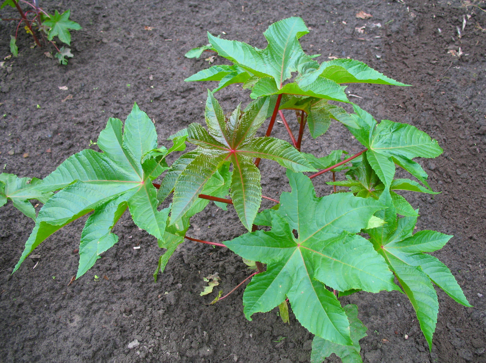
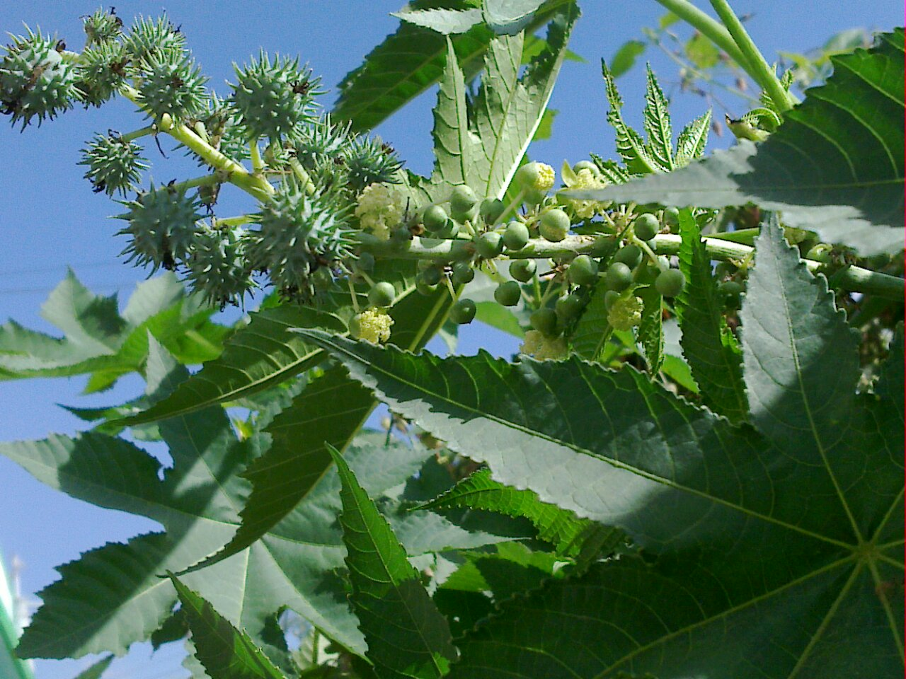
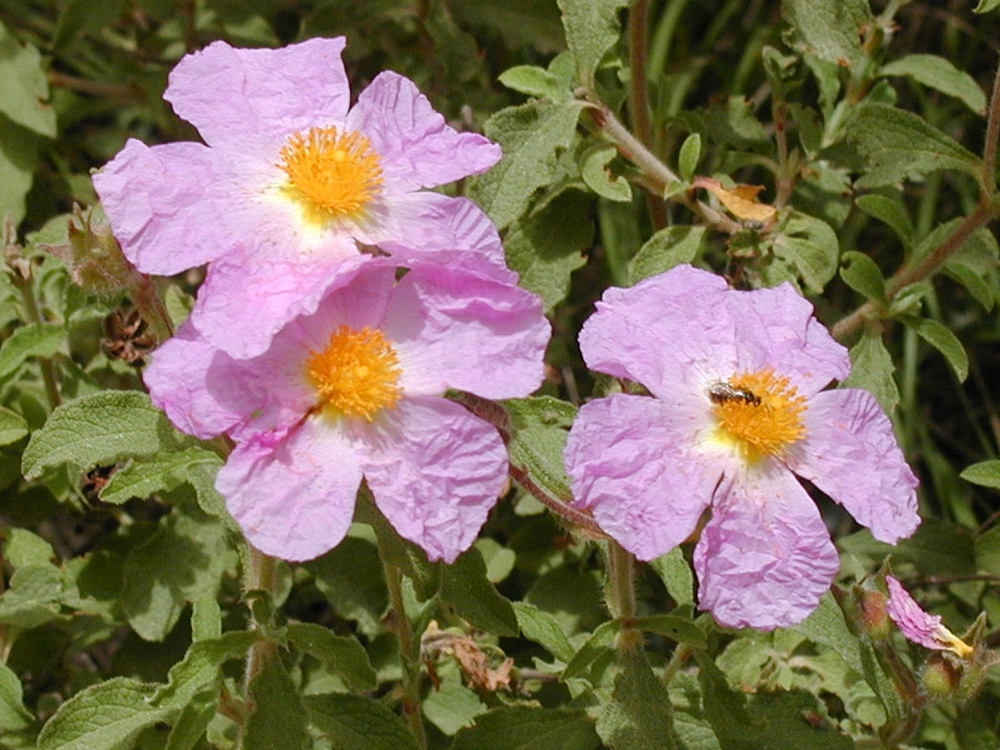
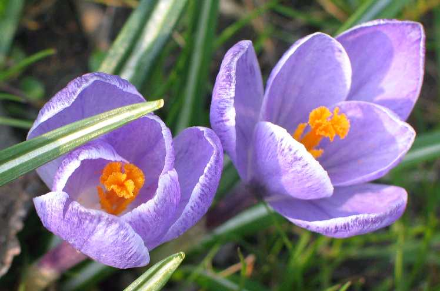

# Plants and Trees in the Bible

## License Information

Plants and Trees in the Bible © United Bible Societies, 2025. Adapted from: <cite>Each According to its Kind: Plants and Trees in the Bible</cite>, by Robert Koops © 2012 United Bible Societies. This work is licensed under Creative Commons Attribution-ShareAlike 4.0 International (<a href="https://creativecommons.org/licenses/by-sa/4.0/">https://creativecommons.org/licenses/by-sa/4.0/</a>).

--------------------------------

## Ointment and balm (medicinal plants) (id: FLORA:4.2)

4\.2 Ointment and balm (medicinal plants)
=========================================

As was mentioned earlier, many of the aromatic plants used for incense and perfumes are also believed to have curative powers. The ones listed below are those that are used primarily for healing: aloe, castor bean, liquidambar, opobalsamum, rock rose, saffron crocus, and tragacanth.
-------------------------------------------------------------------------------------------------------------------------------------------------------------------------------------------------------------------------------------------------------------------------------------------

To begin properly we must deal with definitions. As we said in the introduction to this chapter, the word “balm” is potentially confusing because it is used in a general sense as any oily or resinous substance used to treat injuries or reduce pain, but also as a particular species of plant and its derived resin, found in the Arabian Peninsula. We include it here in both senses. Note the heading above and the discussion of “balm” under [4\.2\.3 Liquidambar (Oriental sweetgum, storax)](#FLORA:4.2.3) and [4\.2\.4 Opobalsamum (balsam, balm)](#FLORA:4.2.4) below.

## Aloe (bitter aloe) (id: FLORA:4.2.1)

4\.2\.1 Aloe (bitter aloe)
==========================

Reference:”
-----------

Greek ἀλόη (aloē)

[JHN 19:39](https://ref.ly/Luke19:39)

Discussion:
-----------

The New Testament aloe must be distinguished from that mentioned in some versions of the Old Testament. In [NUM 24:6](https://ref.ly/Num24:6); [PSA 45:9](https://ref.ly/Ps45:9); and some other places aloe refers to chips of fragrant wood from the agarwood tree found in northern India (see [4\.1\.1](#FLORA:4.1.1)). However, the New Testament reference to aloe is to the True Aloe *Aloe vera*. This aloe originated in southern Africa, Arabia, and Madagascar. The gel\-like substance in the leaves of the aloe has been used as medicine for centuries, especially to treat burns and abrasions of the skin. It is also used as a laxative, and in modern times as an ingredient in all kinds of skin creams, soaps, shampoo, and even as a drink (in Asia), or as an additive to tea.

Description:
------------

The leaves of aloe plants are stiff, fleshy spines that come out like fat knife blades from the center of the plant. They have spiny margins and are mostly solid green in color, but some are spotted or blotched. Most aloes have no visible stem, but some do have stems, and can reach a height of more than a meter (3 feet). The plants produce clusters of small red or yellow tube\-like flowers that are borne on a stalk.

Special significance:
---------------------

[JHN 19:39](https://ref.ly/Luke19:39) mentions aloe along with myrrh as a mixture brought by Nicodemus to embalm the body of Jesus.

Translation:
------------

Aloes are native to southern Africa, Madagascar and Arabia, but are now found in tropical countries throughout the world. Translators in those areas will have local names for the plant. Since the one reference to aloe is a non\-rhetorical passage, a transliteration from a major language is advised, but it will depend on what is done with myrrh, the other word in the pair. Possibilities are Latin *alovera*, French *alowes*, and Spanish *asibar*.

* **Associated Passages:** John 19:39; Numbers 24:6; Psalms 45:9

## Castor oil plant (castor bean plant) (id: FLORA:4.2.2)

4\.2\.2 Castor oil plant (castor bean plant)
============================================

References:
-----------

Hebrew קִיקָיוֹן (qiqayon)

[JON 4:6](https://ref.ly/Jonah4:6), [JON 4:6](https://ref.ly/Jonah4:6), [JON 4:7](https://ref.ly/Jonah4:7), [JON 4:9](https://ref.ly/Jonah4:9), [JON 4:10](https://ref.ly/Jonah4:10)

Discussion:
-----------

The identity of Jonah’s *qiqayon* plant has been debated since the days of St. Jerome and St. Augustine. Zohary, Hepper, and Moldenke all advocate the castor oil plant (*Ricinus communis*) as the *qiqayon*, followed by NJB (New Jerusalem Bible (1985)), FFB, various commentaries, and some Bible encyclopedias. But KJV (King James Version (1611)) “gourd” has a long history, including its use in the Septuagint (*kolocuntha* in Greek; see [5\.2\.6 Wild gourd (colocynth, egusi, bitter apple)](#FLORA:5.2.6)) and in REB (Revised English Bible (1989)), NAB (New American Bible (1970)), Mft (Moffatt Translation (1926)), and AT (American Translation (Goodspeed, 1935)). The Vulgate translated *qiqayon* as *hedera* (“ivy”; see [1\.10 Ivy](#FLORA:1.10)) and that is used in Knox, but that rendering has not had further botanical support. In 1985 Robinson did an in\-depth study of the literature going back as far as St. Jerome and votes hesitantly for the gourd (colocynth). Some scholars even suggest it could be an Assyrian word inserted in the story just to make it sound foreign, or even a made\-up word.

Description:
------------

The castor oil plant can grow to a height of 3 meters (10 feet) and its dark green fan\-like leaves can reach half a meter across. It produces bunches of prickly round seeds on a stalk.

Special significance:
---------------------

Ancient people used the oil of the castor bean for medicine, often as a purgative. In the book of Jonah the plant is a key element of the dramatic confrontation between God and his strong\-willed prophet.

Translation:
------------

A number of translators have decided to avoid choosing between “gourd” and “castor oil plant” by selecting generic words here, for example, “vine” (CEV (Contemporary English Version), NIV (New International Version (1984))) and “plant” (RSV (Revised Standard Version (1952)), GNB (Good News Bible)). NJPSV (New Jewish Publication Society Version) has “ricinus,” which uses the Latin for “castor bean.” Since the castor bean is originally an African plant, it will be known by most translators there. Some may prefer to transliterate the term for it from a major language (for example, Arabic *karwa*; French *ricin*; Portuguese *ricino*, *bofarera*, *karapatero*; Spanish *catapucia*, *higuera*, *higuerillo*) or use a generic descriptive phrase such as “leafy bush.”

* **Associated Passages:** Jonah 4:6; Jonah 4:7; Jonah 4:9; Jonah 4:10

## Liquidambar (Oriental sweetgum, storax) (id: FLORA:4.2.3)

4\.2\.3 Liquidambar (Oriental sweetgum, storax)
===============================================

References:
-----------

Hebrew צֳרִי (tsori)

[GEN 37:25](https://ref.ly/Gen37:25), [GEN 43:11](https://ref.ly/Gen43:11), [JER 8:22](https://ref.ly/Jer8:22), [JER 46:11](https://ref.ly/Jer46:11), [JER 51:8](https://ref.ly/Jer51:8), [EZK 27:17](https://ref.ly/Ezek27:17)

Hebrew נָטָף (nataf)

[EXO 30:34](https://ref.ly/Exod30:34)

Greek στακτή (staktē)

[SIR 24:15](https://ref.ly/Wis24:15)

Discussion:
-----------

The Hebrew word *tsori* (“balm”) may be the basis for the word “storax,” which Zohary takes to be a name for the dried resin of the Liquidambar *Liquidambar orientalis*, a tree that is also called *kataf* or *nataf* in Hebrew. FFB and *The Anchor Bible Dictionary* (ABD (Anchor Bible Dictionary)) suggest that *tsori* is *Balanites aegyptiaca*, which grows in both Palestine and Egypt, but this position raises a question: Why would the Ishmaelite (or Midianite) traders carry it to Egypt if it is already plentiful there? It is more likely that the word is generic and could cover all kinds of medicinal spices.

The Hebrew word *nataf* does not occur outside of [EXO 30:34](https://ref.ly/Exod30:34) in the Bible. The Septuagint renders it *staktē*, which RSV (Revised Standard Version (1952)) transliterates as “stacte.” According to Zohary, *nataf* is a synonym of *tsori* (\= storax), which is found six times in the Bible. Hepper concedes this as possible but suggests that *nataf* may also be the opobalsamum (see [4\.2\.4 Opobalsamum (balsam, balm)](#FLORA:4.2.4)), which Zohary calls “balm.” The liquidambar (or storax) is a tree that used to grow widely in the Middle East and Turkey. It is quite a different tree from the streamside styrax (see [1\.22 Styrax](#FLORA:1.22)).

Description:
------------

The liquidambar tree grows to 10 meters (33 feet) tall, and has deeply incised leaves with five points and round yellow flowers on a 4 centimeter (2 inch) stalk. The fruits are prickly. The sticky gray\-brown gum is produced by making cuts in the trunk of the tree.

Special significance:
---------------------

The Jeremiah and Ezekiel references indicate that *tsori* was medicinal. We conclude from [EXO 30:34](https://ref.ly/Exod30:34) that it was aromatic. [GEN 37:25](https://ref.ly/Gen37:25) shows that it was highly valued in trade with Egypt.

Translation:
------------

The genus *Liquidambar* was widespread many thousands of years ago, according to fossil evidence, but it disappeared from Europe when the glaciers came. The surviving species, apart from *orientalis* in the Middle East, are *formosana* in South China and Taiwan and *styraciflua* in the eastern United States and Central America.

The references to *tsori* in Genesis and Ezekiel are non\-rhetorical, as is *nataf* in Exodus. If Zohary is correct, and the translator wants to be specific, then a transliteration of “storax” may be used in these passages. Alternatively, in [EXO 30:34](https://ref.ly/Exod30:34) translators can use a generic expression such as “resin” (NCV (New Century Version)) or “gum resin” (NIV (New International Version (1984)), REB (Revised English Bible (1989))); that is, they can use their local word for the globs of hardened sap that come from trees that produce it.

If a word for “sweet\-smelling healing ointment” exists, it can be used for *tsori* in Genesis. *Tsori* is the second of three spices the Ishmaelite traders carried in [GEN 37:25](https://ref.ly/Gen37:25), the other two being *neko’th* (“gum”) and *lot* (“myrrh”). Translators can cover all three words with a phrase such as “different kinds of sweet\-smelling medicine and incense.” Transliteration is also possible, from Hebrew *tsori* or Arabic *nakaa* /*nakati*. “Balm” in English is not a good basis for transliteration.

* **Associated Passages:** Genesis 37:25; Genesis 43:11; Jeremiah 8:22; Jeremiah 46:11; Jeremiah 51:8; Ezekiel 27:17; Exodus 30:34; Sirach 24:15

## Opobalsamum (balsam, balm) (id: FLORA:4.2.4)

4\.2\.4 Opobalsamum (balsam, balm)
==================================

References:
-----------

Hebrew בֹּשֶׂם (bosem)

[EXO 25:6](https://ref.ly/Exod25:6), [EXO 30:23](https://ref.ly/Exod30:23), [EXO 30:23](https://ref.ly/Exod30:23), [EXO 30:23](https://ref.ly/Exod30:23), [EXO 35:8](https://ref.ly/Exod35:8), [EXO 35:28](https://ref.ly/Exod35:28), [1KI 10:2](https://ref.ly/1Kgs10:2), [1KI 10:10](https://ref.ly/1Kgs10:10), [1KI 10:10](https://ref.ly/1Kgs10:10), [1KI 10:25](https://ref.ly/1Kgs10:25), [2KI 20:13](https://ref.ly/2Kgs20:13), [1CH 9:29](https://ref.ly/1Chr9:29), [1CH 9:30](https://ref.ly/1Chr9:30), [2CH 9:1](https://ref.ly/2Chr9:1), [2CH 9:9](https://ref.ly/2Chr9:9), [2CH 9:9](https://ref.ly/2Chr9:9), [2CH 9:24](https://ref.ly/2Chr9:24), [2CH 16:14](https://ref.ly/2Chr16:14), [2CH 32:27](https://ref.ly/2Chr32:27), [EST 2:12](https://ref.ly/Esth2:12), [SNG 4:10](https://ref.ly/Song4:10), [SNG 4:14](https://ref.ly/Song4:14), [SNG 4:16](https://ref.ly/Song4:16), [SNG 5:1](https://ref.ly/Song5:1), [SNG 5:13](https://ref.ly/Song5:13), [SNG 6:2](https://ref.ly/Song6:2), [SNG 8:14](https://ref.ly/Song8:14), [ISA 3:24](https://ref.ly/Isa3:24), [ISA 39:2](https://ref.ly/Isa39:2), [EZK 27:22](https://ref.ly/Ezek27:22)

Discussion:
-----------

The Hebrew word *bosem*, which is often rendered “balm” (derived from “balsam”), can refer to any type of aromatic healing substance, but it also designates the product of a particular tree, the Balsam or Opobalsamum *Commiphora gileadensis*. Arabs call it *balasam* or *balasham*. In the Talmud it is called *afarsimon*. Excavations near En Gedi have uncovered an ancient processing plant for balsam oil.

Moldenke is of the opinion that in [SNG 5:1](https://ref.ly/Song5:1) *bosem* (rendered “spice”) refers to gum tragacanth (see [4\.2\.7 Tragacanth (gum tragacanth)](#FLORA:4.2.7)). We support Zohary and Hepper who associate *bosem* with opobalsamum.

Description:
------------

The opobalsamum tree likes a desert or semi\-desert climate. It grows to 2–3 meters (7–10 feet) tall and has small, wrinkled, three\-part leaves, white flowers, and pea\-sized red berries that have a fragrant yellow seed inside. The bark of younger branches is gray, turning brown with age. The resin appears by itself in green droplets from the stems and branches, but collectors also make cuts in the branches to speed the process. The droplets turn from green to brown, clump together, and fall to the ground, where they are collected.

Special significance:
---------------------

In Bible times, balsam oil was used in holy anointing oil, as medicine, and as an ingredient of perfume.

Translation:
------------

A generic word or phrase for sweet\-smelling substances is appropriate to render *bosem*, although where a specific name for the balsam tree is available, as in southwestern Arabia and Somalia, this could also be used. At least one hundred species of the genus *Commiphora* are spread throughout dry areas of the world. Translators in some areas will know the plants; others may know only the dried resin of *Commiphora* sold in spice markets.

* **Associated Passages:** Exodus 25:6; Exodus 30:23; Exodus 35:8; Exodus 35:28; 1 Kings 10:2; 1 Kings 10:10; 1 Kings 10:25; 2 Kings 20:13; 1 Chronicles 9:29; 1 Chronicles 9:30; 2 Chronicles 9:1; 2 Chronicles 9:9; 2 Chronicles 9:24; 2 Chronicles 16:14; 2 Chronicles 32:27; Esther 2:12; Song of Songs 4:10; Song of Songs 4:14; Song of Songs 4:16; Song of Songs 5:1; Song of Songs 5:13; Song of Songs 6:2; Song of Songs 8:14; Isaiah 3:24; Isaiah 39:2; Ezekiel 27:22

## Rock rose (ladanum) (id: FLORA:4.2.5)

4\.2\.5 Rock rose (ladanum)
===========================

References:
-----------

Hebrew לֹט (lot)

[GEN 37:25](https://ref.ly/Gen37:25), [GEN 43:11](https://ref.ly/Gen43:11)

Discussion:
-----------

In Genesis the Hebrew word *lot* is mistakenly rendered “myrrh” by RSV (Revised Standard Version (1952)) and some other versions. It should be translated “ladanum,” which is a sticky juice that comes out on the hairy leaves of a low shrub called Cistus or Turkish Rock Rose *Cistus laurifolius*. It hardens and is sold in fragrant chunks that are ground and made into medicine for cough, catarrh, and dysentery. Hepper says it was used also as perfume.

In North Africa ladanum is called *latai* (compare Assyrian *ladanu*). The Aramaic translation of Hebrew *lot* is *letem*, similar to the post\-biblical Hebrew name *lotem*.

Description:
------------

The rock rose shrub grows to about 70 centimeters (28 inches) high and has hairy leaves and large pink flowers.

Special significance:
---------------------

People in the Near East collect the globs of sap that appear on the leaves of ladanum. They use small rakes with soft leather strips instead of metal teeth. On the island of Cyprus local farmers collect the gum by combing the beards of their goats that had foraged on the plants. Today it is used primarily in the manufacture of incense.

Translation:
------------

The references to ladanum are non\-metaphorical, so translators have traditionally used a generic expression for it (for example, Mft (Moffatt Translation (1926)) with: “fragrant gum”) or a transliteration (for example, AT (American Translation (Goodspeed, 1935)) with “laudanum”). Other possible models are for transliteration are Hebrew *lot* and Arabic *ladan*.

[EXO 30:34](https://ref.ly/Exod30:34): Most commentators, perhaps influenced by the Septuagint, take the Hebrew word *shecheleth* (“onycha”) as referring to “onyx,” a kind of stone, not a plant. Zohary does not discuss it. Given the context (a list of ingredients for incense), both FFB and Hepper feel it is probably a resin\-producing plant, possibly of the genus *Cistus*, like ladanum. Moldenke suggests that onycha may have applied to two substances, one being some kind of resin, and the other a substance coming from the shell of a mollusk living in the Mediterranean Sea. The resin option is supported by the fact that Arabic versions of the Bible have *ladana*, implying that the substance was ladanum. In view of the uncertainty about the identity of *shecheleth*, the easy way out for translators is to transliterate from a major language such as English (*onika*, *oniki*). For those who want to be more specific, “mollusk scent” (Durham) or “aromatic shell” (REB (Revised English Bible (1989))) could be considered.

* **Associated Passages:** Genesis 37:25; Genesis 43:11; Exodus 30:34

## Saffron crocus (id: FLORA:4.2.6)

4\.2\.6 Saffron crocus
======================

Reference:”
-----------

Hebrew כַּרְכֹּם (karkom)

[SNG 4:14](https://ref.ly/Song4:14)

Discussion:
-----------

Our experts agree on the identification of the Hebrew word *karkom* with the Saffron Crocus *Crocus sativus*, but there are others who identify it as the Indian plant Turmeric *Curcuma longa* on the basis of its Arabic name *kurkum* or *kurkam*. However, according to Moldenke, Arabic *kurkum* refers to the plant, and the product from it is called *saferan*, from which we get the English word “saffron” (compare Arabic *asfar*, meaning “yellow”). Saffron is now widely known as a food additive and dye, but in Bible times it was also considered a perfume and medicine. It comes from the reddish\-purple flowers of the crocus, which grew throughout Asia Minor in Bible times. Since then it has been widely cultivated in Europe, England, and America. The English word “crocus” comes from Hebrew *karkom* via Greek *krokos*.

Archeological records indicate that saffron was cultivated in the seventh century B.C. in Assyria and later in Crete (Bronze Age). Saffron\-based paint has been found in four thousand year old pictures in what is today Iraq. The Sumerians used saffron for medicine and magical potions and traded it with other kingdoms. International trade reached a peak with the Minoans in the second millennium B.C. Use of saffron spread into Asia via the Persians and/or the Mongol invaders, and today Buddhist monks in India wear saffron\-colored robes. Merchants in the Middle East sell dried safflower (*Carthamus tinctorius*) as *saferan*, but real saffron comes only from crocus flowers. The fake saffron is appropriately called *alazor bastardo* in Spanish and *safran batard* in French.

Description:
------------

Crocus plants have long, tapered grasslike leaves growing from an onion\-like bulb under the ground. They grow to less than 13 centimeters (5 inches) in height and have beautiful reddish or purple flowers.

Special significance:
---------------------

In Bible times saffron was used as perfume and as medicine, but today it is mostly known as a coloring agent for cloth and food. One reason why it was costly is that it takes about six hundred flowers to produce a few drops of oil.

Translation:
------------

Since Bible times the saffron crocus has been grown mostly in the Mediterranean basin, but it also thrives in India, Oceania, and North Africa, so in those places local words will likely be found. Elsewhere, transliteration from a major language is recommended (for example Arabic *asfar*, *zafaran*, *kruku*, *kurkum*; French *safran*; Portuguese *asafrao*; Spanish *azafran*).

* **Associated Passages:** Song of Songs 4:14

## Tragacanth (gum tragacanth) (id: FLORA:4.2.7)

4\.2\.7 Tragacanth (gum tragacanth)
===================================

References:
-----------

Hebrew נְכֹאת (neko’th)

[GEN 37:25](https://ref.ly/Gen37:25), [GEN 43:11](https://ref.ly/Gen43:11)

Discussion:
-----------

*Neko’th* (“gum”) is the first of three spices mentioned in [GEN 37:25](https://ref.ly/Gen37:25) as being carried by the Ishmaelites along with *tsori* (“balm”) and *lot* (mistranslated as “myrrh”) to Egypt. In [GEN 43:11](https://ref.ly/Gen43:11) Jacob urges his sons to carry some *neko’th* to Egypt as a gift to the Pharaoh. It was an important ingredient of incense and was probably used for medicine as well. The Hebrew word *neko’th* refers to tragacanth. Most the eighteen hundred species of tragacanth (commonly called “milk vetches”) of the genus *Astragalus* produce tragacanth gum, but the ones growing in Judea and Gilead (*Astragalus gummifer* and *Astragalus bethlehemiticus*) are outstanding in their production.

Description:
------------

The tragacanth shrub grows to about 50 centimeters (20 inches) in height and branches densely right from the base. Some of the plants at high elevations or in poor soil cling to the ground looking like sea anemones or pin cushions, with their sharp spines. The flowers, which grow from the point where the leaf joins the stem, give way to tiny wooly fruits that disperse in the wind.

Special significance:
---------------------

The gum of the tragacanth shrub is stored in the roots, providing moisture for the plant during the dry season. People who collect the sap expose a root, make a cut in it, and place a cup where it will catch the globs of sap that ooze from the root. They often have many plants that they tap in this way. Tapping typically begins in June. Today tragacanth is still used in incense and medicine, but also in leatherworking, baking, and even in the production of cigars.

Translation:
------------

*Neko’th* is rendered “gum tragacanth” by REB (Revised English Bible (1989)) and NJB (New Jerusalem Bible (1985)), and “spices” by GNB (Good News Bible), NIV (New International Version (1984)), NLT (New Living Translation), and NCV (New Century Version). In [GEN 37:25](https://ref.ly/Gen37:25) GW (God's Word Translation) handles the set of three substances nicely by saying “materials for cosmetics, medicine, and embalming.” The Arabic word for the plant is *nakaa* or *nakaath*.

The Genesis contexts are both non\-rhetorical, so the translator may choose a general phrase to cover all of the terms in the list. If not, *neko’th* may be rendered “rubbing medicine,” or a transliteration from a major language may be used. A transliteration from English is “tiragacanti,” but this is unwieldy. If there is a word for the dried sap (gum) of trees, that could be used by itself or in combination with a transliteration. Arabic *nakaa* may be useful in some places.

* **Associated Passages:** Genesis 37:25; Genesis 43:11

