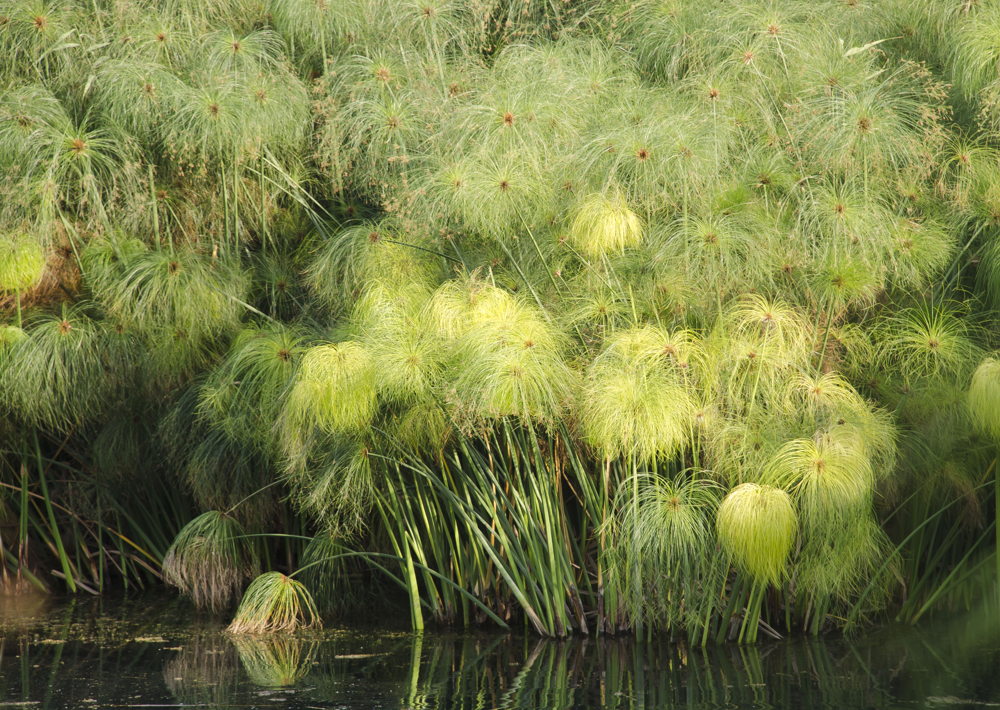
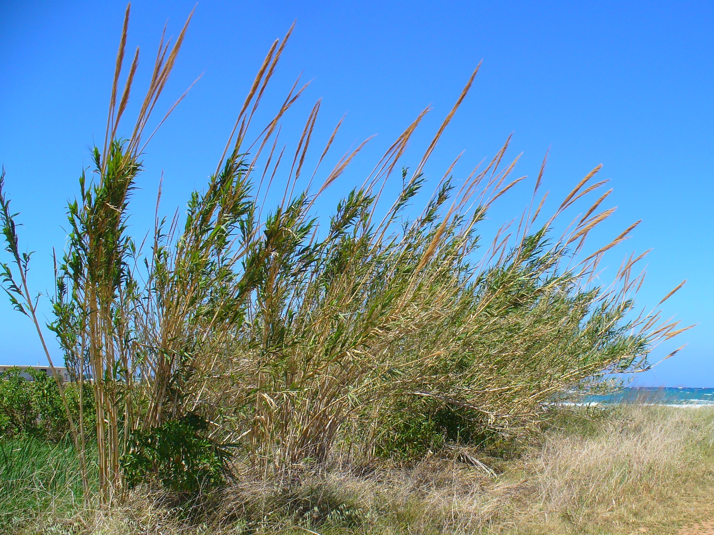
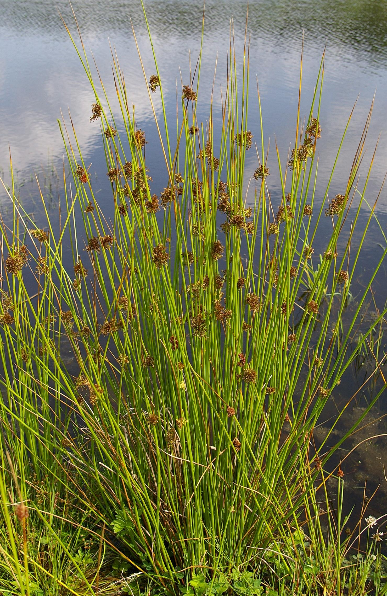
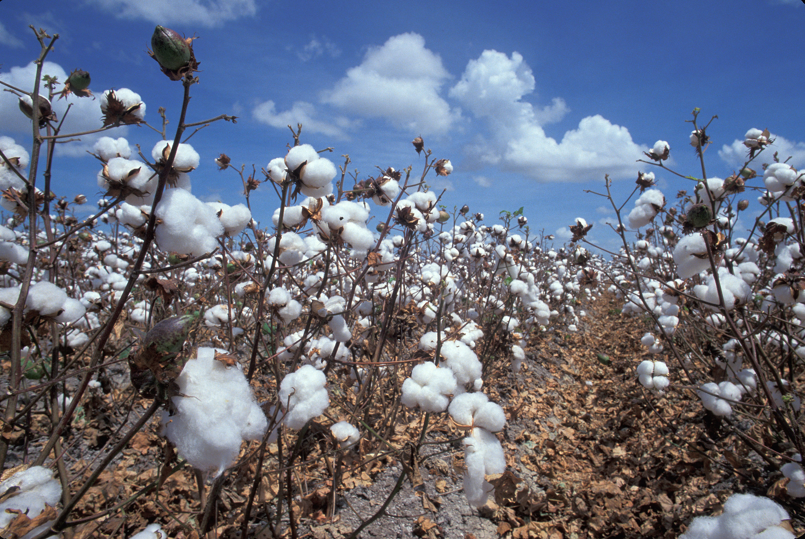
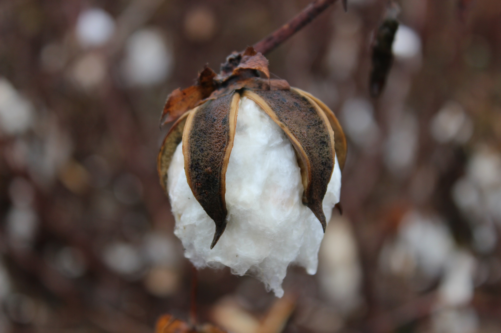
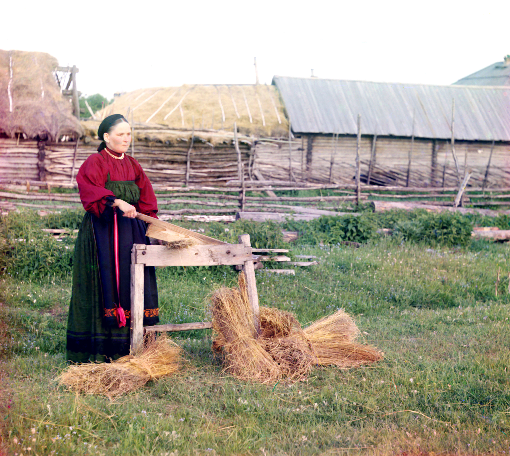
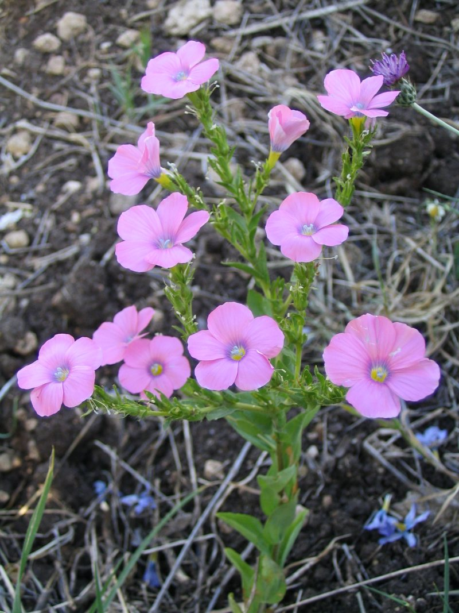

# Plants and Trees in the Bible

## License Information

Plants and Trees in the Bible © United Bible Societies, 2025. Adapted from: <cite>Each According to its Kind: Plants and Trees in the Bible</cite>, by Robert Koops © 2012 United Bible Societies. This work is licensed under Creative Commons Attribution-ShareAlike 4.0 International (<a href="https://creativecommons.org/licenses/by-sa/4.0/">https://creativecommons.org/licenses/by-sa/4.0/</a>).

--------------------------------

## Plants for weaving and building (id: FLORA:5.1)

5\.1 Plants for weaving and building
====================================

We begin this section with the usual survey of generic expressions. While some of us think of grass as the green stuff that has to be removed from the farm before planting, or the stuff surrounding our house that needs to be cut short regularly, botanists look at a mammoth family of plants (*Poaceae*) containing over nine thousand species grouped into six hundred genera. The family includes the major food grains (cereals) grown around the world: rice, maize, sorghum, wheat, barley, quinoa, rye, and others. It includes bamboo, which is a major construction material, as well as reeds and canes used for baskets, beds, musical instruments, paper, and chairs. Even sugarcane is a type of grass. All have hollow stems, joints where leaves protrude, sheaths protecting the base of the leaf, a seed head of some type with tiny, wind\-pollinated flowers lacking petals, and narrow sword\-shaped leaves that grow at the base, not at the tip.
---------------------------------------------------------------------------------------------------------------------------------------------------------------------------------------------------------------------------------------------------------------------------------------------------------------------------------------------------------------------------------------------------------------------------------------------------------------------------------------------------------------------------------------------------------------------------------------------------------------------------------------------------------------------------------------------------------------------------------------------------------------------------------------------------------------------------------------------------------------------------------------------------------------------------------------------------------------------------

[GEN 1:11](https://ref.ly/Gen1:11); [GEN 1:12](https://ref.ly/Gen1:12) gives us a good introduction to the problem of generic and specific vocabulary in Hebrew. God’s speech in verse 11 begins literally “Let the earth sprout \[*tadshe’* ] sprouts \[*deshe’* ], plants \[*‘esev* ] bearing seed, and fruit trees bearing fruit … .” Scholars continue to debate about the Hebrew word *deshe’*. Is it a generic word introducing the two categories that follow, or is it the first of three categories: grass, seed plants, and fruit trees? (See the Discussion and Translation under [5\.1\.2 Grass](#FLORA:5.1.2) for more detail.).

Another generic Hebrew expression is found in [GEN 1:30](https://ref.ly/Gen1:30), where God gives *yereq ‘esev* (“green plants”) to the animals for food. Interestingly, in [GEN 9:3](https://ref.ly/Gen9:3) the same *yereq ‘esev* is to serve as food for Noah in the ark along with the meat of animals.

The generic Hebrew word *siach* also needs to be mentioned. This word usually means “complaint,” “musing,” “meditation,” or “chatter.” In a few places it refers to “bushes” or “shrubs.” It occurs with the latter meaning in [GEN 2:5](https://ref.ly/Gen2:5); [GEN 21:15](https://ref.ly/Gen21:15); [JOB 30:4](https://ref.ly/Job30:4); [JOB 30:7](https://ref.ly/Job30:7).

* **Associated Passages:** Genesis 1:11; Genesis 1:12; Genesis 1:30; Genesis 9:3; Genesis 2:5; Genesis 21:15; Job 30:4; Job 30:7

## Cattail (reed-mace) (id: FLORA:5.1.1)

5\.1\.1 Cattail (reed\-mace)
============================

References:
-----------

Hebrew סוּף (suf)

[EXO 2:3](https://ref.ly/Exod2:3), [EXO 2:5](https://ref.ly/Exod2:5), [ISA 19:6](https://ref.ly/Isa19:6), [JON 2:6](https://ref.ly/Jonah2:6)

Discussion:
-----------

*Cattails (Bogdan (Wikimedia Commons))*

The Hebrew word *suf* probably designates more than one species of the cattail, also called “reed\-mace” and “bulrush.” There are two in Israel: *Typha domingensis* and *Typha latifolia* (*Typha australis* according to Zohary). Both species like to stand in the slow\-moving water on the edge of rivers and streams. The reference to *suf* (“weeds”) in [JON 2:6](https://ref.ly/Jonah2:6) (5\) supports Zohary’s conjecture that *suf* may be a collective name for many water plants. *Suf* is paired with *qaneh* (“reeds”) in [ISA 19:6](https://ref.ly/Isa19:6), so it is almost certainly the cattail since both are found in marshes and slow streams.

Some writers have suggested that the “reed” placed in the hand of Jesus at his mock trial was a cattail stalk ([MAT 27:29](https://ref.ly/Matt27:29)). Others have countered that a cattail flower stalk would not have been ripe that early in the year. But it could also have been a stalk from the previous season. The debate continues.

Description:
------------

The cattail reaches 3 meters (10 feet) in height and is notable for its soft, fuzzy brown seed head that eventually disintegrates into fluffy material that blows away in the wind and floats on the water. The plant also spreads through its thick roots, which creep along the bottom of shallow lakes and streams. Its leaves are long, erect, and sharply pointed.

Special significance:
---------------------

In Bible times, as now, the leaves of cattails were used for baskets and mats. The thick roots are edible, as are the pollen and the young green stalks. The cattails of Exodus are famous as the plants among which the mother of Moses hid her son in his little floating basket.

Translation:
------------

Most kinds of cattail are found in Europe and North America, where the leaves are used for mats and chair seats. Some *Typha* species in India (*Typha elephantina*) are used for making paper and ornaments. Translators who live near rivers may have other reed\-like plants that can be used, keeping in mind that there are four reed\-like plants mentioned in the Bible (see also [5\.1\.3 Papyrus](#FLORA:5.1.3), [5\.1\.4 Reed (common reed, giant reed)](#FLORA:5.1.4), and [5\.1\.5 Rush (bulrush, sedge)](#FLORA:5.1.5). In [EXO 2:3](https://ref.ly/Exod2:3); [EXO 2:5](https://ref.ly/Exod2:5) a number of English versions use the generic word “reeds” (RSV (Revised Standard Version (1952)), NRSV (New Revised Standard Version (1989)), NIV (New International Version (1984)), LB (Living Bible (1971)), REB (Revised English Bible (1989)), NJB (New Jerusalem Bible (1985)), NJPSV (New Jewish Publication Society Version)). GW (God's Word Translation) has “papyrus plants,” but the experts prefer to see papyrus associated with the Hebrew word *gome’*. In communities that are unfamiliar with waterside vegetation, generic expressions such as “tall grass” (GNB (Good News Bible), CEV (Contemporary English Version)) or “tall stalks of grass” (NCV (New Century Version)) may be effective. The basic options for rendering *suf* in Exodus and Isaiah are:

1\. a local grass that grows in streams and rivers;

2\. a generic word such as “grass”;

3\. a descriptive phrase such as “tall grass.”

The word *suf* has a different sense in [JON 2:6](https://ref.ly/Jonah2:6) (5\). In this passage the plants are living in the water without roots or are perhaps rooted in the bottom of a shallow sea. So translations typically use “seaweed” (GNB (Good News Bible), CEV (Contemporary English Version), NLT (New Living Translation), GW (God's Word Translation), REB (Revised English Bible (1989))), a plant with long, grass\-like leaves that is often not attached to the soil under the sea.

If specific transliterations of *suf* are needed, adaptations of the following major language words could be considered: Arabic *bardi*, *but*, *dadi*, *tifa*; French *jonc*, *marset*; Portuguese *murao*, *tabua*; and Spanish *aseña*, *enea*, *espadaina*, *españada*, *junco*, *macio*, *totora*, *tule espidilla*.

The Hebrew expression *yam suf* (literally “sea of reeds”) has been translated somewhat inaccurately by the Septuagint translators and many others as “Red Sea.” *A Handbook on Exodus* recommends following the Hebrew, which is literally “Sea of Reeds,” or the modern equivalent “Gulf of Suez” as in GNB (Good News Bible), unless there is a strong tradition in the receptor culture for “Red Sea.” If “Red Sea” is used, then a footnote should be added, giving “Sea of Reeds” as the literal meaning of the Hebrew text.

* **Associated Passages:** Exodus 2:3; Exodus 2:5; Isaiah 19:6; Jonah 2:6; Matthew 27:29

## Grass (id: FLORA:5.1.2)

5\.1\.2 Grass
=============

References:
-----------

Hebrew אָחוּ (’achu)

[GEN 41:2](https://ref.ly/Gen41:2), [GEN 41:18](https://ref.ly/Gen41:18), [JOB 8:11](https://ref.ly/Job8:11)

Hebrew דשׁא (dasha’ (verb))

[GEN 1:11](https://ref.ly/Gen1:11), [JOL 2:22](https://ref.ly/Joel2:22)

Hebrew דֶּשֶׁא (deshe’)

[GEN 1:11](https://ref.ly/Gen1:11), [GEN 1:12](https://ref.ly/Gen1:12), [DEU 32:2](https://ref.ly/Deut32:2), [2SA 23:4](https://ref.ly/2Sam23:4), [2KI 19:26](https://ref.ly/2Kgs19:26), [JOB 6:5](https://ref.ly/Job6:5), [JOB 38:27](https://ref.ly/Job38:27), [PSA 23:2](https://ref.ly/Ps23:2), [PSA 37:2](https://ref.ly/Ps37:2), [PRO 27:25](https://ref.ly/Prov27:25), [ISA 15:6](https://ref.ly/Isa15:6), [ISA 37:27](https://ref.ly/Isa37:27), [ISA 66:14](https://ref.ly/Isa66:14), [JER 14:5](https://ref.ly/Jer14:5)

Hebrew דֶּתֶא (dethe’)

[DAN 4:12](https://ref.ly/Dan4:12), [DAN 4:20](https://ref.ly/Dan4:20)

Hebrew חָצִיר (chatsir)

[1KI 18:5](https://ref.ly/1Kgs18:5), [2KI 19:26](https://ref.ly/2Kgs19:26), [JOB 8:12](https://ref.ly/Job8:12), [JOB 40:15](https://ref.ly/Job40:15), [PSA 37:2](https://ref.ly/Ps37:2), [PSA 90:5](https://ref.ly/Ps90:5), [PSA 103:15](https://ref.ly/Ps103:15), [PSA 104:14](https://ref.ly/Ps104:14), [PSA 129:6](https://ref.ly/Ps129:6), [PSA 147:8](https://ref.ly/Ps147:8), [PRO 27:25](https://ref.ly/Prov27:25), [ISA 15:6](https://ref.ly/Isa15:6), [ISA 34:13](https://ref.ly/Isa34:13), [ISA 35:7](https://ref.ly/Isa35:7), [ISA 37:27](https://ref.ly/Isa37:27), [ISA 40:6](https://ref.ly/Isa40:6), [ISA 40:7](https://ref.ly/Isa40:7), [ISA 40:7](https://ref.ly/Isa40:7), [ISA 40:8](https://ref.ly/Isa40:8), [ISA 44:4](https://ref.ly/Isa44:4), [ISA 51:12](https://ref.ly/Isa51:12)

Hebrew חֲשַׁשׁ (chashash)

[ISA 5:24](https://ref.ly/Isa5:24), [ISA 33:11](https://ref.ly/Isa33:11)

Hebrew יֶרֶק (yereq)

[GEN 1:30](https://ref.ly/Gen1:30), [GEN 9:3](https://ref.ly/Gen9:3), [EXO 10:15](https://ref.ly/Exod10:15), [NUM 22:4](https://ref.ly/Num22:4), [2KI 19:26](https://ref.ly/2Kgs19:26), [PSA 37:2](https://ref.ly/Ps37:2), [ISA 15:6](https://ref.ly/Isa15:6), [ISA 37:27](https://ref.ly/Isa37:27)

Hebrew מִרְעֶה (mir‘eh)

[GEN 47:4](https://ref.ly/Gen47:4), [1CH 4:39](https://ref.ly/1Chr4:39), [1CH 4:40](https://ref.ly/1Chr4:40), [1CH 4:41](https://ref.ly/1Chr4:41), [JOB 39:8](https://ref.ly/Job39:8), [ISA 32:14](https://ref.ly/Isa32:14), [LAM 1:6](https://ref.ly/Lam1:6), [EZK 34:14](https://ref.ly/Ezek34:14), [EZK 34:14](https://ref.ly/Ezek34:14), [EZK 34:18](https://ref.ly/Ezek34:18), [EZK 34:18](https://ref.ly/Ezek34:18), [JOL 1:18](https://ref.ly/Joel1:18), [NAM 2:12](https://ref.ly/Nah2:12)

Hebrew עֲשַׂב (‘asav)

[DAN 4:12](https://ref.ly/Dan4:12), [DAN 4:22](https://ref.ly/Dan4:22), [DAN 4:29](https://ref.ly/Dan4:29), [DAN 4:30](https://ref.ly/Dan4:30), [DAN 5:21](https://ref.ly/Dan5:21)

Hebrew עֵשֶׂב (‘esev)

[GEN 1:11](https://ref.ly/Gen1:11), [GEN 1:12](https://ref.ly/Gen1:12), [GEN 1:29](https://ref.ly/Gen1:29), [GEN 1:30](https://ref.ly/Gen1:30), [GEN 2:5](https://ref.ly/Gen2:5), [GEN 3:18](https://ref.ly/Gen3:18), [GEN 9:3](https://ref.ly/Gen9:3), [EXO 9:22](https://ref.ly/Exod9:22), [EXO 9:25](https://ref.ly/Exod9:25), [EXO 10:12](https://ref.ly/Exod10:12), [EXO 10:15](https://ref.ly/Exod10:15), [EXO 10:15](https://ref.ly/Exod10:15), [DEU 11:15](https://ref.ly/Deut11:15), [DEU 29:22](https://ref.ly/Deut29:22), [DEU 32:2](https://ref.ly/Deut32:2), [2KI 19:26](https://ref.ly/2Kgs19:26), [JOB 5:25](https://ref.ly/Job5:25), [PSA 72:16](https://ref.ly/Ps72:16), [PSA 92:8](https://ref.ly/Ps92:8), [PSA 102:5](https://ref.ly/Ps102:5), [PSA 102:12](https://ref.ly/Ps102:12), [PSA 104:14](https://ref.ly/Ps104:14), [PSA 105:35](https://ref.ly/Ps105:35), [PSA 106:20](https://ref.ly/Ps106:20), [PRO 19:12](https://ref.ly/Prov19:12), [PRO 27:25](https://ref.ly/Prov27:25), [ISA 37:27](https://ref.ly/Isa37:27), [ISA 42:15](https://ref.ly/Isa42:15), [JER 12:4](https://ref.ly/Jer12:4), [JER 14:6](https://ref.ly/Jer14:6), [AMO 7:2](https://ref.ly/Amos7:2), [MIC 5:6](https://ref.ly/Mic5:6), [ZEC 10:1](https://ref.ly/Zech10:1)

Greek βοτάνη (botanē)

[HEB 6:7](https://ref.ly/Heb6:7), [WIS 16:12](https://ref.ly/Wis16:12)

Greek λάχανον (lachanon)

[MAT 13:32](https://ref.ly/Matt13:32), [MRK 4:32](https://ref.ly/Mark4:32), [LUK 11:42](https://ref.ly/Luke11:42), [ROM 14:2](https://ref.ly/Rom14:2)

Greek χλόη (chloē)

[SIR 40:22](https://ref.ly/Sir40:22), [SIR 43:21](https://ref.ly/Sir43:21)

Greek χόρτος (chortos)

[MAT 6:30](https://ref.ly/Matt6:30), [MAT 13:26](https://ref.ly/Matt13:26), [MAT 14:19](https://ref.ly/Matt14:19), [MRK 4:28](https://ref.ly/Mark4:28), [MRK 6:39](https://ref.ly/Mark6:39), [LUK 12:28](https://ref.ly/Luke12:28), [JHN 6:10](https://ref.ly/John6:10), [1CO 3:12](https://ref.ly/1Cor3:12), [JAS 1:10](https://ref.ly/Jas1:10), [JAS 1:11](https://ref.ly/Jas1:11), [1PE 1:24](https://ref.ly/1Pet1:24), [1PE 1:24](https://ref.ly/1Pet1:24), [1PE 1:24](https://ref.ly/1Pet1:24), [REV 8:7](https://ref.ly/Rev8:7), [REV 9:4](https://ref.ly/Rev9:4), [SIR 40:16](https://ref.ly/Sir40:16)

Latin faenum

[2ES 9:27](https://ref.ly/2Esd9:27), [2ES 15:42](https://ref.ly/2Esd15:42)

Discussion:
-----------

*Grass (Ray Pritz (UBS))*

There are over 450 species of grass in the Holy Land, and it is unlikely that the Hebrew, Aramaic, Greek, and Latin words above refer to particular species. They are probably generic words that have at one time or other, or in one place or another, referred to various kinds of grass.

According to Zohary, in [GEN 41:2](https://ref.ly/Gen41:2); [GEN 41:18](https://ref.ly/Gen41:18) the Hebrew word *’achu* (“reed grass”) refers not to a kind of grass but to “damp swampy land used for grazing” (page 127; see KJV (King James Version (1611)) “meadow”). However, [JOB 8:11](https://ref.ly/Job8:11) seems to speak specifically of some kind of plant (parallel to papyrus), stating that *’achu* cannot grow where there is no water.

The Hebrew word *chashash* in [ISA 5:24](https://ref.ly/Isa5:24) is used for dry grass, parallel to stubble, referring to the wicked who will be burned up. In [ISA 33:11](https://ref.ly/Isa33:11) the futile plans of the wicked are likened to *chashash*, again parallel to stubble.

The eight occurrences of the Hebrew word *yereq* (“green”) in the Old Testament refer to vegetation. Most of them occur in a phrase such as *yereq ‘esev* (rendered “green plant” in [GEN 1:30](https://ref.ly/Gen1:30); [GEN 9:3](https://ref.ly/Gen9:3)) or *yereq deshe’* (rendered “tender grass” or “green herb” in [2KI 19:26](https://ref.ly/2Kgs19:26); [PSA 37:2](https://ref.ly/Ps37:2); [ISA 37:27](https://ref.ly/Isa37:27)). However, in three passages *yereq* stands alone (rendered “grass,” “verdue,” or “green thing” in [EXO 10:15](https://ref.ly/Exod10:15); [NUM 22:4](https://ref.ly/Num22:4); [ISA 15:6](https://ref.ly/Isa15:6)).

The Hebrew word *deshe’* is sometimes translated “grass.” It usually occurs in rhetorical contexts, where it is often parallel to *chatsir*, *yereq*, or *‘esev*.

The Hebrew word *‘esev* occurs thirty\-three times in the Bible and is translated by RSV (Revised Standard Version (1952)) as “plant” in twelve of them, as “grass” in twelve, as “herb” or “herbage” in five, and as “vegetation” in four. Since there may be languages that have no generic word like “plant,” they may be able to use their word for “grass” or “growing things” in many of these passages when it is appropriate.

There are a number of words for “pasture,” the grassy fields in which sheep, goats, and cows like to graze. Hebrew has not less than five words: apart from *mir‘eh*, listed above, there are also *migrash* (114 times, mostly in Joshua and 1 Chronicles), *dover* ([ISA 5:17](https://ref.ly/Isa5:17); [MIC 2:12](https://ref.ly/Mic2:12)), *kar* ([PSA 37:20](https://ref.ly/Ps37:20); [PSA 65:14](https://ref.ly/Ps65:14); [ISA 30:23](https://ref.ly/Isa30:23)), and *nawah* (11 times).

Apart from all of the above, there is also the Hebrew word *teven*, which is translated “straw”—dried grass used for bricks and as bedding for animals. For example, this word occurs in [GEN 24:25](https://ref.ly/Gen24:25); [GEN 24:32](https://ref.ly/Gen24:32), but translators need to be aware that “straw” for the camels was not for the camels to eat but rather was put on the ground to absorb the urine of the animals.

There are two Hebrew words that are usually translated “fodder” (that is, animal food) or “provender”: *belil* ([JOB 6:5](https://ref.ly/Job6:5); [JOB 24:6](https://ref.ly/Job24:6); [ISA 30:24](https://ref.ly/Isa30:24)) and *mispo’* ([GEN 24:25](https://ref.ly/Gen24:25), [GEN 24:32](https://ref.ly/Gen24:32); [GEN 42:27](https://ref.ly/Gen42:27); [GEN 43:24](https://ref.ly/Gen43:24); [JDG 19:19](https://ref.ly/Judg19:19)). These words probably refer to some type of grass.

In the New Testament the Greek word *chortos* occurs fifteen times and is usually translated by RSV (Revised Standard Version (1952)) as “grass.”

The Greek word *lachanon* occurs four times in the New Testament. It is a generic term for garden plants that can be translated according to its context. In [MAT 13:32](https://ref.ly/Matt13:32); [MRK 4:32](https://ref.ly/Mark4:32) the mustard seed grows to become bigger than all the *lachanon* (“shrubs”) of the garden. The Pharisees tithe mint, rue, and every *lachanon* (“herb”) in [LUK 11:42](https://ref.ly/Luke11:42). The weaker brother of [ROM 14:2](https://ref.ly/Rom14:2) eats only *lachanon* (“vegetables”).

The Greek word *botanē* is another generic term. It is translated “vegetation” in [HEB 6:7](https://ref.ly/Heb6:7).

In the Deuterocanon the Greek word *chloē* means “young green growth” ([SIR 40:22](https://ref.ly/Sir40:22); [SIR 43:21](https://ref.ly/Sir43:21)). This same word occurs in the Septuagint to translate the Hebrew word *deshe’* ([2SA 23:4](https://ref.ly/2Sam23:4); [2KI 19:26](https://ref.ly/2Kgs19:26); [JOB 38:27](https://ref.ly/Job38:27); [PSA 23:2](https://ref.ly/Ps23:2); [PSA 37:2](https://ref.ly/Ps37:2)).

Description:
------------

Grass is so common to most translators that no description is needed. However, for translators who live above the Arctic Circle or in inhospitable deserts, the grasses of the lands of the Bible may cause problems. A common problem is having too many specific words and no generic one. I recall a translation team in Niger (Tamasheq) that really struggled with “sat down on the green grass” in [MRK 6:39](https://ref.ly/Mark6:39), because the only grass they knew (appearing in the short rainy season), was not something anyone would want to sit on. Grass can be described as being less than a meter (3 feet) high, with narrow, green, upright leaves, usually growing in bunches or clumps.

Special significance:
---------------------

In [PSA 90:5](https://ref.ly/Ps90:5) and [ISA 40:6](https://ref.ly/Isa40:6); [ISA 40:7](https://ref.ly/Isa40:7) grass is used in a metaphor to emphasize the short lives of human beings. In [MAT 6:30](https://ref.ly/Matt6:30) Jesus uses “grass of the field” as something of little value compared to human beings.

Translation:
------------

In the case of some African languages, a word translated “grass” actually refers to “unexploited vegetation” in contrast to plants used for food, medicine, and utensils. It is possible that such a distinction was present in Hebrew as well, but at this point we don’t know about it. Before translating, it will be important to investigate how the local people categorize the plant world. Once the local taxonomy is known, the translators can decide how much or how little of it they want to use, depending on their general principles of accommodation in the translation as a whole.

Where possible, the Hebrew word *deshe’* should carry the meaning of new growth or fresh sprouts of a plant. Since it usually occurs in rhetorical contexts and is often parallel with other references to grass, the translator needs to think of pairs or triplets of words that refer to grass and grass\-like plants.

[GEN 1:11](https://ref.ly/Gen1:11) a: “Let the earth put forth vegetation \[*deshe’* ].” On the basis of this verse’s parallelism with verse 20, I support the majority view here that there are two categories with a generic introducer (see the [introductory comments](#FLORA:5.1) on this section). The translator needs the most general word for plants here to render *deshe’*.\* If there is no generic word available, a phrase such as “things with leaves” or “sprouting things” is appropriate. As a last resort, one could simply omit the generic term and translate the specifics.

[GEN 1:11](https://ref.ly/Gen1:11) b: “Plants yielding seed.” It is difficult to know if the Hebrew phrase here (*‘esev mazri‘a zera‘*) is talking about plants whose “fruit” is a seed, like rice, or any kind of plants that have seeds, including tomatoes, peppers, grapes, eggplants, and so forth. The English versions stay ambiguous; for example, GNB (Good News Bible) “those that bear grain,” CEV (Contemporary English Version) “grain,” NCV (New Century Version) “some to make grain for seeds,” NIV (New International Version (1984)) “seed\-bearing plants” (also NJB (New Jerusalem Bible (1985)), NJPSV (New Jewish Publication Society Version); similarly NLT (New Living Translation), GW (God's Word Translation)), and REB (Revised English Bible (1989)) “plants that bear seed.” “Grain” (equivalent to “corn” in British English) may be too narrow. In either case, this category is set off against what follows, namely, fruit\-bearing plants like apples and mangoes.

[GEN 1:11](https://ref.ly/Gen1:11) c: “Fruit trees bearing fruit in which is their seed.” The issue here is whether the Hebrew phrase *’asher zar‘o vo* (“in which is their seed”) is a redundant expression like “of the air” after birds, or whether the phrase actually adds information. GNB (Good News Bible) and CEV (Contemporary English Version) take it as redundant (GNB (Good News Bible) “those that bear fruit,” CEV (Contemporary English Version) “fruit trees”). Others seem to feel it necessary to retain this phrase (for example, NCV (New Century Version) “others to make fruits with seeds in them,” and NJB (New Jerusalem Bible (1985)) “fruit trees … bearing fruit with their seed inside” \[similarly NJPSV (New Jewish Publication Society Version) ]).

[GEN 1:11](https://ref.ly/Gen1:11) d: “Each according to its kind.” GW (God's Word Translation) says “each according to its own type.” There seem to be three interpretations of the Hebrew phrase here in the English versions:

1\. Some take it as emphasizing the multiplicity of plant types; for example, GNB (Good News Bible) and CEV (Contemporary English Version) say “all kinds of plants” (similarly NAB (New American Bible (1970)), NJPSV (New Jewish Publication Society Version)).

2\. Some seem to focus on the categorization of plants; for example, NIV (New International Version (1984)) says “according to their various kinds,” and NJB (New Jerusalem Bible (1985)) has “each corresponding to its own species.”

3\. Some focus on the reproductivity of plants; for example, NCV (New Century Version) says “Every seed will produce more of its own kind of plant” and NLT (New Living Translation) has “The seeds will then produce the kinds of plants and trees from which they came.” Compare REB (Revised English Bible (1989)), which reads “each with its own kind of seed.”

A major theme of the writer in [GEN 1:11](https://ref.ly/Gen1:11) seems to be the orderliness—the categories and subcategories—of creation. This supports NIV (New International Version (1984)) and NJB (New Jerusalem Bible (1985)). But the repeated use of “seed” indicates that the writer is also interested in the regularity of genetic laws. Echoing this theme, Deuteronomy includes laws strictly forbidding the mixture of different kinds (“seeds” in some languages!) of plants in farms and fibers in clothes. Christ added his own version to this Hebrew concern when he said, “Are grapes gathered from thorns, or figs from thistles?” ([MAT 7:16](https://ref.ly/Matt7:16)). Possible models for [GEN 1:11](https://ref.ly/Gen1:11) are:

1\. Let the earth be covered with plants. Let there be plants with seeds \[or, a local subcategory] and trees with fruit \[or, a local subcategory]. Let each one have a different kind of seed.

2\. Let different kinds of plants sprout from the ground and cover the whole earth. Let there be grass, shrubs, and trees \[or, plants with seeds and trees with fruit; or, grain, vegetables, and fruit trees]. Let each kind produce its own.

Translators, after carefully studying the categorization system of their own language, should consider which of the two basic structures of this verse matches their own best. It is quite possible that the three\-way division taken by NLT (New Living Translation) and some commentaries would fit the local system better. If so, there is no harm in following it.

Once translators have investigated their local taxonomy, they must decide whether to use it or to try to express the Hebrew categorization. In the absence of middle level generic terms, translators could say “plants like rice” and “plants like mangos,” though this carries the hazard of implying that the original audience had rice or mangos.

The Hebrew categorization is more typological than strictly logical or scientific, so it leaves us with overlap and ambiguity. Probably the most important thing that the writer intends to show is the orderliness of God’s creation.

[2KI 19:26](https://ref.ly/2Kgs19:26): The last two lines of this verse read “like grass \[*chatsir* ] on the housetops; blighted before it is grown” (also [ISA 37:27](https://ref.ly/Isa37:27); similarly [PSA 129:6](https://ref.ly/Ps129:6)). These lines gives us a picture of a house with a flat roof where dust could settle, forming a fertile but shallow environment for the germination of grass seeds. However, the grass was doomed to wither and die quickly because of the lack of moisture and soil. There is a textual problem with the last line. HOTTP (Hebrew Old Testament Text Project (UBS)) backs the MT (Masoretic Text), which reads “blighted/scorced before it rises” (*shedefah lifne qamah*). It gives a “C” rating to the MT (Masoretic Text) over against the conjecture, which reads “blighted/scorched before the east wind” (*shedefah lifne qadim*). The conjection is followed by GNB (Good News Bible) and REB (Revised English Bible (1989)). HOTTP (Hebrew Old Testament Text Project (UBS)) concludes that the copyist(s), lacking sufficient knowledge of Hebrew, didn’t understand this line and guessed that it might have meant “scorched by the east wind,” which is also very logical. The consensus appears to follow the MT (Masoretic Text) (so RSV (Revised Standard Version (1952)), NIV (New International Version (1984)), LB (Living Bible (1971)), GW (God's Word Translation)). NJPSV (New Jewish Publication Society Version) also follows the MT (Masoretic Text) by saying “blasted before the standing grain,” which makes no sense at all in the context.

* **Associated Passages:** Genesis 41:2; Genesis 41:18; Job 8:11; Genesis 1:11; Joel 2:22; Genesis 1:12; Deuteronomy 32:2; 2 Samuel 23:4; 2 Kings 19:26; Job 6:5; Job 38:27; Psalms 23:2; Psalms 37:2; Proverbs 27:25; Isaiah 15:6; Isaiah 37:27; Isaiah 66:14; Jeremiah 14:5; Daniel 4:12; Daniel 4:20; 1 Kings 18:5; Job 8:12; Job 40:15; Psalms 90:5; Psalms 103:15; Psalms 104:14; Psalms 129:6; Psalms 147:8; Isaiah 34:13; Isaiah 35:7; Isaiah 40:6; Isaiah 40:7; Isaiah 40:8; Isaiah 44:4; Isaiah 51:12; Isaiah 5:24; Isaiah 33:11; Genesis 1:30; Genesis 9:3; Exodus 10:15; Numbers 22:4; Genesis 47:4; 1 Chronicles 4:39; 1 Chronicles 4:40; 1 Chronicles 4:41; Job 39:8; Isaiah 32:14; Lamentations 1:6; Ezekiel 34:14; Ezekiel 34:18; Joel 1:18; Nahum 2:12; Daniel 4:22; Daniel 4:29; Daniel 4:30; Daniel 5:21; Genesis 1:29; Genesis 2:5; Genesis 3:18; Exodus 9:22; Exodus 9:25; Exodus 10:12; Deuteronomy 11:15; Deuteronomy 29:22; Job 5:25; Psalms 72:16; Psalms 92:8; Psalms 102:5; Psalms 102:12; Psalms 105:35; Psalms 106:20; Proverbs 19:12; Isaiah 42:15; Jeremiah 12:4; Jeremiah 14:6; Amos 7:2; Micah 5:6; Zechariah 10:1; Hebrews 6:7; Wisdom of Solomon 16:12; Matthew 13:32; Mark 4:32; Luke 11:42; Romans 14:2; Sirach 40:22; Sirach 43:21; Matthew 6:30; Matthew 13:26; Matthew 14:19; Mark 4:28; Mark 6:39; Luke 12:28; John 6:10; 1 Corinthians 3:12; James 1:10; James 1:11; 1 Peter 1:24; Revelation 8:7; Revelation 9:4; Sirach 40:16; 2 Esdras (Latin) 9:27; 2 Esdras (Latin) 15:42; Isaiah 5:17; Micah 2:12; Psalms 37:20; Psalms 65:14; Isaiah 30:23; Genesis 24:25; Genesis 24:32; Job 24:6; Isaiah 30:24; Genesis 42:27; Genesis 43:24; Judges 19:19; Matthew 7:16

## Papyrus (id: FLORA:5.1.3)

5\.1\.3 Papyrus
===============

References:
-----------

Hebrew גֹּמֶא (gome’)

[EXO 2:3](https://ref.ly/Exod2:3), [JOB 8:11](https://ref.ly/Job8:11), [ISA 18:2](https://ref.ly/Isa18:2), [ISA 35:7](https://ref.ly/Isa35:7)

Hebrew אֵבֶה (’eveh)

[JOB 9:26](https://ref.ly/Job9:26)

Discussion:
-----------

*Papyrus (pjt56 (Wikimedia Commons))*

Although there has been considerable debate among botanists as to the identity of the various types of reed in the Bible, there is general agreement that the Hebrew word *gome’* refers to the Papyrus *Cyperus papyrus*, based on etymological and practical grounds. As for the Hebrew word *’eveh*, the phrase “skiffs of *’eveh* in [JOB 9:26](https://ref.ly/Job9:26) suggests that it refers to papyrus, since boats in Egypt were made of papyrus, apart from those made from wood. However, versions are divided between “papyrus” (NIV (New International Version (1984))) and “reed” (RSV (Revised Standard Version (1952)), REB (Revised English Bible (1989))) in this passage.

Description:
------------

*Papyrus heads (pjt56 (Wikimedia Commons))*

Papyrus is a very tall grass producing many flower stems that can be as much as 6 meters (20 feet) tall and 10 centimeters (4 inches) in diameter. The head at the top the stem separates into hundreds of branches that spread out like the top of a palm tree. Each one has small flowers.

Special significance:
---------------------

Papyrus was the most versatile grass in the Ancient Near East. In Egypt it was used to make boxes, mats, ropes, and especially paper. Perhaps its use in boats came to the mind of Jochebed when she wanted to save her infant son Moses from the wrath of the Pharoah ([EXO 2:3](https://ref.ly/Exod2:3)). Job’s companion Bildad uses papyrus as an example of a plant that needs water, and further as a slam at Job suggesting he must have sinned [JOB 8:11](https://ref.ly/Job8:11)). [ISA 18:2](https://ref.ly/Isa18:2) refers to “ambassadors by the Nile, in vessels of papyrus” as emblems of the great political power of Egypt. Poor people also used papyrus for barrels, huts, sandals, and clothing. Perhaps surprisingly, papyrus was not usually used for baskets. The baskets of the Egyptians, like those in sub\-Saharan Africa today, were made of coiled construction using a core of date palm leaflets, fibers, or the split midrib, with a fiber wrapped around the core, like a guitar string.

Translation:
------------

There are over six hundred kinds of *Cyperus* growing in tropical and warm climates throughout the world, but many do not resemble the papyrus. For example, the tigernut sedge, found in West Asia and Africa and producing a tasty tuber (also called *chufa* or *Zulu nut*), belongs to the *Cyperus* genus. So also do the coco grass and several other types used for mats throughout Asia. The papyrus proper is now rare in Egypt but rampant in northern Uganda, where it is called *sudd*.

Most of the contexts where *gome’* is found are rhetorical ([EXO 2:3](https://ref.ly/Exod2:3) being the exception), opening the way for translators to substitute local equivalents. However, if the original plant name is replaced, it is usually good to document the original in a footnote, especially where the word identifies a particular area, as in [ISA 18:1](https://ref.ly/Isa18:1), where papyrus vessels are identified with “Ethiopia.” In [EXO 2:3](https://ref.ly/Exod2:3) the mother of Moses did not use “bulrushes” (RSV (Revised Standard Version (1952)), KJV (King James Version (1611))) but papyrus, nor did she make a “basket” (RSV (Revised Standard Version (1952))) but a “box” (*tevah* in Hebrew). If there is a word for “box,” it should be used. Otherwise, the general word for “basket” can be used, and a type of strong grass used for baskets should be used for the material. The following options are available for *gome’*:

1\. use a local strong grass;

2\. use a descriptive phrase such as “strong grass”;

3\. use a generic word for “grass”;

4\. leave the plant implicit as part of the verb “weave” or the noun “box/basket” in [EXO 2:3](https://ref.ly/Exod2:3);

5\. use “rush” (REB (Revised English Bible (1989))), “papyrus reeds” (LB (Living Bible (1971))), or “reeds” (GNB (Good News Bible)).

If transliterations are needed for papyrus, some possibilities are French *jonc* and Portuguese/Spanish *papiro*.

[ISA 35:7](https://ref.ly/Isa35:7): The last two lines of this verse read “the haunt of jackals shall become a swamp, the grass shall become reeds and rushes \[*gome’* ].” Here translators must have a set of words for grass since these two parallel lines need to show a progression: what was once desert (a haunt of jackals) will become a swamp; and what was once ordinary grass will become grass growing in water.

* **Associated Passages:** Exodus 2:3; Job 8:11; Isaiah 18:2; Isaiah 35:7; Job 9:26; Isaiah 18:1

## Reed (common reed, giant reed) (id: FLORA:5.1.4)

5\.1\.4 Reed (common reed, giant reed)
======================================

References:
-----------

Hebrew קָנֶה (qaneh)

[1KI 14:15](https://ref.ly/1Kgs14:15), [2KI 18:21](https://ref.ly/2Kgs18:21), [JOB 40:21](https://ref.ly/Job40:21), [PSA 68:31](https://ref.ly/Ps68:31), [ISA 19:6](https://ref.ly/Isa19:6), [ISA 35:7](https://ref.ly/Isa35:7), [ISA 36:6](https://ref.ly/Isa36:6), [ISA 42:3](https://ref.ly/Isa42:3), [EZK 29:6](https://ref.ly/Ezek29:6), [EZK 40:3](https://ref.ly/Ezek40:3), [EZK 40:5](https://ref.ly/Ezek40:5), [EZK 40:5](https://ref.ly/Ezek40:5), [EZK 40:5](https://ref.ly/Ezek40:5), [EZK 40:6](https://ref.ly/Ezek40:6), [EZK 40:6](https://ref.ly/Ezek40:6), [EZK 40:7](https://ref.ly/Ezek40:7), [EZK 40:7](https://ref.ly/Ezek40:7), [EZK 40:7](https://ref.ly/Ezek40:7), [EZK 40:8](https://ref.ly/Ezek40:8), [EZK 41:8](https://ref.ly/Ezek41:8), [EZK 42:16](https://ref.ly/Ezek42:16), [EZK 42:16](https://ref.ly/Ezek42:16), [EZK 42:16](https://ref.ly/Ezek42:16), [EZK 42:17](https://ref.ly/Ezek42:17), [EZK 42:17](https://ref.ly/Ezek42:17), [EZK 42:18](https://ref.ly/Ezek42:18), [EZK 42:18](https://ref.ly/Ezek42:18), [EZK 42:19](https://ref.ly/Ezek42:19), [EZK 42:19](https://ref.ly/Ezek42:19)

Greek καλάμη (kalamē)

[1CO 3:12](https://ref.ly/1Cor3:12), [WIS 3:7](https://ref.ly/Wis3:7)

Greek κάλαμος (kalamos)

[MAT 11:7](https://ref.ly/Matt11:7), [MAT 12:20](https://ref.ly/Matt12:20), [MAT 27:29](https://ref.ly/Matt27:29), [MAT 27:30](https://ref.ly/Matt27:30), [MAT 27:48](https://ref.ly/Matt27:48), [MRK 15:19](https://ref.ly/Mark15:19), [MRK 15:36](https://ref.ly/Mark15:36), [LUK 7:24](https://ref.ly/Luke7:24), [3JN 1:13](https://ref.ly/3John1:13), [REV 11:1](https://ref.ly/Rev11:1), [REV 21:15](https://ref.ly/Rev21:15), [REV 21:16](https://ref.ly/Rev21:16), [3MA 2:22](https://ref.ly/3Macc2:22)

Discussion:
-----------

*Reed, common (Botaurus stellaris (Wikimedia Commons))*

There are two general types of reed in Israel, the Common Reed *Phragmites australis* and the Giant Reed *Arundo donax*, and it is impossible to say which one is intended in a given biblical context.

The English word “cane” comes from the Hebrew word *qaneh.**Qaneh* is the most general Hebrew word of the many referring to reeds and rushes. Like the English word “reed,” it may refer to a specific type of reed or be a general name for several kinds of water plant. This word is also used to refer to the stalk of grain in Pharaoh’s dream ([GEN 41:5](https://ref.ly/Gen41:5), [GEN 41:22](https://ref.ly/Gen41:22)), to the shaft and branches of the golden lampstand in the Tabernacle ([EXO 25:31](https://ref.ly/Exod25:31); [EXO 25:32](https://ref.ly/Exod25:32); [EXO 25:33](https://ref.ly/Exod25:33), [EXO 25:35](https://ref.ly/Exod25:35); [EXO 25:36](https://ref.ly/Exod25:36); [EXO 37:17](https://ref.ly/Exod37:17); [EXO 37:18](https://ref.ly/Exod37:18); [EXO 37:19](https://ref.ly/Exod37:19), [EXO 37:21](https://ref.ly/Exod37:21); [EXO 37:22](https://ref.ly/Exod37:22)), to the beam of a scale ([ISA 46:6](https://ref.ly/Isa46:6)), to the upper arm of a person ([JOB 31:22](https://ref.ly/Job31:22)), to a measuring stick ([EZK 40:3](https://ref.ly/Ezek40:3), [EZK 40:5](https://ref.ly/Ezek40:5); [EZK 40:6](https://ref.ly/Ezek40:6); [EZK 40:7](https://ref.ly/Ezek40:7); [EZK 40:8](https://ref.ly/Ezek40:8); [EZK 40:5](https://ref.ly/Ezek40:5); [EZK 42:16](https://ref.ly/Ezek42:16); [EZK 42:17](https://ref.ly/Ezek42:17); [EZK 42:18](https://ref.ly/Ezek42:18); [EZK 42:19](https://ref.ly/Ezek42:19)), and to aromatic cane ([EXO 30:23](https://ref.ly/Exod30:23); [SNG 4:14](https://ref.ly/Song4:14); [ISA 43:24](https://ref.ly/Isa43:24); [JER 6:20](https://ref.ly/Jer6:20); [EZK 27:19](https://ref.ly/Ezek27:19); see [4\.1\.2](#FLORA:4.1.2)).

The Greek word *kalamos* is also used to refer to a measuring stick ([REV 11:1](https://ref.ly/Rev11:1); [REV 21:15](https://ref.ly/Rev21:15); [REV 21:16](https://ref.ly/Rev21:16)) and to a pen ([3JN 1:13](https://ref.ly/3John1:13); [3MA 4:20](https://ref.ly/3Macc4:20)). For a good discussion on pens made out of reeds, see WTH, [1\.7\.3 Pen](#REALIA:1.7.3).

Description:
------------

The common reed is a tall grass with stiff, sharply\-pointed leaves and a plume\-like flower head that reaches to more than 2 meters (7 feet). It grows in lakes and streams, the roots creeping across the bottom of the lake to produce new leaves and stalks.

*Reed, giant cluster (H. Zell (Wikimedia Commons))*

The giant reed is similar to the common reed but tends to grow not in the water but on the river banks. Its majestic plumes can reach up to 5 meters (17 feet) in height on hollow stalks that look like bamboo.

Special significance:
---------------------

*Reed, giant stalk (Opzwartbeek (Wikimedia Commons))*

Reeds of both kinds were used for baskets, mats, flutes, pens, arrows, and roof\-coverings. [ISA 42:3](https://ref.ly/Isa42:3) says that the Messiah will be gentle with weak people (“a bruised reed he will not break”), in contrast to the typical iron\-fisted tyrants of the day. The Pharaoh is likened to an undependable reed staff in [2KI 18:21](https://ref.ly/2Kgs18:21); [ISA 36:6](https://ref.ly/Isa36:6); [EZK 29:6](https://ref.ly/Ezek29:6). In [1KI 14:15](https://ref.ly/1Kgs14:15) Israel is compared to a reed shaking in the water.

Translation:
------------

The common reed of the Mediterranean area has relatives in Europe, India, Japan, and North America. It is thought to be the only species of the genus *Phragmites* (although some botanists divide it into three species). It is very important for conservationists, because it provides habitat for many kinds of animals and birds. In North America the weaker native type is being overtaken by more robust types from Europe, which are now threatening other kinds of marsh plants. In Japan people eat the young shoots of reeds. Native Americans used to eat the seeds.

*Arundo* species are found throughout the Mediterranean area and also in Taiwan and are still used for making the reeds for clarinets, pipes for pipe organs (“Spanish cane”), fishing rods, and walking sticks.

In the form of cellulose, reeds are also used in the rayon industry.

Translators living near lakes and rivers will be able to find an equivalent, if not a relative, of the reed. Others can be generic and use “grass” or a phrase such as “tall grass growing in the water.”

* **Associated Passages:** 1 Kings 14:15; 2 Kings 18:21; Job 40:21; Psalms 68:31; Isaiah 19:6; Isaiah 35:7; Isaiah 36:6; Isaiah 42:3; Ezekiel 29:6; Ezekiel 40:3; Ezekiel 40:5; Ezekiel 40:6; Ezekiel 40:7; Ezekiel 40:8; Ezekiel 41:8; Ezekiel 42:16; Ezekiel 42:17; Ezekiel 42:18; Ezekiel 42:19; 1 Corinthians 3:12; Wisdom of Solomon 3:7; Matthew 11:7; Matthew 12:20; Matthew 27:29; Matthew 27:30; Matthew 27:48; Mark 15:19; Mark 15:36; Luke 7:24; 3 John 1:13; Revelation 11:1; Revelation 21:15; Revelation 21:16; 3 Maccabees 2:22; Genesis 41:5; Genesis 41:22; Exodus 25:31; Exodus 25:32; Exodus 25:33; Exodus 25:35; Exodus 25:36; Exodus 37:17; Exodus 37:18; Exodus 37:19; Exodus 37:21; Exodus 37:22; Isaiah 46:6; Job 31:22; Exodus 30:23; Song of Songs 4:14; Isaiah 43:24; Jeremiah 6:20; Ezekiel 27:19; 3 Maccabees 4:20

## Rush (bulrush, sedge) (id: FLORA:5.1.5)

5\.1\.5 Rush (bulrush, sedge)
=============================

References:
-----------

Hebrew אַגְמוֹן (’agmon)

[JOB 41:12](https://ref.ly/Job41:12), [ISA 9:13](https://ref.ly/Isa9:13), [ISA 19:15](https://ref.ly/Isa19:15), [ISA 58:5](https://ref.ly/Isa58:5)

Discussion:
-----------

*Rush (JoachimG (Wikimedia Commons))*

The Lake Rush *Scirpus lacustris* and the Soft Rush *Juncus effusus* are two of many types of rush (or sedge) that grow in swampy areas of the Mediterranean area. Moldenke states that fifteen species of *Scirpus* and twenty\-one species of *Juncus* grow in the Holy Land. Zohary feels strongly that the Hebrew word *’agmon*, translated as “reed” or “rush” in RSV (Revised Standard Version (1952)), is a generic label and should not be equated with a specific plant.

Description:
------------

Rushes do not have leaves. They are stalks that grow in sandy, waterside soil. They reach a meter (3 feet) or less in height. Tiny flowers form in clusters on the side of the stalk below the top.

Special significance:
---------------------

*Rush (Christian Fischer (Wikimedia Commons))*

Rushes were used for the walls and partitions of homes, as well as for mats and baskets.

Translation:
------------

There are at least two hundred species of *Juncus*. Translators who live near streams will have no problem finding types of rush that will be close or equivalent to the biblical types. Elsewhere, translators can use “tall plant that grows in water.” In the rhetorical context of [ISA 58:5](https://ref.ly/Isa58:5) (“bow down his head like a rush”), a translator can substitute a plant that suits the description of “bowing down.”

According to Hepper, RSV (Revised Standard Version (1952)) and KJV (King James Version (1611)) have confusingly rendered the Hebrew word *gome’* as “bulrushes” in [EXO 2:3](https://ref.ly/Exod2:3), instead of “papyrus” (see [5\.1\.3 Papyrus](#FLORA:5.1.3)).

* **Associated Passages:** Job 41:12; Isaiah 9:13; Isaiah 19:15; Isaiah 58:5; Exodus 2:3

## Cotton (id: FLORA:5.1.6)

5\.1\.6 Cotton
==============

References:
-----------

Hebrew חוֹרַי (choray)

[ISA 19:9](https://ref.ly/Isa19:9)

Hebrew כַּרְפַּס (karpas)

[EST 1:6](https://ref.ly/Esth1:6)

Discussion:
-----------

*Cotton plants (David Nance (Wikimedia Commons))*

Cotton *Gossypium herbaceum* has been grown and woven in the Indus Valley (now Pakistan) for at least five thousand years. Pieces of cotton cloth that old have been found there. However, it was not grown in the land of Israel until a few centuries before Christ.

The story of Esther takes place in Babylon in the time of Ahasuerus (\= Xerxes) 485–465 B.C. By that time both cotton and flax products were probably traded back and forth throughout the Babylonian Empire, and the cultivation of both was probably expanding, although the area of India, Pakistan, and Babylonia would have been the area of largest production. Herodotus, in the fifth century B.C., mentions “trees that bear wool” from India.

The writer of Esther describes fabric made from *karpas*, a Hebrew word that comes from Sanskrit, a language spoken long ago in India, where cotton was domesticated. That may be evidence that *karpas* probably refers to cotton alone, particularly since the Hebrew word *buts* is probably used for “linen” in the same verse.

Some botanists have stated that some of the “linen” mentioned in the Scriptures may actually be cotton, especially in the later books of the Old Testament, written when cotton would have been well known. Also, the forty\-nine references to the Hebrew word *tekeleth*, usually translated “blue” or “purple” and often in conjunction with *argamon*, may have been cotton yarn, though some scholars hold that this material must have been wool.

*Cotton flower (H. Zell (Wikimedia Commons))*

[ISA 19:9](https://ref.ly/Isa19:9), an oracle about Egypt, refers to the “weavers of white cotton \[*choray* ],” parallel to “workers in combed flax.” This supports the contention that cotton was well established in Egypt in Old Testament times, at least by the time of the Israelite monarchy.

Description:
------------

The original Indian and Arabian type of cotton (“Levant cotton”) grows to 2 meters (7 feet) in height, with soft, lobed leaves (like its relatives the hibiscus and the hollyhock). The mallow\-like flowers are yellow with a purple center. When the flower matures, the boll underneath puffs out and eventually splits, revealing a mass of fine white filaments that we know as “cotton wool.”

Special significance:
---------------------

*Cotton boll (Michael Bass\-Deschenes (Wikimedia Commons))*

The main use for cotton has always been to make cloth. It is also used in medicine (for swabs) and in various industries.

Translation:
------------

Cotton is now grown extensively throughout the world, especially in warm, dry areas. The Tree Cotton *Gossypium arboreum* is native to North Africa and is now grown in Upper Egypt. Another species, Upland Cotton *Gossypium barbadense*, grows in the West Indies. Egypt, India, China, and Nigeria all raise cotton in great quantities since it is their most important textile. If a transliteration of cotton from a major language is needed, adaptations of the following are advised: French *cotonnier*; Portuguese *algodão*, *algodeiro*; Spanish *algodonero*; Arabic *kutun*; and English *cotton*.

[EST 1:6](https://ref.ly/Esth1:6) a: “There were white cotton curtains and blue hangings” renders the Hebrew phrase *chur choray utekeleth*.Versions of Esther that have just one object mentioned here (NIV (New International Version (1984)), NLT (New Living Translation), GW (God's Word Translation), NJB (New Jerusalem Bible (1985))) apparently take *utekeleth* (“and blue”) as ascribing a second color for the object *karpas*. The versions that have two objects (RSV (Revised Standard Version (1952)), NRSV (New Revised Standard Version (1989)), REB (Revised English Bible (1989)), NAB (New American Bible (1970))) take *chur karpas* as white curtains or hangings and *tekeleth* as blue curtains or hangings.

Even if the translator’s people do not actually grow cotton, they know it from the cloth sellers and will have a name for it. Failing that, a transliteration from a major language is recommended.

In terms of the material in [EST 1:6](https://ref.ly/Esth1:6) a, my order of preference in English models is:

1\. “blue and white cotton curtains” (GNB (Good News Bible), CEV (Contemporary English Version));

2\. “\[hangings of] white cotton and blue wool ” (NJPSV (New Jewish Publication Society Version));

3\. “white and violet hangings” (NJB (New Jerusalem Bible (1985)), which does not mention any materials);

4\. “hangings of white and blue linen ” (NIV (New International Version (1984)); similarly NLT (New Living Translation));

5\. “white and violet hangings of linen and cotton ” (Bush).

* **Associated Passages:** Isaiah 19:9; Esther 1:6

## Flax (linen) (id: FLORA:5.1.7)

5\.1\.7 Flax (linen)
====================

References:
-----------

Hebrew אֵטוּן (’etun)

[PRO 7:16](https://ref.ly/Prov7:16)

Hebrew בַּד (bad)

[EXO 28:42](https://ref.ly/Exod28:42), [EXO 39:28](https://ref.ly/Exod39:28), [LEV 6:3](https://ref.ly/Lev6:3), [LEV 6:3](https://ref.ly/Lev6:3), [LEV 16:4](https://ref.ly/Lev16:4), [LEV 16:4](https://ref.ly/Lev16:4), [LEV 16:4](https://ref.ly/Lev16:4), [LEV 16:4](https://ref.ly/Lev16:4), [LEV 16:23](https://ref.ly/Lev16:23), [LEV 16:32](https://ref.ly/Lev16:32), [1SA 2:18](https://ref.ly/1Sam2:18), [1SA 22:18](https://ref.ly/1Sam22:18), [2SA 6:14](https://ref.ly/2Sam6:14), [1CH 15:27](https://ref.ly/1Chr15:27), [EZK 9:2](https://ref.ly/Ezek9:2), [EZK 9:3](https://ref.ly/Ezek9:3), [EZK 9:11](https://ref.ly/Ezek9:11), [EZK 10:2](https://ref.ly/Ezek10:2), [EZK 10:6](https://ref.ly/Ezek10:6), [EZK 10:7](https://ref.ly/Ezek10:7), [DAN 10:5](https://ref.ly/Dan10:5), [DAN 12:6](https://ref.ly/Dan12:6), [DAN 12:7](https://ref.ly/Dan12:7)

Hebrew בּוּץ (buts)

[1CH 4:21](https://ref.ly/1Chr4:21), [1CH 15:27](https://ref.ly/1Chr15:27), [2CH 2:13](https://ref.ly/2Chr2:13), [2CH 3:14](https://ref.ly/2Chr3:14), [2CH 5:12](https://ref.ly/2Chr5:12), [EST 1:6](https://ref.ly/Esth1:6), [EST 8:15](https://ref.ly/Esth8:15), [EZK 27:16](https://ref.ly/Ezek27:16)

Hebrew סָדִין (sadin)

[JDG 14:12](https://ref.ly/Judg14:12), [JDG 14:13](https://ref.ly/Judg14:13), [PRO 31:24](https://ref.ly/Prov31:24), [ISA 3:23](https://ref.ly/Isa3:23)

Hebrew פֵּשֶׁת, פִּשְׁתָּה (pesheth, pishtah)

[EXO 9:31](https://ref.ly/Exod9:31), [EXO 9:31](https://ref.ly/Exod9:31), [LEV 13:47](https://ref.ly/Lev13:47), [LEV 13:48](https://ref.ly/Lev13:48), [LEV 13:52](https://ref.ly/Lev13:52), [LEV 13:59](https://ref.ly/Lev13:59), [DEU 22:11](https://ref.ly/Deut22:11), [JOS 2:6](https://ref.ly/Josh2:6), [JDG 15:14](https://ref.ly/Judg15:14), [PRO 31:13](https://ref.ly/Prov31:13), [ISA 19:9](https://ref.ly/Isa19:9), [ISA 42:3](https://ref.ly/Isa42:3), [ISA 43:17](https://ref.ly/Isa43:17), [JER 13:1](https://ref.ly/Jer13:1), [EZK 40:3](https://ref.ly/Ezek40:3), [EZK 44:17](https://ref.ly/Ezek44:17), [EZK 44:18](https://ref.ly/Ezek44:18), [EZK 44:18](https://ref.ly/Ezek44:18), [HOS 2:7](https://ref.ly/Hos2:7), [HOS 2:11](https://ref.ly/Hos2:11)

Hebrew שֵׁשׁ (shesh)

[GEN 41:42](https://ref.ly/Gen41:42), [EXO 25:4](https://ref.ly/Exod25:4), [EXO 26:1](https://ref.ly/Exod26:1), [EXO 26:31](https://ref.ly/Exod26:31), [EXO 26:36](https://ref.ly/Exod26:36), [EXO 27:9](https://ref.ly/Exod27:9), [EXO 27:16](https://ref.ly/Exod27:16), [EXO 27:18](https://ref.ly/Exod27:18), [EXO 28:5](https://ref.ly/Exod28:5), [EXO 28:6](https://ref.ly/Exod28:6), [EXO 28:8](https://ref.ly/Exod28:8), [EXO 28:15](https://ref.ly/Exod28:15), [EXO 28:39](https://ref.ly/Exod28:39), [EXO 28:39](https://ref.ly/Exod28:39), [EXO 35:6](https://ref.ly/Exod35:6), [EXO 35:23](https://ref.ly/Exod35:23), [EXO 35:25](https://ref.ly/Exod35:25), [EXO 35:35](https://ref.ly/Exod35:35), [EXO 36:8](https://ref.ly/Exod36:8), [EXO 36:35](https://ref.ly/Exod36:35), [EXO 36:37](https://ref.ly/Exod36:37), [EXO 38:9](https://ref.ly/Exod38:9), [EXO 38:16](https://ref.ly/Exod38:16), [EXO 38:18](https://ref.ly/Exod38:18), [EXO 38:23](https://ref.ly/Exod38:23), [EXO 39:2](https://ref.ly/Exod39:2), [EXO 39:3](https://ref.ly/Exod39:3), [EXO 39:5](https://ref.ly/Exod39:5), [EXO 39:8](https://ref.ly/Exod39:8), [EXO 39:27](https://ref.ly/Exod39:27), [EXO 39:28](https://ref.ly/Exod39:28), [EXO 39:28](https://ref.ly/Exod39:28), [EXO 39:28](https://ref.ly/Exod39:28), [EXO 39:29](https://ref.ly/Exod39:29), [PRO 31:22](https://ref.ly/Prov31:22), [EZK 16:10](https://ref.ly/Ezek16:10), [EZK 16:13](https://ref.ly/Ezek16:13), [EZK 16:13](https://ref.ly/Ezek16:13), [EZK 27:7](https://ref.ly/Ezek27:7)

Greek βύσσινος (bussinos)

[REV 18:12](https://ref.ly/Rev18:12), [REV 18:16](https://ref.ly/Rev18:16), [REV 19:8](https://ref.ly/Rev19:8), [REV 19:8](https://ref.ly/Rev19:8), [REV 19:14](https://ref.ly/Rev19:14), [1ES 3:6](https://ref.ly/1Esd3:6)

Greek βύσσος (bussos)

[LUK 16:19](https://ref.ly/Luke16:19)

Greek λίνον; λινοῦς (linon, linous)

[MAT 12:20](https://ref.ly/Matt12:20), [REV 15:6](https://ref.ly/Rev15:6), [JDT 16:8](https://ref.ly/Jdt16:8)

Greek ὀθόνη; ὀθόνιον (othonē, othonion)

[LUK 24:12](https://ref.ly/Luke24:12), [JHN 19:40](https://ref.ly/John19:40), [JHN 20:5](https://ref.ly/John20:5), [JHN 20:6](https://ref.ly/John20:6), [JHN 20:7](https://ref.ly/John20:7), [ACT 10:11](https://ref.ly/Acts10:11), [ACT 11:5](https://ref.ly/Acts11:5)

Greek σινδών (sindōn)

[MAT 27:59](https://ref.ly/Matt27:59), [MRK 14:51](https://ref.ly/Mark14:51), [MRK 14:52](https://ref.ly/Mark14:52), [MRK 15:46](https://ref.ly/Mark15:46), [MRK 15:46](https://ref.ly/Mark15:46), [LUK 23:53](https://ref.ly/Luke23:53)

Discussion:
-----------

*Flax (Otto Wilhelm Thomé Flora von Deutschland, Österreich und der Schweiz 1885, via Kurt Stueber (Wikimedia Commons))*

*Flax stalks (Florian Gerlach (Nawaro) (Wikimedia Commons))*

Flax *Linum usitatissimum*, from which linen cloth is made, was cultivated in the Middle East, including Canaan, at least as early as 5000 B.C. It may even have originated in the Holy Land (Zohary, page 78\). A document from Gezer (in Israel) from around King Saul’s time (1000 B.C.) refers to the cultivation of flax and states that flax and wool were the main materials for making cloth. According to [JOS 2:6](https://ref.ly/Josh2:6), the Israelite spies were hidden under flax stalks by Rahab. Flax was grown extensively in Egypt and made into cloth and mats.

*Pesheth* and *pishtah* are probably the original Hebrew words for flax, if indeed the plant was domesticated in the Holy Land, as Zohary proposes. They may be related to the word *pashat*, meaning “to strip off” or “to flay,” or to the word *pasas*, meaning “to disintegrate.” *Pesheth* and *pishtah* are used twenty times in the Old Testament, twice referring clearly to the plant itself ([EXO 9:31](https://ref.ly/Exod9:31); [JOS 2:6](https://ref.ly/Josh2:6)). Other references are to the processed flax ([JDG 15:14](https://ref.ly/Judg15:14); [PRO 31:13](https://ref.ly/Prov31:13); [ISA 19:9](https://ref.ly/Isa19:9); [HOS 2:7](https://ref.ly/Hos2:7); [HOS 2:11](https://ref.ly/Hos2:11) \[5, 9]). A few cases refer to finished products, namely wicks ([ISA 42:3](https://ref.ly/Isa42:3); [ISA 43:17](https://ref.ly/Isa43:17)), cords ([EZK 40:3](https://ref.ly/Ezek40:3)), and items of clothing ([JER 13:1](https://ref.ly/Jer13:1); [EZK 44:17](https://ref.ly/Ezek44:17); [EZK 44:18](https://ref.ly/Ezek44:18); [EZK 44:18](https://ref.ly/Ezek44:18)).

*Flax flower (Zachi Evenor (Wikimedia Commons))*

It is likely that the Hebrews acquired the word *shesh* from the Egyptians during their sojourn in Egypt, since flax was cultivated there also. The Egyptian word for flax was *shent* (via *shen\-suten*). *Shesh* is used thirty\-eight times in the Old Testament: for the material that Pharaoh put on Joseph, for the Tabernacle curtains and hangings in Exodus, for the ephod, and for the priests’ tunics. The wise woman of [PRO 31:22](https://ref.ly/Prov31:22) wears it. In [EZK 16:10](https://ref.ly/Ezek16:10); [EZK 16:13](https://ref.ly/Ezek16:13); [EZK 16:13](https://ref.ly/Ezek16:13) it is paired with silk, and in [EZK 27:7](https://ref.ly/Ezek27:7) “*shesh* from Egypt” is spoken of as material for the sails of ships.

Several references to linen use the Hebrew word *bad*. In [EXO 28:42](https://ref.ly/Exod28:42) the priests’ underwear are made from *bad*, and it is used thereafter in Leviticus to describe various items of clothing—coat, breeches, girdle, and turban. It turns up again in Samuel’s and King David’s “ephods” and then again in Ezekiel and Daniel, where we see visions of “a man clothed in *bad*.”

Linen is referred by the Hebrew word *buts* in 1–2 Chronicles, Esther, and Ezekiel, where the robes of the Temple choir, kings, and rich men are described. Moldenke holds that this word is Assyrian and refers to linen coming from the East. But it could also be a loanword from Egyptian (compare Egyptian *nbos* “to clothe”); note also the Hebrew verb *bots* /*bits*, meaning “whiten” or “bleach” (*Unger’s Bible Dictionary*). The Septuagint often uses the Greek word *bussos* or *bussinos* in these passages.

The Old Testament has four references to the Hebrew word *sadin* (“linen garment”): [JDG 14:12](https://ref.ly/Judg14:12) (Samson promises them to his opponents), [PRO 31:24](https://ref.ly/Prov31:24) (the wise woman makes them), and [ISA 3:23](https://ref.ly/Isa3:23) (the rich women of Jerusalem wear them). The Septuagint uses the Greek word *bussos* or *sindōn* in these passages.

The Hebrew word *’etun* occurs only in [PRO 7:16](https://ref.ly/Prov7:16), where it refers to a linen bedspread from Egypt (compare the Greek word *othonion* for burial cloths, and the Greek word *othonē* in [ACT 10:11](https://ref.ly/Acts10:11) for the sheet in Peter’s vision). Here the Septuagint uses the Greek word *amphitapos*, which normally referred to a double\-sided rug.

In the New Testament there are three primary Greek words for linen: *linon* /*linous*, *sindōn*, and *othonē* /*othonion*. *Linon* is used to refer to garments of the angels in [REV 15:6](https://ref.ly/Rev15:6) as well as to the “smoldering wick” in [MAT 12:20](https://ref.ly/Matt12:20) (quoting [ISA 42:3](https://ref.ly/Isa42:3) and using the same Greek word as in the Septuagint of [ISA 42:3](https://ref.ly/Isa42:3)). The synoptic Gospel writers refer to the linen cloth that Joseph and Nicodemus used to wrap Jesus’ body as a *sindōn*. Mark uses the same word to refer to the cloth that was worn by the unidentified young man at the time of Jesus’ arrest ([MRK 14:51](https://ref.ly/Mark14:51); [MRK 14:52](https://ref.ly/Mark14:52)). John uses a different Greek word for Jesus’ burial cloths: *othonion*.

The rich man referred to in the Lazarus story ([LUK 16:19](https://ref.ly/Luke16:19)) is clothed in “fine linen” (*bussos*). The Greek word *bussos* is the root word for *bussinos*, which refers to tunics, robes and turbans made from linen fabric ([REV 18:12](https://ref.ly/Rev18:12); [REV 18:16](https://ref.ly/Rev18:16); [REV 19:8](https://ref.ly/Rev19:8); [REV 19:8](https://ref.ly/Rev19:8); [REV 19:14](https://ref.ly/Rev19:14); [1ES 3:6](https://ref.ly/1Esd3:6)).

*Woman cutting flax (Sergei Prokudin\-Gorskii (Wikimedia Commons))*

It is often difficult to tell whether the Hebrew and Greek words for linen refer to a material or to an item of clothing such as a shirt, robe, tunic, or coat. For more discussion on linen, see WTH, [1\.5\.3\.7 Linen](#REALIA:1.5.3.7).

Description:
------------

Flax is a little taller than a sesame plant, about a meter (3 feet) tall. Its leaves are narrow and the flowers are bright blue with five petals. The seed capsule contains oil that is used for cooking and also for thinning paint. After flax ripens, the plants are uprooted and the stalks are left to dry for a while. The stalks are then soaked, dried, and beaten to separate the fibers, which are then combed and woven into cloth.

Special significance:
---------------------

Linen cloth was relatively costly in Israel, and being light and easy to dye it was highly valued. Their priests wore linen garments to combat sweating (see [EZK 44:18](https://ref.ly/Ezek44:18); [EZK 44:18](https://ref.ly/Ezek44:18)). They had to remove these holy garments when they left the Temple, “lest they communicate holiness to the people” ([EZK 44:19](https://ref.ly/Ezek44:19)). The high esteem given to linen by the Jews is shown also by the fact that they used it for burying the dead, and we are told that the Dead Sea Scrolls were wrapped in linen cloths. However, the flax plant was special in other ways. The crushed stalks of flax plants were also used for making rope and lamp wicks. The seed was used for oil.

Today flax is raised more for the oil that comes from the seeds (called linseed oil) than for the fibers, although flax stalks are also made into special kinds of paper.

*Flax flowers (Linum pubescens (Wikimedia Commons))*

Metaphorical uses of flax are relatively few in the Bible, and all suggest the weakness of the material. In [JDG 15:14](https://ref.ly/Judg15:14) flax fiber is used as a simile for Samson’s fetters (they snapped like linen thread). [ISA 42:3](https://ref.ly/Isa42:3) says the Messiah will be gentle with weak people (“a dimly burning wick \[*pishtah* ] he will not quench”), in contrast to the typical iron\-fisted tyrants of the day. [ISA 43:17](https://ref.ly/Isa43:17) describes the fate of the Babylonian enemies: they will be snuffed out “like a wick \[*pishtah* ].”

Translation:
------------

Linen cloth (or other cloth with a similar name) is surprisingly widespread. Cloth merchants in the translators’ area may know it under a trade language name, and if so, that can be used. In Hausa of northern Nigeria it is called *lilin*. In some places it is used only for burying people. In that case, if it is used in translation at all, the difference in culture should be explained in a footnote. Since linen is bleached white, a generic phrase such as “beautiful white cloth” can be considered in many places. English common language versions use phrases such as “beautiful clothing” (NLT (New Living Translation)) or “fine clothes” (CEV (Contemporary English Version)) when garments are involved. In the three metaphorical passages mentioned above ([JDG 15:14](https://ref.ly/Judg15:14); [ISA 42:3](https://ref.ly/Isa42:3); [ISA 43:17](https://ref.ly/Isa43:17)), an appropriate cultural image may be substituted, or an adverb expressing weakness or fragility. Models for transliteration in the non\-rhetorical passages are the Latin *linum*; Arabic *fitas*, *kattan*; Spanish *lino*; Portuguese *linho*; French *lin*; Tamil *alvira*; and Chinese *ya ma*.

In [EXO 9:31](https://ref.ly/Exod9:31); [EXO 9:31](https://ref.ly/Exod9:31), where the reference is to the flax plant and is not rhetorical, the translator can transliterate from a major language such as English (*filaks* /*filas*) or from Hebrew (*pishita* /*fisita*).

* **Associated Passages:** Proverbs 7:16; Exodus 28:42; Exodus 39:28; Leviticus 6:3; Leviticus 16:4; Leviticus 16:23; Leviticus 16:32; 1 Samuel 2:18; 1 Samuel 22:18; 2 Samuel 6:14; 1 Chronicles 15:27; Ezekiel 9:2; Ezekiel 9:3; Ezekiel 9:11; Ezekiel 10:2; Ezekiel 10:6; Ezekiel 10:7; Daniel 10:5; Daniel 12:6; Daniel 12:7; 1 Chronicles 4:21; 2 Chronicles 2:13; 2 Chronicles 3:14; 2 Chronicles 5:12; Esther 1:6; Esther 8:15; Ezekiel 27:16; Judges 14:12; Judges 14:13; Proverbs 31:24; Isaiah 3:23; Exodus 9:31; Leviticus 13:47; Leviticus 13:48; Leviticus 13:52; Leviticus 13:59; Deuteronomy 22:11; Joshua 2:6; Judges 15:14; Proverbs 31:13; Isaiah 19:9; Isaiah 42:3; Isaiah 43:17; Jeremiah 13:1; Ezekiel 40:3; Ezekiel 44:17; Ezekiel 44:18; Hosea 2:7; Hosea 2:11; Genesis 41:42; Exodus 25:4; Exodus 26:1; Exodus 26:31; Exodus 26:36; Exodus 27:9; Exodus 27:16; Exodus 27:18; Exodus 28:5; Exodus 28:6; Exodus 28:8; Exodus 28:15; Exodus 28:39; Exodus 35:6; Exodus 35:23; Exodus 35:25; Exodus 35:35; Exodus 36:8; Exodus 36:35; Exodus 36:37; Exodus 38:9; Exodus 38:16; Exodus 38:18; Exodus 38:23; Exodus 39:2; Exodus 39:3; Exodus 39:5; Exodus 39:8; Exodus 39:27; Exodus 39:29; Proverbs 31:22; Ezekiel 16:10; Ezekiel 16:13; Ezekiel 27:7; Revelation 18:12; Revelation 18:16; Revelation 19:8; Revelation 19:14; 1 Esdras (Greek) 3:6; Luke 16:19; Matthew 12:20; Revelation 15:6; Judith 16:8; Luke 24:12; John 19:40; John 20:5; John 20:6; John 20:7; Acts 10:11; Acts 11:5; Matthew 27:59; Mark 14:51; Mark 14:52; Mark 15:46; Luke 23:53; Ezekiel 44:19

