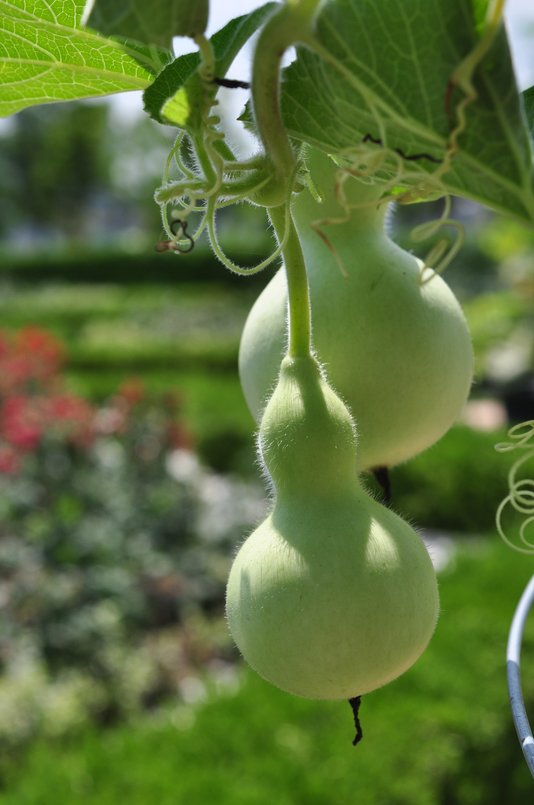
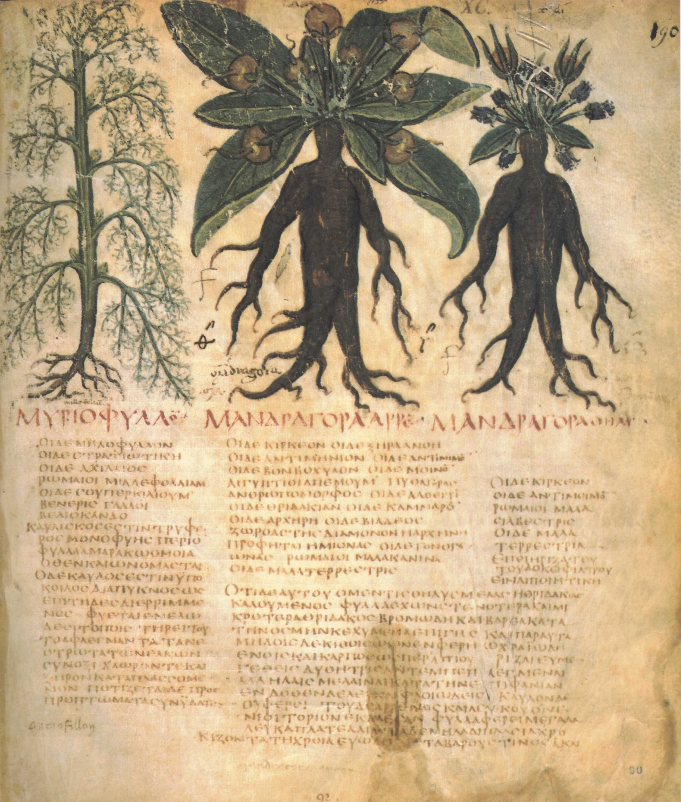
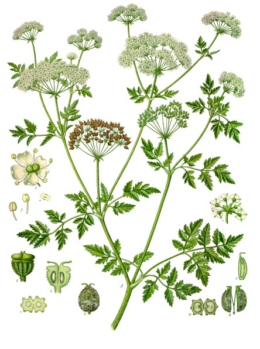
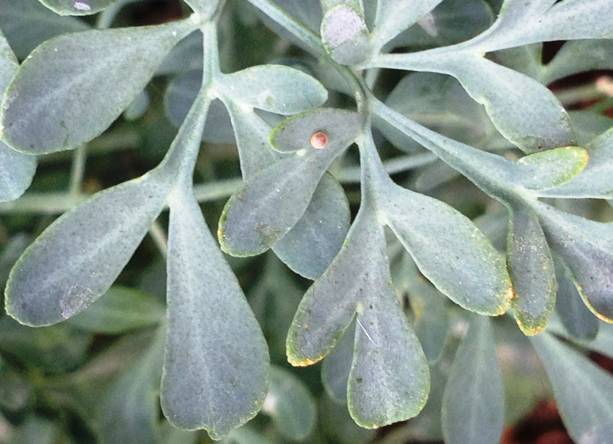

# Plants and Trees in the Bible

## License Information

Plants and Trees in the Bible © United Bible Societies, 2025. Adapted from: <cite>Each According to its Kind: Plants and Trees in the Bible</cite>, by Robert Koops © 2012 United Bible Societies. This work is licensed under Creative Commons Attribution-ShareAlike 4.0 International (<a href="https://creativecommons.org/licenses/by-sa/4.0/">https://creativecommons.org/licenses/by-sa/4.0/</a>).

--------------------------------

## Other useful plants (id: FLORA:5.2)

5\.2 Other useful plants
========================

In this section we include the bottle gourd, hammada (used for lye), mandrake, marjoram (hyssop), poison hemlock, wild gourd, and wormwood. Although the latter three were potentially used for medical purposes, that is not their primary function as we find them in Scripture, so we are including them here rather than in Chapter 4\.
-------------------------------------------------------------------------------------------------------------------------------------------------------------------------------------------------------------------------------------------------------------------------------------------------------------------------------------------

## Bottle gourd (id: FLORA:5.2.1)

5\.2\.1 Bottle gourd
====================

References:
-----------

Hebrew פְּקָעִים (peqa‘im)

[1KI 6:18](https://ref.ly/1Kgs6:18), [1KI 7:24](https://ref.ly/1Kgs7:24), [1KI 7:24](https://ref.ly/1Kgs7:24)

Discussion:
-----------

The Bottle Gourd or Calabash *Lagenaria siceraria* was one of the first plants to be domesticated by human beings. It has been used for food, for medicine, and for various utensils and musical instruments. It is indigenous to Africa but was probably introduced into Asia and the Americas about ten thousand years ago, with or without the help of humans. The name of the genus comes from the Latin word *lagoena*, meaning “flask” (but almost certainly the first Roman flasks were dried gourds). The species name is derived from the Latin word for “dry,” suggesting that the fruit is usable in its dried form. Although the people of the Bible lands undoubtedly used the split bottle gourds in their homes as bowls or “dippers,” as we find in Africa and Asia, the only references we have are to the image of the gourd in the artwork carved into the cedar of King Solomon’s palace ([1KI 6:18](https://ref.ly/1Kgs6:18)) and in the decorating of the giant bronze basin that stood in front of the Temple ([1KI 7:24](https://ref.ly/1Kgs7:24); [1KI 7:24](https://ref.ly/1Kgs7:24)). According to Zohary, the bottle gourd is also found in the place name “Dilean” ([JOS 15:38](https://ref.ly/Josh15:38)), which comes from the Hebrew word *dela‘ath*, a postbiblical name for the bottle gourd.

Description:
------------

The bottle gourd is a climbing vine like a cucumber or pumpkin. Its stem is square, ribbed, and hairy, and can grow up to 5 meters (17 feet) long. The leaves are heart\-shaped, the size of a human hand, and slightly lobed. The flowers are yellow with five petals, giving way to fruits that may be of many different shapes depending on the variety. Most gourds are globular at one end, with a protrusion that may be elongated, making them very useful, when cut in half, as big spoons in the kitchen.

Special significance:
---------------------

Gourds or calabashes have been used as containers, or, when split, as dipping devices, for thousands of years. They have also been used for musical instruments. The pulp of most kinds is very bitter and is poisonous in some cases. Some kinds are used in medicine in some countries, for purges, expelling worms, and for chest pains and headache. In southern Africa the leaves are eaten as a vegetable, as are the young, unripe fruits.

Translation:
------------

Translators in temperate or tropical areas of Africa and Asia will have a word for these gourds. In French they are called *courge bouteille*, in Portuguese *abo­bora\-carneira* or *cabaco*, in Latin America *calabaza* or *cogorda*, in China *po gua*, in India *lauki*, in Indonesia *labu*, in Japan *hyotan* or *yugao*, in Malaysia *labu ayer*, in Philippines *upo*, in Sri Lanka *diya labu*, in Thailand *buap khaus*, and in Vietnam *bau*.

If the only gourd people are familiar with is round like a ball, then an illustration may help in the text, or a footnote can describe the special shape of the Holy Land gourd, insofar as we know it. The bottle gourd is related to the wild gourd mentioned in [2KI 4:39](https://ref.ly/2Kgs4:39), which poisoned a group of prophets (see [5\.2\.6 Wild gourd (colocynth, egusi, bitter apple)](#FLORA:5.2.6)). The “gourd” (KJV (King James Version (1611)), REB (Revised English Bible (1989))) in [JON 4:6](https://ref.ly/Jonah4:6) is now thought to be the castor oil plant (see [4\.2\.2 Castor oil plant (castor bean plant)](#FLORA:4.2.2)).

* **Associated Passages:** 1 Kings 6:18; 1 Kings 7:24; Joshua 15:38; 2 Kings 4:39; Jonah 4:6

## Hammada (Salsola, Salicornia) (id: FLORA:5.2.2)

5\.2\.2 Hammada (Salsola, Salicornia)
=====================================

References:
-----------

Hebrew בֹּר (bor)

[JOB 9:30](https://ref.ly/Job9:30), [ISA 1:25](https://ref.ly/Isa1:25)

Hebrew בֹּרִית (borith)

[JER 2:22](https://ref.ly/Jer2:22), [MAL 3:2](https://ref.ly/Mal3:2)

Discussion:
-----------

The Jews of Jeremiah’s time did not have soap as we know it, since soap was invented many centuries later. However, they did prepare something like it by mixing the ashes of certain plants with olive oil. One of the plants was Hammada *Hammada salicornica*, commonly found in the desert and called *rimth* in Arabic. Hepper says any kind of household ashes would have sufficed, but bushes of the goosefoot family (*Salsola* and *Salicornia* species, saltworts, and glassworts) would have been especially effective. This is supported by Moldenke, who adds that Arabs call saltwort *kali* or *elkali*, which is where we get our chemical term alkali.

Description:
------------

There are two types of *Salicornia*. The white hammada is a leafless shrub that often grows near acacia trees. It is less than a meter (3 feet) in height and has a jointed green stem. Its tiny flowers appear around December and form small fruits with one seed having a kind of wing that catches the wind and scatters the seed. The black hammada is similar, but darker, and favors a lighter type of soil. Its distribution includes North Africa.

Special significance:
---------------------

[MAL 3:2](https://ref.ly/Mal3:2) speaks of being washed by a fuller (launderer). This refers to the process by which natural oil was washed from woolen cloth before it could be dyed. The fuller took ashes from certain plants and mixed them with olive oil, forming what we would call lye or soda. He would then wash the clothes and dry them in the sun in the fuller’s field (see [2KI 18:17](https://ref.ly/2Kgs18:17)). The lye used was much stronger than our soap—more like the bleach of today—and it is this “fuller’s soap” that is used in Malachi to represent the powerful cleansing God performs on his people.

Translation:
------------

It may be useful for translators to investigate local soap making methods to find out what they use for ingredients. If the parallelism of the Hebrew is to be kept in [JER 2:22](https://ref.ly/Jer2:22), the translator needs two words that refer to making something clean. If there is no equivalent for “lye” (or “soda”), translators could consider poetical cultural equivalents for body\-scrubbing things like the loofa gourd or the pumice stone in West Africa. If transliteration is needed, some possibilities for *Salsola kali* (prickly saltwort) are (apart from the Hebrew *borith*) Arabic *hurd*, *shawk ahhmar*; French *soude conchee*, *sonde kali*; Portuguese *barilla espinhosa*, *soda*, *trago\-espinhoso*; and Spanish *abrojos*, *barella*, *salsora*.

* **Associated Passages:** Job 9:30; Isaiah 1:25; Jeremiah 2:22; Malachi 3:2; 2 Kings 18:17

## Mandrake (“love apple”) (id: FLORA:5.2.3)

5\.2\.3 Mandrake (“love apple”)
===============================

References:
-----------

Hebrew דּוּדָאִים (duda’im)

[GEN 30:14](https://ref.ly/Gen30:14), [GEN 30:14](https://ref.ly/Gen30:14), [GEN 30:15](https://ref.ly/Gen30:15), [GEN 30:15](https://ref.ly/Gen30:15), [GEN 30:16](https://ref.ly/Gen30:16), [SNG 7:14](https://ref.ly/Song7:14)

Discussion:
-----------

Commentators do not agree on the identity of the Hebrew word *duda’im*. While many assert that the word must refer to Mandragora or Mandrake *Mandragora autumnalis*, Zohary says it cannot be so since mandragora has never grown in Mesopotamia, where the story of [GEN 30:14](https://ref.ly/Gen30:14); [GEN 30:15](https://ref.ly/Gen30:15); [GEN 30:16](https://ref.ly/Gen30:16) takes place. In [SNG 7:14](https://ref.ly/Song7:14) *duda’im* refers to some sort of “choice fruit” associated with apples, and cultivated on river banks (not dug up in the fields, as was the case with *duda’im* in Genesis). Whatever the original plant was (in Mesopotamia), when the story was told in Israel they used a word that was known to the hearers, namely *duda’im*. In Genesis the context implies, though not directly, that *duda’im* has something to do with fertility. And the most popular conception\-inducing plant in Bible times, according to scholars, was the mandragora (mandrake). The translators of the Septuagint and the Targum, with their own ideas about love and fertility, took *duda’im* in its Holy Land setting rather than trying to establish the identity of the plant in the Mesopotamian context. The English versions have copied the Septuagint, using “mandrake.”

Description:
------------

The mandrake is a stemless herb related to the potato and tomato but grows lower to the ground. Its leaves are dark green, reaching 30 centimeters (1 foot) long and 10 centimeters (4 inches) wide, spreading out rose\-like from the center. Purple or blue flowers appear on stalks out of the center and develop into yellow fruits that, when ripe, look like eggs in a bird’s nest. They have a distinct smell that some find sweet and others unpleasant. The mandrake’s large root is often forked, giving the appearance of a human body, which is perhaps the basis for its widespread reputation as a love potion throughout the Middle East and Europe, and for its name, the “love apple.”

Special significance:
---------------------

The supposed magical properties of mandrakes are many and bizarre. It is said to scream when pulled out of the earth. The leaves are said to shine in the dark. In the Middle Ages Germans dressed them up and made sacrifices to them, lest the spirits be offended. French people believed little elves lived inside them and required daily offerings. As recently as 1630, three women in Hamburg were executed for witchcraft on the grounds that they had mandrake roots in their homes. Arabs call mandrakes the Devil’s candles.

Translation:
------------

The options to translate “mandrake” are:

1\. Translate using a similar plant, such as the wild garden egg (so Berom of Nigeria) plus a footnote. In Hausa of Nigeria *gautan daji* (or *yalo*) would be a possible model in some places.

2\. Translate using a functional equivalent, that is, some local plant known as an aid to conception, as Tiv of Nigeria has done (*mkehem*).

3\. Create a descriptive expression such as “love flower” (CEV (Contemporary English Version)) or “love fruit.”

4\. Transliterate from Hebrew *duda’im* or a major language (for example, English (*mandaraki*), French (*mandragore*)] and write a footnote saying that this plant may have been considered an aid to conception. When transliterating, it may be useful to add “root of” as a tag, showing that it was the root of the plant that was effective.

* **Associated Passages:** Genesis 30:14; Genesis 30:15; Genesis 30:16; Song of Songs 7:14

## Marjoram (id: FLORA:5.2.4)

5\.2\.4 Marjoram
================

References:
-----------

Hebrew אֵזוֹב (’ezov)

[EXO 12:22](https://ref.ly/Exod12:22), [LEV 14:4](https://ref.ly/Lev14:4), [LEV 14:6](https://ref.ly/Lev14:6), [LEV 14:49](https://ref.ly/Lev14:49), [LEV 14:51](https://ref.ly/Lev14:51), [LEV 14:52](https://ref.ly/Lev14:52), [NUM 19:6](https://ref.ly/Num19:6), [NUM 19:18](https://ref.ly/Num19:18), [1KI 5:13](https://ref.ly/1Kgs5:13), [PSA 51:9](https://ref.ly/Ps51:9)

Greek ὕσσωπος (hussōpos)

[JHN 19:29](https://ref.ly/John19:29), [HEB 9:19](https://ref.ly/Heb9:19)

Discussion:
-----------

 Zohary, Hepper, and ABD (Anchor Bible Dictionary) all identify the Hebrew word *’ezov* as probably referring to *Origanum syriacum* or *Majorana syriaca*, better known as “marjoram.” The Septuagint translators decided to use the Greek name *hussōpos* (“hyssop”), which normally refers to a European plant similar to the marjoram of the Holy Land. Compounding the confusion, some botanists have called the biblical marjoram “Syrian hyssop.” *The International Standard Bible Encyclopedia* suggests that *’ezov* may have included various plants. We encourage “marjoram” and hold that the term “Syrian hyssop” is Eurocentric. The words *’ezov* and *hussōpos* are cognate. A number of botanists in the nineteenth and twentieth centuries looked at the Arabic word for “caper bush” (*el asaf*, which became *lassaf*) and speculated that *’ezov* in the Pentateuch must refer to the caper bush (see [3\.5\.1 Caper (caper bush, caper berry)](#FLORA:3.5.1)), which was plentiful in Egypt and the Arabian Desert. Indeed, a caper bush growing out of a wall in [1KI 5:13](https://ref.ly/1Kgs5:13) (4\.33\) makes much more sense than a marjoram plant in that environment. *’Ezov* was required in the Jewish purification ceremonies. Is it possible that as the Hebrews entered the Promised Land, where they found plenty of marjoram, that the ceremony of purification evolved, and that the “legal” definition of *’ezov* could have generalized to include the marjoram? It is a hairy plant very handy for sprinkling. In the New Testament, then, the word *hussōpos* in John could plausibly refer to a stalk of the marjoram.

Description:
------------

The marjoram plant stands 50–80 centimeters tall (20–32 inches) and has small leaves, and a many\-branched, hairy stem. The hairs make it good as a brush. The plant has white flowers. Oil extracted from the leaves and stems is used to scent soaps and lotions.

Special significance:
---------------------

In Europe and the Middle East today, marjoram is used as a condiment, and it may have been so in Bible times as well, but the biblical use of the plant was as a brush. It was so used by the Israelites in the great Exodus from Egypt, when Moses ordered them to sprinkle blood on their doorposts as a sign to the Angel of Death to pass over their homes. This marked the beginning of the Passover Feast, commemorated ever since by Jews. In [PSA 51:9](https://ref.ly/Ps51:9) (7\) *’ezov* is used to symbolize spiritual cleansing. A third, and problematic, reference, occurs in [1KI 5:13](https://ref.ly/1Kgs5:13) (4\.33; see the comments below), where *’ezov* is used to refer to a humble plant that contrasts with the might and grandeur of the cedar of Lebanon.

Translation:
------------

Many English versions, except for REB (Revised English Bible (1989)), bow under the pressure of tradition and use “hyssop” as the rendering for *’ezov*. Translators are not obliged to follow suit. If the opportunity arises, they should follow the more scientifically correct “marjoram.”

[EXO 12:22](https://ref.ly/Exod12:22) a: “Take a bunch of hyssop \[*’ezov* ] and dip it in the blood.” The function of *’ezov* in Exodus is more important than the plant itself, and even if one uses a transliteration like “branch of esov,” a verb such as “sprinkle” helps to convey the picture. If the translator chooses to substitute a local plant typically used for sprinkling, a footnote is in order. If translators are used to transliterating from English, “marjoram” is preferred, not “hyssop.” On the other hand, a translator can transliterate from Latin *majorana*, Spanish *mejorana*, or Arabic *mardakush*. So some of the options for rendering “marjoram” are the following:

1\. a generic expression, for example, “leaves”;

2\. a transliteration (see above);

3\. a substitution, that is, a local plant used for sprinkling (plus footnote).

For translators in West Africa who want to use a plant like marjoram, there are marjoram relatives. One such hairy\-leafed plant grows in The Gambia and is used as a mosquito repellent. The Tiv of Nigeria call the same plant *huuhuu*, and the Etsako of Nigeria refer to it as “mosquito grass.” The leaves have a spicy smell and the plant, being hairy, is good as a kind of brush.

[1KI 5:13](https://ref.ly/1Kgs5:13) a (4\.33a): “He \[Solomon] spoke of trees, from the cedar that is in Lebanon to the hyssop \[*’ezov* ] that grows out of the wall.” This verse has three puzzles:

1\. Marjoram (like the European hyssop) is not a tree. It is a relatively low plant with tiny leaves and white flowers. If the translator has a generic word covering both “trees” and “plants,” that should be used. De Vries holds that the Hebrew word *‘ets* (“tree”) has wider range of meaning than the English word “tree,” because it includes what we would call vines (see [EZK 15:2](https://ref.ly/Ezek15:2)). Still, stretching the word *‘ets* to include a plant like marjoram is expecting quite a bit, which is partly why a few scholars are still unconvinced that *’ezov* is the marjoram plant. Hepper, for example, is inclined to agree with Tristram and Balfour who, in the late nineteenth century, proposed that *’ezov* here refers to the caper bush (see [3\.5\.1 Caper (caper bush, caper berry)](#FLORA:3.5.1)). Part of their argument rests on cognate evidence: Arabic for the caper bush is *lassaf* (derived from *el asaf*), which appears to be cognate with *’ezov*, but the Arabic word for the marjoram (*zaatar*) is completely unrelated. Someone could argue that the caper is not a tree either, but, significantly, it does have a woody stem.

2\. “*’Ezov* that grows out of the wall” is odd because, in real life, marjoram does not typically grow in the cracks of walls. It likes rocky soil, but is quite unlikely to find its way to walls. Was King Solomon, the great biologist, wrong on a botanical detail that would have been obvious even to school children?

3\. Artistically, in this verse, something that grows out of a crack in a wall would make a more striking contrast to the mighty cedar than marjoram would. The caper bush, mentioned above, is an excellent candidate, because it does indeed grow in the cracks of city walls, apart from being a good contrast with the cedar. However, later botanists have not supported this opinion. Also, wider biblical usage votes against it. In Exodus *’ezov* is used in bunches to sprinkle blood on doorposts. The marjoram, with its hairy stem, is quite suited for such a use. The caper bush is less so. Is it possible that *’ezov* refers to two different plants in the different contexts? This would not be unprecedented. Zohary, for example, holds that the Hebrew word *berosh* refers to “cypress” in some contexts and to “fir” in others (see [1\.6 Cypress](#FLORA:1.6)). The same is true of the Hebrew word *suf*, which can mean “cattail” or “seaweed” (see [5\.1\.1 Cattail (reed\-mace)](#FLORA:5.1.1)).

A final piece of evidence that, unfortunately, does not resolve the issue is that the caper bush is abundant in the desert, whereas marjoram prefers cultivated, moister terrain. There may have been marjoram in Egypt when the Israelites left there, but once in the desert they would not have found it. Were they perhaps forced by necessity to use the caper bush for their sprinkling rituals?

The following is a summary of translation options for *’ezov* in [1KI 5:13](https://ref.ly/1Kgs5:13) (4\.33\):

1\. transliterate from *’ezov* (*esobu*, *esofi*) or marjoram (*marjoramu*, *macora*);

2\. substitute a local plant that is capable of growing on a wall.

One possible model for the first half of this verse is “Solomon spoke of all kinds of plants/growing things, even the mighty kedari tree of Lebanon \[Mountains], and the \[little] majoram/esob/kaper/kafer/asafu that can grow on a city wall.”

* **Associated Passages:** Exodus 12:22; Leviticus 14:4; Leviticus 14:6; Leviticus 14:49; Leviticus 14:51; Leviticus 14:52; Numbers 19:6; Numbers 19:18; 1 Kings 5:13; Psalms 51:9; John 19:29; Hebrews 9:19; Ezekiel 15:2

## Poison hemlock (black henbane, gall) (id: FLORA:5.2.5)

5\.2\.5 Poison hemlock (black henbane, gall)
============================================

References:
-----------

Hebrew רֹאשׁ, רוֹשׁ (ro’sh, rosh)

[DEU 29:17](https://ref.ly/Deut29:17), [DEU 32:32](https://ref.ly/Deut32:32), [PSA 69:22](https://ref.ly/Ps69:22), [JER 8:14](https://ref.ly/Jer8:14), [JER 9:14](https://ref.ly/Jer9:14), [JER 23:15](https://ref.ly/Jer23:15), [LAM 3:5](https://ref.ly/Lam3:5), [LAM 3:19](https://ref.ly/Lam3:19), [HOS 10:4](https://ref.ly/Hos10:4), [AMO 6:12](https://ref.ly/Amos6:12)

Greek χολή (cholē)

[MAT 27:34](https://ref.ly/Matt27:34), [ACT 8:23](https://ref.ly/Acts8:23)

Discussion:
-----------

 Zohary suggests that the Hebrew word *ro’sh* /*rosh* probably started out as the name of a specific poisonous plant and then was generalized to cover many kinds of plants producing poison. *Ro’sh* /*rosh* is often translated “poison” and could have referred to poison conine, derived from Poison Hemlock *Conium maculatum*. This plant is a member of the carrot family and has no relation to the evergreen tree with the same name. Hepper says that the word *ro’sh* in [HOS 10:4](https://ref.ly/Hos10:4) (“… like poisonous weeds in the furrows of the field”) probably does not refer to hemlock, since hemlock does not normally grow in cultivated ground. According to him, this passage refers more likely to Veined Henbane *Hyoscyamus reticulatus*. Of the ten Old Testament references to *ro’sh* /*rosh*, five are translated with the Greek word *cholē* (“gall”) in the Septuagint. This suggests that *ro’sh/rosh* was taken as a generic word referring to a bitter, poisonous substance, not necessarily of botanical origin. The *ro’sh* mentioned in [DEU 32:33](https://ref.ly/Deut32:33) is from a snake, the the *cholē* of Tobit is from a fish ([TOB 6:4](https://ref.ly/Tob6:4); [TOB 6:5](https://ref.ly/Tob6:5); [TOB 6:7](https://ref.ly/Tob6:7), [TOB 6:9](https://ref.ly/Tob6:9); [TOB 11:4](https://ref.ly/Tob11:4), [TOB 11:8](https://ref.ly/Tob11:8), [TOB 11:11](https://ref.ly/Tob11:11)).

According to [MRK 15:23](https://ref.ly/Mark15:23), Jesus was offered “wine mingled with myrrh” just before his crucifixion, possibly by his followers, as a sedative. Matthew, seeking to draw a parallel to [PSA 69:22](https://ref.ly/Ps69:22) a (“They gave me poison \[*cholē* in the Septuagint] for food”) writes “they offered him wine to drink, mingled with gall” ([MAT 27:34](https://ref.ly/Matt27:34)), using the generic Greek word *cholē* for gall/poison, thus emphasizing the humiliation that the Savior endured.

Description:
------------

Poison hemlock can reach 1\.5–2\.5 meters (5–8 feet) in height. It has a smooth green stem with purple or red streaks toward the bottom. Its leaves are lacy like a carrot’s and up to half a meter (2 feet) long, and it has tiny white flowers grouped in the form of little umbrellas. People mistake it for parsley or wild carrots. Its root is stout and resembles that of European parsnip. Its leaves and root give off a bitter smell.

The biennial henbane has different forms but in general grows a meter (3 feet) or more high, including the flower. It has an erect, branching stem with white flowers in umbrella\-shaped heads. The gray\-green egg\-shaped leaves have sharp tips, may reach 30 centimeters (1 foot) in length, and are covered with sticky hairs.

Poison hemlock was used as a sedative in ancient times by both Greek and Arab doctors, but it was risky since an overdose was fatal or resulted in loss of speech or paralysis. Henbane (meaning “hen\-killer”) was used in medicine by the Greeks to induce sleep and to counteract pain. Europeans used it in the Middle Ages and there are Anglo\-Saxon works on medicine dating from the eleventh century that mention it under the name “henbell.” Poison derived from hemlock is called “conine.”

Translation:
------------

All the Old Testament references to *ro’sh* /*rosh* are in rhetorical contexts, giving translators freedom to find local words that are powerful. Further, most languages have a word for poison, since it is frequently used in hunting and fishing, or for killing rats. Half of the references are paired with the Hebrew word *la‘anah* (see [5\.2\.7 Wormwood](#FLORA:5.2.7)), so the translator will need to look for a pair of words that fit together. If there is no word for poison, the name of poisonous plants can perhaps be substituted for the pair. Hemlock itself grows throughout central and southern Europe and in Asia and North Africa, and it has been introduced into North and South America. Henbane grows wild throughout central and southern Europe, in western Asia, India and across to Siberia. It now also grows in North and South America, especially in Brazil. A related species of *Hyoscyamus* is found in the Canary Islands and across North Africa to Asia.

* **Associated Passages:** Deuteronomy 29:17; Deuteronomy 32:32; Psalms 69:22; Jeremiah 8:14; Jeremiah 9:14; Jeremiah 23:15; Lamentations 3:5; Lamentations 3:19; Hosea 10:4; Amos 6:12; Matthew 27:34; Acts 8:23; Deuteronomy 32:33; Tobit 6:4; Tobit 6:5; Tobit 6:7; Tobit 6:9; Tobit 11:4; Tobit 11:8; Tobit 11:11; Mark 15:23

## Wild gourd (colocynth, egusi, bitter apple) (id: FLORA:5.2.6)

5\.2\.6 Wild gourd (colocynth, egusi, bitter apple)
===================================================

References:
-----------

Hebrew גֶּפֶן סְדוֹם (gefen sedom)

[DEU 32:32](https://ref.ly/Deut32:32), [DEU 32:32](https://ref.ly/Deut32:32)

Hebrew פַּקֻּעֹת שָׂדֶה (paqu‘oth sadeh)

[2KI 4:39](https://ref.ly/2Kgs4:39), [2KI 4:39](https://ref.ly/2Kgs4:39)

Discussion:
-----------

The young prophet in [2KI 4:39](https://ref.ly/2Kgs4:39) was probably a city dweller. He may not even have had any particular species in mind when he set out to gather “herbs.” What he found was a *gefen sadeh* (literally “vine of the field”). *Gefen* is a general Hebrew word for climbing or twining plants but which, like the English word “vine,” can also be used to refer specifically to the grapevine. In this case it was the wild gourd or colocynth, a common vine in dry climates. Its fruit (*paqu‘oth*) are somewhat poisonous, although in powdered form the gourd was used for medicine. The colocynth gourd still grows in the Jordan Valley near Gilgal, where the story is said to have taken place, as well as in the coastal plain. Hepper informs us that the Roman emperor Claudius was poisoned with colocynth by his wife in 54 A.D. The related Hebrew word *peqa‘im* occurs elsewhere as the fruit of the bottle gourd (see [5\.2\.1 Bottle gourd](#FLORA:5.2.1)).

Hepper suggests that the “vine of Sodom” (*gefen sedom*) mentioned in the Song of Moses ([DEU 32:32](https://ref.ly/Deut32:32)) may have been the Colocynth *Citrullus colocynthis.* While the comparison is apt, this passage may not refer to a poisonous plant at all but may simply be a way of comparing the rebellious and obstinate Israelites to the wicked people of Sodom. Hepper also says that the colocynth may be the plant referred to by the Hebrew word *ro’sh* in [DEU 29:17](https://ref.ly/Deut29:17); [PSA 69:22](https://ref.ly/Ps69:22); [JER 8:14](https://ref.ly/Jer8:14); [JER 9:14](https://ref.ly/Jer9:14); [JER 23:15](https://ref.ly/Jer23:15); and [AMO 6:12](https://ref.ly/Amos6:12) (see [5\.2\.2 Hammada (Salsola, Salicornia)](#FLORA:5.2.2)).

Description:
------------

The colocynth vine is like a melon, cucumber, or calabash vine. It has a thick, watery root, which can penetrate deep into the ground. Its stems creep on the ground, clinging to bushes or fences with their tendrils. Its leaves are triangular and lobed like melon leaves. Its yellow flowers develop into round yellow fruits the size of a large apple or grapefruit. The shell of the fruit is hard and smooth, and inside is a spongy pulp with white or brown seeds.

Special significance:
---------------------

Arabs in Sinai and the western Negev supply the medical market with colocynth, which is used for stomach disorders and as a purgative. In hard times people have been known to grind up the seeds and make flour for bread. It is also used to repel moths when storing woolen clothing.

Translation:
------------

The colocynth grows throughout the Mediterranean region and in western Asia. Some translators will lack a generic word for climbing plants, but they may have a more general word “plant.” Alternatively, a phrase such as “wild cucumber” could be used. An important point to remember is that the Hebrew phrase *paqu‘oth sadeh* (“wild gourds”) in [2KI 4:39](https://ref.ly/2Kgs4:39) is generic and that the young prophet himself did not recognize the fruit. So the story makes most sense if the expression is quite generic. Biblical botanists are fairly sure the vine he discovered was the colocynth, but this is, in a sense, beside the point of the story, since it is intended to demonstrate God’s miraculous power.

Possibilities for the transliteration of “colocynth” are French *coloquinthe*, Spanish/Portuguese *coloquinta*, and Arabic *banzal*.

* **Associated Passages:** Deuteronomy 32:32; 2 Kings 4:39; Deuteronomy 29:17; Psalms 69:22; Jeremiah 8:14; Jeremiah 9:14; Jeremiah 23:15; Amos 6:12

## Wormwood (id: FLORA:5.2.7)

5\.2\.7 Wormwood
================

References:
-----------

Hebrew לַעֲנָה (la‘anah)

[DEU 29:17](https://ref.ly/Deut29:17), [PRO 5:4](https://ref.ly/Prov5:4), [JER 9:14](https://ref.ly/Jer9:14), [JER 23:15](https://ref.ly/Jer23:15), [LAM 3:15](https://ref.ly/Lam3:15), [LAM 3:19](https://ref.ly/Lam3:19), [AMO 5:7](https://ref.ly/Amos5:7), [AMO 6:12](https://ref.ly/Amos6:12)

Greek ἄψινθος (apsinthos)

[REV 8:11](https://ref.ly/Rev8:11), [REV 8:11](https://ref.ly/Rev8:11)

Discussion:
-----------

The Hebrew word *la‘anah* refers literally to a plant, but it is only used figuratively in the Old Testament, as something representing intense bitterness. Despite very little evidence, commentators and botanists have agreed that this word may refer to a substance derived from the white wormwood bush, which is found abundantly in the the deserts of the Holy Land.

Description:
------------

White Wormwood *Artemisia herba\-alba* is a bush less than half a meter (18 inches) high, with finely divided fuzzy leaves. These leaves drop at the end of the cool rainy season of Israel and are replaced with something like scales in the hot season. The flowers appear in clusters of two to four around September/October and mature into small, hairy fruits. When the plant matures, the leaves and flowers are dried to make a very bitter tea, or ground into powder, paste, or oil that is used in medicine.

Special significance:
---------------------

Most of the references to wormwood in the Old Testament are paired with the Hebrew word for “poison/gall” (*ro’sh*) and are used metaphorically to represent painful experience and sorrow (see [5\.2\.5 Poison hemlock (black henbane, gall)](#FLORA:5.2.5)). In [REV 8:11](https://ref.ly/Rev8:11); [REV 8:11](https://ref.ly/Rev8:11) a star named Wormwood (*apsinthos* in Greek) makes a third of the water on earth bitter and poisonous. The leaves of wormwood have a very bitter taste. In small quantities it was used as an anesthetic, and Europeans use it in concocting alcoholic drinks (absinthe, vermouth). It is also used to repel moths and fleas, and as an intestinal worm expeller.

Translation:
------------

The white wormwood of the Holy Land is found throughout the Middle East, North Africa (Egypt, Morocco) and Southwest Europe, but there are at least 300 species of *Artemisia* throughout the world, usually in dry areas. A Chinese type (*huang huahaosu*) is used as medicine against malaria. *Artemisia cina* and *Artemisia maritima* are found in Eurasia, where they produce *santonica*, an anti\-worm medicine. *Artemisia tilesii* is used by the Inuits like codeine. The sagebrush plants of the American West also belong to this genus and were used by Native Americans for various conditions.

Most languages have words for plants that have bitter leaves and/or roots. Since all of the references to wormwood in the Old Testament are metaphorical, these plants can be used to convey the essential component of the passages. As noted above, most of the references to *la‘anah* are coupled with *ro’sh*, so the two must be dealt with together in those passages. If particular plants are not available, phrases such as “bitter fruit,” “bitter spice,” or “bitter thing” can be used. If needed, transliterations for wormwood could be based on French *absinthe*, Portuguese *absinto*, *losna*; and Spanish *absintio*, *ajenjo*.

* **Associated Passages:** Deuteronomy 29:17; Proverbs 5:4; Jeremiah 9:14; Jeremiah 23:15; Lamentations 3:15; Lamentations 3:19; Amos 5:7; Amos 6:12; Revelation 8:11

