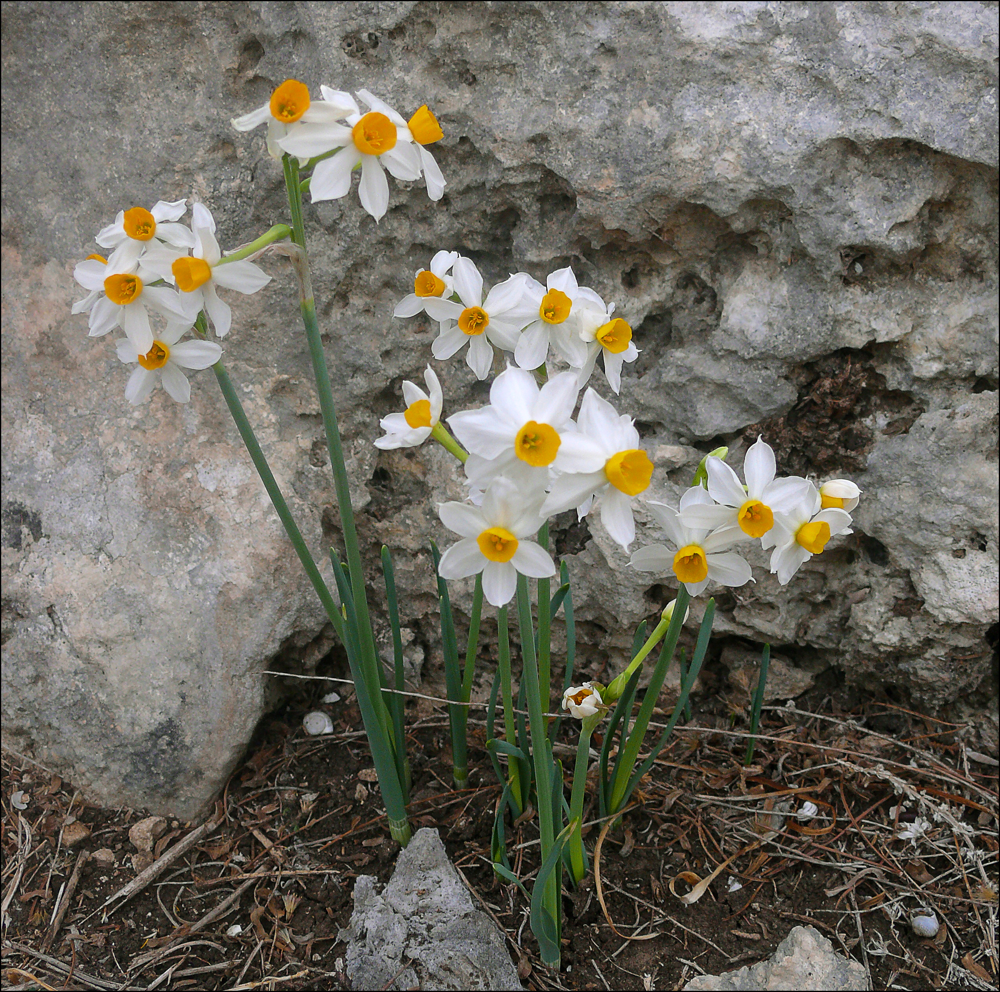
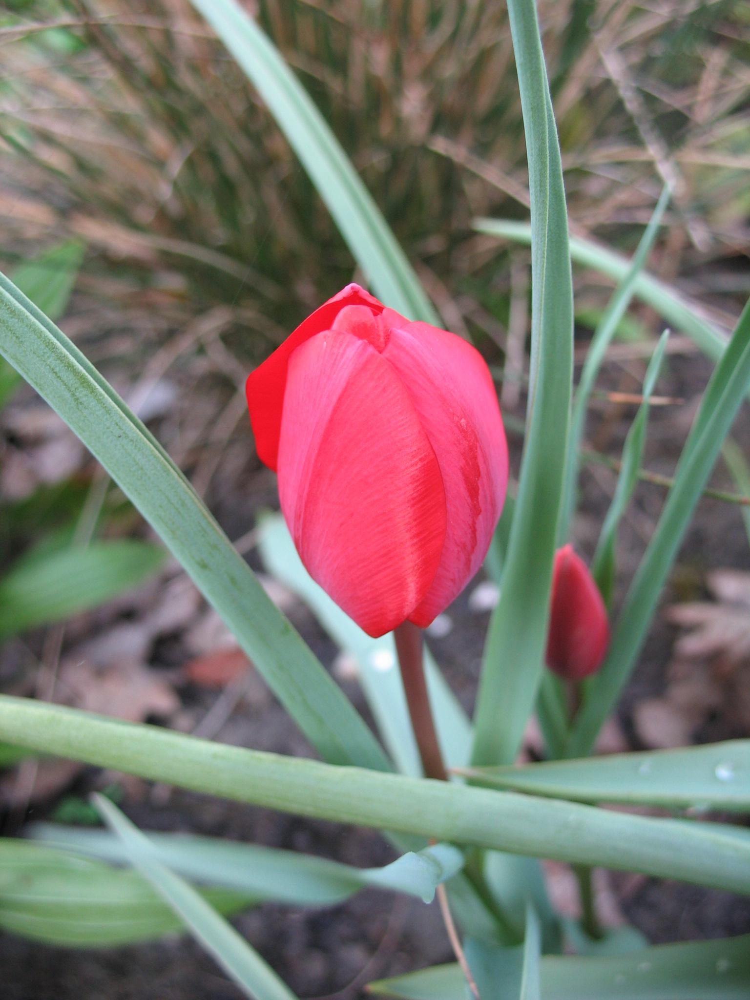

# Plants and Trees in the Bible

## License Information

Plants and Trees in the Bible © United Bible Societies, 2025. Adapted from: <cite>Each According to its Kind: Plants and Trees in the Bible</cite>, by Robert Koops © 2012 United Bible Societies. This work is licensed under Creative Commons Attribution-ShareAlike 4.0 International (<a href="https://creativecommons.org/licenses/by-sa/4.0/">https://creativecommons.org/licenses/by-sa/4.0/</a>).

--------------------------------

## Flowers (id: FLORA:6.1)

6\.1 Flowers
============

* [6\.1\.1 Anemone](#FLORA:6.1.1)
* [6\.1\.2 Lily](#FLORA:6.1.2)
* [6\.1\.3 Narcissus](#FLORA:6.1.3)
* [6\.1\.4 Rose](#FLORA:6.1.4)
* [6\.1\.5 Tulip](#FLORA:6.1.5)

With the above warning out of the way, we need to deal with Hebrew and Greek words for flowers that we think are probably generic.

The Hebrew words *tsits* and *tsitsah* occur twelve times with the meaning “blossom” or “flower.” Aaron’s staff “produced blossoms” in [NUM 17:23](https://ref.ly/Num17:23) (8\). The walls and doors of Solomon’s Temple were engraved with designs of “open flowers” ([1KI 6:18](https://ref.ly/1Kgs6:18); [1KI 6:29](https://ref.ly/1Kgs6:29); [1KI 6:32](https://ref.ly/1Kgs6:32); [1KI 6:35](https://ref.ly/1Kgs6:35)). Several writers use *tsits* to picture the short life of human beings ([JOB 14:2](https://ref.ly/Job14:2); [PSA 103:15](https://ref.ly/Ps103:15); [ISA 28:1](https://ref.ly/Isa28:1); [ISA 40:6](https://ref.ly/Isa40:6); [ISA 40:7](https://ref.ly/Isa40:7); [ISA 40:8](https://ref.ly/Isa40:8)). The verbal form (*tsuts*) is found in [NUM 17:23](https://ref.ly/Num17:23); [ISA 27:6](https://ref.ly/Isa27:6); [EZK 7:10](https://ref.ly/Ezek7:10). The Greek equivalent for this Hebrew word is *anthos*, which is found in [JAS 1:10](https://ref.ly/Jas1:10); [JAS 1:11](https://ref.ly/Jas1:11) and in [1PE 1:24](https://ref.ly/1Pet1:24); [1PE 1:24](https://ref.ly/1Pet1:24) (quoting [ISA 40:6](https://ref.ly/Isa40:6)). Did the writers have particular species in mind with the words *tsits* and *anthos*? We don’t know, because there are dozens of kinds of flowers that qualify. Of course, this makes it easier for translators since they free to use what is appropriate in the context, as the translators of the Septuagint, the Vulgate, and KJV (King James Version (1611)) also did. This is why we find “rose of Sharon” in [SNG 2:1](https://ref.ly/Song2:1) in many versions.

The Hebrew word *nets* occurs in [GEN 40:10](https://ref.ly/Gen40:10), where the vine in the dream of Pharaoh’s butler puts forth “blossoms.” This word also occurs in [SNG 2:12](https://ref.ly/Song2:12) which speaks of “flowers” appearing on the earth at the time of singing. An abundance of red flowers appears in the spring in the land of the Bible. Interestingly, the Iraqis have a cognate word for this group of flowers (*nissan*), which, Zohary suggests, supports the proposal that the Hebrew month of Nissan has to do with the appearance of flowers. A related Hebrew noun *nitstah* is found in [JOB 15:33](https://ref.ly/Job15:33), where it refers to the blossoms of the olive tree, and in [ISA 18:5](https://ref.ly/Isa18:5), where it refers to the blossoms of the grapevine. A related Hebrew verb *natsats* (“to blossom”) is found in [ECC 12:5](https://ref.ly/Eccl12:5); [SNG 6:11](https://ref.ly/Song6:11); [SNG 7:13](https://ref.ly/Song7:13).

Mention should be made also of the Hebrew verb *parach*, which occurs fourteen times with the sense of “blossom,” and its noun form *perach*, which occurs fifteen times. One important floral reference that uses *perach* has to do with the golden lampstand in [EXO 25:31](https://ref.ly/Exod25:31); [EXO 25:31](https://ref.ly/Exod25:31); [EXO 25:32](https://ref.ly/Exod25:32); [EXO 25:33](https://ref.ly/Exod25:33); [EXO 25:34](https://ref.ly/Exod25:34); [EXO 25:35](https://ref.ly/Exod25:35); [EXO 25:36](https://ref.ly/Exod25:36); [EXO 25:37](https://ref.ly/Exod25:37); [EXO 25:38](https://ref.ly/Exod25:38); [EXO 25:39](https://ref.ly/Exod25:39); [EXO 25:40](https://ref.ly/Exod25:40), [EXO 37:17](https://ref.ly/Exod37:17); [EXO 37:18](https://ref.ly/Exod37:18); [EXO 37:19](https://ref.ly/Exod37:19); [EXO 37:20](https://ref.ly/Exod37:20); [EXO 37:21](https://ref.ly/Exod37:21); [EXO 37:22](https://ref.ly/Exod37:22); [EXO 37:23](https://ref.ly/Exod37:23); [EXO 37:24](https://ref.ly/Exod37:24), [NUM 8:4](https://ref.ly/Num8:4). In those passages the lampstand is compared to a flowering plant with stem and blossoms. The tips of the seven branches are described in Hebrew as *perach* and in the Septuagint as *krinon*. This suggests that to the translators of the Septuagint, the Greek word *krinon* had a general sense of “blossom\-shaped object” or “flower.” On the other hand, in [1KI 7:26](https://ref.ly/1Kgs7:26), where the rim of the Temple’s great bronze water basin is described, the Hebrew text says its brim was like *perach shushan* (“blossom of *shushan* ”), and the Septuagint has *blastos krinou* (“blossom of *krinon* ”), which might suggest that both *shushan* and *krinon* designate a specific type of flower or group of flowers with curved petals (rendered “lily” in RSV (Revised Standard Version (1952)) and GNB (Good News Bible)). Further, in [SNG 2:1](https://ref.ly/Song2:1) *chavatseleth* and *shushan* are used in parallel, suggesting that each is specific. The issue is pertinent to the interpretation of many other verses where it is unclear if a specific flower is intended or flowers in general, for example, the phrase “lilies of the field” in the Gospels ([MAT 6:28](https://ref.ly/Matt6:28); [LUK 12:27](https://ref.ly/Luke12:27)). Matthew and Luke used the Greek word *krinon*, but it is likely that *krinon* here is generic, referring to many possible flowers, or some common flower, since there were no true lilies growing “in the fields” at that time. (The white lily grew only in forests.) A few of the species that *krinon* may have referred to are the crown anemone, scarlet crowfoot, common poppy, crown daisy, and dog chamomile.

The Greek word *anthos* is found in [WIS 2:7](https://ref.ly/Wis2:7); [SIR 24:17](https://ref.ly/Sir24:17); [SIR 39:14](https://ref.ly/Sir39:14); [SIR 50:8](https://ref.ly/Sir50:8); [SIR 51:15](https://ref.ly/Sir51:15); and [3MA 7:16](https://ref.ly/3Macc7:16), where in every case but the first one the meaning is “blossom,” that is, the part of a flowering plant that has petals. [WIS 2:7](https://ref.ly/Wis2:7) seems to refer to the entire flowering plant. In [SIR 50:8](https://ref.ly/Sir50:8) the species is mentioned, which is the rose (see [6\.1\.4 Rose (Phoenician rose)](#FLORA:6.1.4)).

The Latin word *flos* is found in [2ES 5:24](https://ref.ly/2Esd5:24); [2ES 5:36](https://ref.ly/2Esd5:36); [2ES 6:3](https://ref.ly/2Esd6:3); [2ES 6:44](https://ref.ly/2Esd6:44); [2ES 9:17](https://ref.ly/2Esd9:17); [2ES 9:24](https://ref.ly/2Esd9:24); [2ES 9:26](https://ref.ly/2Esd9:26); [2ES 12:51](https://ref.ly/2Esd12:51); and [2ES 15:50](https://ref.ly/2Esd15:50), where in most cases it refers to flowering plants in general.

Those flowers that we deal with in this section are:

* **Associated Passages:** Numbers 17:23; 1 Kings 6:18; 1 Kings 6:29; 1 Kings 6:32; 1 Kings 6:35; Job 14:2; Psalms 103:15; Isaiah 28:1; Isaiah 40:6; Isaiah 40:7; Isaiah 40:8; Isaiah 27:6; Ezekiel 7:10; James 1:10; James 1:11; 1 Peter 1:24; Song of Songs 2:1; Genesis 40:10; Song of Songs 2:12; Job 15:33; Isaiah 18:5; Ecclesiastes 12:5; Song of Songs 6:11; Song of Songs 7:13; Exodus 25:31; Exodus 25:32; Exodus 25:33; Exodus 25:34; Exodus 25:35; Exodus 25:36; Exodus 25:37; Exodus 25:38; Exodus 25:39; Exodus 25:40; Exodus 37:17; Exodus 37:18; Exodus 37:19; Exodus 37:20; Exodus 37:21; Exodus 37:22; Exodus 37:23; Exodus 37:24; Numbers 8:4; 1 Kings 7:26; Matthew 6:28; Luke 12:27; Wisdom of Solomon 2:7; Sirach 24:17; Sirach 39:14; Sirach 50:8; Sirach 51:15; 3 Maccabees 7:16; 2 Esdras (Latin) 5:24; 2 Esdras (Latin) 5:36; 2 Esdras (Latin) 6:3; 2 Esdras (Latin) 6:44; 2 Esdras (Latin) 9:17; 2 Esdras (Latin) 9:24; 2 Esdras (Latin) 9:26; 2 Esdras (Latin) 12:51; 2 Esdras (Latin) 15:50

## Anemone (id: FLORA:6.1.1)

6\.1\.1 Anemone
===============

References:
-----------

Greek κρίνον (krinon)

[MAT 6:28](https://ref.ly/Matt6:28), [LUK 12:27](https://ref.ly/Luke12:27), [SIR 39:14](https://ref.ly/Sir39:14), [SIR 50:8](https://ref.ly/Sir50:8)

Discussion:
-----------

The debate over the “lilies of the field” mentioned by Jesus is endless. The problem many scholars have with “lily” is that the popular “white lily” was not well known and was not a “flower of the field” at the time of Jesus. The Greek word *krinon* may have been a generic word for many types of lily (as it is in English). One botanist (Smith, of Kew Gardens) claimed that the red Martagon lily was native to the Levant, but this is disputed. *Krinon* may in fact refer to a broader group of flowers. We can only suggest some of many possibilities. One is the Crown Anemone *Anemone coronaria*, which blooms profusely in different colors every spring throughout the Mediterranean basin. It belongs to the buttercup family and blooms from January to March.

Description:
------------

The anemone plant grows to nearly 50 centimeters (20 inches). It has a thick rhizome or root that stores up nutrients and water and enables the plant to endure drought and dry areas. Its leaves are lacy like a carrot’s, and its flower typically has six big, brightly\-colored petals, usually red. They close at night.

Special significance:
---------------------

Jesus uses the “lilies of the field” as an example of something beautiful but of far less value in God’s sight than his children.

Translation:
------------

There are around 120 species of anemone around the world, in thirty\-five genera. Since the context for this flower is didactic in [MAT 6:28](https://ref.ly/Matt6:28) and [LUK 12:27](https://ref.ly/Luke12:27), the translator may wish to substitute an appropriate wildflower, or use the generic phrase “wild flowers.” Like RSV (Revised Standard Version (1952)), many English versions still use “lilies of the field” in these passages. GNB (Good News Bible), CEV (Contemporary English Version), and NAB (New American Bible (1970)) say “wild flowers,” while ICB (International Children's Bible) has “flowers in the field” (similarly GW (God's Word Translation)).

* **Associated Passages:** Matthew 6:28; Luke 12:27; Sirach 39:14; Sirach 50:8

## Lily (white lily, Madonna lily) (id: FLORA:6.1.2)

6\.1\.2 Lily (white lily, Madonna lily)
=======================================

References:
-----------

Hebrew שׁוּשַׁן, שׁוֹשָׁן, שׁוֹשַׁנָּה (shushan, shoshan, shoshanah)

[1KI 7:19](https://ref.ly/1Kgs7:19), [1KI 7:22](https://ref.ly/1Kgs7:22), [1KI 7:26](https://ref.ly/1Kgs7:26), [2CH 4:5](https://ref.ly/2Chr4:5), [PSA 45:1](https://ref.ly/Ps45:1), [PSA 60:1](https://ref.ly/Ps60:1), [PSA 69:1](https://ref.ly/Ps69:1), [PSA 80:1](https://ref.ly/Ps80:1), [SNG 2:1](https://ref.ly/Song2:1), [SNG 2:2](https://ref.ly/Song2:2), [SNG 2:16](https://ref.ly/Song2:16), [SNG 4:5](https://ref.ly/Song4:5), [SNG 5:13](https://ref.ly/Song5:13), [SNG 6:2](https://ref.ly/Song6:2), [SNG 6:3](https://ref.ly/Song6:3), [SNG 7:3](https://ref.ly/Song7:3), [HOS 14:6](https://ref.ly/Hos14:6)

Latin lilium

[2ES 2:19](https://ref.ly/2Esd2:19), [2ES 5:24](https://ref.ly/2Esd5:24)

Discussion:
-----------

The main linguistic support for translating the Hebrew word *shushan* as “lily” is that its cognates in other languages (Syriac, Coptic, and Arabic) refer to the white lily. White lilies were and still are rare in Israel, and before 1925 many scholars were convinced that they did not exist in the Holy Land. (Two other types of lily are fairly common there.) However, many botanists now believe that *shushan* could refer to the White Lily *Lilium candidum*, at least in several contexts. This lily is also known as the Madonna lily due to its frequent association with the Virgin Mary in medieval art and poetry. Zohary believes that the Hebrew word *chavatseleth* in [SNG 2:1](https://ref.ly/Song2:1) (“rose” in RSV (Revised Standard Version (1952))) and [ISA 35:1](https://ref.ly/Isa35:1) (“crocus” in RSV (Revised Standard Version (1952))) should also be translated as “lily,” but we have reason to disagree with this.

Some scholars have suggested that the *shushan* adorning the tops of the Temple pillars in [1KI 7:19](https://ref.ly/1Kgs7:19); [1KI 7:22](https://ref.ly/1Kgs7:22) are white lilies, on the basis of images engraved into the capitals of columns elsewhere in the Ancient Near East. If so, then it is likely that the *shushan* used later in the same chapter ([1KI 7:26](https://ref.ly/1Kgs7:26)) to describe the downward\-curving rim of the great bronze water basin outside the Temple could refer the same plant (also found in [2CH 4:5](https://ref.ly/2Chr4:5)). In all these cases, any type of lily would have been possible, since they all have distinctive curved petals.

The word *shushan* also occurs in Nehemiah, Esther and Daniel to refer to Susa, the capital city of Persia. Some scholars have written that this name comes from an abundance of lilies found in the area. Others hold that the name comes from “Inshushinak,” the name of the god of the city. This does not necessarily cancel out lilies as the origin of the name; it is a question of what came first.

The word *shushan* is also found in several Psalm titles ([PSA 45:1](https://ref.ly/Ps45:1); [PSA 60:1](https://ref.ly/Ps60:1); [PSA 69:1](https://ref.ly/Ps69:1); [PSA 80:1](https://ref.ly/Ps80:1)), where lilies are appropriate but not necessary to the thought of the passages.

[HOS 14:6](https://ref.ly/Hos14:6) (5\) envisions a renewed Israel that “shall blossom as the lily.”

We also find *shushan* mentioned in the Song of Songs, where the context suggests a broader range of flowers. For example, [SNG 2:16](https://ref.ly/Song2:16); [SNG 6:3](https://ref.ly/Song6:3) refer to pasturing a flock among the *shushan* in the field. The botanist Moldenke commends AT (American Translation (Goodspeed, 1935)) for using “hyacinths” here, a flower blue in color. But it could as well be the crown anemone, the common poppy, or some other flower that blankets the valleys and pastures in the springtime. The third line of [SNG 5:13](https://ref.ly/Song5:13) reads “His lips are *shoshanim*.” Some suggest that the red color is the ground of comparison here, so Ariel and Chana Bloch translate “his lips \[are] red lilies.” However, as Murphy points out, “The use of the flower here may have less to do with the color of the man’s lips than with the delight they provide” (page 166\). In [SNG 7:3](https://ref.ly/Song7:3) (3\) the woman is wearing a string of *shushan* around her waist. They could have been almost any flower, but presumably would have been an abundant one. So, in practice, if not in theory, we recommend a generic expression such as “beautiful flowers” in these verses.

The Greek word *krinon* in [MAT 6:28](https://ref.ly/Matt6:28); [LUK 12:27](https://ref.ly/Luke12:27) is now thought to refer to the crown anemone, the common poppy, or to a whole class of plants (see [6\.1\.1 Anemone (crown anemone)](#FLORA:6.1.1)).

Latin inherited the word *lilium* from Greek, and references to it in [2ES 2:19](https://ref.ly/2Esd2:19); [2ES 5:24](https://ref.ly/2Esd5:24) are generic. It is uncertain what type of lily is in view in these passages since the context is apocalyptic. In [2ES 2:19](https://ref.ly/2Esd2:19) lilies are paired with roses (see [6\.1\.4 Rose (Phoenician rose)](#FLORA:6.1.4)).

Description:
------------

The white lily can grow to 1\.5 meters (5 feet) in height. It has a bulbous root and an erect stem with long narrow leaves. Its cone\-shaped flowers, usually with 5–6 petals, protrude straight out or slightly downward from the stem.

Special significance:
---------------------

Almost all the Bible references to *shushan* suggest a quality of unsurpassed beauty. From antiquity in the Ancient Near East and in Europe, lilies have been cultivated for their beauty.

Translation:
------------

Translators who are convinced that *shushan* refers to a specific flower can use local species, if there is one, or substitute a cultural equivalent. Lilies are known throughout the world both as wildflowers and as cultivated flowers. Many translators will prefer to use “flower” or a phrase such as “beautiful flower,” as some common language versions have done. Transliteration is not advised in the poetical passages. In Song of Songs English versions generally say “lily/lilies,” but FRCL (French Common Language Version (Bible en français courant)) has “anemone\[s]” and *La Biblia: Traducción en Lenguaje Actual* uses “rose\[s].”

Lily of the field: See [6\.1\.1 Anemone (crown anemone)](#FLORA:6.1.1).

* **Associated Passages:** 1 Kings 7:19; 1 Kings 7:22; 1 Kings 7:26; 2 Chronicles 4:5; Psalms 45:1; Psalms 60:1; Psalms 69:1; Psalms 80:1; Song of Songs 2:1; Song of Songs 2:2; Song of Songs 2:16; Song of Songs 4:5; Song of Songs 5:13; Song of Songs 6:2; Song of Songs 6:3; Song of Songs 7:3; Hosea 14:6; 2 Esdras (Latin) 2:19; 2 Esdras (Latin) 5:24; Isaiah 35:1; Matthew 6:28; Luke 12:27

## Narcissus (daffodil) (id: FLORA:6.1.3)

6\.1\.3 Narcissus (daffodil)
============================

Reference:”
-----------

Hebrew חֲבַצֶּלֶת (chavatseleth)

[ISA 35:1](https://ref.ly/Isa35:1)

Discussion:
-----------

[ISA 35:1](https://ref.ly/Isa35:1) says that the renewed Israel will blossom “like *chavatseleth*.” The same Hebrew word occurs in [SNG 2:1](https://ref.ly/Song2:1), where the young woman describes herself as “*chavatseleth* of Sharon” (the famous “rose of Sharon”), and a number of botanists take both references to be the Narcissus *Narcissus tazetta*. Murphy adds asphodel to the possibilities. Still others take both references to be to the crocus, the mountain tulip, or the white lily (Madonna lily). We are following Moldenke in distinguishing the rather different contexts of Isaiah and Song of Songs by proposing the narcissus (or daffodil) in [ISA 35:1](https://ref.ly/Isa35:1) and the tulip in [SNG 2:1](https://ref.ly/Song2:1) (see [6\.1\.5 Tulip (mountain tulip, “rose of Sharon”)](#FLORA:6.1.5)). The narcissus, like the tulip, grows plentifully on the Plain of Sharon between Caesarea and Joppa (now Tel Aviv) as well as elsewhere throughout Israel, and indeed, across Asia all the way to China. It is a popular, fragrant flower that people love to use for bouquets. It blooms in early spring.

Description:
------------

Although *Narcissus* is a genus with many species within it, including daffodils and what North Americans call “jonquils,” many people also associate “narcissus” with a particular species almost identical to the daffodil. All of them grow to a height of 30–45 centimeters (12–18 inches) and have long, flat, narrow leaves. The root of the narcissus is a bulb like that of an onion, and the flower usually has six lovely creamy\-white petals radiating from a bright yellow funnel\-like center. The stem bends just before the blossom, so the blossom faces out or down rather than up.

Special significance:
---------------------

Isaiah apparently uses *chavatseleth* to describe the new community in the renewed land of Israel, where the desert will turn into acres of brightly colored flowers. The narcissus fits this perfectly. The flower is named after Narcissus, a young man in Greek mythology. His name has also given us the Greek word *narkē* “numb” from which we also get the word narcotic. For the Greeks, Narcissus stood for vanity, since Narcissus did not respond to the love of others and preferred to gaze at his reflection in a pool of water. The yellow daffodil is the national flower of Wales, where people wear it on Saint David’s Day (March 1\). In China it is a common decoration flower during the New Year festival.

Translation:
------------

English versions vary widely in their rendering of *chavatseleth* in [ISA 35:1](https://ref.ly/Isa35:1). RSV (Revised Standard Version (1952)), NRSV (New Revised Standard Version (1989)), NIV (New International Version (1984)), and *The Message* have “crocus”; NEB (New English Bible (1970)) and REB (Revised English Bible (1989)) have “asphodel”; KJV (King James Version (1611)), NKJV (New King James Version (1982)), and NJPSV (New Jewish Publication Society Version) have “rose”; GW (God's Word Translation) has “lily”; while GNB (Good News Bible), CEV (Contemporary English Version), NLT (New Living Translation), and NCV (New Century Version) use the generic word “flowers.” Translators in Europe, North America, and Asia will know the narcissus or daffodil. Since many scholars feel *chavatseleth* may equally have been the crocus, narcissus, tulip, or the Madonna lily, translators who find one of those in a major language near them may wish to transliterate, although we do not generally recommend transliteration in poetic passages. Preferably, the translator will substitute a flower that carries the same emotive effect, or use a descriptive phrase such as “abundant, beautiful flowers.”

* **Associated Passages:** Isaiah 35:1; Song of Songs 2:1

## Rose (Phoenician rose) (id: FLORA:6.1.4)

6\.1\.4 Rose (Phoenician rose)
==============================

References:
-----------

Greek ῥόδον (rodon)

[ESG 1:6](https://ref.ly/EsthGr1:6), [WIS 2:8](https://ref.ly/Wis2:8), [SIR 24:14](https://ref.ly/Sir24:14), [SIR 39:13](https://ref.ly/Sir39:13), [SIR 50:8](https://ref.ly/Sir50:8)

Latin rosa

[2ES 2:19](https://ref.ly/2Esd2:19)

Discussion:
-----------

The Greek word *rodon* in the Deuterocanon is generally agreed to refer to the Phoenician Rose *Rosa phoenicia*. This rose originated in the area of Turkey and is also found in Lebanon and northern Iraq. The genus to which it belongs stretches from western Europe across to the mountains of Nepal and into China. However, Moldenke considers the word *rodon* in Sirach to refer to Oleander *Nerium oleander*. In our view both flowers are equally possible.

Description:
------------

The Phoenician rose is a prickly plant with a woody stem that can reach 1–2 meters (3–7 feet). It has vine\-like branches with small, hooked thorns. Its leaves are very small and hairy with toothed edges. Its flowers are abundant, small and white, with a fragrant smell. When the petals drop, the seeds are left in a round fruit that is called a “hip.”

The oleander shrub has been cultivated in warm countries for many centuries. It grows abundantly in the Jordan Valley and along streams elsewhere in Israel. It reaches 2–4 meters (7–13 feet) in height and has thickly leaved branches and profuse pink flowers. Its leaves are narrow and about eight centimeters (three inches) long. Both the leaves and the flowers exude a poisonous milky resin.

Special significance:
---------------------

Roses have been popular for thousands of years. The Egyptians cultivated them as early as 2000 B.C., and the Romans at the time of Christ were so fond of them that the writer Horace worried that farmers were neglecting their olive groves because of roses. They cooked and made wine with the petals; they bathed with rose\-scented oils. Europeans have taken the passion for roses even further, as they develop ever stranger genetic combinations of roses, until we now have hundreds of cultivated varieties. People elsewhere have used parts of roses in medicine and in hot drinks, using the globular “hip” left when the petals wither. The references in Sirach clearly suggest that roses were valued for their beauty.

Translation:
------------

Since the contexts of the references in Sirach are rhetorical in every case, translators should preferably look for a local equivalent that represents beauty and fragrance. If emotive impact is of less concern, a descriptive expression can be used, such as “beautiful flower,” or a name from a major language can be transliterated, for example, *rosa* (Spanish), *warda* (Arabic), or *mugunga* /*jangmi* (Korean). In [2ES 2:19](https://ref.ly/2Esd2:19) “roses” are paired with “lilies” (see [6\.1\.2 Lily (white lily, Madonna lily)](#FLORA:6.1.2)), so these flowers need to be handled in the same way.

Rose of Sharon: See [6\.1\.5 Tulip (mountain tulip, “rose of Sharon”)](#FLORA:6.1.5).

* **Associated Passages:** Esther Greek 1:6; Wisdom of Solomon 2:8; Sirach 24:14; Sirach 39:13; Sirach 50:8; 2 Esdras (Latin) 2:19

## Tulip (mountain tulip, “rose of Sharon”) (id: FLORA:6.1.5)

6\.1\.5 Tulip (mountain tulip, “rose of Sharon”)
================================================

Reference:”
-----------

Hebrew חֲבַצֶּלֶת (chavatseleth)

[SNG 2:1](https://ref.ly/Song2:1)

Discussion:
-----------

 In [SNG 2:1](https://ref.ly/Song2:1) the woman describes herself as “a rose \[*chavatseleth* in Hebrew] of Sharon, a lily \[*shushan* ] of the valleys.” Sharon is a fertile plain along the Mediterranean coast between Mount Carmel and Joppa. Most botanists agree that the “rose” of Sharon is not a rose, despite persistence of that name to the present time in English versions (for example, RSV (Revised Standard Version (1952)), CEV (Contemporary English Version), NIV (New International Version (1984)), NLT (New Living Translation), NJB (New Jerusalem Bible (1985)), NJPSV (New Jewish Publication Society Version)). The Hebrew word *chavatselah* may be related to the verb *batsal*, meaning “to form a bulb,” and this has suggested a variety of possibilities that include the crocus, narcissus (daffodil), tulip, and Madonna lily. The unopened flower of these plants is indeed a bulb\-shaped bud before it opens up and the petals curve out. The same word is found in [ISA 35:1](https://ref.ly/Isa35:1), where we read that the renewed Israel will “blossom like the *chavatseleth*.” The parallel reference in [HOS 14:6](https://ref.ly/Hos14:6) b (5; “he shall blossom as the *shushan* ”) might suggest that *chavatseleth* is clearly synonymous with the true lily. However, we have argued above that *shushan* may in fact have a general sense (see [6\.1\.3 Lily (white lily, Madonna lily)](#FLORA:6.1.3)) and that *chavatseleth* in [ISA 35:1](https://ref.ly/Isa35:1) refers to the narcissus/daffodil (see [6\.1\.3 Narcissus (daffodil)](#FLORA:6.1.3)). So in [SNG 2:1](https://ref.ly/Song2:1) we are left with three other possibilities: the saffron crocus, the narcissus/daffodil, and the tulip (either the mountain tulip or the Sharon tulip). (Incidentally, commercial florists have added to the confusion by naming two other species of flower “rose of Sharon.” One is actually a hybiscus; the other, a hypericum.) Following Professor Hareuveni of the Hebrew University and the botanist Moldenke, we favor the Mountain Tulip *Tulipa montana* for *chavatseleth* in [SNG 2:1](https://ref.ly/Song2:1), with the Sharon Tulip *Tulipa agenensis* as a close second (some botanists hold them to be the same species).

Description:
------------

Both the mountain tulip and the Sharon tulip grow to 15–30 centimeters (6–12 inches) and have gray\-green spear\-shaped leaves. Its single flower grows on a long stem and has 4–5 dark red petals that overlap each other like the cloth of a turban. The names for tulip in Turkish (*shuliban*) and Persian (*thuliband* /*dulband*) mean “turban.” The English word tulip comes from the Old French *dulipan*, which came from Persian *thuliband*.

Special significance:
---------------------

Whether *chavatseleth* refers to the tulip, the crocus, the narcissus or anything else, the apparent quality in [SNG 2:1](https://ref.ly/Song2:1) is beauty.

Translation:
------------

In [SNG 2:1](https://ref.ly/Song2:1) *chavatseleth* is translated “rose” (RSV (Revised Standard Version (1952)), KJV (King James Version (1611)), NKJV (New King James Version (1982)), NIV (New International Version (1984)), REB (Revised English Bible (1989))), “asphodel” (NEB (New English Bible (1970))), “wild flower” (GNB (Good News Bible)), “flower” (FRCL (French Common Language Version (Bible en français courant))), and “saffron \[crocus]” (AT (American Translation (Goodspeed, 1935))). Recent commentators feel that the young woman in this verse is downplaying her beauty by naming two ordinary flowers for comparison. So GNB (Good News Bible) renders the first line as “I am only a wild flower in Sharon.” Translators may consider using a local species with the same characteristics. Alternatively, a generic expression can be used as in GNB (Good News Bible). Poetically, a specific plant name carries more impact than a generic word.

* **Associated Passages:** Song of Songs 2:1; Isaiah 35:1; Hosea 14:6

