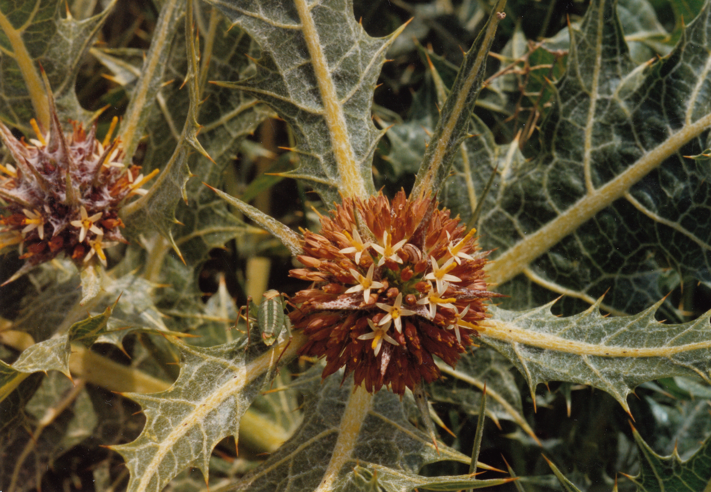
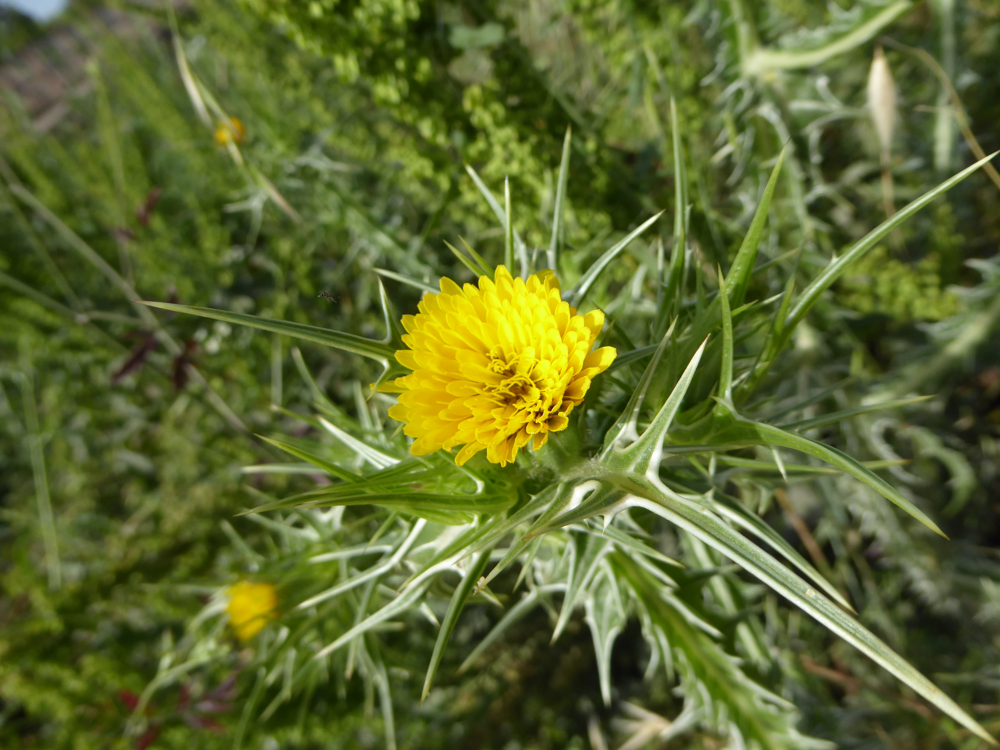
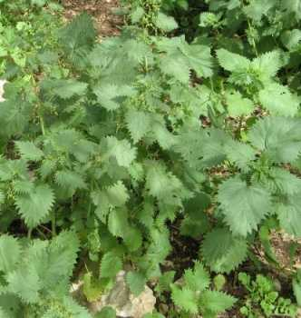

# Plants and Trees in the Bible

## License Information

Plants and Trees in the Bible © United Bible Societies, 2025. Adapted from: <cite>Each According to its Kind: Plants and Trees in the Bible</cite>, by Robert Koops © 2012 United Bible Societies. This work is licensed under Creative Commons Attribution-ShareAlike 4.0 International (<a href="https://creativecommons.org/licenses/by-sa/4.0/">https://creativecommons.org/licenses/by-sa/4.0/</a>).

--------------------------------

## Thorns, thistles, brambles, and briers (id: FLORA:6.2)

6\.2 Thorns, thistles, brambles, and briers
===========================================

We have about twenty names in Hebrew and Greek for thorny and prickly plants in the Bible, and at least seventy or eighty thorny and prickly plants in the Bible lands. Trying to match them is even more hopeless than it is for flowers. In some cases the word was probably not attached to a specific plant in the first place. But we do not even know for sure which ones are generic. If the frequency of use implies generality, the Hebrew word *qots* and the Greek word *akantha* are the most general words for thorny and prickly plants.
------------------------------------------------------------------------------------------------------------------------------------------------------------------------------------------------------------------------------------------------------------------------------------------------------------------------------------------------------------------------------------------------------------------------------------------------------------------------------------------------------------------------------------------------------

In most cases we simply don’t know which of the many spiny plants they could refer to. We have already included the boxthorn (*Lycium europaeum*) and Christ thorn (*Ziziphus spina\-christi*) in our discussion on wild trees and shrubs (see [1\.2 Boxthorn](#FLORA:1.2)). Here we deal with various others. Whatever we may know about these Bible plants is based on two sources of information: 1\) paleo\-botany, that is, studies of what plants probably grew in the Middle East in ancient times, and 2\) cognate words in related languages. We look at cognates because, even after Hebrew passed out of common usage for some centuries, the Arabic and Syriac names, often similar, may have carried on into the present, giving us clues to what the Hebrew may have referred to.

Up to this point we have not included discussion of plants used as place names or personal names, but it is worth noting that thorns have a place in these categories. For example, in [GEN 4:23](https://ref.ly/Gen4:23) “Adah” and “Zillah,” the wives of Lamech, are the names of thorny plants. That this may have affected their personality and behavior is left to the reader to decide. In any case, it would not have been missed by Hebrew hearers of the Lamech story. Likewise, the Hebrew name “Shamir” means “thorny,” although the word is rendered “diamond” or “adamant” in some contexts (for example, [JER 17:1](https://ref.ly/Jer17:1)). The Hebrew word *qots*, which means “thornbush,” occurs in the names Koz and Hakkoz, who are men mentioned in 1 Chronicles, Ezra, and Nehemiah.

Biologists make a sharp distinction between thorns, spines, and prickles. Thorns evolve from branches and spines from leaves. Prickles are usually tiny projections on leaves, especially on smaller plants. In English we also use “thorn” to refer to a thorn\-bearing tree or shrub. Thistles are flowering plants from various genera having leaves with sharp prickles on the edges. Most of them are from the *Asteraceae* family. Nettles belong to the genus *Urtica* and almost all have stinging hairs on their stems and leaves. The sting is caused by a toxin secreted by the plant. We will comment on the technical meanings of “brier” and “bramble” below.

* **Associated Passages:** Genesis 4:23; Jeremiah 17:1

## Thistles (id: FLORA:6.2.1)

6\.2\.1 Thistles
================

References:
-----------

Hebrew בַּרְקָן (barqan)

[JDG 8:7](https://ref.ly/Judg8:7), [JDG 8:16](https://ref.ly/Judg8:16)

Hebrew גַּלְגַּל (galgal)

[PSA 83:14](https://ref.ly/Ps83:14), [ISA 17:13](https://ref.ly/Isa17:13)

Hebrew דַּרְדַּר (dardar)

[GEN 3:18](https://ref.ly/Gen3:18), [HOS 10:8](https://ref.ly/Hos10:8)

Hebrew חוֹחַ (choach)

[1SA 13:6](https://ref.ly/1Sam13:6), [2KI 14:9](https://ref.ly/2Kgs14:9), [2KI 14:9](https://ref.ly/2Kgs14:9), [2CH 25:18](https://ref.ly/2Chr25:18), [2CH 25:18](https://ref.ly/2Chr25:18), [JOB 31:40](https://ref.ly/Job31:40), [PRO 26:9](https://ref.ly/Prov26:9), [SNG 2:2](https://ref.ly/Song2:2), [ISA 34:13](https://ref.ly/Isa34:13), [HOS 9:6](https://ref.ly/Hos9:6)

Discussion:
-----------

The context of certain verses suggests that some biblical plants may have been thistles. They go especially under three names in Hebrew: *barqan*, *dardar*, and *choach*. However, other Hebrew words such as *galgal*, *sirah* and *qots* may have referred to thistles as well. The following may have been some of the thistles referred to in Scripture:

*Tumble Thistle (Ray Pritz (UBS))*

The **Tumble Thistle***Gundelia tournefortii* is a widespread thistle in the Middle East, and the young tender plants are eaten as a vegetable in early spring. However, as the plant matures, the leaves become dry and sharp. Further, the whole plant becomes round, and at a certain point the stem breaks and the plant becomes a “tumbleweed,” rolling and bouncing in the wind, at the same time scattering its seeds. The plant is called *akub* or *ka’aub* in Arabic. The place name “Akov” may come from this plant.

The Hebrew word *galgal* in [PSA 83:14](https://ref.ly/Ps83:14); [ISA 17:13](https://ref.ly/Isa17:13) could refer to the tumble thistle or the Prickly Saltwort *Salsola kali* (also called Russian thistle or tumbleweed; see [5\.2\.2 Hammada (Salsola, Salicornia)](#FLORA:5.2.2)). Like the tumble thistle, the prickly saltwort is round and breaks loose when it dries up, rolling and tumbling before a strong wind.

*Milk thistle (Ray Pritz (UBS))*

The **Milk Thistle***Silybum marianum* is also called Mary’s thistle, holy thistle, or variegated thistle. It is found in southern Europe, North Africa, and the Middle East. It can grow annually or biennially. It grows 1–2 meters (3–7 feet) in height and has large waxy, lobed leaves with sharp spines as in other thistles. Its flower heads, one per stalk, have tiny pink or purple florets bunched together to form the flower. A chemical (silymarin) extracted from the seeds of this thistle is believed to enhance liver function. It is used to treat liver cirrhosis, hepatitis, and gallbladder disorders. Related species of *Silybum* are found in North and South America.

*Syrian thistle (באדיבות הצלם \- ניר אוהד (Wikimedia Commons))*

The **Syrian Thistle***Notobasis syriaca* is native to the Mediterranean region, from the Canary Islands across Morocco and eastward to Egypt, Iran, and Azerbaijan. It also grows on the Mediterranean coast of Europe. According to Zohary, this thistle could have been the *barkan* with which Gideon whipped the elders of the town of Succoth ([JDG 8:7](https://ref.ly/Judg8:7); [JDG 8:16](https://ref.ly/Judg8:16)). The Syrian thistle is an annual plant growing to a meter (3 feet) tall. Its leaves are arranged spirally and are deeply lobed, gray\-green with white veins with sharp spines on the edges and tip. Its flowers have purple petals surrounded by sharp spines.

*Golden thistle (Chenspec (Wikimedia Commons))*

The **Golden Thistle***Scolymus maculatus* is also called the common thistle or oyster thistle. It is an annual or perennial plant that grows to a meter (3 feet) tall. It has a bright yellow flower. As with other thistles, it has leaves with sharp spines on the edges.

*Globe thistle (Ray Pritz (UBS))*

The **Iberian Thistle***Centaurea iberica* is also called the star thistle or Spanish thistle. Zohary suggests that the Hebrew word *dardar* could refer to this thistle, but it does not occur as a weed in the fields and does not fit the context of [GEN 3:18](https://ref.ly/Gen3:18). Hepper suggests instead the Slender Safflower *Carthamus tenuis*, Crete eryngo *Eryngium creticum*, Upright Rest Harrow *Ononis antiquorum*, or Field Prosopis *Prosopis farcta*. Other possible candidates are the tumble thistle, Globe Thistle *Echinops adenocaulus*, and Cotton Thistle *Onopordum cynarocephalum*.

Translation:
------------

Translators in French\-speaking areas may know thistles as *artichout sauvage* (“wild artichoke”); in Portuguese they are called *cardo leiteiro*; in Spanish, *cardo de Maria* or *cardo lechero*. It is possible that thistles will be known to translators in some areas. If not, any obnoxious plant, particularly if it has thorns or prickles, will suffice.

Translators need to know that a phrase like “thorns and thistles” is a rhetorical device called a “doublet” intended to emphasize the thorniness of the scene described, for example the unpleasant outcome of Adam’s tragic choice in the garden of Eden ([GEN 3:18](https://ref.ly/Gen3:18)) or the punishment of Samaria’s idol worshipers ([HOS 10:8](https://ref.ly/Hos10:8)). Since these are rhetorical passages, translators should try to convey the intensity of the whole phrase. The identity of the Hebrew plants is not in focus. If well\-known specific words for thorn plants are lacking, one can get the negative idea by a phrase such as “prickly and obnoxious plants” or “thorns of every kind.” Also, in the absence of prickly plants, any sort of plant considered destructive by farmers will do. Note the variety in English versions at [GEN 3:18](https://ref.ly/Gen3:18): NJB (New Jerusalem Bible (1985)) “brambles and thistles”; GNB (Good News Bible) “weeds and thorns.”

* **Associated Passages:** Judges 8:7; Judges 8:16; Psalms 83:14; Isaiah 17:13; Genesis 3:18; Hosea 10:8; 1 Samuel 13:6; 2 Kings 14:9; 2 Chronicles 25:18; Job 31:40; Proverbs 26:9; Song of Songs 2:2; Isaiah 34:13; Hosea 9:6

* **Associated ACAI Concepts:** Thistle (ID: `flora:Thistle`)

## Nettles (id: FLORA:6.2.2)

6\.2\.2 Nettles
===============

References:
-----------

Hebrew חָרוּל (charul)

[JOB 30:7](https://ref.ly/Job30:7), [PRO 24:31](https://ref.ly/Prov24:31), [ZEP 2:9](https://ref.ly/Zeph2:9)

Hebrew סָרָב (sarav)

[EZK 2:6](https://ref.ly/Ezek2:6)

Hebrew סִרְפַּד (sirpad)

[ISA 55:13](https://ref.ly/Isa55:13)

Hebrew קִמּוֹשׂ (qimmos)

[PRO 24:31](https://ref.ly/Prov24:31), [ISA 34:13](https://ref.ly/Isa34:13), [HOS 9:6](https://ref.ly/Hos9:6)

Discussion:
-----------

*Nettles (Krzysztof Ziarnek, Kenraiz (Wikimedia Commons))*

*Little ball nettle (Pancrat (Wikimedia Commons))*

 There are thirty to forty\-five species of nettles belonging to the family *Urtica*, which is found mainly in temperate regions of the world. Three are common in Israel and probably were there in Bible times: the Tailed Nettle *Urtica caudata* (\= *Urtica membranacea*), the Roman Nettle *Urtica pilulifera* (“little ball nettle”) and the Dwarf Nettle *Urtica urens* (“burning nettle”). Nettles are mostly perennial plants, with stinging hairs. People who have experienced the sting appreciate that the Hebrew roots *s\-r\-f* and *ch\-r\-h* both mean “burning” or “scorching.” The Arabic name for one type of nettle is *chorreig* in Israel and *sorbei* in Egypt.

Special significance:
---------------------

All the references cited above are in rhetorical contexts where the quality of thorniness or pain is in focus. Nettles were and are a nuisance on many farms. They tend to sprout in abandoned settlements, and they are often cited with jackals and owls to illustrate the desolation of a nation by their enemies. Today the tops of the growing nettles are used for food in many places. Extracts from nettles are used to treat arthritis and hay fever and as an ingredient of shampoos to control dandruff.

Translation:
------------

Nettles are found in the Far East, Asia, and Europe, as well as in North America. Translators in those areas may have a special word for them, or they may have a general word for thorns that covers anything with prickles, spikes, needles, or barbs. If transliterations are needed in footnotes, some possibilities are French *orties*; Portuguese *urtiga*; Spanish *ortiga*; and Arabic *angura*, *nabat*, *akub*.

* **Associated Passages:** Job 30:7; Proverbs 24:31; Zephaniah 2:9; Ezekiel 2:6; Isaiah 55:13; Isaiah 34:13; Hosea 9:6

* **Associated ACAI Concepts:** Nettle (ID: `flora:Nettle`)

## Other thorny plants (thorns, brambles, briers) (id: FLORA:6.2.3)

6\.2\.3 Other thorny plants (thorns, brambles, briers)
======================================================

References:
-----------

Hebrew חֵדֶק (chedeq)

[PRO 15:19](https://ref.ly/Prov15:19), [MIC 7:4](https://ref.ly/Mic7:4)

Hebrew נַעֲצוּץ (na‘atsuts)

[ISA 7:19](https://ref.ly/Isa7:19), [ISA 55:13](https://ref.ly/Isa55:13)

Hebrew סִירָה (sirah)

[ECC 7:6](https://ref.ly/Eccl7:6), [ISA 34:13](https://ref.ly/Isa34:13), [HOS 2:8](https://ref.ly/Hos2:8), [NAM 1:10](https://ref.ly/Nah1:10)

Hebrew סַלּוֹן, סִלּוֹן (sallon/sillon)

[EZK 2:6](https://ref.ly/Ezek2:6), [EZK 28:24](https://ref.ly/Ezek28:24)

Hebrew צֵן, צְנִינִים (tsen, tseninim)

[NUM 33:55](https://ref.ly/Num33:55), [JOS 23:13](https://ref.ly/Josh23:13), [JOB 5:5](https://ref.ly/Job5:5), [PRO 22:5](https://ref.ly/Prov22:5)

Hebrew קוֹץ (qots)

[GEN 3:18](https://ref.ly/Gen3:18), [EXO 22:5](https://ref.ly/Exod22:5), [JDG 8:7](https://ref.ly/Judg8:7), [JDG 8:16](https://ref.ly/Judg8:16), [2SA 23:6](https://ref.ly/2Sam23:6), [PSA 118:12](https://ref.ly/Ps118:12), [ISA 32:13](https://ref.ly/Isa32:13), [ISA 33:12](https://ref.ly/Isa33:12), [JER 4:3](https://ref.ly/Jer4:3), [JER 12:13](https://ref.ly/Jer12:13), [EZK 28:24](https://ref.ly/Ezek28:24), [HOS 10:8](https://ref.ly/Hos10:8)

Hebrew שֵׂךְ (sek)

[NUM 33:55](https://ref.ly/Num33:55)

Hebrew שַׁיִת (shayith)

[ISA 5:6](https://ref.ly/Isa5:6), [ISA 7:23](https://ref.ly/Isa7:23), [ISA 7:24](https://ref.ly/Isa7:24), [ISA 7:25](https://ref.ly/Isa7:25), [ISA 9:17](https://ref.ly/Isa9:17), [ISA 10:17](https://ref.ly/Isa10:17), [ISA 27:4](https://ref.ly/Isa27:4)

Hebrew שָׁמִיר (shamir)

[ISA 5:6](https://ref.ly/Isa5:6), [ISA 7:23](https://ref.ly/Isa7:23), [ISA 7:24](https://ref.ly/Isa7:24), [ISA 7:25](https://ref.ly/Isa7:25), [ISA 9:17](https://ref.ly/Isa9:17), [ISA 10:17](https://ref.ly/Isa10:17), [ISA 27:4](https://ref.ly/Isa27:4), [ISA 32:13](https://ref.ly/Isa32:13)

Greek ἄκανθα (akantha)

[MAT 7:16](https://ref.ly/Matt7:16), [MAT 13:7](https://ref.ly/Matt13:7), [MAT 13:7](https://ref.ly/Matt13:7), [MAT 13:22](https://ref.ly/Matt13:22), [MAT 27:29](https://ref.ly/Matt27:29), [MRK 4:7](https://ref.ly/Mark4:7), [MRK 4:7](https://ref.ly/Mark4:7), [MRK 4:18](https://ref.ly/Mark4:18), [LUK 6:44](https://ref.ly/Luke6:44), [LUK 8:7](https://ref.ly/Luke8:7), [LUK 8:7](https://ref.ly/Luke8:7), [LUK 8:14](https://ref.ly/Luke8:14), [JHN 19:2](https://ref.ly/John19:2), [HEB 6:8](https://ref.ly/Heb6:8), [SIR 28:24](https://ref.ly/Sir28:24)

Greek ἀκάνθινος (akanthinos)

[MRK 15:17](https://ref.ly/Mark15:17), [JHN 19:5](https://ref.ly/John19:5)

Greek βάτος (batos)

[MRK 12:26](https://ref.ly/Mark12:26), [LUK 6:44](https://ref.ly/Luke6:44), [LUK 20:37](https://ref.ly/Luke20:37), [ACT 7:30](https://ref.ly/Acts7:30), [ACT 7:35](https://ref.ly/Acts7:35)

Greek ῥάμνος (ramnos)

[LJE 1:70](https://ref.ly/EpJer1:70)

Greek τρίβολος (tribolos)

[MAT 7:16](https://ref.ly/Matt7:16), [HEB 6:8](https://ref.ly/Heb6:8)

Latin spina

[2ES 16:33](https://ref.ly/2Esd16:33), [2ES 16:78](https://ref.ly/2Esd16:78)

Discussion:
-----------

We bring together here nine Hebrew words, five Greek words, and one Latin word. We would have included the Hebrew word *‘atad* here, but since it is tree\-sized, we have included it in Chapter 1 (see [1\.2 Boxthorn](#FLORA:1.2)). Also, the Hebrew word *barqan* could have been treated here, but we have taken it to refer to thistles (see [6\.2\.1 Thistles](#FLORA:6.2.1)). Hepper suggests that *barqan* could have referred to branches of the boxthorn. The Hebrew and Greek words discussed below are usually translated “thorn,” “bramble,” or “brier” in English. The words “brier” and “bramble” have technical usages. Bramble technically refers to thorny plants in the rose family (genus *Rubus*), and it includes blackberries and raspberries, both common as food plants in Europe and North America. Brier can refer to a type of rose with pink flowers, also called the sweetbrier or eglantine, or to a prickly vine in the eastern United States called the bullbrier, greenbrier, and other names.

*chedeq*

In both references to this Hebrew word there is an association with a fence or hedge (*mesukah*). The first line of [PRO 15:19](https://ref.ly/Prov15:19) says literally “The way of a sluggard is like a hedge of thorns \[*chedeq* ].” The first line of [MIC 7:4](https://ref.ly/Mic7:4) says “The best of them is like a brier \[*chedeq* ],” which is parallel to “the most upright of them a thorn hedge.” [ISA 5:5](https://ref.ly/Isa5:5) mentions a vineyard with a hedge. This hedge may have been made of stones, but may well have been topped with thorny branches of spiny burnet or Christ thorn. [HOS 2:8](https://ref.ly/Hos2:8) (6\) refers to God hedging the path of wayward Israel with “thorns” (*sirah*).

*na‘atsuts*

This Hebrew word occurs twice in Isaiah. In [ISA 7:19](https://ref.ly/Isa7:19) we read that flies and bees will settle on “thornbushes” (*na‘atsuts*). Later in the vision of the new Israel, [ISA 55:13](https://ref.ly/Isa55:13) says beautiful cypress trees will replace thornbushes (*na‘atsuts*), and fragrant myrtle shrubs will replace briers (*sirpad*).

*sirah*

Two passages where this Hebrew word occurs are [ECC 7:6](https://ref.ly/Eccl7:6) (“For as the crackling of thorns \[*sirah* ] under a pot …”) and [HOS 2:8](https://ref.ly/Hos2:8) (“Therefore I will hedge up her way with thorns \[*sirah* ] …”). According to Zohary, *sirah* could refer to the Thorny or Spiny Burnet *Sarcopoterium spinosum*. A related Arabic word *sir* /*thir* is still used for hedging and as fuel for cooking and for lime kilns.

*sallon* /*sillon*

Both references to this Hebrew word are from Ezekiel. In [EZK 2:6](https://ref.ly/Ezek2:6) it is in a doublet with *sarav*: “… though briers \[*sarav* ] and thorns \[*sallon* ] are with you … .” In [EZK 28:24](https://ref.ly/Ezek28:24) we read that in the new Israel “there shall be no more a brier \[*sillon* ] to prick or a thorn \[*qots* ] to hurt them.”

*tsen*, *tseninim*

This singular Hebrew word *tsen* occurs two times with a botanical meaning; it is found also in [AMO 4:2](https://ref.ly/Amos4:2) with the meaning “hook.” In [PRO 22:5](https://ref.ly/Prov22:5) a we read “Thorns \[*tsen* ] and snares are in the way of the perverse.” Hepper suggests that here we may have the True Bramble (Blackberry) *Rubus sanguineus* (French *mûre*, *mûrier*; Spanish *zarza*). [JOB 5:5](https://ref.ly/Job5:5) says “His harvest the hungry eat, and he takes it even out of thorns \[*tsen* ] … .” See below for discussion of this difficult verse. The plural Hebrew word *tseninim* is used in [NUM 33:55](https://ref.ly/Num33:55); [JOS 23:13](https://ref.ly/Josh23:13) in a metaphorical sense: the enemies of Israel will be like thorns in the Israelites’ bodies.

*qots*

This is probably the most general of the Hebrew words for thorn, occurring twelve times, including six times in doublets with *barqan*, *dardar*, *sillon*, or *shamir*.

*sek*

The only place we find this Hebrew word is in [NUM 33:55](https://ref.ly/Num33:55), where we read that the inhabitants of Canaan “will be as pricks \[*sek* ] in your eyes and as thorns (*tseninim* ] in your sides.” However, several related words give us clues to the meaning of *sek*: *sukkah* refers to a harpoon in [JOB 40:31](https://ref.ly/Job40:31), and *sakkin* means “knife.”

*shayith*

This Hebrew word occurs seven times, always as a doublet with *shamir*, and only in Isaiah.

*shamir*

This Hebrew word occurs eight times in Isaiah with a botanical meaning, seven of which are in parallel with *shayith*. RSV (Revised Standard Version (1952)) usually translates the doublet as “briers \[*shamir* ] and thorns \[*shayith* ].” In [ISA 10:17](https://ref.ly/Isa10:17) the order of these Hebrew words is reversed, so RSV (Revised Standard Version (1952)) has “thorns and briers.” RSV (Revised Standard Version (1952)) translates *shamir* as “diamond” or “adamant,” a type of hard stone, in [JER 17:1](https://ref.ly/Jer17:1), [JER 17:1](https://ref.ly/Jer17:1); [EZK 3:9](https://ref.ly/Ezek3:9); and [ZEC 7:12](https://ref.ly/Zech7:12). The name “Shamir” occurs in [JOS 15:48](https://ref.ly/Josh15:48) and [JDG 10:1](https://ref.ly/Judg10:1); [JDG 10:2](https://ref.ly/Judg10:2) as a place name and in [1CH 24:24](https://ref.ly/1Chr24:24) as a personal name.

*akantha*

This Greek word occurs in [MAT 7:16](https://ref.ly/Matt7:16) b, which asks “Are grapes gathered from thorns \[*akantha* ] or figs from thistles \[*tribolos* ]?” Interestingly, the parallel passage in [LUK 6:44](https://ref.ly/Luke6:44) keeps *akantha*, but substitutes *batos* (“bramble bush”) for *tribolos*. In [HEB 6:8](https://ref.ly/Heb6:8) *akantha* is in a doublet again with *tribolos**Akantha* also occurs in the story of the sower ([MAT 13:7](https://ref.ly/Matt13:7); [MAT 13:7](https://ref.ly/Matt13:7); [MAT 13:22](https://ref.ly/Matt13:22); [MRK 4:7](https://ref.ly/Mark4:7); [MRK 4:7](https://ref.ly/Mark4:7); [MRK 4:18](https://ref.ly/Mark4:18); [LUK 8:7](https://ref.ly/Luke8:7); [LUK 8:7](https://ref.ly/Luke8:7); [LUK 8:14](https://ref.ly/Luke8:14)). In [MAT 27:29](https://ref.ly/Matt27:29); [JHN 19:2](https://ref.ly/John19:2) “a crown of thorns \[*akantha* ]” is placed on Jesus’ head. Scholars have speculated for centuries over what species *akantha* refers to in these verses. Linnaeus was so convinced that it must be the Syrian Christ Thorn *Ziziphus spina\-christi* that he made “Christ\-thorn” the species name. Others, particularly Hebrew botanists, argue for the Spiny Burnet *Sarcopoterium spinosum* on the grounds that the soldiers would have taken the most available thorny plant. It could also have been the *Paliurus spina\-christi*, the Lotus Thorn *Ziziphus lotus*, or the Boxthorn *Lycium shawii* (see [1\.2 Boxthorn](#FLORA:1.2)). We believe that Matthew and John were not interested in the particular bush that the thorns came from, so they used a general word here.

*akanthinos*

This Greek word is derived from *akantha*. It is used of the crown of thorns in [MRK 15:17](https://ref.ly/Mark15:17); [JHN 19:5](https://ref.ly/John19:5). It seems to be a generic word, meaning “thorny” or “made of thorns.”

*batos*

The famous burning bush in [EXO 3:2](https://ref.ly/Exod3:2); [EXO 3:3](https://ref.ly/Exod3:3); [EXO 3:4](https://ref.ly/Exod3:4) (*seneh* in Hebrew) is rendered by the Greek word *batos* in the Septuagint, and that word is used in the retelling of the story in [MRK 12:26](https://ref.ly/Mark12:26); [LUK 20:37](https://ref.ly/Luke20:37); [ACT 7:30](https://ref.ly/Acts7:30); [ACT 7:35](https://ref.ly/Acts7:35) (see [1\.4 Burning bush](#FLORA:1.4)). The only clue that this might have been a thorny plant is that Luke uses it in parallel with *akantha* in [LUK 6:44](https://ref.ly/Luke6:44) b: “For figs are not gathered from thorns \[*akantha* ], nor are grapes picked from a bramble bush \[*batos* ].”

*ramnos*

In [LJE 1:70](https://ref.ly/EpJer1:70) (71\), a passage that echoes [JER 10:5](https://ref.ly/Jer10:5), the Greek word *ramnos* refers to a bush that birds land on. How did the translators of RSV (Revised Standard Version (1952)) know it was a “thorn bush”? It is possible that they used “thorn bush” for *ramnos* in [LJE 1:70](https://ref.ly/EpJer1:70) because the Septuagint translators used *ramnos* to translate the Hebrew word for “bramble” (*‘atad*) in [JDG 9:14](https://ref.ly/Judg9:14); [JDG 9:15](https://ref.ly/Judg9:15) (see [1\.2 Boxthorn](#FLORA:1.2)).

*tribolos*

This Greek word only occurs in [MAT 7:16](https://ref.ly/Matt7:16); [HEB 6:8](https://ref.ly/Heb6:8), where it is rendered “thistles.” In both passages it is paired with *akantha*.

*spina*

In [2ES 16:33](https://ref.ly/2Esd16:33); [2ES 16:78](https://ref.ly/2Esd16:78) the Latin word *spina* is used to refer to thorns growing on the roads of a deserted land. The context requires a general word that implies a bush that blocks the road so people cannot pass easily.

Translation:
------------

As in the case of thistles and nettles, the contexts for other thorny plants are usually rhetorical, and translators need to be free to use appropriate cultural equivalents. In many cases doublets are involved (for example, “thorns and thistles,” “thorns and briers”) or synonyms in parallel lines. In many languages there may not be nearly as many words in the semantic domain “thorny plants” to choose from as there are in Hebrew, so translators will have to use their vocabulary more than once, trying to be concordant where possible.

[JDG 8:7](https://ref.ly/Judg8:7); [JDG 8:16](https://ref.ly/Judg8:16): Two problems arise in these verses. First, the identity of the plant(s) referred to and second, the meaning of the Hebrew verb rendered “flail” (*dush*). Gideon promises to punish the people of Succoth by flailing their flesh with “thorns” (*qots*) and “briers” (*barqan*). The Hebrew verb *dush* occurs elsewhere with the meaning “thresh,” “trample,” or “beat.” It is unclear here whether Gideon is simply threatening to beat the people of Succoth with thorny branches, or using a metaphor, saying, in effect, “I’m going to deal with your bodies as a farmer threshes/beats his grain at harvest time, only I will use thorny branches.” It must be remembered that threshing was and is done in many ways—by beating the grain with sticks, by having donkeys and oxen tread on it, or by dragging a sledge over it. In the development of agriculture, we can assume that beating by hand came first, followed by having animals trample the grain, and finally, the invention of the sledge, and that the verb *dush* started with the sense of “beat” and then took on the more specific meanings as the technology changed. The threshing sledge had protrusions on the underside which crushed the grain and made the outer shell come off (see WTH, [1\.1\.8\.2 Threshing board, sledge](#REALIA:1.1.8.2)). So some commentators have suggested that *barqan* here may actually refer to a sledge. However, the simplest solution is often the best, and Gideon’s threat is probably adequately translated by a verb that means “beat” (GNB (Good News Bible)) or “whip” (NCV (New Century Version), GW (God's Word Translation)), rather than by “trample” (NRSV (New Revised Standard Version (1989))), “thresh” (NJPSV (New Jewish Publication Society Version)), or “flail” (RSV (Revised Standard Version (1952)), REB (Revised English Bible (1989))). Translating *dush* as “tear” (NIV (New International Version (1984)), NLT (New Living Translation), NKJV (New King James Version (1982))) seems to be going beyond the normal semantic range of that word. Still, the use of “your flesh/bodies” instead of simply “you” raises the possibility that the writer intends something other than just “beat someone with a tool.” So translations following NIV (New International Version (1984)), NLT (New Living Translation), and NKJV (New King James Version (1982)) also have some merit.

[JOB 5:5](https://ref.ly/Job5:5): This verse is about God giving rich people their just reward by letting poor people inherit their wealth. The second line seems to say “they will take \[the rich man’s] harvest, even from among thorns \[*tsinnim*, plural of *tsen* ].” Commentators who take *tsinnim* as thorns here picture either thorny places on the edge of the field, where seed has fallen (so GNB (Good News Bible), NCV (New Century Version), GW (God's Word Translation); see [MAT 13:7](https://ref.ly/Matt13:7)) or perhaps a field surrounded by a thorn hedge, which was very common. In the latter case, the sense is that the poor people will even penetrate a thorny fence to take the rich man’s grain (so NLT (New Living Translation), FRCL (French Common Language Version (Bible en français courant))).

Various commentators have considered the above situation strange, and have assumed that a word other than “thorns” was intended by the writer. REB (Revised English Bible (1989)) and NJPSV (New Jewish Publication Society Version) take *tsinnim* as a plural for *tsinna’* (“basket/pannier”). NJPSV (New Jewish Publication Society Version) says “carrying it off in baskets,” and REB (Revised English Bible (1989)) has “stronger men seize it from the panniers.” “Stronger men” here results from taking the Hebrew word *’el* as “strong man” rather than as the preposition “to.” Others, using different emendations, have translated this line as “and carry away to hiding places” (Dhorme), “he takes it to the famished” (Guillaume), “or God shall take it away by blight” (NAB (New American Bible (1970)), using square brackets), and “God snatches it from their mouths” (NJB (New Jerusalem Bible (1985))). The Septuagint, perhaps following a different text, has “but they shall not be delivered out of calamities.” A number of commentators take this line as untranslatable and delete it. The Jewish commentator Moshe Eisemann adds this bit of explanation: The poor gleaners in the picture are not in a hurry. They take their time gleaning, even taking the grain from the thorny places or from behind thorn hedges, because they have no fear of being chased away. With this in mind, I recommend staying with “thorns” by following GNB (Good News Bible) and NCV (New Century Version) or NLT (New Living Translation) and FRCL (French Common Language Version (Bible en français courant)).

* **Associated Passages:** Proverbs 15:19; Micah 7:4; Isaiah 7:19; Isaiah 55:13; Ecclesiastes 7:6; Isaiah 34:13; Hosea 2:8; Nahum 1:10; Ezekiel 2:6; Ezekiel 28:24; Numbers 33:55; Joshua 23:13; Job 5:5; Proverbs 22:5; Genesis 3:18; Exodus 22:5; Judges 8:7; Judges 8:16; 2 Samuel 23:6; Psalms 118:12; Isaiah 32:13; Isaiah 33:12; Jeremiah 4:3; Jeremiah 12:13; Hosea 10:8; Isaiah 5:6; Isaiah 7:23; Isaiah 7:24; Isaiah 7:25; Isaiah 9:17; Isaiah 10:17; Isaiah 27:4; Matthew 7:16; Matthew 13:7; Matthew 13:22; Matthew 27:29; Mark 4:7; Mark 4:18; Luke 6:44; Luke 8:7; Luke 8:14; John 19:2; Hebrews 6:8; Sirach 28:24; Mark 15:17; John 19:5; Mark 12:26; Luke 20:37; Acts 7:30; Acts 7:35; Letter of Jeremiah 1:70; 2 Esdras (Latin) 16:33; 2 Esdras (Latin) 16:78; Isaiah 5:5; Amos 4:2; Job 40:31; Jeremiah 17:1; Ezekiel 3:9; Zechariah 7:12; Joshua 15:48; Judges 10:1; Judges 10:2; 1 Chronicles 24:24; Exodus 3:2; Exodus 3:3; Exodus 3:4; Jeremiah 10:5; Judges 9:14; Judges 9:15

* **Associated ACAI Concepts:** Brier (ID: `flora:Brier`)
