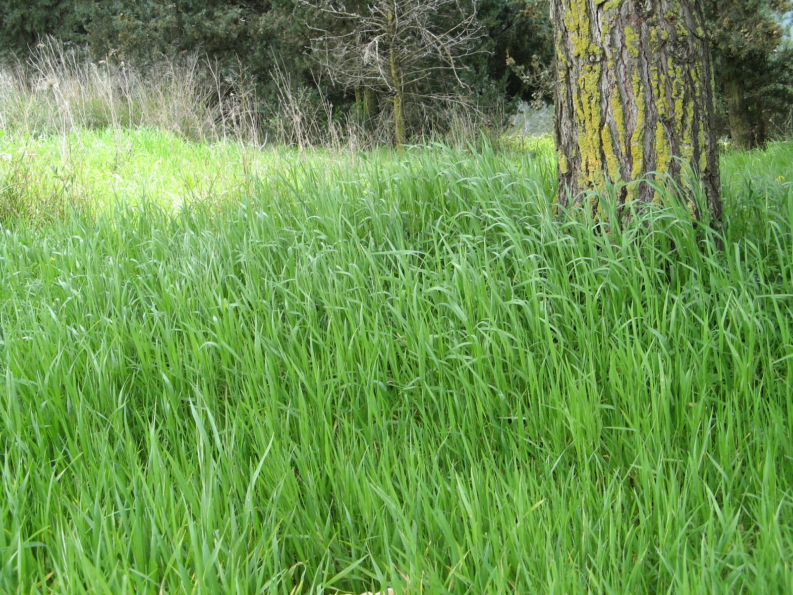

# Plants and Trees in the Bible

## License Information

Plants and Trees in the Bible © United Bible Societies, 2025. Adapted from: <cite>Each According to its Kind: Plants and Trees in the Bible</cite>, by Robert Koops © 2012 United Bible Societies. This work is licensed under Creative Commons Attribution-ShareAlike 4.0 International (<a href="https://creativecommons.org/licenses/by-sa/4.0/">https://creativecommons.org/licenses/by-sa/4.0/</a>).

--------------------------------

## Weeds (id: FLORA:6.3)

6\.3 Weeds
==========

One plant name in the Bible is mentioned with no connotation of its thorniness. Rather, its unpopularity is due to its persistence in growing where it should not grow. That is the “tare” of the well\-known Gospel parable.
-----------------------------------------------------------------------------------------------------------------------------------------------------------------------------------------------------------------------------

## Weed (tare, darnel) (id: FLORA:6.3.1)

6\.3\.1 Weed (tare, darnel)
===========================

References:
-----------

Hebrew בָּאְשָׁה (ba’ashah)

[JOB 31:40](https://ref.ly/Job31:40)

Greek ζιζάνιον (zizanion)

[MAT 13:25](https://ref.ly/Matt13:25), [MAT 13:26](https://ref.ly/Matt13:26), [MAT 13:27](https://ref.ly/Matt13:27), [MAT 13:29](https://ref.ly/Matt13:29), [MAT 13:30](https://ref.ly/Matt13:30), [MAT 13:36](https://ref.ly/Matt13:36), [MAT 13:38](https://ref.ly/Matt13:38), [MAT 13:40](https://ref.ly/Matt13:40)

Discussion:
-----------

*Darnel grass, botanical illustration (Wikimedia Commons)*

[MAT 13:25](https://ref.ly/Matt13:25) speaks of enemies sowing weeds (or tares) in with the wheat seed. Although the land of the Bible does not lack noxious weeds in the fields, the best candidate for the Greek word *zizanion* is Darnel Grass *Lolium temulentum*. Evidence from Egyptian tombs and from excavations at Lachish tells us that darnel grass has been a pest for at least three millennia. It looks so much like emmer wheat that it is very difficult to distinguish the two.

The Hebrew noun *ba’ashah* occurs only in [JOB 31:40](https://ref.ly/Job31:40), but its verbal form occurs many times in the Old Testament with the meaning “to stink” like that of a rotting sore or a corpse. This noun does not actually refer to a plant; it literally means “stinking thing.” However, in [JOB 31:40](https://ref.ly/Job31:40) it is parallel with the Hebrew word *choach* (“thistle”; see [6\.2\.1 Thistles](#FLORA:6.2.1)), so it has the sense of “stinking/unpleasant weed” in this context. One lexicon takes it to refer to a particular plant called “stinkweed,” but it has a more generic sense here, referring to any stinking weeds.

Description:
------------

*Darnel grass (H. Zell (Wikimedia Commons))*

Darnel grass grows annually throughout Palestine and reaches 30–60 centimeters (1–2 feet) high.

Special significance:
---------------------

In the Bible darnel grass is only cited as a noxious plant. However, the Assyrians used it for medicine.

Translation:
------------

Translators in agricultural areas will have no difficulty understanding the biblical farmer’s frustration with nasty weeds. Darnel grass is so well known that it generates a lot of names (for example, French *herbe a couteau*, *herbe d’ivrogue*, *ivraie*; Spanish *barrachuela*, *cizaña*, *cominillo*, *joyo*, *trigollo*; Portuguese *joio*). Translators who are out of touch with the rural, agricultural scene need to consult farmers for possible names. A cultural equivalent to the “false wheat” of the Bible may exist. Otherwise a phrase such as “false wheat” could be used in the parable of the weeds.

* **Associated Passages:** Job 31:40; Matthew 13:25; Matthew 13:26; Matthew 13:27; Matthew 13:29; Matthew 13:30; Matthew 13:36; Matthew 13:38; Matthew 13:40

* **Associated ACAI Concepts:** Weed (ID: `flora:Weed`)
