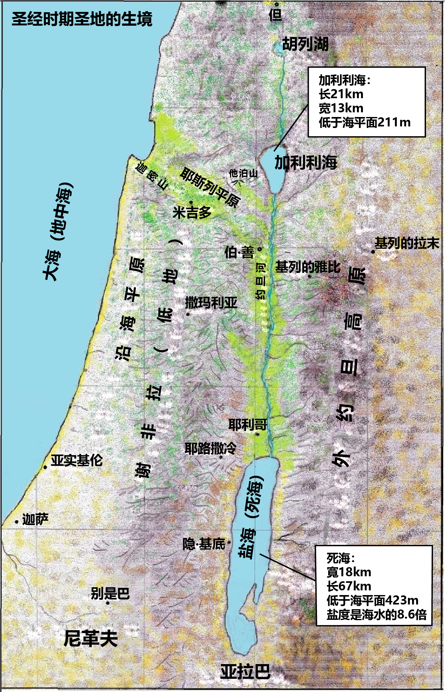

# Plants and Trees in the Bible

## License Information

Plants and Trees in the Bible © United Bible Societies, 2025. Adapted from: <cite>Each According to its Kind: Plants and Trees in the Bible</cite>, by Robert Koops © 2012 United Bible Societies. This work is licensed under Creative Commons Attribution-ShareAlike 4.0 International (<a href="https://creativecommons.org/licenses/by-sa/4.0/">https://creativecommons.org/licenses/by-sa/4.0/</a>).

--------------------------------

## 标题：翻译圣经中的植物 (id: FLORA:0.1)

0\.1 标题：翻译圣经中的植物
================

*圣经时期圣地的生境 (© Robert Koops)*

圣经既是一部历史文献，也是一部文学著作，这种两重性体现在圣经的每章每节之中，使得圣经翻译者处于两难的境地。经文的历史性把翻译者推向逐字逐句对应的形式对等翻译方法。然而，经文的文学性和修辞又把翻译者引向文学、修辞和诗学对等的翻译方法，意思是，使读者产生与阅读原作相同的情感反应。要获得这个效果，翻译者往往需要大刀阔斧地调整语句结构和表达方式。这里没有"皆大欢喜的中庸之道"，只有各种让人不满意的翻译方法，或者更确切地说，只有对译本的历史性处理或文学性处理满腹牢骚的读者！

圣经中表示树木和花草的词语也逃不过这种两难。翻译者必须要问的第一个问题是：这个词语的直接上下文主要是"修辞性的"还是"非修辞性的"？我们这里说"主要"的原因是有些经文很难分类。我们用"非修辞性"而不用"历史性"的说法，是因为后者涉及一个复杂的问题，就是在古代文献的语境中什么是"历史"。

翻译者的工作之一是处理术语，具体来说，是决定使用读者熟悉的表达方式来翻译这些术语（"归化翻译"），还是保留一点外来的奇特性（"异化翻译"）。度量衡单位就是一个典型的例子。当圣经翻译者将犹太人的"肘"转换成英制的尺或寸（或者公制单位），他是在使用读者熟悉的度量衡单位将经文"归化"；然而如果翻译者保留用"肘"，这种做法就是将经文"异化"。中文圣经译本在许多情况下保留了"肘"。当翻译者使用"figi"（来自英文"fig"，中译"无花果"）一词而没有使用当地的对等词，就是将经文"异化"。整个译本的"陌生感"的程度，是由度量衡、词汇，甚至语法结构的归化或异化数量积累来决定的。

在20世纪中期发展起来的"动态／功能对等"圣经翻译运动引入了一个新思维，就是"上帝说你的语言"。激进的归化翻译成为主流。可是，圣经翻译理论不断变化，现在的观点是："异化"并不像人们从前以为的那样不济。过度归化的译文被视为误导甚或矫情，就像对孩子说话似的。但是，什么程度的归化最为合宜呢？这取决于利益相关者想要什么。谁是利益相关者呢？出版商固然是其一，然而长远来说，译本的潜在读者才是更重要的利益相关者。

让我们把当前的问题问得再具体一些：翻译者的目标读者应划定在怎样的范围内？哪一群人应被视为选择圣经所用词汇的参照基准？是很少接触其他语言的农村人？还是居住在城市里面，通过电视、互联网等媒体扩大了接触面，因而能接受许多不同观念的人们？

每一本杂志或书籍都有目标读者群，从某种意义上说，他们是该杂志或书籍背后的"权威"。圣经翻译也是这样。大部分欧系语言和英文圣经的目标读者，是能够适应希腊原文和希伯来原文术语的"陌生感"的人群。考虑到不同读者群体的需要，以及方便不同处境的翻译者参考使用，本手册在提出翻译建议时保留了一些灵活性，包含了不同的归化和异化进路。

然而，我们也讲求实际，因此刻意地强调要有规范；对于一部分学习翻译的人来说，做到规范是很不容易的事。我们主要面向那些采纳"动态／功能对等"翻译方法的翻译者，并倾向于严肃对待修辞和体栽。

出版商制订了"风格指南"，因为认识到他们制订拼写、用字、格式和风格的一套规则可使出版物达到一定程度的一致性，并且也明白不同出版商的规则可能是不同的。同样地，我们提倡使用前后一致的翻译方法，但并不认为我们关于圣经专门用语的翻译建议是任何人必须遵从的。我们只是说，如果翻译者采纳这些建议，则译作符合21世纪初主流学术对圣经翻译的观念。

