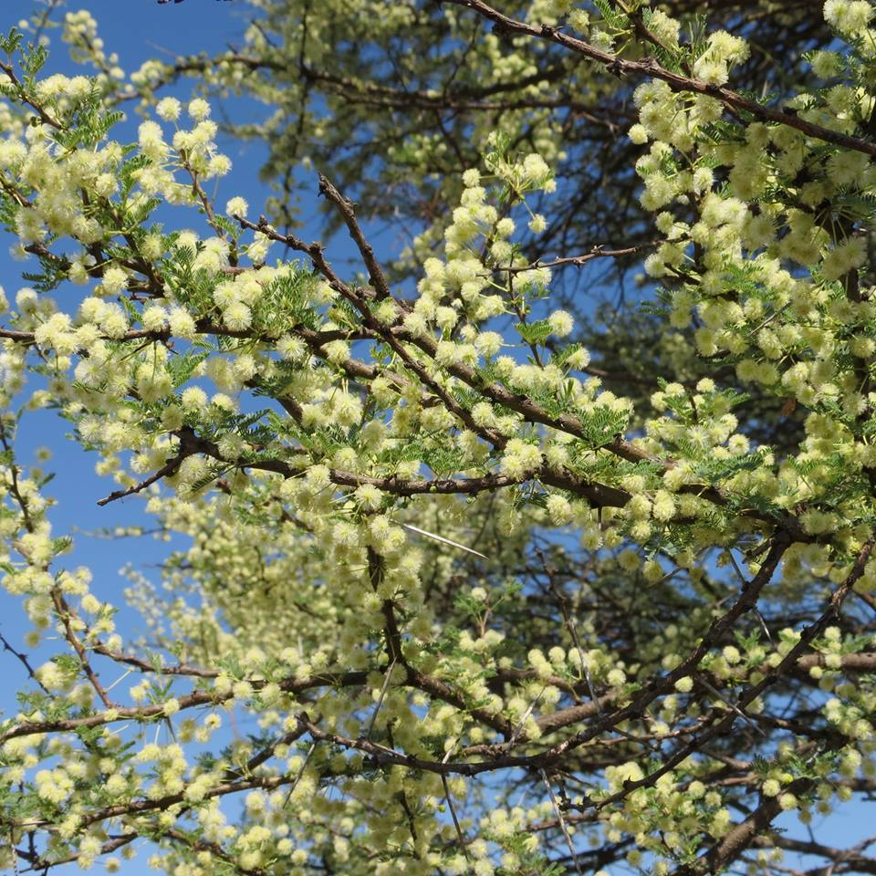

# Plants and Trees in the Bible

## License Information

Plants and Trees in the Bible © United Bible Societies, 2025. Adapted from: <cite>Each According to its Kind: Plants and Trees in the Bible</cite>, by Robert Koops © 2012 United Bible Societies. This work is licensed under Creative Commons Attribution-ShareAlike 4.0 International (<a href="https://creativecommons.org/licenses/by-sa/4.0/">https://creativecommons.org/licenses/by-sa/4.0/</a>).

--------------------------------

## 标题：金合欢树（acacia） (id: FLORA:1.1)

1\.1 标题：金合欢树（acacia）
====================

经文出处
----

Hebrew 来：שִׁטָּה (音译：shittah)

[EXO 25:5](https://ref.ly/Exod25:5), [EXO 25:10](https://ref.ly/Exod25:10), [EXO 25:13](https://ref.ly/Exod25:13), [EXO 25:23](https://ref.ly/Exod25:23), [EXO 25:28](https://ref.ly/Exod25:28), [EXO 26:15](https://ref.ly/Exod26:15), [EXO 26:26](https://ref.ly/Exod26:26), [EXO 26:32](https://ref.ly/Exod26:32), [EXO 26:37](https://ref.ly/Exod26:37), [EXO 27:1](https://ref.ly/Exod27:1), [EXO 27:6](https://ref.ly/Exod27:6), [EXO 30:1](https://ref.ly/Exod30:1), [EXO 30:5](https://ref.ly/Exod30:5), [EXO 35:7](https://ref.ly/Exod35:7), [EXO 35:24](https://ref.ly/Exod35:24), [EXO 36:20](https://ref.ly/Exod36:20), [EXO 36:31](https://ref.ly/Exod36:31), [EXO 36:36](https://ref.ly/Exod36:36), [EXO 37:1](https://ref.ly/Exod37:1), [EXO 37:4](https://ref.ly/Exod37:4), [EXO 37:10](https://ref.ly/Exod37:10), [EXO 37:15](https://ref.ly/Exod37:15), [EXO 37:25](https://ref.ly/Exod37:25), [EXO 37:28](https://ref.ly/Exod37:28), [EXO 38:1](https://ref.ly/Exod38:1), [EXO 38:6](https://ref.ly/Exod38:6), [DEU 10:3](https://ref.ly/Deut10:3), [ISA 41:19](https://ref.ly/Isa41:19)

讨论
--

希伯来文*shittah* 的复数形式*shittim* 有时用作地名（[NUM 25:1](https://ref.ly/Num25:1) ，[NUM 33:49](https://ref.ly/Num33:49) ；[JOS 2:1](https://ref.ly/Josh2:1) ，[JOS 3:1](https://ref.ly/Josh3:1) ；[HOS 5:2](https://ref.ly/Hos5:2) ；[JOL 4:18](https://ref.ly/Joel4:18) ［《和》3:18］；[MIC 6:5](https://ref.ly/Mic6:5) ），说明这种树广泛分布在西奈半岛和巴勒斯坦南部。圣经中提到的金合欢树有两种：伞刺金合欢（学名*Acacia tortilis* ）和普通金合欢（学名*Acacia raddiana* ）。

伞刺金合欢（学名*Acacia tortilis* ）生长在炎热的亚拉巴谷，而普通金合欢（学名*Acacia raddiana* ）通常分布在西奈半岛较为凉爽的地带。另外一种金合欢树（微白金合欢；学名*Acacia albida* ）分布在以色列低地、沙仑平原和下加利利。以色列人建造帐幕时，唯一可用的树木就是普通金合欢。哈鲁范尼（Hareuveni）探讨了如何在旷野中取得足够的金合欢木，来制造帐幕所需的全部物件，包括贯通帐幕整面墙的长达15米（50英尺）的横木。他确信，虽然大多数金合欢树都比较矮小，但也有一些高度可及15米。然而，即使有15米高的金合欢树，是否有足够笔直的树干可以用来制作竖板上的横木呢？我对此仍有怀疑。或许，他们可以把几根短木拼接起来成为一根长木。事实上，可折叠的横木更容易运输。哈鲁范尼认为，尼罗河上的船也是用金合欢木造的。（另参《人手所做之工：圣经中的物件》［WTH ］中的讨论，[3\.15\.2\.3](#REALIA:3.15.2.3) \- [3\.15\.2\.3\.9\.1](#REALIA:3.15.2.3.9.1) ，特别是[3\.15\.2\.3\.5](#REALIA:3.15.2.3.5) 。）

描述
--

伞刺金合欢和普通金合欢都不算高，仅3—5米（10—17英尺），但是树冠很宽广。金合欢属于含羞草科，长有尖刺，叶片细分如羽，浅黄色的小花一串串下垂。金合欢结的豆荚在干燥后会卷起来。

翻译
--

金合欢树在非洲、阿拉伯半岛、印度和澳大利亚的干旱地区很常见，因此这些地区的翻译者应该能够找到当地的对等词。帕尔格雷夫（Palgrave）仅仅在非洲南部就发现了43种金合欢树。在尼日利亚、乍得、尼日尔等地使用的豪萨语中，至少有12个指称金合欢树的词语。在这些语言中，翻译者应该使用当地的一种金合欢树的名称作为译词，尤其以用于建筑的树种为佳。在其他没有这些词语的地方，翻译者可以按照希伯来文（*shittah* ）或一种主要语言进行音译，如*sunt* 、*talh* （阿拉伯文）或*akasiya* （英文／法文／西班牙文，源于拉丁文）。西非的翻译者需要避免混淆"金合欢"（"acacia"）和"腊肠树"（"cassia"），腊肠树是当地一种常见的开黄花的树。

* **Associated Passages:** 出埃及记 25:5; 出埃及记 25:10; 出埃及记 25:13; 出埃及记 25:23; 出埃及记 25:28; 出埃及记 26:15; 出埃及记 26:26; 出埃及记 26:32; 出埃及记 26:37; 出埃及记 27:1; 出埃及记 27:6; 出埃及记 30:1; 出埃及记 30:5; 出埃及记 35:7; 出埃及记 35:24; 出埃及记 36:20; 出埃及记 36:31; 出埃及记 36:36; 出埃及记 37:1; 出埃及记 37:4; 出埃及记 37:10; 出埃及记 37:15; 出埃及记 37:25; 出埃及记 37:28; 出埃及记 38:1; 出埃及记 38:6; 申命记 10:3; 以赛亚书 41:19; 民数记 25:1; 民数记 33:49; 约书亚记 2:1; 约书亚记 3:1; 何西阿书 5:2; 约珥书 4:18; 弥迦书 6:5

