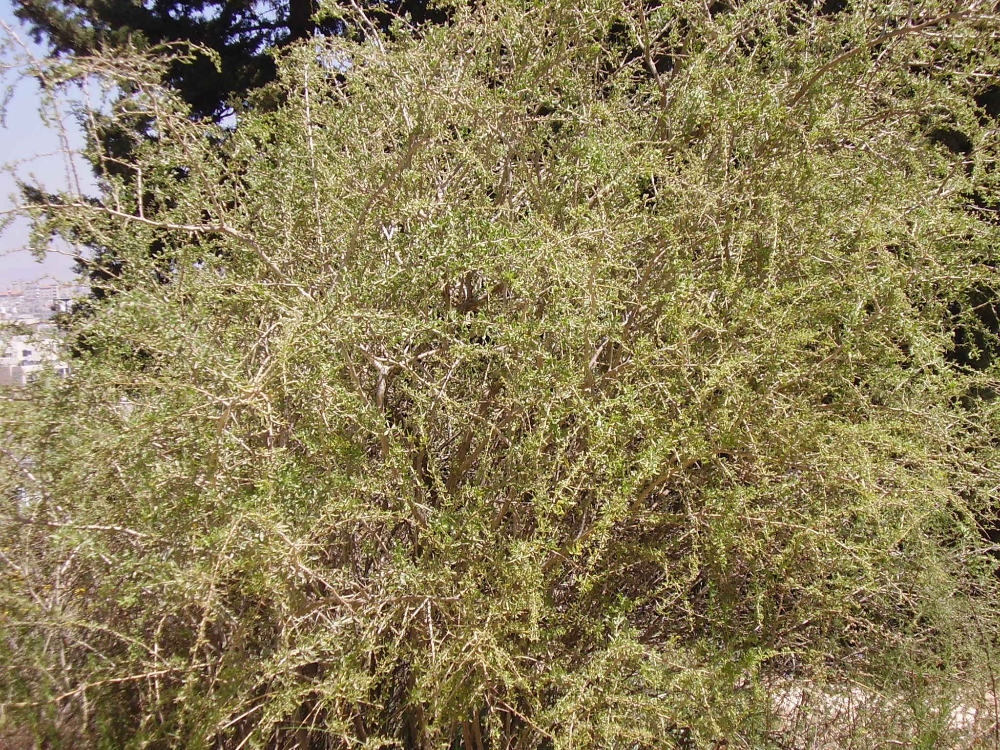

# Plants and Trees in the Bible

## License Information

Plants and Trees in the Bible © United Bible Societies, 2025. Adapted from: <cite>Each According to its Kind: Plants and Trees in the Bible</cite>, by Robert Koops © 2012 United Bible Societies. This work is licensed under Creative Commons Attribution-ShareAlike 4.0 International (<a href="https://creativecommons.org/licenses/by-sa/4.0/">https://creativecommons.org/licenses/by-sa/4.0/</a>).

--------------------------------

## 标题：欧洲枸杞（boxthorn） (id: FLORA:1.2)

1\.2 标题：欧洲枸杞（boxthorn）
======================

经文出处
----

Hebrew 来：אָטָד (音译：’atad)

[JDG 9:14](https://ref.ly/Judg9:14), [JDG 9:15](https://ref.ly/Judg9:15), [JDG 9:15](https://ref.ly/Judg9:15), [PSA 58:10](https://ref.ly/Ps58:10)

讨论
--

*欧洲枸杞 (Ray Pritz (UBS))*

在[JDG 9:0](https://ref.ly/Judg9:0) 所记关于树的寓言中，众树都来到*’atad* 那里，请它作众树之王，RSV (Revised Standard Version (1952)) 将其译作"bramble"（"黑莓"）。学者普遍同意此树可能是欧洲枸杞（学名*Lycium europaeum* ）。然而祖海里认为，这种树更可能是滨枣（又名基督刺；学名*Ziziphus spina\-christi* ）。这两种树都是多刺树木，大量生长在近东地区，特别是在以色列北部的撒玛利亚附近；讲述这个寓言的约坦就住在那里。"基督刺"（法文*couronne\-du\-Christ* ）一名反映出一种传统观念，即在基督被钉十字架的记载里提到的荆棘来自这种树。这个题目引起了广泛的争论，并且几乎没有证据可以证实"荆棘冠冕"究竟是来自于这种树，还是来自其他多刺植物，比如在耶路撒冷地区更为常见的刺地榆。对于这个题目，本手册支持多数人的意见，即这种植物是欧洲枸杞（法文*lycie d’europe* ）。

描述
--

*欧洲枸杞树的枝条 (Ray Pritz (UBS))*

欧洲枸杞树的高度可达5米（17英尺），叶子较小，形成一个椭圆形的树冠，刺非常锐利，花朵为黄绿色，果实可食用，大小与葡萄或樱桃相近。

特殊意义
----

约坦在寓言中使用这个词的言外之意不明，他似乎是用*’atad* 来指一种既不美观、也没有太大用处的树。事实上，*’atad* 的果实几乎不能食用，也不能作为可用的木材，甚至不能提供足够的树荫，因为这种树的叶子细小而稀疏。*’Atad* 多刺，但我们并不清楚这一点在寓言中是否重要。如果这棵树代表亚比米勒，那么大多数读者很可能会同意，他是一个非常棘手的狠角色。

翻译
--

翻译者可以根据约坦寓言的寓意，用修辞对等的树木来替代其中提到的橄榄树、无花果树、葡萄树和欧洲枸杞。然而，目标语言中可能没有表示"欧洲枸杞"的词语，此时翻译者可以使用"多刺的树"等一般性的短语，或者用当地最常见的多刺树木或灌木来替代。翻译者常会遇到一个问题，就是无用的植物通常没有名称。如果需要采用音译，翻译者可以音译希伯来文*atad* ，或者音译一种主要语言中的近缘树木，比如西班牙文*cambron* 或*azufaifa* 、法文*jubier* 、葡萄牙文*acufaifa* 等。

* **Associated Passages:** 士师记 9:14; 士师记 9:15; 诗篇 58:10; 士师记 9:0

* **Associated ACAI Concepts:** Boxthorn (ID: `flora:Boxthorn`)
