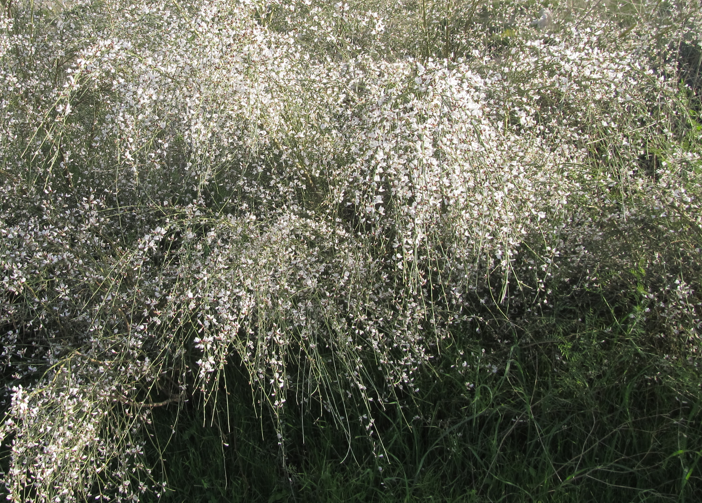

# Plants and Trees in the Bible

## License Information

Plants and Trees in the Bible © United Bible Societies, 2025. Adapted from: <cite>Each According to its Kind: Plants and Trees in the Bible</cite>, by Robert Koops © 2012 United Bible Societies. This work is licensed under Creative Commons Attribution-ShareAlike 4.0 International (<a href="https://creativecommons.org/licenses/by-sa/4.0/">https://creativecommons.org/licenses/by-sa/4.0/</a>).

--------------------------------

## 标题：罗腾树（broom） (id: FLORA:1.3)

1\.3 标题：罗腾树（broom）
==================

经文出处
----

Hebrew 来：רֹתֶם (音译：rothem)

[1KI 19:4](https://ref.ly/1Kgs19:4), [1KI 19:5](https://ref.ly/1Kgs19:5), [JOB 30:4](https://ref.ly/Job30:4), [PSA 120:4](https://ref.ly/Ps120:4)

讨论
--

*罗腾树和山羊 (Michael Baranovsky (Wikimedia Commons))*

许多学者认为*rothem* 就是白罗腾树（学名*Retama raetam* ），这是一种生长在圣地和阿拉伯半岛的硬质沙漠灌木。早些时候，莫尔登克（Moldenke）主张*rothem* 是一种叫做狗棍（dog's club）的寄生植物。在以利亚逃离耶洗别的叙事中，[1KI 19:4](https://ref.ly/1Kgs19:4) 提到了罗腾，为这节经文前面的"旷野"一词带给人的荒凉景象补充了细节。学者从[PSA 120:4](https://ref.ly/Ps120:4) （"……罗腾木的炭火"）和[JOB 30:4](https://ref.ly/Job30:4) （"……罗腾树的根为他们取暖"；RSV (Revised Standard Version (1952)) 直译）这两节经文提到的*rothem* 推断，这种植物就是罗腾灌木，因为罗腾灌木的茎和叶里有油，烧起来火很旺。[NUM 33:18](https://ref.ly/Num33:18); [NUM 33:19](https://ref.ly/Num33:19) 提到的地名利提玛（意为"罗腾之地"）也可能与罗腾树有关。白罗腾树遍布圣地的山区、多石的地方、沟壑和沙地，尤其在死海附近、基列、迦密山、叙利亚沙漠和腓尼基海岸等地更是常见。

描述
--

*罗腾花 (תמר מרום Pikiwiki Israel (Wikimedia Commons))*

白罗腾树可长到2米（7英尺）高，与其说是矮树，不如说是较大的丛生灌木。白罗腾树有很多小枝子，叶子寥寥，一簇簇美丽的白花点缀在山坡之上。

翻译
--

在[1KI 19:4](https://ref.ly/1Kgs19:4) ，NJB (New Jerusalem Bible (1985)) 使用了一个只有英国园丁才知道的名称，把*rothem* 翻译为"furze bush"（"荆豆丛"），又名"gorse"（"金雀花"）。但在21世纪，不了解植物学的城市居民对"gorse"和"furze"都不熟悉。同样，德文通俗译本GECL (German Common Language Version (Gute Nachricht Bibel)) 将其译成*Ginsterstrauch* ，这个词也不太常用。因此，一些英文现代译本在《列王纪上》使用了比较一般性的表述，如 "large bush"（"大灌木丛"；CEV (Contemporary English Version) ）、"tree"（"树"；GNB (Good News Bible) ）、"bush"（"灌木丛"；NCV (New Century Version) ）。在植物种类有具体名称的地区，翻译者可以选择一种生长在干旱贫瘠地区的灌木（这种灌木必须大到足以遮荫），也可以音译希伯来文（*rothem* ）或一种主要语言（如阿拉伯文*retem* ）。另外，翻译者也可以使用"小树"或"灌木"这样的通称。

在[PSA 120:4](https://ref.ly/Ps120:4) ，翻译者可以使用当地一种烧起来很旺的木材，因为这里的经文是修辞性的，需要用一个非常热的东西来作比喻。

[JOB 30:4](https://ref.ly/Job30:4) 提到的罗腾树具有很大的文本和解经问题，所以在现代圣经译本中出现了许多种译法。RSV (Revised Standard Version (1952)) 译作："they pick mallow and the leaves of bushes, and to warm themselves the roots of the broom"（英文直译："他们采摘锦葵和灌木的叶子，并用罗腾树的根取暖"）。在GNB (Good News Bible) 和NIV (New International Version (1984)) 的译文里，这些可怜人"吃"罗腾树的根。然而，根据可靠的资料，罗腾树的根是有毒的。因此，莫尔登克提出，这里必定是从罗腾树的根部长出来的另外一种植物，即寄生的欧洲锁阳（学名*Cynomorium coccineum* ）。然而，有充分的证据表明，作者想说的话是根部"被烧了"（如RSV (Revised Standard Version (1952)) 的译文），而不是"被吃了"（如GNB (Good News Bible) 和NIV (New International Version (1984)) 的译文）。对这节难解的经文，哈尼库恩（Hanni Kuhn）在《圣经翻译者》（*The Bible Translator* ）中为翻译者提供了三种译法，这里我们列出了其中两种（第三种是根据莫尔登克提出的欧洲锁阳，支持的学者较少，我们也不建议采纳）：

1\. 他们采咸草叶作食物，

烧罗腾树的根来取暖。

这里将最后一个希伯来文词语的字母*l\-ch\-m\-m* 读作*lchumam* （"给自己取暖"），对添加到希伯来文本中的元音作了一处改变，RSV (Revised Standard Version (1952)) 和Mft (Moffatt Translation (1926)) 采纳了这种做法。（关于"咸草"，参[3\.5\.10 滨藜（盐草）（orache \[saltwort]）](#FLORA:3.5.10) ）

2\. 他们采咸草叶作食物，

卖／做罗腾木炭来糊口。

这种译法将*l\-ch\-m\-m* 读作*lachmam* （"他们的饼／食物"）。哈鲁范尼也支持这个观点（第31—32页）。

* **Associated Passages:** 列王纪上 19:4; 列王纪上 19:5; 约伯记 30:4; 诗篇 120:4; 民数记 33:18; 民数记 33:19

* **Associated ACAI Concepts:** Broom (ID: `flora:Broom`)
