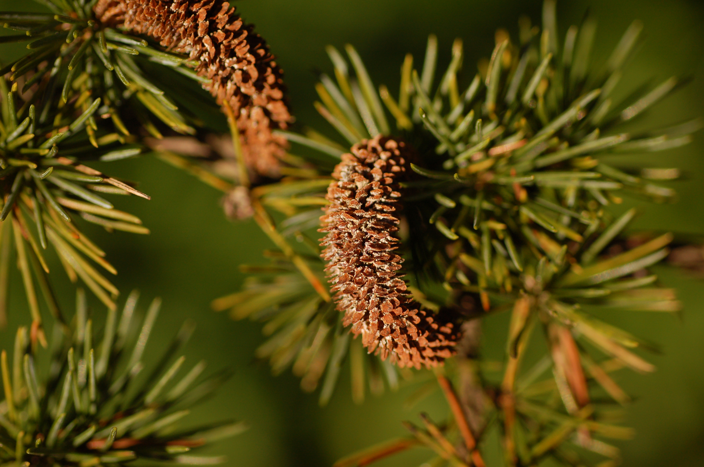

# Plants and Trees in the Bible

## License Information

Plants and Trees in the Bible © United Bible Societies, 2025. Adapted from: <cite>Each According to its Kind: Plants and Trees in the Bible</cite>, by Robert Koops © 2012 United Bible Societies. This work is licensed under Creative Commons Attribution-ShareAlike 4.0 International (<a href="https://creativecommons.org/licenses/by-sa/4.0/">https://creativecommons.org/licenses/by-sa/4.0/</a>).

--------------------------------

## 标题：香柏树（cedar） (id: FLORA:1.5)

1\.5 标题：香柏树（cedar）
==================

经文出处
----

Hebrew 来：אֶזְרָח (音译：’ezrach)

[PSA 37:35](https://ref.ly/Ps37:35)

Hebrew 来：אֶרֶז (音译：’erez)

[JDG 9:15](https://ref.ly/Judg9:15), [2SA 5:11](https://ref.ly/2Sam5:11), [2SA 7:2](https://ref.ly/2Sam7:2), [2SA 7:7](https://ref.ly/2Sam7:7), [1KI 5:13](https://ref.ly/1Kgs5:13), [1KI 5:20](https://ref.ly/1Kgs5:20), [1KI 5:22](https://ref.ly/1Kgs5:22), [1KI 5:24](https://ref.ly/1Kgs5:24), [1KI 6:9](https://ref.ly/1Kgs6:9), [1KI 6:10](https://ref.ly/1Kgs6:10), [1KI 6:15](https://ref.ly/1Kgs6:15), [1KI 6:16](https://ref.ly/1Kgs6:16), [1KI 6:18](https://ref.ly/1Kgs6:18), [1KI 6:18](https://ref.ly/1Kgs6:18), [1KI 6:20](https://ref.ly/1Kgs6:20), [1KI 6:36](https://ref.ly/1Kgs6:36), [1KI 7:2](https://ref.ly/1Kgs7:2), [1KI 7:2](https://ref.ly/1Kgs7:2), [1KI 7:3](https://ref.ly/1Kgs7:3), [1KI 7:7](https://ref.ly/1Kgs7:7), [1KI 7:11](https://ref.ly/1Kgs7:11), [1KI 7:12](https://ref.ly/1Kgs7:12), [1KI 9:11](https://ref.ly/1Kgs9:11), [1KI 10:27](https://ref.ly/1Kgs10:27), [2KI 14:9](https://ref.ly/2Kgs14:9), [2KI 19:23](https://ref.ly/2Kgs19:23), [1CH 14:1](https://ref.ly/1Chr14:1), [1CH 17:1](https://ref.ly/1Chr17:1), [1CH 17:6](https://ref.ly/1Chr17:6), [1CH 22:4](https://ref.ly/1Chr22:4), [2CH 1:15](https://ref.ly/2Chr1:15), [2CH 2:2](https://ref.ly/2Chr2:2), [2CH 2:7](https://ref.ly/2Chr2:7), [2CH 9:27](https://ref.ly/2Chr9:27), [2CH 25:18](https://ref.ly/2Chr25:18), [EZR 3:7](https://ref.ly/Ezra3:7), [JOB 40:17](https://ref.ly/Job40:17), [PSA 29:5](https://ref.ly/Ps29:5), [PSA 29:5](https://ref.ly/Ps29:5), [PSA 80:11](https://ref.ly/Ps80:11), [PSA 92:13](https://ref.ly/Ps92:13), [PSA 104:16](https://ref.ly/Ps104:16), [PSA 148:9](https://ref.ly/Ps148:9), [SNG 1:17](https://ref.ly/Song1:17), [SNG 5:15](https://ref.ly/Song5:15), [SNG 8:9](https://ref.ly/Song8:9), [ISA 2:13](https://ref.ly/Isa2:13), [ISA 9:9](https://ref.ly/Isa9:9), [ISA 14:8](https://ref.ly/Isa14:8), [ISA 37:24](https://ref.ly/Isa37:24), [ISA 41:19](https://ref.ly/Isa41:19), [ISA 44:14](https://ref.ly/Isa44:14), [JER 22:7](https://ref.ly/Jer22:7), [JER 22:14](https://ref.ly/Jer22:14), [JER 22:15](https://ref.ly/Jer22:15), [JER 22:23](https://ref.ly/Jer22:23), [EZK 17:3](https://ref.ly/Ezek17:3), [EZK 17:22](https://ref.ly/Ezek17:22), [EZK 17:23](https://ref.ly/Ezek17:23), [EZK 27:5](https://ref.ly/Ezek27:5), [EZK 31:3](https://ref.ly/Ezek31:3), [EZK 31:8](https://ref.ly/Ezek31:8), [AMO 2:9](https://ref.ly/Amos2:9), [ZEC 11:1](https://ref.ly/Zech11:1), [ZEC 11:2](https://ref.ly/Zech11:2)

Greek 希：κέδρινος (音译：kedrinos)

[1ES 4:48](https://ref.ly/1Esd4:48), [1ES 5:53](https://ref.ly/1Esd5:53)

Greek 希：κέδρος (音译：kedros)

[SIR 24:13](https://ref.ly/Sir24:13), [SIR 50:12](https://ref.ly/Sir50:12)

讨论
--

*黎巴嫩的香柏树 (Olivier BEZES (Wikimedia Commons))*

*黎巴嫩的香柏树 (Ray Pritz (UBS))*

很久以前，高贵的黎巴嫩香柏树（学名*Cedrus libani* ）遍布黎巴嫩山脉西侧和北侧山坡的上部，然而现在只剩下几小块地方还生长着这种伟岸的树木。和现今一样，香柏树在那时也是与其他树木混生，如基利家杉树、希腊杜松、柏树、卡拉布里亚松等。

我们从《列王纪上》得知，所罗门王用香柏树建造王宫和圣殿，用香柏树来做梁、板、柱子和天花板。历史学家告诉我们，亚述人也把香柏树运到自己的地方作为建材。巴比伦王尼布甲尼撒也从黎巴嫩进口香柏树。在《以赛亚书》的某些译本中，我们读到人们用香柏树和橡树雕刻偶像（[ISA 44:14](https://ref.ly/Isa44:14); [ISA 44:15](https://ref.ly/Isa44:15); [ISA 44:16](https://ref.ly/Isa44:16); [ISA 44:17](https://ref.ly/Isa44:17); [ISA 44:18](https://ref.ly/Isa44:18); [ISA 44:19](https://ref.ly/Isa44:19); [ISA 44:20](https://ref.ly/Isa44:20) ）。最后，当被掳归回的犹太人重建圣殿（[EZR 3:7](https://ref.ly/Ezra3:7) ），他们再次砍伐香柏树来装饰上帝的殿。

在《撒母耳记下》、《列王纪上下》、《历代志上下》和《以斯拉记》中，特别是提到黎巴嫩的地方，*’erez* 毫无疑问就是*Cedrus libani* ，即"黎巴嫩的香柏树"，尽管这个词有时可能泛指各种常绿树。

在对洁净礼仪的记叙中（[LEV 14:4](https://ref.ly/Lev14:4); [LEV 14:6](https://ref.ly/Lev14:6); [LEV 14:49](https://ref.ly/Lev14:49); [LEV 14:51](https://ref.ly/Lev14:51); [LEV 14:52](https://ref.ly/Lev14:52); [NUM 19:6](https://ref.ly/Num19:6) ），*’erez* 可能指的是腓尼基杜松树（参[1\.11\.2 腓尼基杜松（沿海杜松）（phoenician juniper \[coastal juniper]）](#FLORA:1.11.2) ），因为它是西奈旷野中唯一类似香柏树的树木。然而，祖海里认为，在这些贫瘠的地方，即使是"叶子"像香柏树的柽柳，在这些条例中也可算为"香柏树"。

描述
--

*香柏树的叶子和球果 (Derek Ramsey (Wikimedia Commons))*

香柏树可以长到30米（100英尺）高，树干直径超过2米（7英尺）。真正的香柏树的叶子不像大多数树的叶子那样是平整的，而是一绺绺深绿色的、亮泽的针叶。（北美香柏树的针叶比圣经中的香柏树要扁平一些。）木料芳香且抗虫，果实为球果，可以生长两三千年。

特殊意义
----

黎巴嫩的香柏树以高大和木料芳香而闻名（参[ISA 2:13](https://ref.ly/Isa2:13); [ISA 37:24](https://ref.ly/Isa37:24); [EZK 17:22](https://ref.ly/Ezek17:22); [AMO 2:9](https://ref.ly/Amos2:9) 等例）。[PSA 92:13](https://ref.ly/Ps92:13) （《和》92:12）把香柏树和义人联系在一起，大概是因为它的笔直和高大超过其他树木。香柏树是黎巴嫩国徽上的主要图案。

翻译
--

香柏树（学名*Cedrus* ）分布在北非山脉、喜马拉雅山脉、印度和北美。在非比喻性的经文中，这些地方的翻译者当然应该使用当地树种的名称。在撒哈拉以南的非洲地区，翻译者可以音译希伯来文（*erets* ）、希腊文（*kedar* ）、英文（*sedar* ）或其他主要语言的词语，也可以采用"高大佳美的树木"这样的一般性短语。在诗歌体经文（智慧文学和先知书）中，有些翻译者可能希望使用在文化上与这些特征对等的词汇。伯克希尔（Burkhill）指出，非洲的粉色桃花心木（学名*Guarea cedrata* ）具有香柏树的芳香，因此也被称为粉色非洲香柏树。另外，在印度和澳大利亚，同样有些人用"香柏木"来指称香椿，因为香椿的木质是红色的。在历史性的经文中不建议使用这样的替代词，因为*’erez* 与这些树没有亲缘关系。然而，在一些比喻性经文中，就可以采用这种替代，因为这些树木都很高大，木质都是红色的。但是，翻译者必须仔细研读每节经文，以确定比喻所要表达的意思。

在[ISA 44:14](https://ref.ly/Isa44:14) 中，RSV (Revised Standard Version (1952)) 、JB (Jerusalem Bible (1966)) 和NEB (New English Bible (1970)) 将希伯来文*’oren* 译作"cedar"（"香柏树"），KJV (King James Version (1611)) 译作"ash"（"白蜡树"）。这个希伯来文词语可能是指月桂树（参[1\.12 月桂树 (laurel \[bay tree])](#FLORA:1.12) ）。在现代希伯来文中，*’oren* 指阿勒坡松（参[1\.18\.2 阿勒坡松、地中海松 (aleppo pine)](#FLORA:1.18.2) ）。

[PSA 37:35](https://ref.ly/Ps37:35) ：根据不同的希伯来文本，有两种译法：

1\. 根据读文*ke’erez halevanon* ，译作"好像一棵黎巴嫩的香柏树"（RSV (Revised Standard Version (1952)) 、GNB (Good News Bible) 、JB (Jerusalem Bible (1966)) 、《七十士译本》直译）；

2\. 根据读文*ke’ezrach ra‘anan* ，译作"高耸如本地青翠的树木"（CEV (Contemporary English Version) 、NIV (New International Version (1984)) 、NLT (New Living Translation) 、NCV (New Century Version) 、REB (Revised English Bible (1989)) 、NJPSV (New Jewish Publication Society Version) 直译）。

《希伯来文旧约文本项目初步和中期报告》（HOTTP (Hebrew Old Testament Text Project (UBS)) ）倾向于后一种读文*ke’ezrach ra‘anan* ，并将其可靠性定为B级："好像一棵本土的树，青翠"。KJV (King James Version (1611)) 译作"like a green bay tree"（英文直译："像一棵青翠的月桂树"），但这种解释没有近期学术研究的支持。因此，上述的第二种译文可能是最好的。

* **Associated Passages:** 诗篇 37:35; 士师记 9:15; 撒母耳记下 5:11; 撒母耳记下 7:2; 撒母耳记下 7:7; 列王纪上 5:13; 列王纪上 5:20; 列王纪上 5:22; 列王纪上 5:24; 列王纪上 6:9; 列王纪上 6:10; 列王纪上 6:15; 列王纪上 6:16; 列王纪上 6:18; 列王纪上 6:20; 列王纪上 6:36; 列王纪上 7:2; 列王纪上 7:3; 列王纪上 7:7; 列王纪上 7:11; 列王纪上 7:12; 列王纪上 9:11; 列王纪上 10:27; 列王纪下 14:9; 列王纪下 19:23; 历代志上 14:1; 历代志上 17:1; 历代志上 17:6; 历代志上 22:4; 历代志下 1:15; 历代志下 2:2; 历代志下 2:7; 历代志下 9:27; 历代志下 25:18; 以斯拉记 3:7; 约伯记 40:17; 诗篇 29:5; 诗篇 80:11; 诗篇 92:13; 诗篇 104:16; 诗篇 148:9; 雅歌 1:17; 雅歌 5:15; 雅歌 8:9; 以赛亚书 2:13; 以赛亚书 9:9; 以赛亚书 14:8; 以赛亚书 37:24; 以赛亚书 41:19; 以赛亚书 44:14; 耶利米书 22:7; 耶利米书 22:14; 耶利米书 22:15; 耶利米书 22:23; 以西结书 17:3; 以西结书 17:22; 以西结书 17:23; 以西结书 27:5; 以西结书 31:3; 以西结书 31:8; 阿摩司书 2:9; 撒迦利亚书 11:1; 撒迦利亚书 11:2; 厄斯德拉上 4:48; 厄斯德拉上 5:53; 德训篇 24:13; 德训篇 50:12; 以赛亚书 44:15; 以赛亚书 44:16; 以赛亚书 44:17; 以赛亚书 44:18; 以赛亚书 44:19; 以赛亚书 44:20; 利未记 14:4; 利未记 14:6; 利未记 14:49; 利未记 14:51; 利未记 14:52; 民数记 19:6

* **Associated ACAI Concepts:** Cedar (ID: `flora:Cedar`); Phoenician Juniper (ID: `flora:JuniperTree`); Aleppo Pine (ID: `flora:PineTree`)
