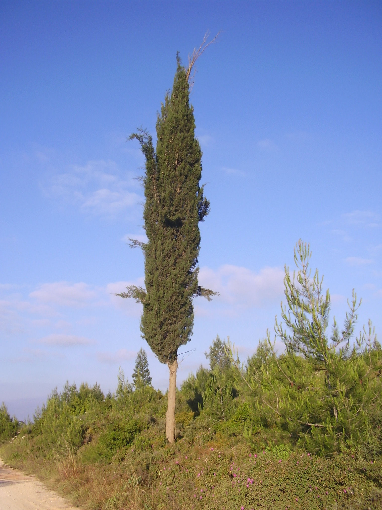

# Plants and Trees in the Bible

## License Information

Plants and Trees in the Bible © United Bible Societies, 2025. Adapted from: <cite>Each According to its Kind: Plants and Trees in the Bible</cite>, by Robert Koops © 2012 United Bible Societies. This work is licensed under Creative Commons Attribution-ShareAlike 4.0 International (<a href="https://creativecommons.org/licenses/by-sa/4.0/">https://creativecommons.org/licenses/by-sa/4.0/</a>).

--------------------------------

## 标题：柏树（cypress） (id: FLORA:1.6)

1\.6 标题：柏树（cypress）
===================

经文出处
----

Hebrew 来：בְּרוֹשׁ (音译：berosh)

[2SA 6:5](https://ref.ly/2Sam6:5), [PSA 104:17](https://ref.ly/Ps104:17), [ISA 37:24](https://ref.ly/Isa37:24), [ISA 41:19](https://ref.ly/Isa41:19), [ISA 55:13](https://ref.ly/Isa55:13), [EZK 31:8](https://ref.ly/Ezek31:8), [HOS 14:9](https://ref.ly/Hos14:9), [NAM 2:4](https://ref.ly/Nah2:4)

Hebrew 来：בְּרוֹת (音译：beroth)

[SNG 1:17](https://ref.ly/Song1:17)

Hebrew 来：גֹּפֶר (音译：gofer)

[GEN 6:14](https://ref.ly/Gen6:14)

Hebrew 来：תְּאַשּׁוּר (音译：te’ashur)

[ISA 41:19](https://ref.ly/Isa41:19), [ISA 60:13](https://ref.ly/Isa60:13), [EZK 27:6](https://ref.ly/Ezek27:6)

Hebrew 来：תִּדְהָר (音译：tidhar)

[ISA 41:19](https://ref.ly/Isa41:19), [ISA 60:13](https://ref.ly/Isa60:13)

讨论
--

*柏树 (Ray Pritz (UBS))*

希伯来文*berosh* 可能涵盖柏树、杉树和杜松等树木；这里只讨论那些可能特指柏树的情况。柏树（学名*Cupressus sempervirens* ）是以色列本地生长的树木，曾经广泛分布在犹太山区。柏树，以及香柏树、杉树和希腊杜松，也盛产于黎巴嫩。柏树还生长在犹太地、基列和以东等地，现今依然这样。

通过译本的对比，我们看到学者对于针叶树的辨识存在不同的意见。例如，在[1KI 5:22](https://ref.ly/1Kgs5:22) （《和》5:8），希伯来文*berosh* 被译为：

"柏树"（"cypress"；RSV (Revised Standard Version (1952)) 、NRSV (New Revised Standard Version (1989)) 、NLT (New Living Translation) 、LB (Living Bible (1971)) 、NJPSV (New Jewish Publication Society Version) ；BDB (Brown-Driver-Briggs Hebrew and English Lexicon) 、凯尔和德利奇［Keil \& Delitzsch］）

"松树"（"pine"；GNB (Good News Bible) 、CEV (Contemporary English Version) 、NIV (New International Version (1984)) 、NCV (New Century Version) 、REB (Revised English Bible (1989)) 、FFB ）

"杜松"（"juniper"；NJB (New Jerusalem Bible (1985)) ）

"杉树"（"fir"；NAB (New American Bible (1970)) ）

*结着球果的柏树枝 (Hans Braxmeier from Pixabay (Pixabay))*

这里出现分歧的原因是：*berosh* 可能是一个通称，或许应该使用含意较广的译词，或者尽量根据上下文做不同的处理。在《列王纪上下》和《历代志下》，*berosh* 常与*’erez* （"香柏树"）和"黎巴嫩"一起出现。我们同意祖海里等人的观点，认为*berosh* 指的是基利家杉树（参[1\.9 杉树 (fir)](#FLORA:1.9) ）或希腊杜松（参[1\.11\.1](#FLORA:1.11.1) ），而不是指柏树。在*berosh* 出现的其他几处经文里，这个词可指这三种针叶树中的任何一种。这里的逻辑是，既然犹太地出产柏树，所罗门王就无需从黎巴嫩进口。然而，也有人认为黎巴嫩出产的柏树比以色列本地的更好，所以所罗门进口了一部分柏木。这两种情况与*berosh* 作为一个通称并不相悖。

赫珀似乎同意祖海里的看法。哈鲁范尼认为*berosh* 是杜松。因此，如果*berosh* 确实是指某个单一的树种，那么当前的学术观点支持"杉树"或"杜松"，而不是"柏树"或"松树"。很可能*berosh* 及其同源词*burasu* （阿卡德文）和*brotha* （黎巴嫩阿拉伯文）有时用作统称，有时用来特指某种针叶树。

关于挪亚造方舟所用的*gofer* 木（[GEN 6:14](https://ref.ly/Gen6:14) ；《和》、《和修》作"歌斐木"，《思》作"柏木"，《吕》作"松柏木"），在实物于亚拉腊山出现之前，人们无法得知其具体树种。另一方面，莫尔登克等人认为，建造方舟所用的树木可能是柏树，摩法特（Moffatt）的译本就是这样翻译的。但是，法国探险家在20世纪70年代声称发现的方舟碎片，后来证实其实是主后6世纪或7世纪的橡木。柏树非常耐用。希伯来文*gofer* 与*kofer* （"沥青"）的相似性让人联想到这可能是一种树脂木；因此，还有人大胆提出"松树"或"香柏树"的意见。

描述
--

柏树与松树、杉树和香柏树具有亲缘关系，高度为9—15米（30—50英尺），叶子较小，呈鳞片状，结有球果。今天，常见于以色列和其他国家的又细又高的柏树，是经过特殊培育的现代品种（*pyramidalis* ）。

特殊意义
----

在下面的几节经文里，*berosh* 似乎让人感受到某种异国风情：

[SNG 1:17](https://ref.ly/Song1:17) ："以香柏树为房子的栋梁，以*berothim* 作屋顶的椽木。"

[ISA 60:13](https://ref.ly/Isa60:13) ："黎巴嫩的荣耀，就是*berosh* 、悬铃树和松树，都必一同归你，用以装饰我圣所坐落之处……"

不论*berosh* 是通称还是特指某种树木，许多诗歌体经文都用它来表达一些特殊的意义，但却没有具体说明是哪种特质；例如，[HOS 14:9](https://ref.ly/Hos14:9) （《和》14:8）的第三行说，"我如青翠的*berosh* 。"在这节经文中，GNB (Good News Bible) 将树的功能理解为保护，而NLT (New Living Translation) 强调的是树木的青翠。在其他经文中，树的形状和气味可能才是重点。

以赛亚用*berosh* 表示一种山地树木，在将来的日子，这种树木将为沙漠增色：

[ISA 41:19](https://ref.ly/Isa41:19) ："我要在旷野栽植香柏树、金合欢树……在沙漠一同栽上*berosh* ……"

[ISA 55:13](https://ref.ly/Isa55:13) ："*berosh* 长出，代替荆棘……"

赫珀认为，埃及人曾经使用柏木做棺材。

翻译
--

如果目标语言有表示常绿针叶树的统称，该词可以用在所有提到*berosh* 的经文中。如果没有这种统称，那么许多地方可以使用"挺拔而美丽的树木"这样的短语；对于《列王纪上下》、《历代志下》和《雅歌》中提到的*berosh* （以及其他地方的*kupresi* 或*sipres* ），可以音译一种主要语言的词语，例如*firi* 、*piro* 、*junipa* 或*yunifer* 。如果当地没有常绿树，最好不要找替代词。在[GEN 6:14](https://ref.ly/Gen6:14) ，我们主张译为"结实的木料"或音译。

[EZK 27:6](https://ref.ly/Ezek27:6) ：在这节经文中，根据希伯来文辅音*b\-t\-’\-sh\-r\-m* 中加入什么元音，以及如何划分这个短语中的各个词语，文本会有一些变化。*B\-t\-’\-sh\-r\-m* 可以读作*bat\-’ashurim* 或*bite’ashurim* 。KJV (King James Version (1611)) 采用第一种文本，并把*’ashurim* 解作亚施户（亚述）人。现在，大多数学者和译本都认为该词指的是某种木材（NEB (New English Bible (1970)) 和NJPSV (New Jewish Publication Society Version) 作"boxwood"，"黄杨木"；NIV (New International Version (1984)) 作"cypress"，"柏树"；RSV (Revised Standard Version (1952)) 、GNB (Good News Bible) 和NLT (New Living Translation) 作"pine"，"松树"）。这里的语境是修辞性的，但是通过大量详细的地理、历史和当时贸易的信息产生出非常震撼的力量，所以我们要用具体的词语翻译*berosh* 、*’erez* （第5节）、*’allon* 和*te’ashur* （第6节）。这里，*te’ashur* 的翻译（或音译）取决于翻译者对其他词语的处理。我们建议音译希伯来文（增加一个分类词"木"或"树"），译作"……示尼珥的*berosh* 木……黎巴嫩的*erez* 木……巴珊的*allon* 木……基提海岛的*te’ashur* 木"。另外，也可以音译一种主要语言的词语。

[EZK 31:3](https://ref.ly/Ezek31:3) ：有些学者将本节希伯来文本的第二个词语（*’ashur* ）修改为*te’ashur* （比较[ISA 41:19](https://ref.ly/Isa41:19) ，[ISA 60:13](https://ref.ly/Isa60:13) ），并认为该词指的是柏树。第三个希伯来文词语（*’erez* ）指的则是香柏树。现在，学者一致认为*’ashur* 指的是亚述，而不是一棵树；只有TOB (Traduction Oecuménique de la Bible (French, 1975)) 将其翻译为"柏树"。

[NAM 2:4](https://ref.ly/Nah2:4) （《和》2:3）：本节最后一行的字面意思是"*beroshim* 颤动"。对于这一行的解释，各译本分为两派：

1\. NIV (New International Version (1984)) 、NLT (New Living Translation) 和GW (God's Word Translation) 接受希伯来文本的原样，认为*beroshim* 指的是用*berosh* 木做成的箭或枪，"颤动"是指战士在头顶挥舞这些武器。

2\. RSV (Revised Standard Version (1952)) 、GNB (Good News Bible) 、CEV (Contemporary English Version) 、NCV (New Century Version) 、REB (Revised English Bible (1989)) 、NAB (New American Bible (1970)) 、JB (Jerusalem Bible (1966)) 和NJB (New Jerusalem Bible (1985)) 修改了*beroshim* 的辅音字母，将其读作"horses"（"马"）。如此一来，"颤动"的意思被理解为"马后足立地腾跃"（"prance"；RSV (Revised Standard Version (1952)) 、GNB (Good News Bible) 、CEV (Contemporary English Version) ）、"迫不及待"（"be impatient for action"；NJB (New Jerusalem Bible (1985)) ），或"前进"（"advance"；REB (Revised English Bible (1989)) ）。

《〈那鸿书〉、〈哈巴谷书〉和〈西番雅书〉手册》（*A Handbook on The Books of Nahum, Habakkuk, and Zephaniah* ）认为这两种解释都有可能。建议翻译者遵循所在地区主要译本的意见，并在脚注中说明另一种译法。

[2SA 6:5](https://ref.ly/2Sam6:5) ：关于字面意为"用*beroshim* 木"的希伯来文短语，有两种明显不同的解释立场：

1\. RSV (Revised Standard Version (1952)) 、NRSV (New Revised Standard Version (1989)) 、GNB (Good News Bible) 、NIV (New International Version (1984)) 、NLT (New Living Translation) 、REB (Revised English Bible (1989)) 、NAB (New American Bible (1970)) 、JB (Jerusalem Bible (1966)) 和NJB (New Jerusalem Bible (1985)) 遵循《死海古卷》中的一份抄本、《七十士译本》，以及平行经文（[1CH 13:8](https://ref.ly/1Chr13:8) ），译作"with all their might, with songs"（"他们用尽全力，随着诗歌"）。

2\. KJV (King James Version (1611)) 、NCV (New Century Version) 、NJPSV (New Jewish Publication Society Version) 、TOB (Traduction Oecuménique de la Bible (French, 1975)) 、ICB (International Children's Bible) 、NASB (New American Standard Bible) 、FRCL (French Common Language Version (Bible en français courant)) 、NVSR 和SEM 遵循《马索拉文本》（MT (Masoretic Text) ）中的*berosh* ，以*beroshim* 指称用"fir"（"杉木"；KJV (King James Version (1611)) 、NASB (New American Standard Bible) ）、"cypress"（"柏木"；NASB (New American Standard Bible) 、NVSR 、SEM 、TOB (Traduction Oecuménique de la Bible (French, 1975)) ）或"pine"（"松木"；ICB (International Children's Bible) 、FRCL (French Common Language Version (Bible en français courant)) ）制造的乐器，正如该词在[NAM 2:4](https://ref.ly/Nah2:4) （《和》2:3）可能指枪或箭。这似乎得到了HOTTP (Hebrew Old Testament Text Project (UBS)) 的支持，HOTTP (Hebrew Old Testament Text Project (UBS)) 将MT (Masoretic Text) 的可靠性评为C级。有些译本在脚注中补充说明了这一种解释（NIV (New International Version (1984)) "pine"，"松木"；GNB (Good News Bible) "fir"，"杉木"；NLT (New Living Translation) "cypress"，"柏木"；REB (Revised English Bible (1989)) "beating of batons"，"指挥棒打拍子"）。

如果要在MT (Masoretic Text) 和《七十士译本》之间做出选择，我们建议参照MT (Masoretic Text) ，但建议将*beroshim* 解作"珍贵的木材"，译作"用珍贵的木材制造的乐器"。

* **Associated Passages:** 撒母耳记下 6:5; 诗篇 104:17; 以赛亚书 37:24; 以赛亚书 41:19; 以赛亚书 55:13; 以西结书 31:8; 何西阿书 14:9; 那鸿书 2:4; 雅歌 1:17; 创世记 6:14; 以赛亚书 60:13; 以西结书 27:6; 列王纪上 5:22; 以西结书 31:3; 历代志上 13:8

* **Associated ACAI Concepts:** Cypress (ID: `flora:Cypress`); Grecian Juniper (ID: `flora:Juniper`); Fir (ID: `flora:Fir`)
