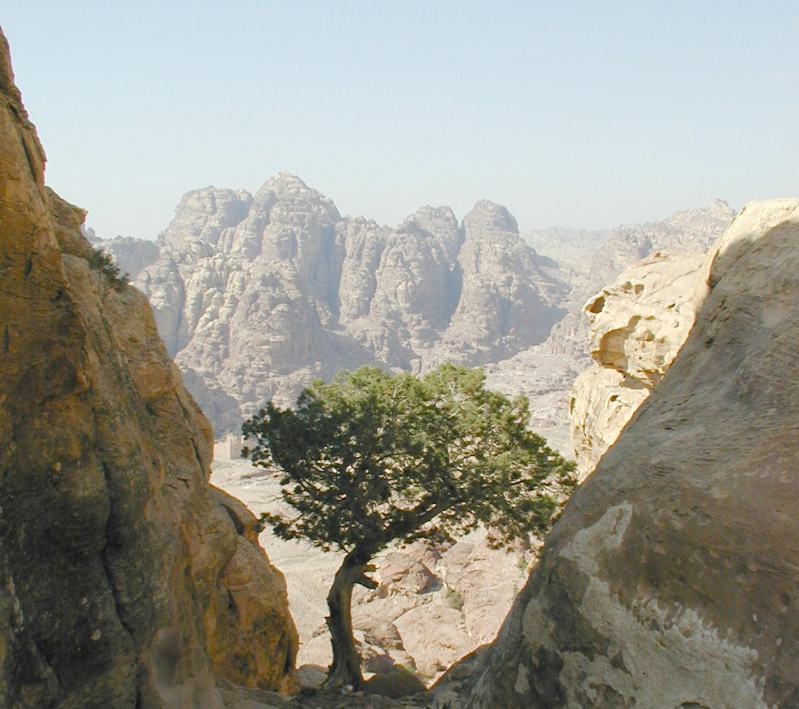

# Plants and Trees in the Bible

## License Information

Plants and Trees in the Bible © United Bible Societies, 2025. Adapted from: <cite>Each According to its Kind: Plants and Trees in the Bible</cite>, by Robert Koops © 2012 United Bible Societies. This work is licensed under Creative Commons Attribution-ShareAlike 4.0 International (<a href="https://creativecommons.org/licenses/by-sa/4.0/">https://creativecommons.org/licenses/by-sa/4.0/</a>).

--------------------------------

## 标题：杜松（juniper） (id: FLORA:1.11)

1\.11 标题：杜松（juniper）
====================

圣经时期的圣地生长着两种杜松：一种是希腊杜松，由希伯来文通称*berosh* 来表示；另一种是腓尼基杜松（或称沿海杜松），在摩西五经中称为*’erez* ，在《耶利米书》中称为*‘ar‘ar* 。

## 标题：希腊杜松、东方桧柏（grecian juniper [eastern savin]） (id: FLORA:1.11.1)

1\.11\.1 标题：希腊杜松、东方桧柏（grecian juniper \[eastern savin]）
=======================================================

经文出处
----

Hebrew 来：בְּרוֹשׁ (音译：berosh)

[ISA 14:8](https://ref.ly/Isa14:8), [ISA 37:24](https://ref.ly/Isa37:24), [ISA 41:19](https://ref.ly/Isa41:19), [ISA 55:13](https://ref.ly/Isa55:13), [ISA 60:13](https://ref.ly/Isa60:13), [EZK 27:5](https://ref.ly/Ezek27:5), [EZK 31:8](https://ref.ly/Ezek31:8), [HOS 14:9](https://ref.ly/Hos14:9), [ZEC 11:2](https://ref.ly/Zech11:2)

讨论
--

*希腊杜松 (Ray Pritz (UBS))*

希腊杜松（学名*Juniperus excelsa* ）是一种高大的常绿树，又名东方桧柏，与香柏树、杉树和柏树（希伯来文*berosh* 可能涵盖这三种树木）一同生长在黎巴嫩的山区。在[EZK 27:5](https://ref.ly/Ezek27:5) ，*berosh* 和示尼珥山的关联支持希腊杜松的说法，因为该山以盛产希腊杜松闻名。时至今日，黎巴嫩人仍称杜松为*brotha* ，这个词可能与*berosh* 同源。无疑，所罗门王把这些树木连同香柏树和杉树一起运到耶路撒冷，用来建造他的王宫和耶和华的殿。以色列植物学家哈鲁范尼主张将*berosh* 译为"杜松"，可能就是希腊杜松。

描述
--

希腊杜松呈圆锥形，高度可达20米（65英尺），"叶子"饱满，非扁平状，果实是结种子的多肉球果，不能食用。

翻译
--

希伯来文和希腊文都没有专门指称希腊杜松的词语。在对柏树和杉树的讨论中，我们主张使用通称来翻译*berosh* ；在《列王纪上下》和《历代志下》（通常与黎巴嫩或香柏树联系在一起），将其译作"杉树"或"杜松"。如果目标语言没有通称，可以使用描述性短语，如"挺拔而美丽的树木"。对于[HOS 14:9](https://ref.ly/Hos14:9) （《和》14:8）、[EZK 31:8](https://ref.ly/Ezek31:8) 、[ZEC 11:2](https://ref.ly/Zech11:2) 等诗歌体经文，可考虑当地对等的诗歌用词。

* **Associated Passages:** 以赛亚书 14:8; 以赛亚书 37:24; 以赛亚书 41:19; 以赛亚书 55:13; 以赛亚书 60:13; 以西结书 27:5; 以西结书 31:8; 何西阿书 14:9; 撒迦利亚书 11:2

## 标题：腓尼基杜松（沿海杜松）（phoenician juniper [coastal juniper]） (id: FLORA:1.11.2)

1\.11\.2 标题：腓尼基杜松（沿海杜松）（phoenician juniper \[coastal juniper]）
==============================================================

经文出处
----

Hebrew 来：אֶרֶז (音译：’erez)

[LEV 14:4](https://ref.ly/Lev14:4), [LEV 14:6](https://ref.ly/Lev14:6), [LEV 14:49](https://ref.ly/Lev14:49), [LEV 14:51](https://ref.ly/Lev14:51), [LEV 14:52](https://ref.ly/Lev14:52), [NUM 19:6](https://ref.ly/Num19:6), [NUM 24:6](https://ref.ly/Num24:6)

Hebrew 来：עֲרוֹעֵר (音译：‘aro‘er)

[JER 48:6](https://ref.ly/Jer48:6)

Hebrew 来：עַרְעָר (音译：‘ar‘ar)

[JER 17:6](https://ref.ly/Jer17:6)

讨论
--

*腓尼基杜松 (Ray Pritz)*

腓尼基杜松（学名*Juniperus phoenicea* ）是上一个条目讨论的希腊杜松的近缘树种，生长在海拔较低的地方，今天散布在西奈半岛北部和约旦南部的山区。赫珀指出，腓尼基杜松遍布西奈半岛和阿拉伯半岛的高地。在古时，这种树木可能遍布整个尼革夫。[DEU 2:36](https://ref.ly/Deut2:36) 提到一座名叫亚罗珥的城镇，位于亚嫩谷旁边，亚罗珥可能与希伯来文*‘ar‘ar* 同源，说明这种树木可能生长在那里。多个国家的阿拉伯人称这种杜松为*‘ar‘ar* ，这为我们将*‘ar‘ar* /*‘aro‘er* 确认为腓尼基杜松提供了支持。由于腓尼基杜松与香柏树密切相关，有些人也将其称为"腓尼基的香柏树"。请注意，希伯来文使用同一个词语*’erez* 来指称腓尼基杜松和高大的黎巴嫩香柏树。对于[JER 17:6](https://ref.ly/Jer17:6) 中的*‘ar‘ar* ，挪迦‧哈鲁范尼（Nogah Hareuveni，Desert and Shepherd in our Biblical Heritage，第67—71页）从"文学"角度建议译成"所多玛的苹果树"（学名*Calotropis procera* ）。所多玛的苹果树生长在"无人居住的盐碱地"，长着悦人眼目的绿叶和果实，但果实是空心的，而且有毒——这与生长在溪边的果树形成了鲜明的对比。然而，其他植物学家没有采纳这个提议，而是更多地依赖阿拉伯文提供的语言证据。

描述
--

腓尼基杜松是一种矮灌木或乔木，高度可达5米（17英尺），长着革质小叶子和浆果状的小球果。

特殊意义
----

在[NUM 24:6](https://ref.ly/Num24:6) ，巴兰将以色列的营地比作上帝的园子，其中栽种着芬芳的沉香树和苍翠的*’arazim* 。我们无法从上下文判断这里巴兰所见的异象是端庄的腓尼基杜松，还是佳美的黎巴嫩香柏树。[JER 17:6](https://ref.ly/Jer17:6) 说，只倚靠人类力量的人就像"沙漠里的矮树（*‘ar‘ar* ）"。这里描绘的是一幅严酷环境中的孤独景象，与倚靠上帝的人形成对比（7—8节）。

翻译
--

根据祖海里的提议，我们主张在读者知道"杜松"这种树木的前提下，将《利未记》和《民数记》中的*’erez* 译为"杜松"，或者按照一种主要语言来音译。[JER 17:6](https://ref.ly/Jer17:6) 提到的*‘ar‘ar* 是诗歌体语言，可以使用文化上对应的树木。由于所多玛苹果树在非洲和亚洲很常见，因此可以使用"所多玛苹果树"的当地词语。有些学者认为，[JER 48:6](https://ref.ly/Jer48:6) 最后一行的希伯来文*‘aro‘er* 意指"杜松"。但是，这个希伯来文词语仍有一些文本问题，故有以下四种翻译主张：

1\. 音译这个希伯来文词语，将这行译作"如旷野里的亚罗珥"（如NJPSV (New Jewish Publication Society Version) 的译法）。亚罗珥是旷野中的一座城镇。

2\. 修订*‘aro‘er* 为*‘arod* ，将这行译作"如旷野里的野驴"（如RSV (Revised Standard Version (1952)) 、GNB (Good News Bible) 、CEV (Contemporary English Version) 、NJB (New Jerusalem Bible (1985)) 、NAB (New American Bible (1970)) 的译法）。在希伯来文中，字母*‘r* 和*‘d* 十分相似。

3\. 根据阿拉伯文用*‘arar* 指称杜松这一点，将*‘aro‘er* 确定为杜松矮树。NCV (New Century Version) 的译文贴近这个提议，英文直译为："如旷野里被风吹动的矮树。"

4\. 将*‘aro‘er* 读作*‘ar‘ar* （意为"穷人"）。REB (Revised English Bible (1989)) 据此翻译，英文直译作："如旷野里的穷人。"

* **Associated Passages:** 利未记 14:4; 利未记 14:6; 利未记 14:49; 利未记 14:51; 利未记 14:52; 民数记 19:6; 民数记 24:6; 耶利米书 48:6; 耶利米书 17:6; 申命记 2:36

