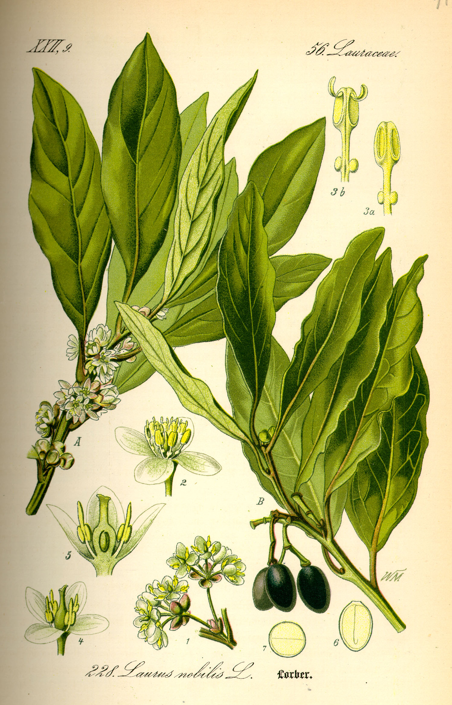

# Plants and Trees in the Bible

## License Information

Plants and Trees in the Bible © United Bible Societies, 2025. Adapted from: <cite>Each According to its Kind: Plants and Trees in the Bible</cite>, by Robert Koops © 2012 United Bible Societies. This work is licensed under Creative Commons Attribution-ShareAlike 4.0 International (<a href="https://creativecommons.org/licenses/by-sa/4.0/">https://creativecommons.org/licenses/by-sa/4.0/</a>).

--------------------------------

## 标题：月桂树（laurel [bay tree]） (id: FLORA:1.12)

1\.12 标题：月桂树（laurel \[bay tree]）
================================

经文出处
----

Hebrew 来：אֹרֶן (音译：’oren)

[ISA 44:14](https://ref.ly/Isa44:14)

Hebrew 来：עָרִיץ (音译：‘oritz)

[PSA 37:35](https://ref.ly/Ps37:35)

讨论
--

月桂树（学名*Laurus nobilis* ）至今仍是欧式烹饪所用月桂叶的来源。月桂树在圣经时期的以色列一定很常见，用于榨油、作烹饪调料和入药。月桂树有一种清新宜人的味道，直至今日仍盛产于迦密山、他泊山、基列山和黑门山等地。然而，圣经中只有两处提到了月桂树，而且很有争议。一处是关于制造偶像的[ISA 44:14](https://ref.ly/Isa44:14) ，"……栽种*’oren* ，得雨水滋养长大"；RSV (Revised Standard Version (1952)) 将*’oren* 译为"cedar"（"香柏树"）。另一处是[PSA 37:35](https://ref.ly/Ps37:35) ，其中的希伯来文*‘oritz* 可能根本不是指植物。在[ISA 44:14](https://ref.ly/Isa44:14) ，马索拉文本将希伯来文*’oren* 中的字母*n* 标记为不确定，因此后来的学者认为词根*’ar* 指的是*’erez* （"香柏树"）。然而，*’oren* 也可能是正确的。

虽然*’oren* 在现代希伯来文中是指松树，但亚兰文译本《约拿单的他尔根》（*Targum Jonathan* ）在这节经文中作*’aranye* ，对应的阿拉伯文是*’ar* 。在圣经成书之后的时期，作者用*’ar* 表示"月桂树"。植物学家汤普森（Thompson）将阿卡德文*’eru* 与月桂树联系在一起。祖海里遵循这个思路，设想圣经作者不可能忽视这种有用而可爱的树木，所以他含蓄地建议将其用在[ISA 44:14](https://ref.ly/Isa44:14) 中。同样地，植物学家莫尔登克认为[PSA 37:35](https://ref.ly/Ps37:35) 中的*‘oritz* （RSV (Revised Standard Version (1952)) 译为"overbearing"，"专横"）是指月桂树，但没有一个译本采纳。KJV (King James Version (1611)) 将[ISA 44:14](https://ref.ly/Isa44:14) 中的*’oren* 译为"ash"（"白蜡树"），但没有得到学界的支持，尽管有一种名为叙利亚白蜡树（学名*Fraxinus syriaca* ）的植物在以色列十分常见，而且可能在圣经时期就已为人所知。

描述
--

月桂树的高度可达15米（50英尺），叶子呈深绿色，花小，呈青白色，果实差不多和小葡萄粒一样大，内含一粒种子。月桂树生长在灌木丛和树林中，分布范围从地中海沿岸开始，一路延伸到犹太和加利利山区。

特殊意义
----

在圣经时期，花环（希腊文为*stemma* ）是用月桂枝叶编成的，颁给获胜的运动员，象征荣誉；罗马皇帝也佩戴这种桂冠。因此，[ACT 14:13](https://ref.ly/Acts14:13) 中提到的花环很可能是用月桂叶做成。[1CO 9:25](https://ref.ly/1Cor9:25) 、[2TI 2:5](https://ref.ly/2Tim2:5) 和[1PE 5:4](https://ref.ly/1Pet5:4) 所说的冠冕应该是月桂叶编成的。[PRO 1:9](https://ref.ly/Prov1:9) 和[PRO 4:9](https://ref.ly/Prov4:9) 也提到了华冠（希伯来文为*liwyah* ）。在[PSA 37:35](https://ref.ly/Ps37:35) ，如果诗人指的确实是月桂树，那么月桂树在那里象征恶人的浮华。（另参WTH 中的讨论，[6\.8](#REALIA:6.8) ，[6\.9](#REALIA:6.9) 。）

翻译
--

月桂树分布在整个地中海地区和欧洲南部，属樟科（学名*Lauraceae* ）。樟科有数百种植物，分布在全球热带及气候温暖的地区，在东南亚和巴西尤其常见。肉桂树、鳄梨树和木兰树都是该科为人所熟知的树种。月桂树的近缘植物只生长在亚速尔群岛（亚速尔月桂树；学名*Laurus azorica* ）。在知道月桂树的地方，[ISA 44:14](https://ref.ly/Isa44:14) 可以采用这种译法。否则，我们建议音译一种主要语言的词语，如*laurier* （法文）、*loureiro* /*louro* （葡萄牙文）、*laurel* （西班牙文）等。然而，*’oren* 的翻译在一定程度上取决于翻译者如何处理[ISA 44:14](https://ref.ly/Isa44:14) 提到的其他树木。如果采用音译，那么其他树木也要音译。如果用当地的树木替代，则应全部替代。

* **Associated Passages:** 以赛亚书 44:14; 诗篇 37:35; 使徒行传 14:13; 哥林多前书 9:25; 提摩太后书 2:5; 彼得前书 5:4; 箴言 1:9; 箴言 4:9

