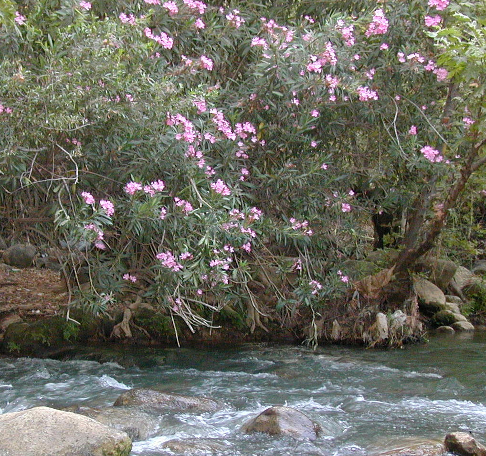

# Plants and Trees in the Bible

## License Information

Plants and Trees in the Bible © United Bible Societies, 2025. Adapted from: <cite>Each According to its Kind: Plants and Trees in the Bible</cite>, by Robert Koops © 2012 United Bible Societies. This work is licensed under Creative Commons Attribution-ShareAlike 4.0 International (<a href="https://creativecommons.org/licenses/by-sa/4.0/">https://creativecommons.org/licenses/by-sa/4.0/</a>).

--------------------------------

## 标题：夹竹桃（oleander） (id: FLORA:1.17)

1\.17 标题：夹竹桃（oleander）
======================

经文出处
----

Hebrew 来：Ardat

Latin 拉：Ardat

[2ES 9:26](https://ref.ly/2Esd9:26)

讨论
--

*夹竹桃 (Ray Pritz (UBS))*

夹竹桃（学名*Nerium oleander* ）遍布以色列地，从迦密山一直到约旦河谷，尤其是大雨过后涨满水的河床边上。现在，夹竹桃成为十分受欢迎的花园灌木。即便是约旦河东边的干旱地区，也盛产夹竹桃。祖海里认为，[2ES 9:26](https://ref.ly/2Esd9:26) 中的地名"阿达特"（Ardat）与现代希伯来文*harduf* 一词有关联，后者指的是夹竹桃灌木。赫珀等人认为，[SIR 24:14](https://ref.ly/Sir24:14) 和[SIR 39:13](https://ref.ly/Sir39:13) 中的希腊文*rodon* 指的是夹竹桃，但少数人认为*rodon* 是腓尼基玫瑰（参[6\.1\.5 郁金香（山地郁金香，"沙仑的玫瑰"）（tulip \[mountain tulip, "rose of sharon"]）](#FLORA:6.1.5) ）。RSV (Revised Standard Version (1952)) 将这些经文中的*rodon* 译作"rose"（"玫瑰"）。对于[LEV 23:40](https://ref.ly/Lev23:40) 中的希伯来文*‘aravah* ，RSV (Revised Standard Version (1952)) 将其译作"willows"（"柳树"）；有些学者确信是夹竹桃，但并没有确凿的证据。

描述
--

夹竹桃是一种开花灌木，高度为1—4米（3—13英尺），叶片狭长像柳树叶，花呈粉红色，花瓣对生，看起来像是玫瑰；因此在《次经‧便西拉智训》（《思》《德训篇》）中作"玫瑰"。夹竹桃的叶、花和汁均有剧毒。通常在6月开花，颜色从白色到粉色不一。种荚会释放一粒粒毛绒绒的种子，可以随风飘到很远的地方。

翻译
--

夹竹桃隶于夹竹桃属（学名*Nerium* ），其中包括多个树种，分布地区从地中海一直到日本。该属归在夹竹桃科（拉丁文Apocynaceae），这是个涵盖许多植物的大科，该科植物遍布非洲和亚洲各地。但同科的其他属，如丝胶树属（学名*Funtumia* ）、飘香藤属（*Mandevilla* ）、同心结属（*Parsonsia* ）、羊角拗属（*Strophanthus* ）的差异很大，对翻译没有帮助。

* **Associated Passages:** 厄斯德拉下 9:26; 德训篇 24:14; 德训篇 39:13; 利未记 23:40

