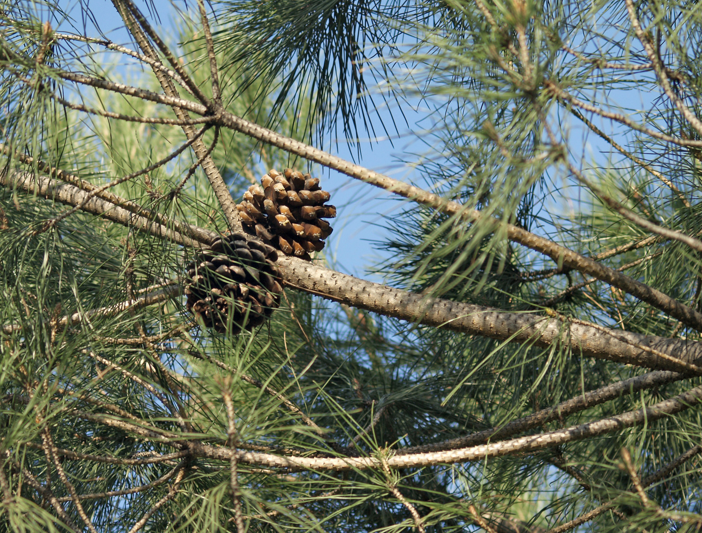

# Plants and Trees in the Bible

## License Information

Plants and Trees in the Bible © United Bible Societies, 2025. Adapted from: <cite>Each According to its Kind: Plants and Trees in the Bible</cite>, by Robert Koops © 2012 United Bible Societies. This work is licensed under Creative Commons Attribution-ShareAlike 4.0 International (<a href="https://creativecommons.org/licenses/by-sa/4.0/">https://creativecommons.org/licenses/by-sa/4.0/</a>).

--------------------------------

## 标题：松树（pine） (id: FLORA:1.18)

1\.18 标题：松树（pine）
=================

圣经中提及的"松树"都不是百分之百确定的译词，因为学者对于所有针叶树的辨识都很难确定其具体树种。圣经中提到的松树可能有两种，这两种松树在形态和生长环境上有很大的差异。

## 标题：石松（stone pine） (id: FLORA:1.18.1)

1\.18\.1 标题：石松（stone pine）
==========================

经文出处
----

Hebrew 来：תִּרְזָה (音译：tirzah)

[ISA 44:14](https://ref.ly/Isa44:14)

讨论
--

*石松 (Serge Melki (Wikimedia Commons))*

根据汤姆森（Tomson，1860，祖海里引述）的意见，石松（学名*Pinus pinea* ；又名矮松）在19世纪的巴勒斯坦沿海平原很常见。爱琴海岸和黎巴嫩曾有石松林。今天，以色列只在迦密山和加利利沿海平原有几片小规模的石松林，但在黎巴嫩仍有很多，因为那里人们会种植石松以收获美味的含油松子。祖海里提出，[ISA 44:14](https://ref.ly/Isa44:14) 中的希伯来文*tirzah* 可能是指石松；一些英文译本的译法如下："holm"（"石栎"；RSV (Revised Standard Version (1952)) ）、"cypress"（"柏树"；NIV (New International Version (1984)) ）、"plane"（"悬铃树"；NJPSV (New Jewish Publication Society Version) ）、"fir"（"杉树"；GW (God's Word Translation) ）、"oak"（"橡树"；GNB (Good News Bible) ）。词根*r\-z* 表明该词可能与希伯来文*’erez* （"香柏树"）一词有关联，并且第一本阿拉伯文圣经（10世纪）也使用了意为"石松"的阿拉伯文。

因其种子的特性，有人建议将[HOS 14:9](https://ref.ly/Hos14:9) （《和》14:8）中的*berosh* 译为石松，那里上帝将自己比作常青的*berosh* 树。但这种翻译是有争议的，因为语法似乎表明，那里提到的果子不是说话人（上帝）的果子，而是听者的果子，即"你的果子"或"他们的果子"。

描述
--

*结着球果的石松枝 (Luis Fernández García (Wikimedia Commons))*

石松的高度可达10米（33英尺），通常呈伞状，因此在一些地方又被称为"伞松"。只有这种松树的种子可以食用。

翻译
--

各英文译本对[ISA 44:14](https://ref.ly/Isa44:14) 中*tirzah* 的翻译，如"holm"（"石栎"）、"plane"（"悬铃树"）、"fir"（"杉树"）、"oak"（"橡树"）和"cypress"（"柏树"）等，都只是猜测。因此，一个合理的解决办法是采纳祖海里的建议，他的建议至少在古生物学和语言学上有一定的根据；另外就是音译一种主要语言的词语（如*pino* 、*payin* 、*pinyola* ）。如果以目标语言的文化为导向，那么翻译者可以用一种经常用来雕刻偶像的树木来替代，并且这个名称不曾用来翻译其他树木。

现今，中国出产的"松子"在美国作为色拉配料销售。我们认为这些松子产自石松的一个亚种。

* **Associated Passages:** 以赛亚书 44:14; 何西阿书 14:9

## 标题：阿勒坡松、地中海松（aleppo pine） (id: FLORA:1.18.2)

1\.18\.2 标题：阿勒坡松、地中海松（aleppo pine）
==================================

经文出处
----

Hebrew 来：עֵץ שֶׁמֶן (音译：‘ets shemen)

[1KI 6:23](https://ref.ly/1Kgs6:23), [1KI 6:31](https://ref.ly/1Kgs6:31), [1KI 6:32](https://ref.ly/1Kgs6:32), [1KI 6:33](https://ref.ly/1Kgs6:33), [NEH 8:15](https://ref.ly/Neh8:15), [ISA 41:19](https://ref.ly/Isa41:19)

讨论
--

*阿勒坡松 (Isidre Blanc (Wikimedia Commons))*

高贵的阿勒坡松（学名*Pinus halepensis* ）又称地中海松或耶路撒冷松，原产于以色列和黎巴嫩。以色列从未盛产阿勒坡松，因为这种树最适宜生长在松软的白垩质土壤里，而以色列这样的土质很少。在现代，许多阿勒坡松种植在以色列的多个保护区内。在现代希伯来文中，这种松树叫做*’oren* ，出现在[ISA 41:19](https://ref.ly/Isa41:19) ；有些译本在该节经文中译成"松树"（"pine"；NIV (New International Version (1984)) ），但祖海里认为那里指的是月桂树（参[1\.12 月桂树 (laurel \[bay tree])](#FLORA:1.12) ）。

在[1KI 6:23](https://ref.ly/1Kgs6:23); [1KI 6:31](https://ref.ly/1Kgs6:31); [1KI 6:32](https://ref.ly/1Kgs6:32); [1KI 6:33](https://ref.ly/1Kgs6:33) 中，希伯来文短语*‘ets shemen* （字面意为"油树"）是制作圣殿中基路伯、门扇和门柱的木料。大部分英文译本都将其译作"wild olive"（"野橄榄木"）；不过，橄榄树无论是栽植的还是野生的，其扭曲和多节瘤的外形都是众所周知的，通常不适合做建筑木材或雕刻大型物品。

[NEH 8:15](https://ref.ly/Neh8:15) 列出了搭棚所用的四种树木，包括*zayith* （"橄榄树"）和*‘ets shemen* （"野橄榄树"）。GNB (Good News Bible) 和NJPSV (New Jewish Publication Society Version) 都将*‘ets shemen* 译作"pine"（"松树"；GNB (Good News Bible) 颠倒了这两种树的顺序）。"各样茂密树"表明是阔叶树而不是针叶树，但松树枝也可能因其宜人的气味而被包含在内。

[ISA 41:19](https://ref.ly/Isa41:19) 所列的树木将于新的时代栽植在旷野，包括*‘ets shemen* 、香柏树、金合欢树和香桃木。

有了这个证据，祖海里确信*‘ets shemen* 就是阿勒坡松；自被掳时期以来，库尔德斯坦北部的松树至今仍被那里的犹太人称为*‘ets shemen* ，这一事实支持上述观点。布伦金索普（Blenkinsopp，第292页）和其他解经家，包括早期的犹太解经家萨阿迪亚（Saadiah）、书尚鲁克（Shulchan Aruch）和基姆奇（Kimchi），也赞同将"油树"翻译为"松树"。但是，赫珀认为[1KI 6:23](https://ref.ly/1Kgs6:23) 中的基路伯（以及[1KI 6:31](https://ref.ly/1Kgs6:31); [1KI 6:32](https://ref.ly/1Kgs6:32); [1KI 6:33](https://ref.ly/1Kgs6:33) 中的门扇和门框）是用橄榄木做的。他说，像基路伯这样的大物件可能是"由许多小木块以某种方式连接在一起，然后雕刻成所需的形状"（第158页）。GNB (Good News Bible) 、NIV (New International Version (1984)) 、NCV (New Century Version) 、LB (Living Bible (1971)) ，NAB (New American Bible (1970)) 、NJPSV (New Jewish Publication Society Version) 、GECL (German Common Language Version (Gute Nachricht Bibel)) 也都采纳了这个观点，将*‘ets shemen* 译为"olive"（"橄榄木"）。

FFB 的作者采纳了第三种观点，即《列王纪上》6章的*‘ets shemen* 指沙枣树（学名*Elaeagnus angustifolia* ），有时也称为野橄榄（或俄罗斯橄榄），尽管这种树与橄榄树并没有亲缘关系。赫珀说，*‘ets shemen* 不可能是沙枣树，因为沙枣树并不是以色列本土植物。此外，沙枣树太小，无法用来制作任何家具或建筑物。

描述
--

阿勒坡松是一种常绿针叶树，高度达20米（66英尺），寿命可达150年，与香柏树、柏树和杜松同属。

特殊意义
----

如上所述，*‘ets shemen* 是住棚节搭棚所用的四种特殊树木之一。如果它是某种松树，那么它的树枝就不仅有遮荫的作用，还可以给棚屋带来芳香。

翻译
--

希伯来文*‘ets shemen* 有几种译法：

1\. 按照祖海里的建议，音译一种主要语言中表示"松树"的词语（如法文*pin* 、西班牙文*pino* 、阿拉伯文*sanawbar* 、葡萄牙文*pinheiro* ），或者音译由政府引进的松树树种。（在尼日利亚南部的一些地方，所有针叶树都被称为"圣诞树"，这种译法是不可取的！）

2\.按字面译为"油树"（"oil tree"），如KJV (King James Version (1611)) 在[ISA 41:19](https://ref.ly/Isa41:19) 的译文。

3\. 按照通俗英文的用法，取当地表示"橄榄"的词语（最早出现在[GEN 8:11](https://ref.ly/Gen8:11) ），并增加词语"野"或"灌木丛"，与栽种的树木相区分（如同REB (Revised English Bible (1989)) 的处理方式）。这与FFB 的建议一致。

4\. 按照一种主要语言音译"橄榄"这个词（如*olivi* 或*wolifu* ），再增加词语"野"或"灌木丛"。

* **Associated Passages:** 列王纪上 6:23; 列王纪上 6:31; 列王纪上 6:32; 列王纪上 6:33; 尼希米记 8:15; 以赛亚书 41:19; 创世记 8:11

