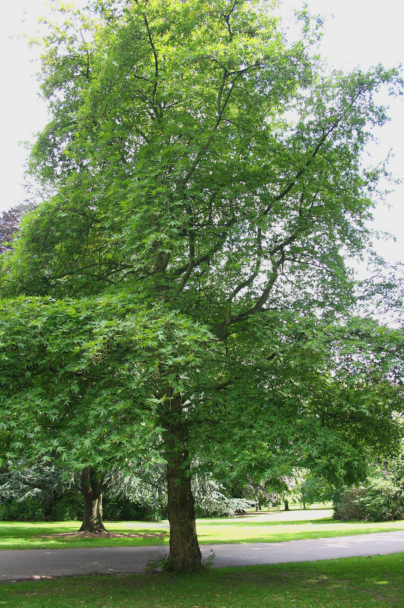
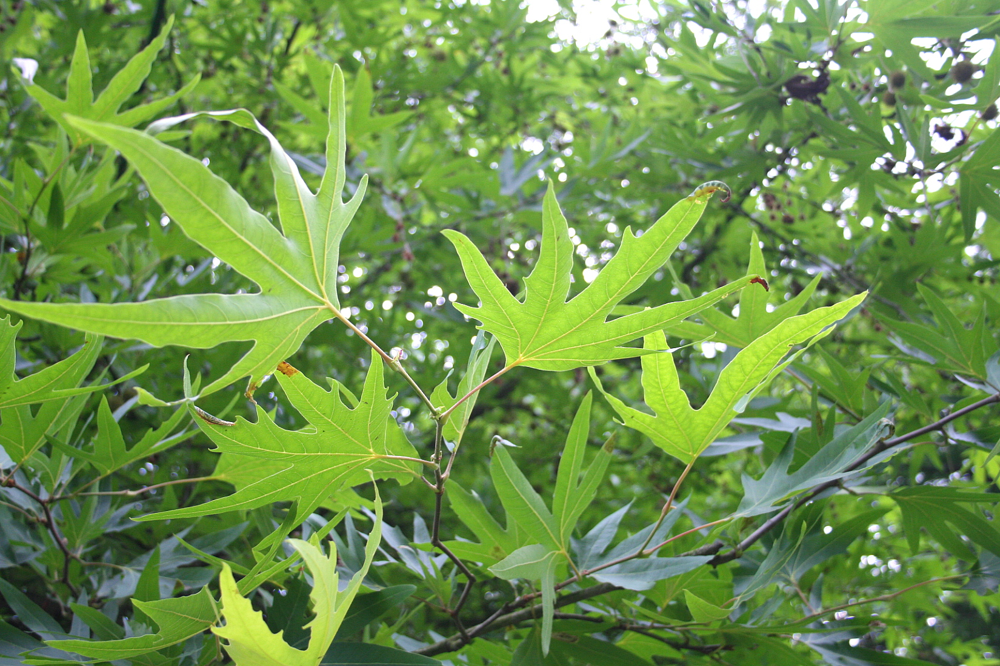

# Plants and Trees in the Bible

## License Information

Plants and Trees in the Bible © United Bible Societies, 2025. Adapted from: <cite>Each According to its Kind: Plants and Trees in the Bible</cite>, by Robert Koops © 2012 United Bible Societies. This work is licensed under Creative Commons Attribution-ShareAlike 4.0 International (<a href="https://creativecommons.org/licenses/by-sa/4.0/">https://creativecommons.org/licenses/by-sa/4.0/</a>).

--------------------------------

## 标题：悬铃树（plane） (id: FLORA:1.19)

1\.19 标题：悬铃树（plane）
===================

经文出处
----

Hebrew 来：עֶרְמוֹן (音译：‘ermon)

[GEN 30:37](https://ref.ly/Gen30:37), [EZK 31:8](https://ref.ly/Ezek31:8)

Greek 希：πλάτανος (音译：platanos)

[SIR 24:14](https://ref.ly/Wis24:14)

讨论
--

祖海里确信，[EZK 31:8](https://ref.ly/Ezek31:8) 中的*‘ermon* 就是三球悬铃树（学名*Platanus orientalis* ），主要的根据是阿拉伯人称这种树为*dilba* ，而这个词出自亚兰文。*‘Ermon* 这个名称可能来自希伯来文*‘erom* （意为"裸露的"），指树皮剥落，树干因此看似裸露。

如果迪比河谷（Wadi Dilb）这个俗名与阿拉伯文*dilba* 有关，那么悬铃树在过去可能非常繁多。今天，悬铃树在上约旦河谷及其支流地区相当常见，并且广泛分布于地中海东部地区以及伊拉克和伊朗的山区。

描述
--

悬铃树高大而舒展，枝干粗大，叶缘分裂，叶面多毛，形如手掌。以色列的悬铃树高度可达20米（66英尺），树干直径可达50厘米（2英尺），开绿色的小花，种子较小，包裹在长着刚毛的圆形果实里。果实裂开后，会释放出带有绒毛的种子，随风飘得很远。

特殊意义
----

在[GEN 30:37](https://ref.ly/Gen30:37) ，雅各选用的可能是悬铃树的枝子，因为悬铃树的树皮很容易一条条剥下，露出白色或黄色的内层。在古时，悬铃树被希腊人、罗马人和波斯人誉为遮荫树。[EZK 31:8](https://ref.ly/Ezek31:8) 将悬铃树、香柏树和*beroshim* （"柏树"或"希腊杜松"）与"上帝的园"联系在一起，说明这些树特别美丽。在[SIR 24:14](https://ref.ly/Wis24:14) ，智慧被比作佳美、高大的悬铃树。

翻译
--

真正的悬铃树生长在欧洲和北美洲，另外地中海东部地区和伊朗也有一些品种。（英国的一种野生枫树被误称为"悬铃树"。）对于[GEN 30:37](https://ref.ly/Gen30:37) 中雅各育羊的故事，亚洲、拉丁美洲和非洲的翻译者没有当地树种可以选用，因此需要考虑音译，经文中提到的其他树木（杨树、杏树）也要在译法上配合。然而，在 [EZK 31:8](https://ref.ly/Ezek31:8) ，悬铃树用在比喻性的语境中，翻译者可以相应地将这个词译为当地树木。在这节经文中，埃及被比作一棵高大的香柏树，任何其他树木，如悬铃树和杉树，都不能与之媲美。这里，对"悬铃树"的翻译取决于翻译者如何处理其他树木。

* **Associated Passages:** 创世记 30:37; 以西结书 31:8; 德训篇 24:14

