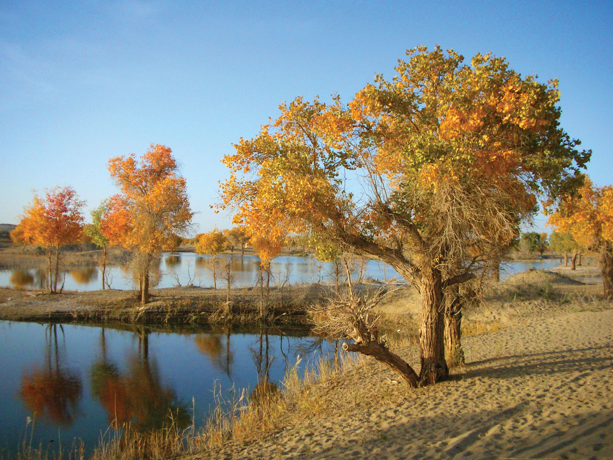

# Plants and Trees in the Bible

## License Information

Plants and Trees in the Bible © United Bible Societies, 2025. Adapted from: <cite>Each According to its Kind: Plants and Trees in the Bible</cite>, by Robert Koops © 2012 United Bible Societies. This work is licensed under Creative Commons Attribution-ShareAlike 4.0 International (<a href="https://creativecommons.org/licenses/by-sa/4.0/">https://creativecommons.org/licenses/by-sa/4.0/</a>).

--------------------------------

## 标题：杨树（poplar） (id: FLORA:1.20)

1\.20 标题：杨树（poplar）
===================

经文出处
----

Hebrew 来：בָּכָא (音译：baka’)

[2SA 5:23](https://ref.ly/2Sam5:23), [2SA 5:24](https://ref.ly/2Sam5:24), [1CH 14:14](https://ref.ly/1Chr14:14), [1CH 14:15](https://ref.ly/1Chr14:15)

Hebrew 来：לִבְנֶה (音译：livneh)

[GEN 30:37](https://ref.ly/Gen30:37)

Hebrew 来：עֲרָבָה (音译：‘aravah)

[LEV 23:40](https://ref.ly/Lev23:40), [JOB 40:22](https://ref.ly/Job40:22), [PSA 137:2](https://ref.ly/Ps137:2), [ISA 15:7](https://ref.ly/Isa15:7), [ISA 44:4](https://ref.ly/Isa44:4)

讨论
--

中东地区有多种杨树，因此，某个特定的希伯来文词语指的是哪一种杨树常有争议。在圣经时期，以色列地有两种常见的杨树，即白杨和胡杨（胡杨又名幼发拉底杨树）。

在[GEN 30:37](https://ref.ly/Gen30:37) ，雅各用来繁殖绵羊和山羊的神奇方法是借助白杨（学名*Populus alba* ）浅色的里层木质。白杨生长在以色列地区的河岸上。这种树的树皮为灰色，木质较软，用作建筑木料，也可制作工具和椽子，有些地方还将树皮入药。

胡杨（学名*Populus euphratica* ）也生长在河岸上，但在中东地区，胡杨的分布要比白杨广泛得多，因而自然而然地成为[PSA 137:2](https://ref.ly/Ps137:2) 所述树木的候选，这节经文说："在一排*‘aravim* 中，我们挂上我们的竖琴"（RSV (Revised Standard Version (1952)) 将*‘aravim* 译作"willows"，即"柳树"）。在伊拉克，胡杨被称为*gharab* ，该词与*‘aravah* 同源，从而佐证了"杨树"的译法。祖海里认为，[EZK 17:5](https://ref.ly/Ezek17:5) 中的希伯来文*tsaftsafah* 可能是指胡杨。赫珀认同此观点，举出了这种杨树容易生根的特性。然而，阿拉伯人称柳树为*safsaf* ，因此我们认为《以西结书》的这节经文指的是柳树。

[2SA 5:23](https://ref.ly/2Sam5:23); [2SA 5:24](https://ref.ly/2Sam5:24) 和[1CH 14:14](https://ref.ly/1Chr14:14); [1CH 14:15](https://ref.ly/1Chr14:15) 提到的树木可能是杨树（RSV (Revised Standard Version (1952)) 译作"balsam trees"，"香脂树"；KJV (King James Version (1611)) 译作"mulberry trees"，"桑树"；NEB (New English Bible (1970)) 和REB (Revised English Bible (1989)) 译作"aspens"，"山杨"），因为杨树的叶子在风吹过时会沙沙作响。

请注意，在[HOS 4:13](https://ref.ly/Hos4:13) ，希伯来文*livneh* 指的是安息香树（参[1\.22 安息香树 (styrax)](#FLORA:1.22) ），依据是*livneh* 在这处经文中与橡树和笃耨香树联系在一起。

描述
--

白杨树很高大，高度可达20米（66英尺），种子像一簇簇长而柔顺的毛絮随风飘散。胡杨也很高大，有两种叶子，小树的叶子像柳叶一样细窄，成熟后的叶子比较宽。在辨识圣经中提到的柳树和杨树时，这个特点给学者造成了一些困惑。

翻译
--

杨属（学名*Populus* ）树木（三角叶杨、山杨）在欧洲和北美洲广为人知。北非和南非从欧洲引进了若干种杨树，除此之外非洲似乎没有任何杨属树木。然而，帕尔格雷夫指出，有一种近缘树种分布在非洲，范围从埃及、苏丹起，经肯尼亚、乌干达、扎伊尔，一直到非洲南部的广大地区；该近缘树木即野柳（学名*Salix subserrata* ）。在亚洲，从阿拉伯半岛到喜马拉雅地区，杨属树木广为人知。

在有杨属树木的地方，如果当地品种的内皮是白色的，就可以用在《创世记》中；但是要记住，[LEV 23:40](https://ref.ly/Lev23:40) 提到了另一种同科树木（柳树）。由于[GEN 30:37](https://ref.ly/Gen30:37) 的背景是历史性的，而非修辞性的，因此在不熟悉杨属树木的地方，我们主张按照一种主要语言进行音译（例如*popula* 、*populari* 、*hawur* （阿拉伯文）或*abele* （法文）），避免用当地树木的名称来替代，尽管《〈创世记〉手册》（*A Handbook on Genesis* ，第701—702页）赞同替代名称。

* **Associated Passages:** 撒母耳记下 5:23; 撒母耳记下 5:24; 历代志上 14:14; 历代志上 14:15; 创世记 30:37; 利未记 23:40; 约伯记 40:22; 诗篇 137:2; 以赛亚书 15:7; 以赛亚书 44:4; 以西结书 17:5; 何西阿书 4:13

