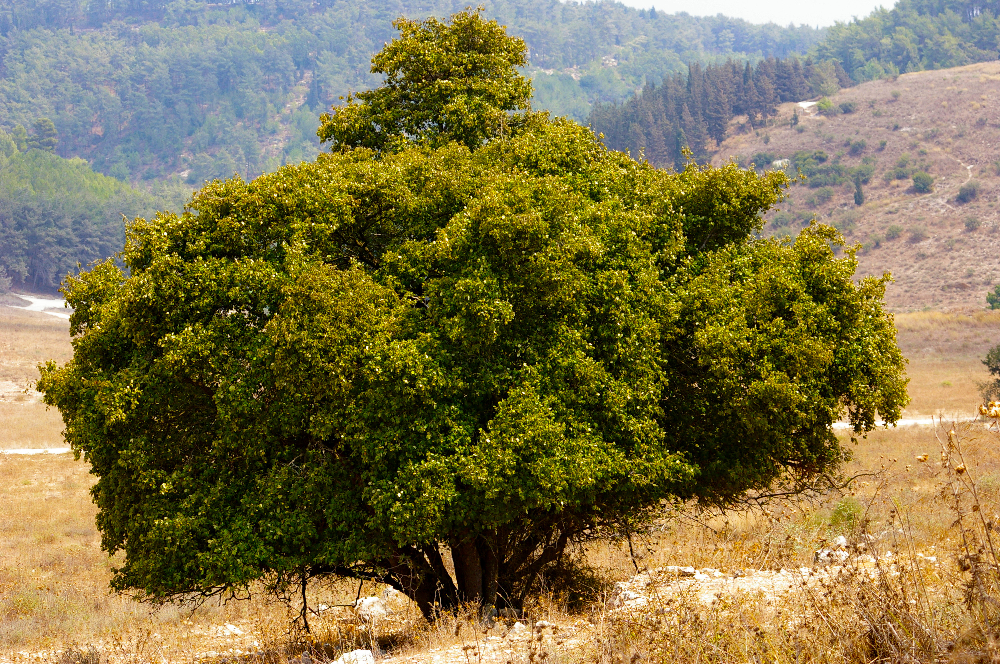
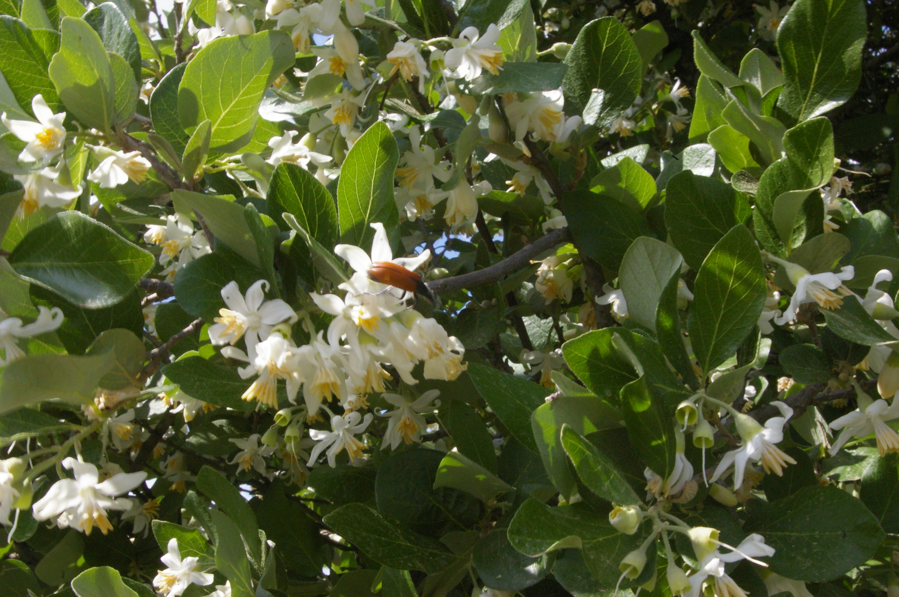

# Plants and Trees in the Bible

## License Information

Plants and Trees in the Bible © United Bible Societies, 2025. Adapted from: <cite>Each According to its Kind: Plants and Trees in the Bible</cite>, by Robert Koops © 2012 United Bible Societies. This work is licensed under Creative Commons Attribution-ShareAlike 4.0 International (<a href="https://creativecommons.org/licenses/by-sa/4.0/">https://creativecommons.org/licenses/by-sa/4.0/</a>).

--------------------------------

## 标题：安息香树（styrax） (id: FLORA:1.22)

1\.22 标题：安息香树（styrax）
=====================

经文出处
----

Hebrew 来：לִבְנֶה (音译：livneh)

[HOS 4:13](https://ref.ly/Hos4:13)

讨论
--

*安息香树 (איתן פרמן (Wikimedia Commons))*

在《何西阿书》关于以色列人拜偶像的记叙中，*livneh* 树与橡树（*’allon* ）和笃耨香树（*’elah* ）一起被提到，传统上认为它是杨树，因为这个词在[GEN 30:37](https://ref.ly/Gen30:37) 出现过。然而，祖海里指出，希伯来文*livneh* 实际上可能是指两种不同的白色树木，应根据上下文来翻译。在《何西阿书》，地理背景是犹太山区的橡树和黄连木林，所以这里的*livneh* 很可能是指安息香树（学名*Styrax officinalis* ）；而在[GEN 30:37](https://ref.ly/Gen30:37) 关于雅各繁殖绵羊和山羊的记叙中，同一个词*livneh* 则可能是指白杨（学名*Populus alba* ；参[1\.20 杨树 (poplar)](#FLORA:1.20) ）。

描述
--

*安息香树的叶子和花 (איתן פרמן (Wikimedia Commons))*

安息香树是一种落叶灌木或小乔木，高3—6米（10—20英尺），叶子较大，因为树叶背面长着银白色的绒毛，所以从远处看起来是白色的。（注意，阿拉伯文同源词*lavan* 和*livna* 的意思是"白色的"或"明亮的"。）安息香树开白色花，渔夫有时会把有毒的种子扔进溪流，将鱼毒晕后再捕捞。

关于安息香树（styrax）和苏合香树（storax）这两个名称，一直存在很大的争议和混淆。根据祖海里的意见，我们建议用苏合香指称阿拉伯半岛的产胶灌木枫香树的树脂（参[4\.2\.4 麦加香脂（香脂、香膏）（opobalsamum \[balsam, balm]）](#FLORA:4.2.4) ），而安息香树只用来指巴勒斯坦山区的灌木*Styrax officinalis* 。祖海里说，虽然有些安息香树会产芳香树脂，但是这一种不会。

特殊意义
----

安息香树因其浓密的树荫而与橡树和笃耨香树列在一起，以色列人则在树荫下拜偶像。

翻译
--

在地中海地区、东南亚和热带美洲，分布着120种安息香树，其中有很多都以出产芳香树脂闻名，这些树脂可以入药（安息香），也可以用来制香。

翻译者对[HOS 4:13](https://ref.ly/Hos4:13) 中安息香树的处理，取决于如何处理橡树和笃耨香树。如果其他两种树木采用音译，那么安息香树也要音译，译作*sitirak* 、*suturak* ，或*libine* /*labani* （阿拉伯文的音译）。然而，翻译者也可以采用功能对等译法，即翻译成与神灵崇拜有关的当地树种；另外还可以增加一个脚注，说明在植物学上有可能是哪些树木。

* **Associated Passages:** 何西阿书 4:13; 创世记 30:37

