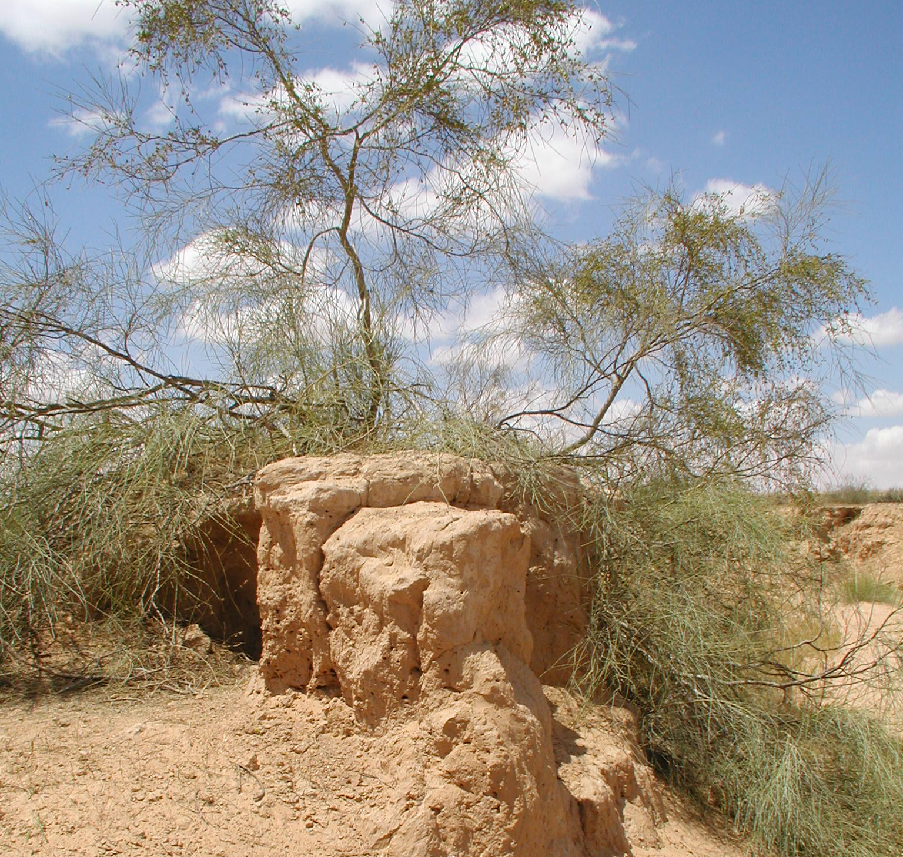
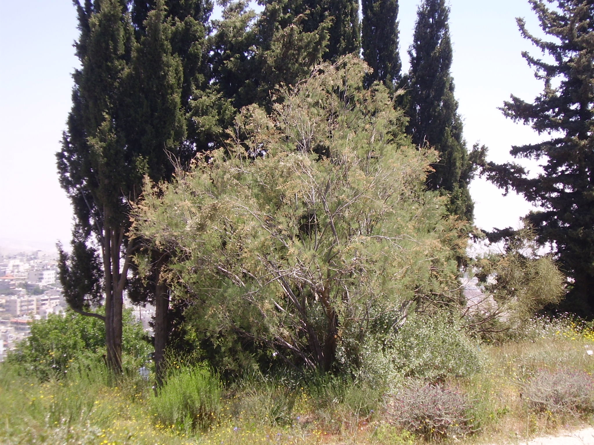

# Plants and Trees in the Bible

## License Information

Plants and Trees in the Bible © United Bible Societies, 2025. Adapted from: <cite>Each According to its Kind: Plants and Trees in the Bible</cite>, by Robert Koops © 2012 United Bible Societies. This work is licensed under Creative Commons Attribution-ShareAlike 4.0 International (<a href="https://creativecommons.org/licenses/by-sa/4.0/">https://creativecommons.org/licenses/by-sa/4.0/</a>).

--------------------------------

## 标题：柽柳（tamarisk） (id: FLORA:1.23)

1\.23 标题：柽柳（tamarisk）
=====================

经文出处
----

Hebrew 来：אֶשֶׁל (音译：’eshel)

[GEN 21:33](https://ref.ly/Gen21:33), [1SA 22:6](https://ref.ly/1Sam22:6), [1SA 31:13](https://ref.ly/1Sam31:13)

讨论
--

*无叶柽柳 (Michael Baranovsky (Wikimedia Commons))*

圣经提到柽柳的两个主要品种：无叶柽柳（学名*Tamarix aphylla* ）和更为常见的尼罗河柽柳（学名*Tamarix nilotica* ）。这两个品种遍布平原地区，以及阿拉瓦和尼革夫的河谷（干河床），汲取突发洪水后渗入地下的水。柽柳可以在盐碱地生长，因此有些地方称之为"盐地香柏树"。另一种柽柳只生长在约旦河谷。这三种柽柳都没有真正的叶子，只有多肉的小树枝，成为山羊和绵羊的食物。罗望子树（学名*Tamarindus indica* ）与柽柳的名称十分相似，但实际上两者没有亲缘关系。

在埋葬扫罗的叙事中，[1SA 31:13](https://ref.ly/1Sam31:13) 说他葬在*’eshel* 下（RSV (Revised Standard Version (1952)) 译为"tamarisk"，"柽柳"），而[1CH 10:12](https://ref.ly/1Chr10:12) 说他葬在*’elah* 下（RSV (Revised Standard Version (1952)) 译为"oak"，"橡树"），两者不符。那么究竟是什么树呢？也许这两种都不是！

在希伯来文发展的某个阶段，*’eshel* 一词成为了树木的统称。然而，*’allon* （"橡树"）和*’elah* （"笃耨香树"）这两个词在圣经成书时期之后的希伯来文中被一般化为*’ilan* ，意思是"树"。所以一种可能性是，在《历代志上》的编辑过程中，*’elah* 作为一个通称取代了早前的*’eshel* ，而后者在当时可能已经是一个通称。也就是说，这两个词可能都是"树"的统称，只是各自作为不同地区、风格或时兴的变体。

描述
--

*柽柳在一些柏树前面 (Ray Pritz (UBS))*

无叶柽柳可以长到10米（33英尺）高，树干底部直径可达1米（3英尺）。更为常见的尼罗河柽柳比较矮小，实际上是从地面开始分枝的灌木。柽柳生长在非常干旱的地方，根系深深地扎进地里。据发现，伊拉克一棵柽柳的树根延伸到了地表以下11米（36英尺）处（赫珀，第53页）。这两个品种都有宽大的树冠，树干通常呈扭绞状，枝条类似香柏树，并且会像柳树一样垂下来。贝都因牧羊人为了牧羊，在尼革夫各地栽种了许多柽柳。

特殊意义
----

*类似香柏树叶子的柽柳叶 (Forest and Kim Starr (Wikimedia Commons))*

亚伯拉罕种了一棵柽柳，在那里敬拜耶和华（[GEN 21:33](https://ref.ly/Gen21:33) ），表明这些树就像橡树那样，与灵界有关。祖海里认为，在[LEV 14:4](https://ref.ly/Lev14:4) 和[NUM 19:6](https://ref.ly/Num19:6) 关于洁净条例中提到的"香柏树"的枝子可能是柽柳枝，尽管以色列人在旷野漂流的一些地方也长着腓尼基杜松（与香柏树非常相似）。柽柳被引进到美国西部后，在河床里繁殖得非常快速，以致现在被视为一种造成重大损失的环境公害。有些地方会用柽柳来制造染料或加工皮革。

翻译
--

柽柳盛产于亚洲（40种）和欧洲（14种），另有几个品种生长在地中海盆地的非洲。英文译本几乎一致将*’eshel* 译为"tamarisk"（"柽柳"）。CEV (Contemporary English Version) 译作"tamarisk"（"柽柳"），并增加了一个脚注："一种高大的遮荫树，根系深，需水少。"翻译"柽柳"的方法有：

1\. 从一种主要语言进行音译，如*tamarisiki* 、*tamaris* 、*esheli* （希伯来文），或*eteli* /*atali* （阿拉伯文）。

2\. 在《创世记》，几乎可以肯定这种树与亚伯拉罕敬拜上帝有关联，鉴于树的这个功能，可以将其翻译为"圣树"，或许还可以增加一个脚注来说明这个词的希伯来文和／或英文；如果在[GEN 12:6](https://ref.ly/Gen12:6) 已经使用了"圣树"来表示"橡树"，则更需要在脚注中说明。

3\. 只译作"树"，在脚注中说明希伯来文作*’eshel* ，即柽柳。

* **Associated Passages:** 创世记 21:33; 撒母耳记上 22:6; 撒母耳记上 31:13; 历代志上 10:12; 利未记 14:4; 民数记 19:6; 创世记 12:6

