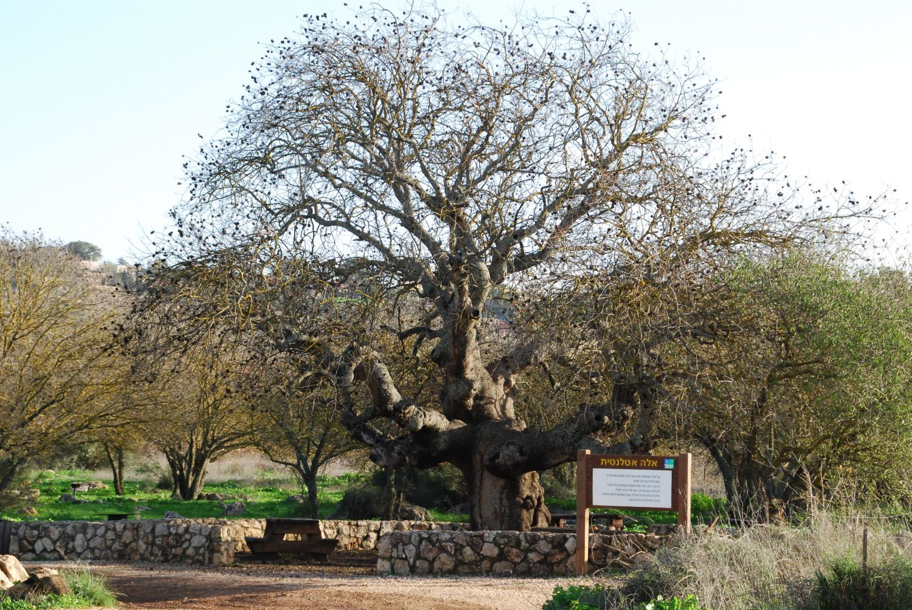

# Plants and Trees in the Bible

## License Information

Plants and Trees in the Bible © United Bible Societies, 2025. Adapted from: <cite>Each According to its Kind: Plants and Trees in the Bible</cite>, by Robert Koops © 2012 United Bible Societies. This work is licensed under Creative Commons Attribution-ShareAlike 4.0 International (<a href="https://creativecommons.org/licenses/by-sa/4.0/">https://creativecommons.org/licenses/by-sa/4.0/</a>).

--------------------------------

## 标题：笃耨香树、黄连木（terebinth） (id: FLORA:1.24)

1\.24 标题：笃耨香树、黄连木（terebinth）
============================

经文出处
----

### **树** ：

Hebrew 来：אֵלָה, אַלָּה (音译：’elah, ’alah)

[GEN 35:4](https://ref.ly/Gen35:4), [JOS 24:26](https://ref.ly/Josh24:26), [JDG 6:11](https://ref.ly/Judg6:11), [JDG 6:19](https://ref.ly/Judg6:19), [1SA 17:2](https://ref.ly/1Sam17:2), [1SA 17:19](https://ref.ly/1Sam17:19), [1SA 21:10](https://ref.ly/1Sam21:10), [2SA 18:9](https://ref.ly/2Sam18:9), [2SA 18:9](https://ref.ly/2Sam18:9), [2SA 18:10](https://ref.ly/2Sam18:10), [2SA 18:14](https://ref.ly/2Sam18:14), [1KI 13:14](https://ref.ly/1Kgs13:14), [1CH 10:12](https://ref.ly/1Chr10:12), [ISA 1:30](https://ref.ly/Isa1:30), [ISA 6:13](https://ref.ly/Isa6:13), [EZK 6:13](https://ref.ly/Ezek6:13), [HOS 4:13](https://ref.ly/Hos4:13)

Hebrew 来：אַיִל (音译：’ayil)

[ISA 1:29](https://ref.ly/Isa1:29), [ISA 57:5](https://ref.ly/Isa57:5), [ISA 61:3](https://ref.ly/Isa61:3), [EZK 31:14](https://ref.ly/Ezek31:14)

Hebrew 来：אֵלֶם (音译：’elem)

[PSA 56:1](https://ref.ly/Ps56:1)

Greek 希：σχῖνος (音译：schinos)

[SUS 1:54](https://ref.ly/Sus1:54)

Greek 希：τερέμινθος (音译：tereminthos)

[SIR 24:16](https://ref.ly/Sir24:16)

经文出处
----

### **果实** ：

Hebrew 来：בָּטְנִים (音译：boten)

[GEN 43:11](https://ref.ly/Gen43:11)

经文出处
----

### **树脂** ：

Hebrew 来：צֳרִי (音译：tsori)

[GEN 37:25](https://ref.ly/Gen37:25), [GEN 43:11](https://ref.ly/Gen43:11), [JER 8:22](https://ref.ly/Jer8:22), [JER 46:11](https://ref.ly/Jer46:11), [JER 51:8](https://ref.ly/Jer51:8), [EZK 27:17](https://ref.ly/Ezek27:17)

讨论
--

希伯来文*’elah* 和*’alah* 指圣经中提到的三种黄连木中的任何一种：（1）大西洋黄连木（学名*Pistacia atlantica* ）；（2）笃耨香黄连木（*Pistacia palaestina* 、*Pistacia terebinthus* ）；（3）乳香黄连木（*Pistacia lentiscus* 、*Pistacia lenticus* ），又称乳香树。

根据祖海里的意见，大西洋黄连木，又名椴树（teil tree），分布在尼革夫、下加利利和但河河谷。赫珀说，基列地曾盛产大西洋黄连木，树干和树皮可作为芳香树脂（乳香）的原料出口到埃及。这种树为旱地树，生长在常绿林地和矮灌木草原的邻接地带（注意[1SA 17:2](https://ref.ly/1Sam17:2); [1SA 17:19](https://ref.ly/1Sam17:19); [1SA 21:10](https://ref.ly/1Sam21:10) 中的"以拉谷"）。大西洋黄连木的坚果可用来染色和鞣革，烤熟后也可以食用。这些坚果常在阿拉伯市场上售卖，比笃耨香黄连木的果实大，与圣地之外出产的真正的开心果非常不同（见下文）。

笃耨香黄连木主要生长在树林茂密的山丘，经常与一般的橡树混生。小小的球形坚果可以整个生吃，或烤熟吃。这些坚果（*boten* ）可能就是雅各的儿子带到埃及的礼物（[GEN 43:11](https://ref.ly/Gen43:11) ）；但是祖海里认为，这些礼物也可能是盛产于波斯（现伊朗）的、真正的开心果树（阿月浑子树；学名*Pistacia vera* ）的果实。

乳香黄连木是一种生长在基列山的灌木或灌木丛，可能就是[GEN 37:25](https://ref.ly/Gen37:25) 所载以实玛利人贩卖的"乳香"（希伯来文*tsori* ）的原料，也可能在[GEN 43:11](https://ref.ly/Gen43:11) 与开心果一起被雅各的儿子带到埃及。[GEN 37:25](https://ref.ly/Gen37:25); [JER 8:22](https://ref.ly/Jer8:22); [JER 46:11](https://ref.ly/Jer46:11) 均提到基列与乳香（学名*Tsori* ）之间的联系，说明乳香的原料是巴勒斯坦特有的一种植物，所以乳香*tsori* 可以用来交换埃及的货物。《耶利米书》指的可能是由笃耨香树脂制成的药膏。

描述
--

笃耨香树的外形很像橡树，但叶子呈羽状。大西洋黄连木可长到10米（33英尺）高。笃耨香黄连木较矮，高可达5米（17英尺）。乳香黄连木，或乳香树，是一种小灌木或小乔木，高为1—3米（3—10英尺），枝干切开会流出芳香的树脂。树脂干燥成硬块后再磨碎，溶解在橄榄油中，可用来制作药品、香水、熏香、清漆和胶水。

特殊意义
----

这两种比较高大的黄连木都受到古代以色列人和其他民族的崇敬。他们在黄连木树林里筑坛，有时还在那里埋葬死者。乳香黄连木的树脂因药用价值而被珍视，这就是为什么以实玛利人（[GEN 37:25](https://ref.ly/Gen37:25) ）和雅各的众子（[GEN 43:11](https://ref.ly/Gen43:11) ）将其作为交易的货物带到埃及。[SIR 24:16](https://ref.ly/Sir24:16) 用枝干舒展的黄连木来比喻智慧。

翻译
--

在[HOS 4:13](https://ref.ly/Hos4:13) ，KJV (King James Version (1611)) 将本应是"笃耨香树"的树木译作"elms"（"榆树"）。在[GEN 35:4](https://ref.ly/Gen35:4) 中，示剑那里的笃耨香树（*’elah* ）似乎与[GEN 12:6](https://ref.ly/Gen12:6) 中的橡树（*’elon* ）相冲突。有些译本在这两处都使用"橡树"来统一译词。其他译本则都译作"笃耨香树"。还有的译本将这两处都译作"大树"或"圣树"。*’Elah* 很有可能在某个时期变成了大树的通称。

笃耨香黄连木只生长在中东地区，但黄连木属（学名*Pistacia* ）树种分布很广，从南欧经亚洲，一直到菲律宾等地区都有。如果在当地找不到同属树木，建议使用一般性的短语，或者从一种主要语言进行音译，例如*terebinti* ，或根据希伯来文音译为*elahi* 。

[PSA 56:1](https://ref.ly/Ps56:1) ：虽然希伯来文*’elem* 在[PSA 56:0](https://ref.ly/Ps56:0) 的标题中常作"无声"的意思，但大多数解经家更倾向于将其视为"笃耨香树"（*’elah* 、*’alah* ）的另一种拼写法。

* **Associated Passages:** 创世记 35:4; 约书亚记 24:26; 士师记 6:11; 士师记 6:19; 撒母耳记上 17:2; 撒母耳记上 17:19; 撒母耳记上 21:10; 撒母耳记下 18:9; 撒母耳记下 18:10; 撒母耳记下 18:14; 列王纪上 13:14; 历代志上 10:12; 以赛亚书 1:30; 以赛亚书 6:13; 以西结书 6:13; 何西阿书 4:13; 以赛亚书 1:29; 以赛亚书 57:5; 以赛亚书 61:3; 以西结书 31:14; 诗篇 56:1; 苏撒拿传 1:54; 德训篇 24:16; 创世记 43:11; 创世记 37:25; 耶利米书 8:22; 耶利米书 46:11; 耶利米书 51:8; 以西结书 27:17; 创世记 12:6; 诗篇 56:0

