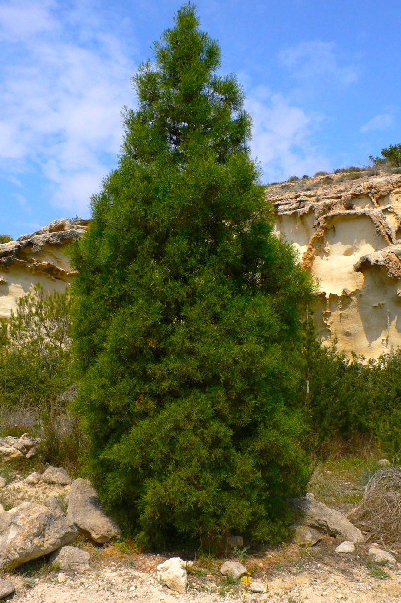

# Plants and Trees in the Bible

## License Information

Plants and Trees in the Bible © United Bible Societies, 2025. Adapted from: <cite>Each According to its Kind: Plants and Trees in the Bible</cite>, by Robert Koops © 2012 United Bible Societies. This work is licensed under Creative Commons Attribution-ShareAlike 4.0 International (<a href="https://creativecommons.org/licenses/by-sa/4.0/">https://creativecommons.org/licenses/by-sa/4.0/</a>).

--------------------------------

## 标题：香橼树、山达脂树、中山杉（thyine [sandarac]） (id: FLORA:1.25)

1\.25 标题：香橼树、山达脂树、中山杉（thyine \[sandarac]）
=========================================

经文出处
----

Greek 希：θύϊνος (音译：thuinos)

[REV 18:12](https://ref.ly/Rev18:12)

讨论
--

*香橼树 (Nanosanchez (Wikimedia Commons))*

香橼树（学名*Tetraclinis articulata* ）也称为"侧柏"或"金钟柏"，令人困惑的是，在世界其他多处地方，它又称为"柑橘树"（citron或citrus）。香橼树与人们熟知的崖柏类似，主要分布在地中海地区和整个北非（摩洛哥、阿尔及利亚）。香橼树与柏树、松树、香柏树同为针叶树。在《启示录》中，我们通过希腊文的拼写*thuinos* 辨识出这种树。有些地方称这种树为山达脂树，因为其树脂可以制成清漆（山达脂）。罗马人用这种树做橱柜，并出于某种奇怪的原因称之为"柑橘树"，其实除了黄色的果实外，它与真正的柑橘树没有任何相似之处。

描述
--

香橼树可达9米（30英尺）高，长着像香柏树和柏树那样的鳞叶，树皮为红棕色，木材芳香，可驱虫。

翻译
--

在[REV 18:12](https://ref.ly/Rev18:12) ，希腊文*thuinos* 列在流入"巴比伦"（罗马）的货物中，物品清单中也包括了"香橼木"。GNB (Good News Bible) 用了一个描述性短语，即"rare woods"（"稀有木材"）。RSV (Revised Standard Version (1952)) 和NEB (New English Bible (1970)) 译作"scented wood\[s]"（"芳香的木材"）。我们建议翻译者采用其中一种译法，或是两种均予采用，或音译为*tuyin* 或*sandaraki* 。JB (Jerusalem Bible (1966)) 译作"sandalwood"（"檀香木"），这也是一种可能，但没有其他译本采纳。我们和大多数人意见相同，认为檀香木对应的希伯来文是*’almug* （参[1\.21 檀香木 (sandalwood \[red saunders])](#FLORA:1.21) ）。

* **Associated Passages:** 启示录 18:12

* **Associated ACAI Concepts:** Thyine (ID: `flora:Thyine`)
