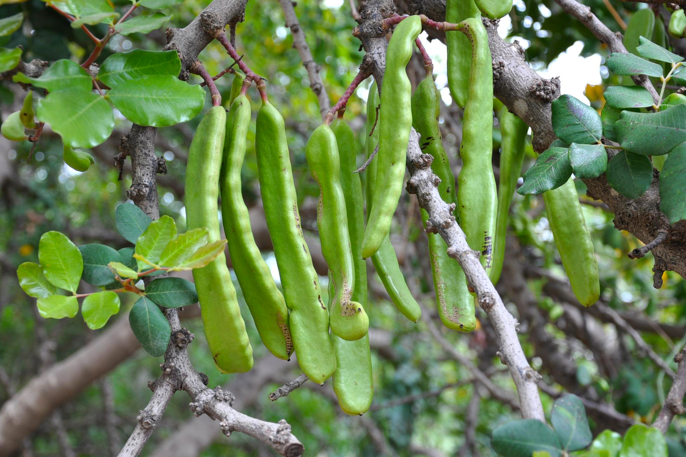

# Plants and Trees in the Bible

## License Information

Plants and Trees in the Bible © United Bible Societies, 2025. Adapted from: <cite>Each According to its Kind: Plants and Trees in the Bible</cite>, by Robert Koops © 2012 United Bible Societies. This work is licensed under Creative Commons Attribution-ShareAlike 4.0 International (<a href="https://creativecommons.org/licenses/by-sa/4.0/">https://creativecommons.org/licenses/by-sa/4.0/</a>).

--------------------------------

## 标题：长角豆树（carob） (id: FLORA:2.3)

2\.3 标题：长角豆树（carob）
===================

经文出处
----

### **豆荚** ：

Greek 希：κεράτιον (音译：keration)

[LUK 15:16](https://ref.ly/Luke15:16)

讨论
--

长角豆树（学名*Ceratonia siliqua* ）常见于地中海地区、阿拉伯、索马里和阿曼。这种植物原产于以色列，根据主后最初几个世纪的犹太宗教著作，这种树被称为*charuv* 。阿拉伯人称其为*kharrub* 。

长角豆树在圣经时期就生长于沿海平原、低地（谢非拉），以及加利利和撒玛利亚的东坡，今天也是一样。长角豆的豆荚里面饱含一层甘甜多汁的果肉，很多穷人以之为食。豆荚也用来喂牲畜。在[LUK 15:16](https://ref.ly/Luke15:16) 所述浪子的比喻中，耶稣说浪子恨不得拿猪吃的长角豆*keration* （"豆荚"）充饥，可能就是这种植物。

描述
--

长角豆树是一种常绿乔木，叶子深绿色；许多低矮多叶的枝条几乎遮住了短短的树干。树冠呈圆形，高度可达12米（40英尺）。长角豆树属于云实亚科（学名*Caesalpinioideae* ），这是一个很大的热带乔木科。与金合欢树、海枣树和无花果树的情况一样，长角豆树是唯一一种生长在以色列多个地区的云实亚科树木，而且存在了几千年。该科树木都是豆类植物，通过根部的小瘤使空气中的氮进到土壤中。随着树龄的增长，树干会发生扭转。与圣地许多其他树木不同的是，这种树在秋天开花，次年夏天结出豆荚。成熟的豆荚为深棕色，长约15—25厘米（6—10英寸），宽约2\.5—3\.5厘米（1—1\.5英寸）。

特殊意义
----

如果[LUK 15:16](https://ref.ly/Luke15:16) 中的"豆荚"确实是长角豆树的豆荚，那么可以肯定这不是上等食物。长角豆树也被称为"圣约翰的饼"，因为人们相信施洗约翰住在犹太旷野的时候必定吃过这些果子。约翰很可能吃过角豆荚。但是，若说[MRK 1:6](https://ref.ly/Mark1:6) 中的"蝗虫"是刺槐豆（又称蝗虫豆）的豆荚，这是不正确的，因为约翰可能真的以蝗虫为食；今天世界上有些人仍然吃蝗虫。有趣的是，曾经作为"穷人的食物"的长角豆果肉，近几年在英国和美国成为了一种昂贵的"健康食品"！钻石的重量单位"克拉"，就源自这种树的希腊文名称，因为其种子曾被用作测量的标准。长角豆的种子一般重约200毫克。

翻译
--

因为[LUK 15:16](https://ref.ly/Luke15:16) 的希腊文本实际上没有出现"长角豆"一词，并且*keration* 有可能指其他种类的豆荚，所以这里不能将其译成某个具体的品种。如果翻译者能找到一个表示可食用豆荚的词，就应使用该词，否则应采用"野果子"之类的表述。在圣经研读版的注解中，翻译者可以说明主要语言译本中的译词，例如法文*caroube* 、西班牙文*algarrobo* 、葡萄牙文*alfarroba* ，以及阿拉伯文*kharrub* 。

* **Associated Passages:** 路加福音 15:16; 马可福音 1:6

