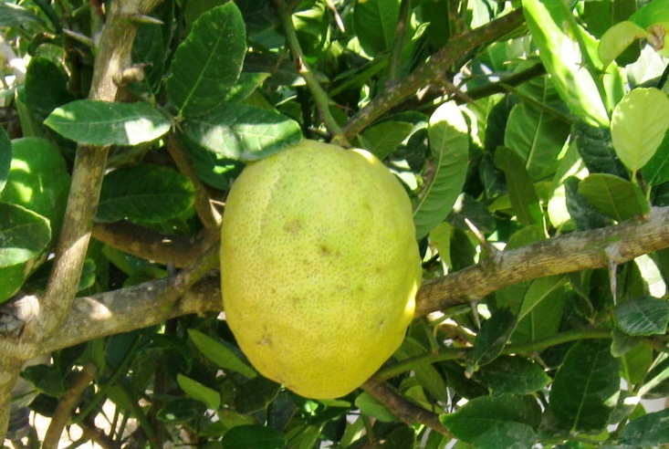

# Plants and Trees in the Bible

## License Information

Plants and Trees in the Bible © United Bible Societies, 2025. Adapted from: <cite>Each According to its Kind: Plants and Trees in the Bible</cite>, by Robert Koops © 2012 United Bible Societies. This work is licensed under Creative Commons Attribution-ShareAlike 4.0 International (<a href="https://creativecommons.org/licenses/by-sa/4.0/">https://creativecommons.org/licenses/by-sa/4.0/</a>).

--------------------------------

## 标题：香橼树（citron） (id: FLORA:2.4)

2\.4 标题：香橼树（citron）
===================

经文出处
----

Hebrew 来：עֵץ הָדָר (音译：‘ets hadar)

[LEV 23:40](https://ref.ly/Lev23:40)

讨论
--

在[LEV 23:40](https://ref.ly/Lev23:40) 摩西为庆祝住棚节所定的条例中，希伯来文*‘ets hadar* 常被译为"美好树"。不过，*hadar* 这个词可能是某种树的名称（注意该词与英文"cedar"［香柏树］和意大利文*cedro* 相似）。有些植物学家（如莫尔登克［Moldenke］和古尔［Goor］）认为，香橼树（学名*Citrus medica* ；现代希伯来文作*etrog* ）在古时就被引入到中东。在美索不达米亚地区的考古发掘中，人们发现了主前4000年的香橼树种子。另外，一枚主前136年的犹太硬币有一面刻着香橼树的图案。有学者认为，尼希米和其他人被掳归回时，把这种树从巴比伦带到了以色列。尼希米在关于庆祝住棚节的吩咐中（[NEH 8:15](https://ref.ly/Neh8:15) ），只提到"上山"收集多种树枝来搭棚，并没有提到果实。因此，*‘ets hadar* 可能是一个一般性的短语。我所知道的英文译本在《利未记》中都没有使用"香橼树"。不过，NLT (New Living Translation) 译作"citrus trees"（"柑橘树"）（并添加了脚注：或"雄伟的树木"），NJPSV (New Jewish Publication Society Version) 则音译为"hadar trees"（"哈达尔树"）。许多解经家，如凯尔和德利奇（Keil \& Delitzsch），认为这个短语并不是特指某种树，而是一个一般性的表达，用来引出清单中的其他树木。祖海里和赫珀也对*hadar* 是香橼树的解释提出了一些质疑，但他们都在自己的讨论中谈到了这个可能性，以示对犹太传统的尊重。

描述
--

*香橼树的果实 (דני (Wikimedia Commons))*

香橼树是一种柑橘类树木，自然生长到大约4米（13英尺），叶子深绿色，带刺，白色的花朵非常芳香。香橼树的果实和柠檬很像，是黄色的，而且很酸。在世界许多地方，香橼树的种植都已商业化。预加工的果皮（大部分）运往欧洲和美国，作蛋糕的香料。在日本和中国，人们也喜欢香橼的香味。果皮中的油可以蒸馏出来，制成香水。果实在古时也用来治病，直到今天仍在东南亚和南美洲作为药用。在现今的以色列，犹太人会仔细修剪香橼树，使其保持在大约70厘米（2英尺）的高度，并保护果实不受任何损坏，以便在住棚节使用。

翻译
--

如果翻译者认为希伯来文*peri ‘ets hadar* 在[LEV 23:40](https://ref.ly/Lev23:40) 中是一个一般性的短语，那么因为这个短语在上下文中存在句子结构上的含糊，翻译者还要判断这是"美好树X上的果子"，还是"X树上的美好果子"。在GNB (Good News Bible) 、CEV (Contemporary English Version) 、NIV (New International Version (1984)) 、NCV (New Century Version) 和GW (God's Word Translation) 中，*hadar* （"美好的"）修饰*peri* （"fruit"，"果子"），而在REB (Revised English Bible (1989)) 和NJPSV (New Jewish Publication Society Version) ，*hadar* 修饰*‘ets* （"tree"，"树"）。

那些想要依循犹太传统和NLT (New Living Translation) 的翻译者应该留意，香橼树在热带有很多品种，许多语言借用了一个通称，并加上特定品种的修饰语；例如，*lemo* 或*lemuno* （英文）、*cedrat* （法文）、*cidra* 或*poncil* （西班牙文）、*cidrão* （葡萄牙文）、*cedro* /*cedrone* （意大利文）、*cedratzitrone* 或*cederappel* （德文）、*citroen* （荷兰文）。在印度，香橼树被称为*beg\-poora* ；在马来半岛称为*limau susu* ；在中国称为"枸橼"。

* **Associated Passages:** 利未记 23:40; 尼希米记 8:15

